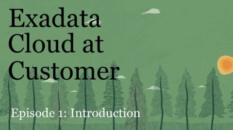
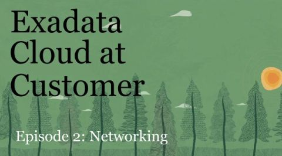
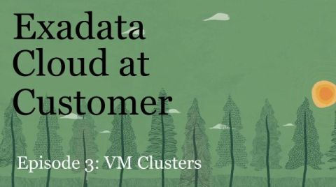
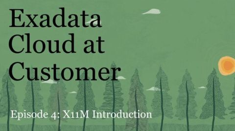
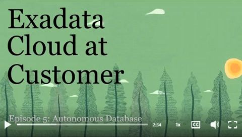

# Exadata Cloud@Customer

Oracle Exadata Cloud@Customer (ExaDB-C@C) brings the performance, automation, and economics of Exadata Database Service and the fully managed Autonomous AI Database into enterprise data centers. It’s the simplest way for customers to start using cloud database resources in their data centers and help address strict data residency requirements. Exadata Cloud@Customer incorporates unique optimizations that let Oracle AI Database workloads run faster with less management and lower costs so organizations can get more value from their data. Oracle offers both autonomous and co-managed Oracle Database cloud solutions on Exadata Cloud@Customer.

# Useful Links

- [Main Oracle Product Page](https://www.oracle.com/uk/engineered-systems/exadata/cloud-at-customer/)

- [Oracle Exadata Database Service on Cloud@Customer X11M datasheet](https://www.oracle.com/a/ocom/docs/engineered-systems/exadata/exadb-cc-x11m-ds.pdf)

- [Documentation Home](https://docs.oracle.com/en/engineered-systems/exadata-cloud-at-customer/)

- [What’s New in Oracle Exadata Database Service on Cloud@Customer Gen2](https://docs.oracle.com/en-us/iaas/exadata/doc/ecc-whats-new-in-exadata-cloud-at-customer-gen2.html)

- [What’s New in ADB-D on Exadata Cloud@Customer](https://docs.oracle.com/en-us/iaas/exadata/doc/adb-okv-integration.html)

# Subpages

- [ExaDB-C@C Infrastructure](https://github.com/oracle-devrel/technology-engineering/tree/main/data-platform/database-cloud-at-customer/exadata-cloud-at-customer/exacc-infra)

- [ExaDB-C@C Network](https://github.com/oracle-devrel/technology-engineering/tree/main/data-platform/database-cloud-at-customer/exadata-cloud-at-customer/exacc-network)

- [ExaDB-C@C Security](https://github.com/oracle-devrel/technology-engineering/tree/main/data-platform/database-cloud-at-customer/exadata-cloud-at-customer/exacc-security)

- [ExaDB-C@C Data Protection](https://github.com/oracle-devrel/technology-engineering/tree/main/data-platform/database-cloud-at-customer/exadata-cloud-at-customer/exacc-data-protection)

- [ADB-C@C](https://github.com/oracle-devrel/technology-engineering/tree/main/data-platform/database-cloud-at-customer/exadata-cloud-at-customer/adb-cc)

# Videos
A short video series covering different aspects of the Oracle Exadata Cloud@Customer - the best platform for running your Oracle Databases in the cloud behind your firewall.

**Episode 1 - Introductions to Exadata Cloud@Customer:**

**Episode 2 - Exadata Cloud@Customer Networking:**

**Episode 3 - VM Clusters on Exadata Cloud@Customer:**

**Episode 4 - Exadata Cloud@Customer X11M Introduction:**

**Episode 5 - Autonomous Database on Exadata Cloud@Customer:**

The below videos are showcasing best practices and how-to's with a technical and hands-on approach.

**Learn how to optimize Exadata Database Service performance using IORM (I/O Resource Manager):** 

# Exadata Cloud@Customer Public references

- [Advania, Infromation Technology, Sweden](https://github.com/oracle-devrel/technology-engineering/tree/main/data-platform/database-cloud-at-customer/exadata-cloud-at-customer/files/Adviana-Island-ExaDBCC.pdf)

- [Banque Internationale A Luxemburg (BIL), Financial Services, Luxemburg](https://github.com/oracle-devrel/technology-engineering/tree/main/data-platform/database-cloud-at-customer/exadata-cloud-at-customer/files/BIL-ExaDBCC.pdf)

- [Elsewedy Electric, Manufacturing, Egypt](https://github.com/oracle-devrel/technology-engineering/tree/main/data-platform/database-cloud-at-customer/exadata-cloud-at-customer/files/El-Sewedy-Electric-ExaDBCC.pdf)

- [Ellevio, Utilities, Sweden](https://github.com/oracle-devrel/technology-engineering/tree/main/data-platform/database-cloud-at-customer/exadata-cloud-at-customer/files/Ellevio-AB-ExaDBCC.pdf)

- [EOPYY, Goverment/Health Services, Greece](https://github.com/oracle-devrel/technology-engineering/tree/main/data-platform/database-cloud-at-customer/exadata-cloud-at-customer/files/EOPYY-ExaDBCC.pdf)

- [HUG, Healthcare, Switzerland](https://github.com/oracle-devrel/technology-engineering/tree/main/data-platform/database-cloud-at-customer/exadata-cloud-at-customer/files/HUG-ExaDBCC.pdf)

- [HUS, Healthcare, Finland](https://github.com/oracle-devrel/technology-engineering/tree/main/data-platform/database-cloud-at-customer/exadata-cloud-at-customer/files/HUS-yhtyma-ExaDBCC.pdf)

# Exadata Cloud@Customer Training

## Oracle MyLearn
At [Oracle Mylearn](https://www.oracle.com/uk/education/training/) Here you can find Training, certification, Oracle guided learning, skill development etc. Some content is free and some you need to buy a subscription for/pay for. 

Below, we have summarised content we think customers would benefit from specifically to support their skills and development in using Exadata Cloud@Customer.
Your Customer Success Services account manager can guide you on available training that can be purchased. Reach out if you would like us to put you in contact with your aligned representative or you can reach CSS via [this link](https://www.oracle.com/uk/education/contact-form.html).

## Free Customer Training

[Oracle Cloud Infrastructure Training and Certification](https://www.oracle.com/uk/education/training/oracle-cloud-infrastructure/)

Where we would recommend:

* OCI Foundations Associate
* Introduction to Oracle Cloud essentials
* OCI Architect
* OCI Cloud Security professional
* OCI Networking Professional
* Managing OCI identity and access management

### Some other trainings you may want to consider:
[Administering Exadata Cloud at Customer Gen 2](https://education.oracle.com/administering-exadata-cloud-at-customer-gen-2/courP_110895624)
[Develop Coaching webinars](https://www.oracle.com/developer/events/)

The [Oracle Developers YouTube channel](https://www.youtube.com/@oracledevs) is a great source for training materials on specific topics. You can browse for ExaDB-C@C related content. Our team has provided the following sessions:
* [Scaling Your Database Workloads on Exadata DB Cloud@Customer](https://www.youtube.com/watch?v=PxscD5EedAQ)
* [Exadata Database Service Resource Management - IORM](https://www.youtube.com/watch?v=vXkWR6Uc0vM)

There are other YouTube channels which have relevant training videos published, for example:

[Tips for Managing Exadata Cloud@Customer and Exadata Cloud Service with Enterprise Manager](https://www.youtube.com/watch?v=L_kcLPZjlXg)

## Chargeable Customer Training
[Oracle Technology Learning Subscription (Oracle Cloud Infrastructure, Oracle Database)](https://shop.oracle.com/apex/f?p=DSTORE:PRODUCT::::6:P6_LPI,P6_PROD_HIER_ID:39173837313210910012927941,39203894217074790107465754)

# Useful Links

- [Oracle Mylearn](https://www.oracle.com/uk/education/training/)

- [Oracle Developers YouTube channel](https://www.youtube.com/@oracledevs)

- [Oracle Universiy](https://shop.oracle.com/apex/f?p=dstore:2:0::NO:RIR,2:PROD_HIER_ID:38022788136100320034918191)

Reviewed: 06/11/26

# License

Copyright (c) 2026 Oracle and/or its affiliates.

Licensed under the Universal Permissive License (UPL), Version 1.0.

See [LICENSE](https://github.com/oracle-devrel/technology-engineering/blob/main/LICENSE) for more details.
