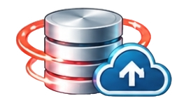

# Exadata Cloud@Customer Data Protection

Exadata Cloud@Customer provides secure connectivity between the Exadata infrastructure, your local data center, and Oracle Cloud Infrastructure (OCI). Dedicated client and backup networks enable seamless integration with enterprise applications and backup services, while a secure control plane connection to OCI allows Oracle to deliver cloud-based management, monitoring, and lifecycle operations. For business continuity and disaster recovery, the platform supports Oracle Data Guard and other replication technologies to protect critical workloads across geographically separated sites.

 

# ExaDB-C@C Backup Approaches

Below is a summary of the backup and recovery approaches, target platforms and benefits and considerations for each approach. Please also refer to the "Additional Information" section for links to the documentation and MOS Notes pertinent to this area.

## Oracle Managed Backup

Oracle's recommended approach. 

- Simple to use
- Single target configuration for the entire VM Cluster (when using ZDLRA & NFS)
- All setup within OCI Console
- All tracking & logging within the OCI Console
- Supports Autonomous Database
- Simple restore management process
- Utilises RMAN capabilities embedded within the database

## User Configured Backup

- More control and flexibility
- Customer choice for retention periods
- Wider choice of backup targets
- Customer can use existing 3rd party backup solution

## Backup destinations

### ExaDB-C@C Local Exadata Storage
- Fastest backup & recovery
- Not physically separate to the primary database
- Limited capacity
- Expensive capacity
- Needs to be incorporated at VM Cluster creation
- Maximum 14-day retention

### Zero Data Loss Recovery Appliance (ZDLRA)
- Real time database protection
- Space efficient backups of encrypted databases
- Highly configurable
- Complies with Oracle MAA
- Assists with cross-platform database migration
- CAPEX product
- Protects only the Oracle database content
- Virtual machine O/S backups are not catered for by the ZDLRA, so an alternate solution will be required by the customer

### OCI Object Store
- Low cost
- Auto-Tiering
- TDE Keystore protected
- Mirrored backup files
- Cloud service managed through the ExaDB-C@C control plane
- Network latency & bandwidth – particularly for restore
- Data residency considerations
- OCI Object Storage bucket is managed by Oracle and not visible to the customer

### NFS Platform
- Customer choice of supplier
- Normally can utilise an existing platform
- Backup and recovery of the TDE Keystore and virtual machine O/S backup would need to be configured separately by the customer.

### 3rd Party Backup solution (Only for User Configure Backups)
- Customer choice of supplier
- Enterprise wide backup solution
- Likely to be the existing backup solution for Oracle databases
- Can utilise an existing platform
- Configurable retention periods
- Utilises existing skills & experience
- Can incorporate TDE Keystore and virtual machine O/S backups

# Useful Links

- [Oracle Maximum Availability Architecture landing page](https://www.oracle.com/database/technologies/maximum-availability-architecture/)
- [Manage Database Backup and Recovery on Oracle Exadata Database Service on Cloud@Customer - Documentation](https://docs.oracle.com/en/engineered-systems/exadata-cloud-at-customer/ecccm/ecc-manage-db-backup-and-recovery.html)
- [Zero Data Loss Recovery Appliance (ZDLRA) - Documenation](https://docs.oracle.com/en/engineered-systems/zero-data-loss-recovery-appliance/)
- [ZFS - Documentation](https://docs.oracle.com/en/storage/zfs-storage/)
- [Exadata Cloud Compute Node Backup and Restore Operations MOS Note 2809393.1](https://support.oracle.com/epmos/faces/DocumentDisplay?id=2809393.1)
- [Oracle Database 19c Backup and Recovery User's Guide - Documentation](https://docs.oracle.com/en/database/oracle/oracle-database/19/bradv/preface.html)
- [Site Requirements for Oracle Exadata Database Service on Cloud@Customer](https://docs.oracle.com/en/engineered-systems/exadata-cloud-at-customer/ecccm/ecc-site-requirements.html)
- [Use Oracle Data Guard with Oracle Exadata Database Service on Cloud@Customer - Documentation](https://docs.oracle.com/en/engineered-systems/exadata-cloud-at-customer/ecccm/ecc-using-data-guard.html)
- [Using Autonomous Data Guard with Autonomous Database on Exadata Cloud@Customer - Documentation](https://docs.oracle.com/en/engineered-systems/exadata-cloud-at-customer/ecccm/adb-using-adg-with-adb.html)
- [Backup from ExaDB-C@C to C3 Object Storage](https://github.com/oracle-devrel/technology-engineering/tree/main/data-platform/database-cloud-at-customer/exadata-cloud-at-customer/exacc-data-protection/backup-from-exacc-to-c3-object-store)

Reviewed: 06/24/26

# License

Copyright (c) 2026 Oracle and/or its affiliates.

Licensed under the Universal Permissive License (UPL), Version 1.0.

See [LICENSE](https://github.com/oracle-devrel/technology-engineering/blob/main/LICENSE) for more details.
