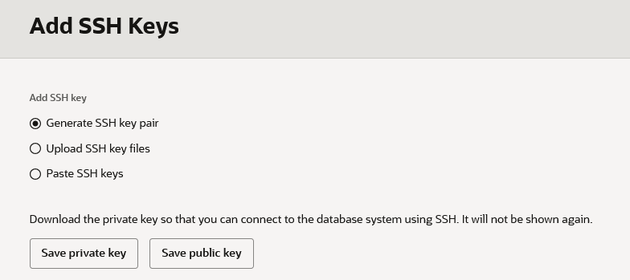
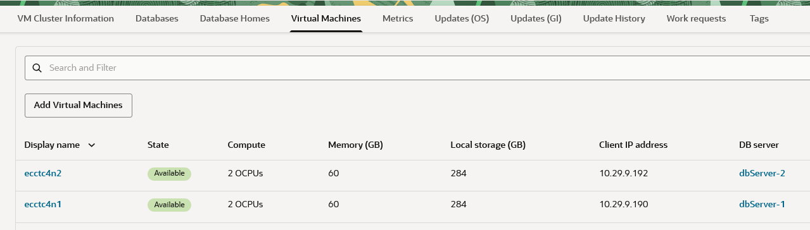
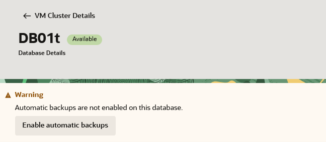
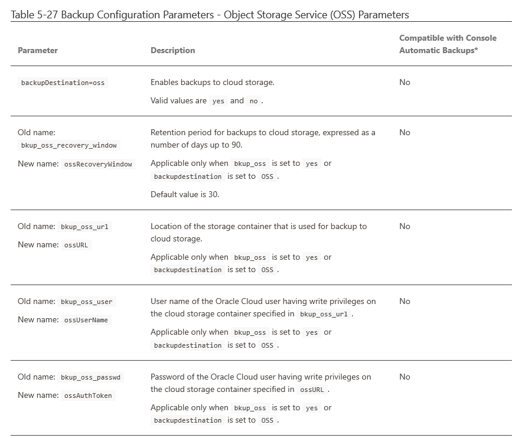

# Backup from ExaDB-C@C to C3 Object Storage

- [Use case](#BackupfromExaDBC@CtoC3ObjectStorage-Usecase)
- [Manual Backups on ExaDB-C@C](#BackupfromExaDBC@CtoC3ObjectStorage-ManualBackupsonExaDB-C@C)
  - [Objective](#BackupfromExaDBC@CtoC3ObjectStorage-Objective)
  - [Testing](#BackupfromExaDBC@CtoC3ObjectStorage-Testing)
  - [Result](#BackupfromExaDBC@CtoC3ObjectStorage-Result)
- [Automatic / User Configured Backups on ExaDB-C@C](#BackupfromExaDBC@CtoC3ObjectStorage-Automatic/UserConfiguredBackupsonExaDB-C@C)
  - [Objective](#BackupfromExaDBC@CtoC3ObjectStorage-Objective.1)
  - [Testing](#BackupfromExaDBC@CtoC3ObjectStorage-Testing.1)
  - [Result](#BackupfromExaDBC@CtoC3ObjectStorage-Result.1)
- [Summary](#BackupfromExaDBC@CtoC3ObjectStorage-Summary)

## Use case

An Exadata Cloud@Customer customer with requirements to run applications on-premises for data residency and/or latency reasons will likely appreciate the consumption model of the Compute Cloud@Customer (C3).\
If said customer also has database backup infrastructure limitations and require a consumption based backup/recovery solution, the C3 could potentially deliver resources for the ExaDB-C@C backups and recovery. This document does not discuss the merits of such solution, but will validate the technical feasibility.

This use case focuses on the provisioning of object storage from the C3 as a backup destination to the ExaDB-C@C platform. NFS that is provisioned from the C3 may also be used as a standard backup destination and is known to function as described in the ExaDB-C@C documentation.

Some of the advantages of the use case that combine Compute Cloud@Customer (C3) with Exadata Cloud@Customer (ExaDB-C@C):

- Consumption based platform for applications  and middleware
- Consumption based object storage for backup and recovery
- Directly connected to Client and/or Backup network ports on ExaDB-C@C database servers
- Avoids using legacy backup solution not under the database teams control

Be aware of the following considerations:

- Running backup and recovery to the same platform as your applications requires proper sizing and understanding of *"noisy neighbor"* effect on IO performance.
- Directly connecting Client and/or Backup network ports on ExaDB-C@C database servers to C3 Spine Switches might require re-provisioning of VM Clusters

Due to the pricing of the Storage Services in C3 (Object Storage, Block Storage and File Storage) the testing is focused only on C3 Object Storage Service.

# Manual Backups on ExaDB-C@C

Performing manual backups on ExaDB-C@C means installing software (Oracle and/or 3rd party) and configuration for RMAN backups through said software and operating system using SSH to the ExaDB-C@C VM's.

## Objective

To verify if manual backups can be performed from ExaDB-C@C to C3 Object Storage Service.\
The objective of this test is to verify functionality and potentially uncover any specifics in the installation and configuration to serve as a guide towards a successful implementation.

## Testing

### High level overview of the steps

- C3 prerequisites
  - C3 User OCID and username (email)
  - Policies on C3 for using the Object Storage service in the way required
  - API key and Fingerprint for the user
  - CA Certificates for the C3 endpoint
  - Tenancy OCID
  - C3 endpoint (URL), Object Storage namespace and Bucket name
- ExaDB-C@C prerequisites
  - (optional) ExaDB-C@C User OCID and username (email) required if VM Cluster, SSH Keys, Databases needs to be provisioned or configured
  - (optional) Policies related to ExaDB-C@C for above said optional requirements
  - Public and Private keys for SSH access to ExaDB-C@C VM's
  - (optional) REST API script (or OCI CLI) for testing and troubleshooting (requires User OCID, Username and Policies)
  - ExaDB-C@C database without Automatic Backups enabled
- Create directories for wallet files, libraries and config files on all nodes in the VM Cluster
- Import the C3 CA Certificates in Java Keystore used by the Java binaries for the below installation (on all nodes in the VM Cluster)
- Installing Oracle Database Cloud Backup Module (libopc) for OCI Object Storage on all nodes in the VM Cluster
  - C3 supports only OCI Object Storage endpoints, no SWIFT endpoints are provided by C3
  - [Oracle Database Cloud Backup Module](https://www.oracle.com/database/technologies/oracle-cloud-backup-downloads.html)
  - [Installing the Oracle Database Cloud Backup Module for OCI](https://docs.oracle.com/en/cloud/paas/db-backup-cloud/csdbb/installing-oracle-database-cloud-backup-module-oci.html)
  - Configuration of Oracle Database Cloud Backup Module (libopc) is done by installation if using the correct parameter
- Testing the library and media communication
- Configuring RMAN to enable the SBT_TAPE channel to use libopc
- Run backup and validate as required

### Detailed steps

#### 1. Requirements

The OCI .config file (if it exists as part of OCI CLI installation), can be used to retreive the required parameters.

``` syntaxhighlighter-pre
[C3]
user=ocid1.user.oc1..<complete ocid>
fingerprint=2d:<complete fingerprint>:fc
tenancy=ocid1.tenancy.oc1..<complete ocid>
region=emeac3001.c3.<url>
key_file=/home/opc/.oci/osc_c3.pem
namespace=emeac3001
cert-bundle=/home/opc/.oci/cert-bundle.crt
```

These are environment variables that were used by OCI CLI for trial and error and troubleshooting.

``` syntaxhighlighter-pre
export OCI_CLI_SUPPRESS_FILE_PERMISSIONS_WARNING=True
export comp=ocid1.compartment.oc1..<complete ocid>
export OCI_CLI_CERT_BUNDLE=/home/opc/.oci/cert-bundle.crt
```

Connecting to the Virtual Machine with SSH

- [Connecting to a Virtual Machine with SSH](https://docs.oracle.com/en-us/iaas/exadata/doc/ecc-connect-to-the-service.html#ECCCM-GUID-91BB09F6-85BA-40BD-93EA-69A165A86CB4)

 

The Client IP addresses can be found in the OCI Console UI under VM Cluster Virtual Machines.

 

There needs to be a database without Automatic Backups enabled, in order to properly configure and run Manual Backups.

 

If your database have Automatic Backups enabled, follow the documenation to disable Automatic Backups.

- [Disabling Automatic Backups to Facilitate Manual Backup and Recovery Management](https://docs.oracle.com/en-us/iaas/exadata/doc/ecc-manage-db-backup-and-recovery.html#ECCCM-GUID-E8EB30A9-7E0F-48B6-8DCD-5B013A13E79C)

#### 2. Creating directories and prepare for installtion of libopc

Create required directories:

``` syntaxhighlighter-pre
sudo su - oracle
[oracle@ecctc4n2 ~]$ mkdir -p /u02/app/oracle/oci_backup/lib
[oracle@ecctc4n2 ~]$ mkdir -p /u02/app/oracle/oci_backup/wallet
[oracle@ecctc4n2 ~]$ mkdir -p /u02/app/oracle/oci_backup/api
[oracle@ecctc4n2 ~]$ mkdir -p /u02/app/oracle/oci_backup/config
```

Download the Oracle Database Cloud Backup Module (libopc) in case it is not already available at `$ORACLE_HOME/lib`

- [Oracle Database Cloud Backup Module](https://www.oracle.com/database/technologies/oracle-cloud-backup-downloads.html)

Unzip the OCI installer to the correct directory:

``` syntaxhighlighter-pre
sudo su - oracle
[oracle@ecctc4n2 ~]$ . /home/oracle/DB02t.env
[oracle@ecctc4n2 ~]$ cd /u02/app/oracle/oci_backup
[oracle@ecctc4n2 oci_backup]$ unzip $ORACLE_HOME/lib/oci_installer.zip -d .
```

Repeat for all nodes in the VM Cluster

#### 3. Import the C3 CA certificates

    Get the java_home:

``` syntaxhighlighter-pre
sudo su - root
[root@ecctc4n2]# ls -ls /etc/alternatives/java
0 lrwxrwxrwx. 1 root root 46 Aug  5  2025 /etc/alternatives/java -> /usr/lib/jvm/jdk-1.8.0_461-oracle-x64/bin/java
```

    Import the C3 CA certificates:

``` syntaxhighlighter-pre
[root@ecctc4n2 ~]$ cd /usr/lib/jvm/jdk-1.8.0_461-oracle-x64/jre/lib/security
[root@ecctc4n2 security]$ keytool -import -alias pca-bundle -keystore ./cacerts -file /tmp/cert-bundle.crt

[root@ecctc4n2 security]$ keytool -list -keystore cacerts| grep "pca-bundle"

pca-bundle, Mar 4, 2026, trustedCertEntry, 
```

    Repeat for all nodes in the VM Cluster

#### 4. Installing Oracle Database Cloud Backup Module (libopc) 

If the C3 Private Key contains the OCI CLI label `OCI_API_KEY` as per the documentation recomendations, this needs to be removed prior to installing libopc. The label can be appended again to the key file after the installation is complete.

- *To increase the security of your API keys, we recommend that you append an extra line with `OCI_API_KEY` at the end of the private key.*
- [Required Keys and OCIDs](https://docs.oracle.com/en-us/iaas/Content/API/Concepts/apisigningkey.htm)

Installing Oracle Database Cloud Backup Module (libopc):

``` syntaxhighlighter-pre
sudo su - oracle
[oracle@ecctc4n2 ~]$ . DB02t.env
[oracle@ecctc4n2 ~]$ cd /u02/app/oracle/oci_backup

[oracle@ecctc4n2 oci_backup]$ java -jar /u02/app/oracle/oci_backup/oci_install.jar \
    -host https://•••••••••.••••••••.••.<url> \
    -pvtKeyFile /u02/app/oracle/oci_backup/api/•••••••.pem \
    -pubFingerPrint 2d:<complete fingerprint>:fc \
    -tOCID ocid1.tenancy.oc1..<complete ocid>\
    -uOCID ocid1.user.oc1..<complete ocid>\
    -libDir /u02/app/oracle/oci_backup/lib \
    -walletDir /u02/app/oracle/oci_backup/wallet \
    -configFile /u02/app/oracle/oci_backup/config/••••••••••.ora \
    -bucket dbcs-bucket -trustedCerts

Oracle Database Cloud Backup Module Setup Tool, build 19.29.0.0.0DBRU_2025-10-02
Oracle Database Cloud Backup Module credentials are valid.
Backups would be sent to bucket dbcs-bucket.
Oracle Database Cloud Backup Module wallet created in directory /u02/app/oracle/oci_backup/wallet.
Oracle Database Cloud Backup Module initialization file /u02/app/oracle/oci_backup/config/•••••••.ora created.
Downloading Oracle Database Cloud Backup Module Software Library from Oracle Cloud Infrastructure.
Download complete.
```

Verify installation:


``` syntaxhighlighter-pre
[oracle@ecctc4n2 oci_backup]$ cat /u02/app/oracle/oci_backup/config/••••••••••.ora
OPC_HOST=https://••••••••••.••••••••••.••.<url>/n/oscemea001
OPC_WALLET='LOCATION=file:/u02/app/oracle/oci_backup/wallet CREDENTIAL_ALIAS=alias_oci'
OPC_CONTAINER=dbcs-bucket
OPC_AUTH_SCHEME=BMC

[oracle@ecctc4n2 oci_backup]$ ls -l /u02/app/oracle/oci_backup/lib
total 94932
-rw-r--r--. 1 oracle oinstall    25881 Mar  4 09:09 bulkimport.pl
-rw-r--r--. 1 oracle oinstall 96984304 Mar  4 09:09 libopc.so
-rw-r--r--. 1 oracle oinstall      287 Mar  4 09:09 metadata.xml
-rw-r--r--. 1 oracle oinstall   164413 Mar  4 09:09 odbsrmt.py
-rw-r--r--. 1 oracle oinstall     4858 Mar  4 09:09 perl_readme.txt
-rw-r--r--. 1 oracle oinstall     9801 Mar  4 09:09 python_readme.txt
```

Repeat for all nodes in the VM Cluster

#### 5. Testing the library and media communication

Testing the library and media communication:

``` syntaxhighlighter-pre
$ sudo su - oracle
[oracle@ecctc4n2 ~]$ sbttest foo -libname /u02/app/oracle/oci_backup/lib/libopc.so

The sbt function pointers are loaded from /u02/app/oracle/oci_backup/lib/libopc.so library.
-- sbtinit succeeded
-- sbtinit (2nd time) succeeded
sbtinit: vendor description string=Oracle Secure Backup
sbtinit: Media manager is version 19.0.0.1
sbtinit: Media manager supports SBT API version 2.0
sbtinit: allocated sbt context area of 1824 bytes
-- sbtinit2 succeeded
-- regular_backup_restore starts ................................
-- sbtbackup succeeded
write 100 blocks
-- sbtwrite2 succeeded
-- sbtclose2 succeeded
sbtinfo2: SBTBFINFO_NAME=foo
sbtinfo2: SBTBFINFO_COMMENT=Oracle Database Backup Service Library
sbtinfo2: SBTBFINFO_METHOD=stream
sbtinfo2: SBTBFINFO_ORDER=random access
sbtinfo2: SBTBFINFO_SHARE=multiple users
sbtinfo2: SBTBFINFO_LABEL=••••••••••••.•••••••••••.••.<url>/n/osce~/dbcs-bucket
-- sbtinfo2 succeeded
Oracle Database Backup Service Library
Copyright (c) 2008, 2017, Oracle and/or its affiliates.  All rights reserved.
Release :    19.0.0.0.0 Production.
Build label: RDBMS_19.23.0.0.0DBBKPCSBP_LINUX.X64_250410
Build time: Apr 10 2025 20:30:33 

POST: https://•••••••••••••.•••••••••.••.<url>/n/oscemea001/b/dbcs-bucket/actions/restoreObjects?x-Node=ecctc4n2&x-ReqCnt=24&x-ReqTime=2026-03-04%2009%3A12%3A16&x-SbtApi=sbtrestore&x-SbtOp=actions/restoreObjects&x-SbtVersion=19.0.0.1&x-SessionId=4C3036D3E7F9E4D6E063C0091D0A25A5&x-System=Linux%20x86%2064-bit&x-SystemId=13&x-User=oracle
Status => 501
Reason => Not Implemented
Content-Length => 134
{"code": "NotImplemented", "message": "Not Implemented (Request /n/•••••••/actions/restoreObjects not implemented.)"}
-- sbtrestore succeeded
file was created by this program:
     seed=1311911826, blk_size=16384, blk_count=100
read 100 buffers
-- sbtread2 succeeded
-- sbtclose2 succeeded
-- sbtremove2 succeeded
-- regular_backup_restore ends   ................................
-- sbtcommand succeeded
proxy copy is not supported
-- sbtend succeeded
*** The SBT API test was successful ***
```

#### 6. Configuring RMAN and run backup

Make sure to have "`set encryption on"` when doing backups

``` syntaxhighlighter-pre
$ sudo su - oracle
[oracle@ecctc4n2 ~]$ . DB02t.env
[oracle@ecctc4n2 ~]$ rman target /

RMAN>

RMAN> set encryption on

RMAN> run {
             ALLOCATE CHANNEL cloud1 DEVICE TYPE sbt_tape PARMS='SBT_LIBRARY=/u02/app/oracle/oci_backup/lib/libopc.so,SBT_PARMS=(OPC_PFILE=/u02/app/oracle/oci_backup/config/configDB02t.ora)';
          }

allocated channel: cloud1
channel cloud1: SID=78 instance=DB02t2 device type=SBT_TAPE
channel cloud1: Oracle Database Backup Service Library VER=19.0.0.1
released channel: cloud1

RMAN> run {
            ALLOCATE CHANNEL cloud1 DEVICE TYPE sbt_tape PARMS='SBT_LIBRARY=/u02/app/oracle/oci_backup/lib/libopc.so,SBT_PARMS=(OPC_PFILE=/u02/app/oracle/oci_backup/config/••••••••.ora)';
            backup as COMPRESSED backupset current controlfile tag 'TEST_CF_RUN1' spfile tag 'TEST_SPF_RUN1' ;
          }


allocated channel: cloud1
channel cloud1: SID=78 instance=DB02t2 device type=SBT_TAPE
channel cloud1: Oracle Database Backup Service Library VER=19.0.0.1

Starting backup at 04-MAR-26
channel cloud1: starting compressed full datafile backup set
channel cloud1: specifying datafile(s) in backup set
including current control file in backup set
channel cloud1: starting piece 1 at 04-MAR-26
channel cloud1: finished piece 1 at 04-MAR-26
piece handle=dn4i520q_10679_1_1 tag=TEST_CF_RUN1 comment=API Version 2.0,MMS Version 19.0.0.1
channel cloud1: backup set complete, elapsed time: 00:00:07
channel cloud1: starting compressed full datafile backup set
channel cloud1: specifying datafile(s) in backup set
including current SPFILE in backup set
channel cloud1: starting piece 1 at 04-MAR-26
channel cloud1: finished piece 1 at 04-MAR-26
piece handle=do4i5212_10680_1_1 tag=TEST_SPF_RUN1 comment=API Version 2.0,MMS Version 19.0.0.1
channel cloud1: backup set complete, elapsed time: 00:00:07
Finished backup at 04-MAR-26

Starting Control File and SPFILE Autobackup at 04-MAR-26
piece handle=c-1000593576-20260304-13 comment=API Version 2.0,MMS Version 19.0.0.1
Finished Control File and SPFILE Autobackup at 04-MAR-26
released channel: cloud1
```

List the completed backup. Retrieve the backupset number from the previous backup execution. In this example it was 10667.

``` syntaxhighlighter-pre
RMAN> list backupset 10667;

List of Backup Sets
===================

BS Key Type LV Size Device Type Elapsed Time Completion Time
------- ---- -- ---------- ----------- ------------ ---------------
10667 Full 2.25M SBT_TAPE 00:00:04 04-MAR-26 
BP Key: 10667 Status: AVAILABLE Compressed: YES Tag: TEST_CF_RUN1
Handle: dn4i520q_10679_1_1 Media: ••••••••••.•••••••••.••.<url>/n/osce~/dbcs-bucket
Control File Included: Ckp SCN: 37380583 Ckp time: 04-MAR-26
```
Check the contents of the C3 bucket:

``` syntaxhighlighter-pre
[opc@ecctc4n1 ~]$ oci --profile C3 os object list -ns oscemea001 -bn dbcs-bucket | grep "dn4i520q_10679_1_1"
"name": "file_chunk/1000593576/DB02T/backuppiece/2026-03-04/dn4i520q_10679_1_1/720ab7C87fpP/0000000001",
"name": "file_chunk/1000593576/DB02T/backuppiece/2026-03-04/dn4i520q_10679_1_1/720ab7C87fpP/metadata.xml",
"name": "sbt_catalog/dn4i520q_10679_1_1/metadata.xml",
```

## Result

As shown in the above testing we can successfully backup Exadata Cloud@Customer databases to Compute Cloud@Customer object storage service by using manual backup procedure.\
This makes the use case described earlier confirmed from a technical point of view. The validity of said use case is a different discussion that includes more considerations than covered here.

It is important to note that storage capacity planning and monitoring on the C3 will require careful consideration and implementation.

# Automatic / User Configured Backups on ExaDB-C@C

Automatic/User Configured Backups on ExaDB-C@C means configuring backups using OCI Cloud Tooling (UI, CLI, API) and/or `dbaascli` towards an OCI defined Backup Destination (ZDLRA, NFS or OCI Object Storage).

## Objective

Verify if we can run Automatic / User Configured Backups from ExaDB-C@C to C3 Object Storage Service.
The objective of this test is to verify functionality and discover any specifics in installation and configuration to guide towards a succesful implementation.

## Testing

### High level overview of the steps

The testing of Automatic/User Configured Backups from ExaDB-C@C to C3 Object Storage Service requires the procedure described on this documentation:

- [Customizing Backup Settings by Using a Generated Configuration File](https://docs.oracle.com/en-us/iaas/exadata/doc/ecc-manage-db-backup-and-recovery.html#ECCCM-GUID-1ECF8EBB-AF48-4372-BC66-1E555F8A9AC8)

Mainly the testing would require changing the parameters listed in the table below.\
If Automatic Backups are enabled the config file created will point to Oracle managed Object Storage Service buckets.\
In the testing we changed these parameters, including the authentication information, to reflect the C3 Object Storage Service.

 

Unfortunately the Automatic/User Configured backup testing indicates that a SWIFT Object Storage endpoint is required.
C3 only supports OCI Object Storage endpoints, neither SWIFT nor S3 endpoints can be provided by C3.

## Result

The testing of Automatic/User Configured Backups from ExaDB-C@C to C3 Object Storage Service failed.
This backup method is not available.

## Summary

As shown in the above testing we can succesfully backup Exadata Cloud@Customer databases to Compute Cloud@Customer Object Storage service. This makes the Use Case described earlier confirmed from a technical point of view. The validity of said Use Case is a different discussion that includes more considerations than covered here.

The important note is that only Manual Backup method is available. You can not use Automatic/User Configured Backups to backup to C3 Object Storage Service.

Due to the pricing of the Storage Services in C3 the testing focused on the most cost efficient C3 Object Storage Service.

For Autonomous Databases on ExaDB-C@C that can not use the Manual Backup method validated here, the following could be considered but is not verified by this document.

- Block Storage Service on C3 mounted on below Compute Instance
- Compute Instance on C3 running an NFS Server using above said Block Storage
- Backup Destination on ExaDB-C@C configured for NFS Server and Autonomous Backups
- Autonomous Database on ExaDB-C@C using NFS Backup Destination

Using the File Storage Service on C3 is an option that is likely to be too expensive.

Reviewed: 06/26/2026

# License

Copyright (c) 2026 Oracle and/or its affiliates.

Licensed under the Universal Permissive License (UPL), Version 1.0.

See [LICENSE](https://github.com/oracle-devrel/technology-engineering/blob/main/LICENSE) for more details.
