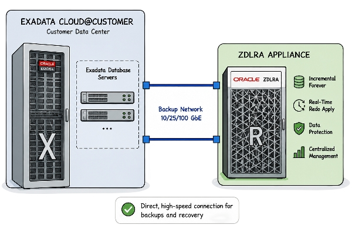
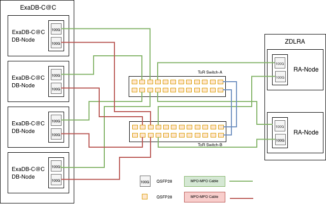
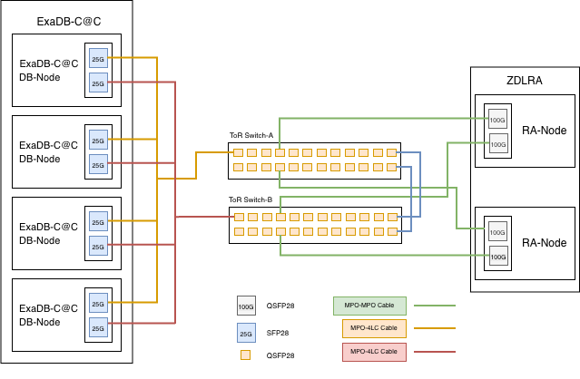

# ExaDB-C@C with Dedicated Backup Network to connect ZDLRA

## Introduction

To improve the ZDLRA attach rate to Exadata customers, we must make the joint engagement process as smooth as possible. According to sales teams, one of the impediments to these deals is the additional complexity introduced when discussing backup and recovery network requirements. This area is usually the responsibility of storage and networking teams, outside of the DBA team.

For some historical perspective, ZFS was able to achieve a high attach rate to Exadata, driven in part by the ability to use the InfiniBand fabric to create a dedicated backup network between the two architectures and keep the whole infrastructure under the control of the DBA team, without much involvement of the storage and networking teams. With the discontinuation of InfiniBand-based Exadata systems, the ZFS team introduced the ability to add two switches (Cisco 9336C) when configuring a ZFS rack to create a similar, dedicated backup network.

We are proposing to create a similar option for creating a dedicated backup network between ExaDB-C@C and ZDLRA RA23.  Its purpose is to relieve the need for additional networking discussions and effort during pre-sales on how ZDLRA would connect into a corporate backup network. It is not necessarily aimed at increasing network bandwidth for backup and restore traffic to ZDLRA, though that can be a benefit with dedicated network. 

ExaDB-C@C X11M can be connected to a RA23 (former named ZDLRA) but there are some specific considerations to keep in mind : 

1. ExaDB-C@C supports either 25GbE or 100GbE backup network configurations, depending on the Exadata generation and selected network option. Verify the deployed backup network configuration before designing connectivity to RA23.
2. The ExaDB-C@C internal network configuration can't be modified. 2x 25GbE or 2x 100GbE network ports per database server, designated as backup network, can be used.
3. If multiple VM Clusters are configured on ExaDB-C@C, each one should have its own VLAN. As a consequence, the ZDLRA ingest network must also be configured to support the same VLANs
4. If no VLANs are used, enter 1 as the VLAN id in the ExaDB-C@C backup network configuration for the VM cluster.
5. When configuring the ExaDB-C@C backup network it is mandatory to enter a default gateway IP address because ExaDB-C@C will perform some validation tests, including pinging the default gateway. It is possible to assign an IP address to the Cisco switch and specify it as the default gateway in the ExaDB-C@C configuration to pass the validation test.

 

## Connectivity Options for ExaDB-C@C and RA23

- Connection: 100GE on RA23 / 25GE on ExaDB-C@C - Direct connection using RA23 TOR Switches
    - RA23 to TOR switch
        - Direct connection 100GE via QSFP28 copper cable assembly, 3/5 meters, 4 cables
    - ExaDB-C@C X11M to TOR switch
        - Direct Connection from X11M database servers 25GE NICs 
            - under 5 meters: Copper break-out cable, QSFP28-4LC (optical module, ToR side, fixed on the cable)
            - over 5 meters: Optical splitter, MPO-4LC, need to include QSFP28 modules for the ToR switch
- Connection: 100GE on RA23 / 100GE on ExaDB-C@C - **Preferred option where 100GbE backup networking is available. No breakout cables required.**
    - RA23 to TOR switch
        - Direct connection 100GE via QSFP28 copper cable assembly, 3/5 meters, 4 cables
    - ExaDB-C@C X11M to TOR switch
        - Direct connection from ExaDB-C@C 100GbE backup network ports 
            - under 5 meters: Copper QSFP28-QSFP28 (optical modules fixed on the cable)
            - over 5 meters: Optical cable, MPO-MPO, need to include QSFP28 modules for the ToR switch

## Connection RA23 100GbE to ExaDB-C@C 100GbE via ToR

 

## Connection RA23 100GbE to ExaDB-C@C 25GbE via ToR

 

## Part List
Example of parts used for the architecture in the diagrams above:

- RA23:
    - TOR switches : 100 Gb Spine Switches (Quantity : 2)
    - Cables :
        - if the distance between RA23 and spine switches is 3m max (Spine switches are installed in RA23 rack) : 
            - 4 x QSFP28 copper cable assembly: 3 meters. (Quantity : 2)
        - if the distance between RA23 and spine switches is 5m max : 
            - 4 x QSFP28 copper cable assembly :5 meters can be used (Quantity : 2)
        - If a longer distance is needed Fiber cables and QSFP28 transceivers must be ordered instead : 
            - 4 x 100GbE QSPF28 Short-range transceivers
            - And: 
                - Optical cable assembly: 10 meters, MT ferrule terminated, 12-fiber, multimode, MPO, OM3 (Quantity : 2)
                - or Optical cable assembly: 20 meters, MT ferrule terminated, 12-fiber, multimode, MPO, OM3 (Quantity : 2)
                - or Optical cable assembly: 50 meters, MT ferrule terminated, 12-fiber, multimode, MPO, OM3 (Quantity : 2)
                - or Optical cable assembly: 100 meters, 12-fiber, multimode, MPO connectors, OM4 (Quantity : 2)
- ExaDB-C@C:
    - Installed on database nodes: Dual port 10/25 Gb NIC with 2x 10/25 Gb Dual Rate SFP28 SR transceiver or Oracle Dual Port 100 Gb Ethernet Adapter with 2x QSFP28 short-range transceiver 100G (NIC + optical modules are included as standard in the ExaDB-C@C build)
    - Installed on the 2 spine switches :  2 x QSFP28 transceivers (if optical cables), (Quantity : 2 transceivers are required for every four database servers)
    - Cables (database nodes with 25G NIC):
        - Optical or copper splitter cables (MPO-4LC split cables). The splitter cables combine four LC connectors for the database nodes into a single 100GbE MPO connector for the ToR switch.
        - *2 cables are required for every four database servers (each database server will use one LC connections of 2 different cables for redundancy)*
        - Up to 5m between ExaDB-C@C and Spine switches, copper split cable assembly option can be used : 
            - Copper Splitter Cable assembly: 5 meters, QSFP28 to 4 SFP28
        - From more that 5m between ExaDB-C@C and Spine switches, optical split cables must be used : 
            - Optical splitter cable assembly: 10 meters, MT ferrule terminated, 12-fiber to 4x2-fiber, multimode, MPO to 4 LC connectors, extended breakout, 50/125 diameter, OM4, LSZH, riser
            - or Optical splitter cable assembly: 20 meters, MT ferrule terminated, 12-fiber to 4x2-fiber, multimode, MPO to 4 LC connectors, extended breakout, 50/125 diameter, OM4, LSZH, riser
            - or Optical splitter cable assembly: 50 meters, MT ferrule terminated, 12-fiber to 4x2-fiber, multimode, MPO to 4 LC connectors, extended breakout, 50/125 diameter, OM4, LSZH, riser
    - Cables (database nodes with 100G NIC):
        - MPO - MPO optical cables 
        - 2 cables are required for every database server
        - Up to 5m between ExaDB-C@C and Spine switches, copper split cable assembly option can be used : 
            - Copper Splitter Cable assembly: 5 meters, QSFP28 to QSFP28
        - From more that 5m between ExaDB-C@C and Spine switches, optical cables must be used : 
            - Optical cable assembly: 10 meters, MT ferrule terminated, 12-fiber, multimode, MPO, OM3 (Quantity : 2)
            - or Optical cable assembly: 20 meters, MT ferrule terminated, 12-fiber, multimode, MPO, OM3 (Quantity : 2)
            - or Optical cable assembly: 50 meters, MT ferrule terminated, 12-fiber, multimode, MPO, OM3 (Quantity : 2)
            - or Optical cable assembly: 100 meters, 12-fiber, multimode, MPO connectors, OM4 (Quantity : 2)

**Notes :** 

- QSFP28 transceiver connects to MPO connector.
- SFP28 transceiver connects to LC connector.
- Transceivers are needed for optical cables only. Copper cables does not need transceivers.
- Optical cables = Fiber cables
- SFP28 = 25 GbE max
- QSFP28 = 100 GbE max
- Optical Splitter cables : 1  MPO connector to 4 LC connectors
- Copper Splitter cables : 1 QSFP28 connector to 4 SFP28 connectors

# Useful Links

- [KB196696 Set Up and Configure Exadata X9M Backup with ZFS Storage ZS9-2 Using Dedicated 100Gb Top of Rack (ToR) Switches](https://support.oracle.com/ic/builder/rt/customer_portal/live/webApps/customer-portal/?anchorId=&kmContentId=2905622&page=sptemplate&sptemplate=km-article))
- [KB784377 How to upgrade a 9336 TOR Switches in an Oracle ZFS Storage Rack ZS7-2 - ZS11-2](https://support.oracle.com/ic/builder/rt/customer_portal/live/webApps/customer-portal/?anchorId=&kmContentId=2782115&page=sptemplate&sptemplate=km-article)
- [Cisco Nexus 9336C-FX2 DataSheet](https://www.cisco.com/c/en/us/products/collateral/switches/nexus-9000-series-switches/datasheet-c78-742282.html)

Reviewed: 06/26/26

# License

Copyright (c) 2026 Oracle and/or its affiliates.

Licensed under the Universal Permissive License (UPL), Version 1.0.

See [LICENSE](https://github.com/oracle-devrel/technology-engineering/blob/main/LICENSE) for more details.
