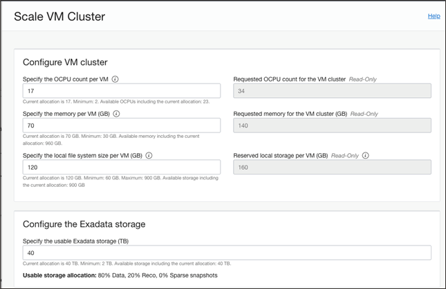
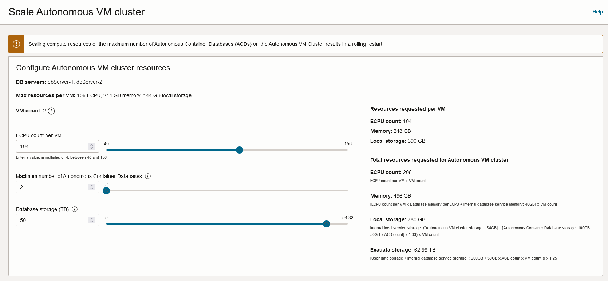
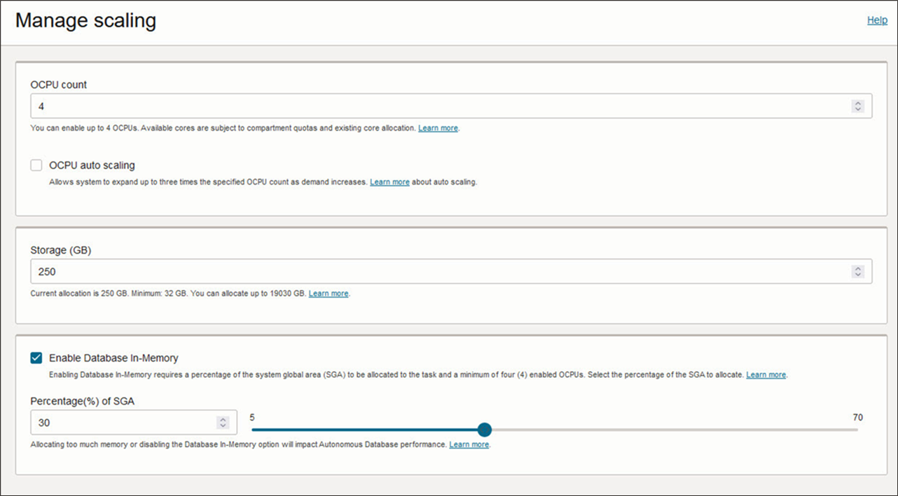
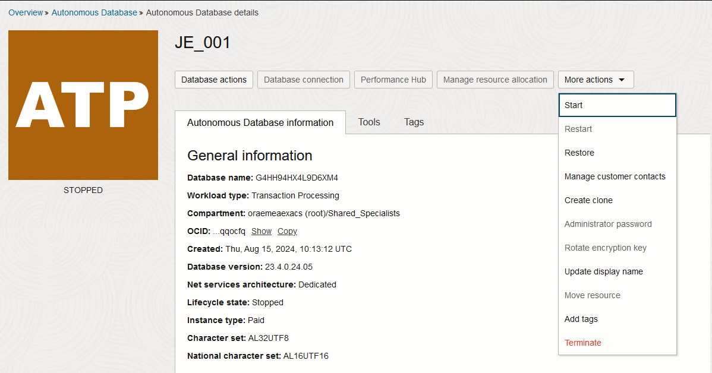
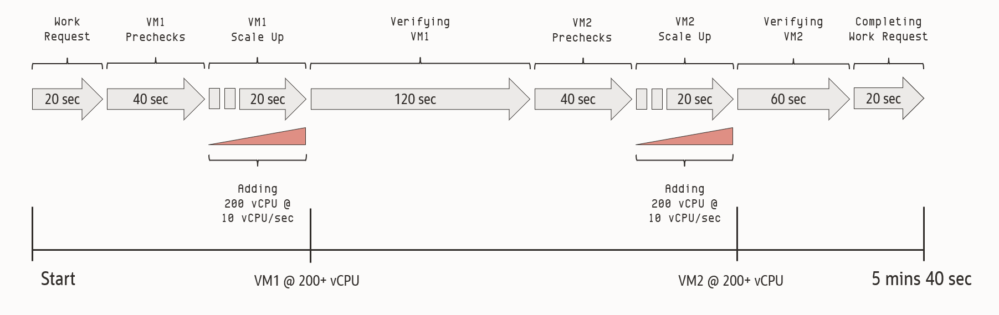

# VM Cluster Scaling

- [1. VM Cluster Scaling](#VMClusterScaling-Introduction)
- [2. VM Cluster Scaling based on CPU load](#VMClusterScaling-VMClusterScalingbasedonCPUload)
    - [2.1. Installation Best Practices](#VMClusterScaling-InstallationBestPractices)
- [3. Scaling recommendations for Autonomous Databases](#VMClusterScaling-ScaliongrecommendationforAutonomousDatabases)
- [4. Autonomous VM Cluster Scaling](#VMClusterScaling-AutonomousVMClusterScaling)
- [5. Autonomous Database Scaling](#VMClusterScaling-AutonomousDatabaseScaling)
- [6. Autonomous Database Scaling based on CPU load](#VMClusterScaling-AutonomousDatabaseScalinebasedonCPUload)
    - [6.1. Installation Best Practices](#VMClusterScaling-InstallationBestPractices)
- [7. Automation of billing stopping and starting](#VMClusterScaling-Automationofbillingstoppingandstarting)
    - [7.1. Non-autonomous Database Service](#VMClusterScaling-Non-autonomousDatabaseService)
    - [7.2. Autonomous Database Service](#VMClusterScaling-AutonomousDatabaseService)
- [8. Useful Links](#VMClusterScaling-Useful-Links)
- [9. VM Cluster CPU scale up/scale down time observtions]


## 1. Introduction

Scaling the number of OCPUs allocated to a VM Cluster manually can be done in the Cloud Console or by using OCI REST API.
With the REST API the scaling can be scheduled by time using simple scripts and crontab execution.

If ExaDB-C@C system is disconnected from internet/OCI Region and scaling needs to be performed then use dbaascli (see below).

In Exadata Database Service on ExaDB-C@C the billing occurs on the size of the VM Cluster.

To be able to achieve the best possible consumption results it is highly advisable to set up automated scaling for the VM clusters running on Exadata Cloud@Customer.



## 2. VM Cluster Scaling based on CPU load

Scaling the number of OCPUs allocated to a VM cluster based on CPU load is possible by using Dynamic Scaling. Dynamic Scaling is currently not part of the official cloud tooling, therefore it can not be configured from the OCI console.

### 2.1. Installation Best Practices

Please follow the installation instructions in the bellow linked MOS notes. The system running the Dynamic Scaling scripts has to have internet access to be able to connect to OCI. Oracle Dynamic Scaling can be executed as standalone executable or as daemon on VM cluster nodes. Dynamic Scaling is leveraging on oci-cli or REST API to perform the scale operations hence you have same network requirements to access OSN (Oracle Service Network). You can find the link for oci-cli GitHub page below.

## 3. Scaling recommendations for Autonomous Databases

Scaling for Autonomous Databases involves several different settings.

The OCPU/ECPU size of the Autonomous VM Cluster:

- can be scaled up/down to accommodate the total of the Autonomous Databases in the Autonomous VM Cluster - No billing occurs on this size
The OCPU/ECPU size of the Autonomous Database:

- can be scaled up/down to accommodate changes over times, day vs night, weekday vs weekend, end of month, etc. This is the base line.
- can be enabled to use Auto Scaling to automatically scale the Autonomous Database up to 3x the base line value, measured and billed per second.

## 4. Autonomous VM Cluster Scaling

Scaling the number of OCPUs/ECPUs allocated to an Autonomous VM Cluster does not incur any billing or change in billing.
In Autonomous the billing occurs on the Autonomous Database level (see below).

Scaling the Autonomous VM Cluster can be done to make room for additional Autonomous Databases in the Autonomous VM Cluster.



## 5. Autonomous Database Scaling

Scaling the number of OCPUs/ECPUs allocated to an Autonomous Database involves selecting the base OCPU/ECPU Count as well as enabling/disabling OCPU/ECPU Auto Scaling (see below for Auto Scaling).

In Autonomous Database Service on ExaDB-C@C the billing occurs on the size of the Autonomous Database, which can automatically scale using Auto Scaling.



## 6. Autonomous Database Scaling based on CPU load

Scaling the number of OCPUs/ECPUs allocated to an Autonomous Database is possible by activating the Auto Scaling feature, which is part of the official Cloud Tooling and can be activated at the creation of an Autonomous environment or at any later point (see example above).
Auto Scaling is able to scale the Autonomous Database up to 3x the selected OCPU/ECPU count. This Auto Scaling is a per second billing mechanism rather than an actual resource scaling.

The underlying Autonomous VM Cluster must have sufficient OCPU/ECPU resources for all the aggregated OCPU/ECPU count of Autonomous Databases (in that Autonomous VM Cluster).

At no point will the billing go below the currently selected OCPU/ECPU count, even it the CPU load is lower. This setting is the base line.
As described above, the setting can be changed in order to accommodate changes in workload over time (day vs. night, weekday vs weekend, etc.). Auto Scaling will work on top of this, if enabled.

### 6.1. Installation Best Practices

With auto-scaling enabled, the database can use up to three times more CPU and IO resources than specified by the number of CPUs currently shown in the Scale Up/Down dialog. If auto-scaling is disabled while more CPU cores are in use than the database's currently assigned number of cores, then Autonomous Database scales the number of CPU cores in use down to the assigned number.

## 7. Automation of billing stopping and starting
For environments, where 7/24 availability is not required it is highly advisable to implement automatic stop of the database service *(for example during outside of office hours like weekday nights and weekends)*. This will stop billing for the period of time and improves cost efficiency. Then automatically start the database service when required. 

### 7.1. Non-autonomous Database Service
Stop billing of non-autonomous Database Service is done by setting the OCPU count for the VM Cluster to 0 (zero) which in turn gracefully brings down the VM's of the VM Cluster. Starting the VM's again is done by raising the OCPU count per VM to minimum 2 OCPU or any desired value above that. Automating this is done by using the REST API and executing a simple script in a scheduler like crontab. There is an example written in Python on the GitHub link in the Public Resources section below.

Please note:

- Even if the allocated OCPUs to a VM is getting lowered to zero, the system is still reserving two OCPUs for the VM. This reserved capacity is not accounted for on the OCI Console when showing the number of available OCPUs. 
- Simply stopping the VM's or a VM Cluster does not stop billing. Only lowering the OCPU count to zero will stop billing.

As an alternative to REST API, the OCI client CLI can also be used as part of an automation. See this syntax for using the OCI client CLI:
Setting --cpu-core-count to 0 (zero) will gracefully shutdown the VM's of the VM Cluster and stop the associated billing. 

**Scale VM Cluster using CLI:**
```
oci db vm-cluster update  --vm-cluster-id <VM_Cluster_OCID> --cpu-core-count <#OCPUs>
```

### 7.2. Autonomous Database Service
Since billing of Autonomous Database Service incur on the Autonomous Database and not the Autonomous VM Cluster there is no need to scale the Autonomous VM Cluster down to 0 (zero).

To stop billing of Autonomous Database Service you must stop the Autonomous Database. And when service is to resume then start the Autonomous Database again. Automating this is done by using the REST API and executing a simple script in a scheduler like crontab.



**Stop Autonomous Database using CLI:**
```
export compartment_id=<substitute-value-of-compartment_id> # https://docs.cloud.oracle.com/en-us/iaas/tools/oci-cli/latest/oci_cli_docs/cmdref/db/autonomous-database/create.html#cmdoption-compartment-id
export db_name=<substitute-value-of-db_name> # https://docs.cloud.oracle.com/en-us/iaas/tools/oci-cli/latest/oci_cli_docs/cmdref/db/autonomous-database/create.html#cmdoption-db-name

autonomous_database_id=$(oci db autonomous-database create --compartment-id $compartment_id --db-name $db_name --query data.id --raw-output)

oci db autonomous-database stop --autonomous-database-id $autonomous_database_id
```

## 9. VM Cluster CPU scale up/scale down time observtions

There is a difference in time taken to scale up a VM Cluster depending on the number of VM's in the VM Cluster and the CPU delta of the scale operation.
VM's are scaled sequentially, not in parallell. And there are prechecks/verifications in the process that means the time taken to scale a given VM might be shorter or longer.
Main focus for the prechecks and verifications is to maintain VM Cluster availability at all times.

Scaling down during load takes considerably longer, but this is typically not time-sensitive, as scaling down is rarely urgent.



Generic scaling guidelines:
- For scale up, half of the VM's scale up first. If you consider scale up of a DR VM Cluster after a Data Guard failover this can be useful depending on customer DR plans. i.e. First start most critical services, set preferred nodes, etc.
- It is also useful to understand the difference between scaling up with a smaller vs. a larger CPU delta. The rate at which CPU's are hot added can be used to estimate scaling with different CPU deltas.
- Scale down should always to be tested under load since it's assumed it will impact the time significantly. This understanding is useful when determining if scale down should be done, or if staying at the current CPU count is the best.


# Useful Links

- [(ODyS) Oracle Dynamic Scaling Suite Main Index Page (Doc ID 2774779.1)](https://support.oracle.com/epmos/faces/DocumentDisplay?_afrLoop=462034266570470&id=2774779.1&displayIndex=5&_afrWindowMode=0&_adf.ctrl-state=28hy4urnp_72) this is a top level MOS note collecting all other Dynamic Scaling related one
- [(ODyS) Oracle Dynamic Scaling engine - Scale-up and Scale-down automation utility for OCI DB System (ExaCS/ExaC@C) (Doc ID 2719916.1)](https://support.oracle.com/epmos/faces/DocumentDisplay?_afrLoop=462547894780385&parent=DOCUMENT&sourceId=2774779.1&id=2719916.1&_afrWindowMode=0&_adf.ctrl-state=28hy4urnp_121) describing Dynamic Scaling options and configuration guidelines
- [oci-cli on GitHub](https://github.com/oracle/oci-cli)
- [ExaDB-C@C VM cluster manipulation with python](https://github.com/oracle/oci-python-sdk/blob/master/examples/exacc_vmcluster_example.py)
- [Introduction to Scale Up or Scale Down Operations](https://docs.oracle.com/en/engineered-systems/exadata-cloud-at-customer/ecccm/ecc-manage-vm-clusters.html#ECCCM-GUID-B9529795-C3D0-423A-B83F-BDD96AB29E32)
- [Scale the CPU Core Count or Storage of an Autonomous Database](https://docs.oracle.com/en/cloud/paas/autonomous-database/dedicated/adbcf/#articletitle)
- [CPU Allocation When Auto-Scaling](https://docs.oracle.com/en-us/iaas/autonomous-database/doc/ocpu-management-and-billing.html#ADBOR-GUID-E1D93E1C-76D5-43EC-A24A-40420601EC2D)
- [Cloud Coaching Video on Scaling Your Oracle Database Workloads on Exadata Cloud@Customer](https://youtu.be/PxscD5EedAQ)

Reviewed: 06/29/26

# License

Copyright (c) 2026 Oracle and/or its affiliates.

Licensed under the Universal Permissive License (UPL), Version 1.0.

See [LICENSE](https://github.com/oracle-devrel/technology-engineering/blob/main/LICENSE) for more details.
