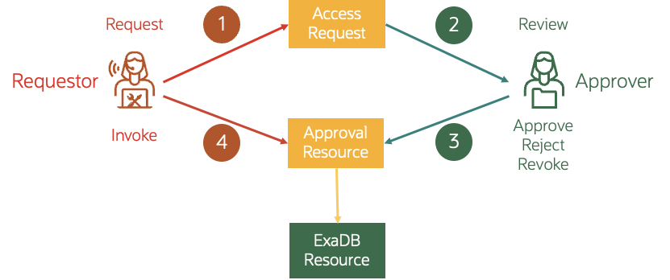

# ExaDB-C@C API Access Control

Oracle API Access Control enables customers to manage access to the REST APIs exposed by various database cloud services. Oracle API Access Control strengthens the security of OCI database cloud services by adding an extra authorization layer for critical operations and can be configured at any point during the subscription.

By designating specific APIs as privileged, customers can ensure that invoking these APIs requires prior approval from an authorized group within their tenancy.

Oracle API Access Control helps to prevent:

- Destructive mistakes: Say goodbye to accidentally deleting the wrong database or VM cluster
- Disruptive mistakes: Avoid unintentionally stopping, restarting, or updating vital services
- Access mistakes: No more installing SSH keys on the wrong VM cluster

This page will discuss how can customers enable this feature on their Exadata Cloud@Customer deployments.

## How it works

- Mark APIs as Privileged: Identify critical APIs that could impact data integrity or service availability.
- Approval Workflow: Before a privileged API is invoked, the user intending to invoke the API must raise an Access Request with their OCI identity, and a different OCI identity that is authorized to approve Access Requests for the resource must approve the Access Request.
- Enhanced Security: This workflow helps to prevent unauthorized or accidental execution of sensitive actions, such as modifying or deleting databases, Grid Infrastructure, virtual machines, or network resources.The workflow requires different identities to ask for access and approve access, including the cloud administrator account.

 

# Useful Links

- [API Access Control Documentation](https://docs.oracle.com/en-us/iaas/oracle-api-access-control/doc/overview-of-api-access-control.html)
- [API Access Control Demonstration Video](https://www.youtube.com/watch?v=-kzyH4LzP3c)
- [Use Oracle API Access Control with Oracle Exadata Database Service on Cloud@Customer and Oracle Exadata Database Service on Dedicated Infrastructure Tutorial](https://docs.oracle.com/en/learn/exadb-cc-api-access-control/)

Reviewed: 06/26/26

# License

Copyright (c) 2026 Oracle and/or its affiliates.

Licensed under the Universal Permissive License (UPL), Version 1.0.

See [LICENSE](https://github.com/oracle-devrel/technology-engineering/blob/main/LICENSE) for more details.
