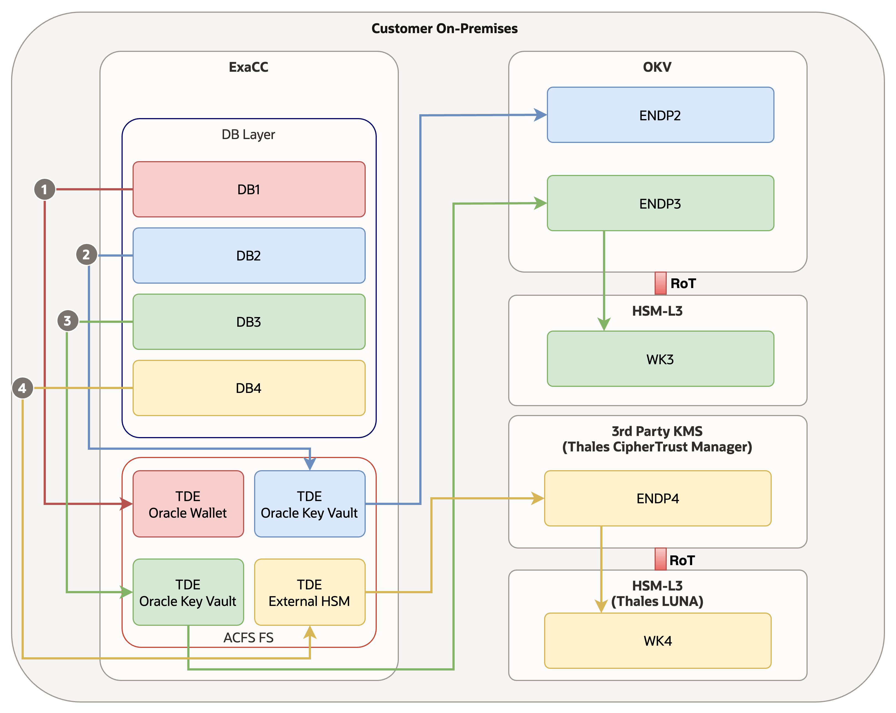
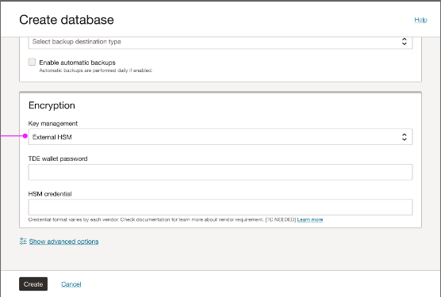
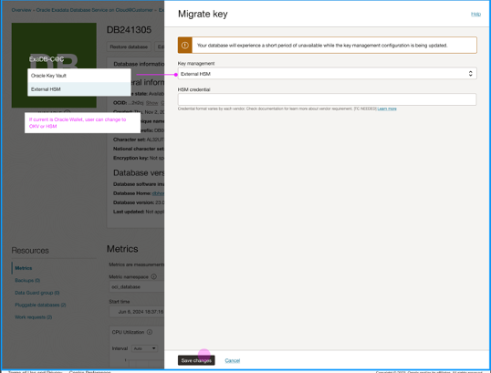
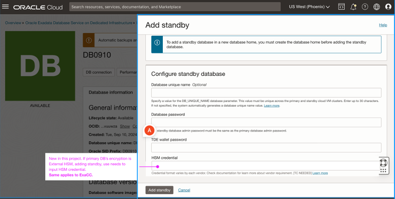

# ExaDB-C@C Key Management Using an External Key Store

- [1. Introduction](#ExaDBC@CKeyManagementUsinganExternalKeyStore-Introduction)
- [2. Supported Operations](#ExaDBC@CKeyManagementUsinganExternalKeyStore-SupportedOperations)
- [3. Requirements](#ExaDBC@CKeyManagementUsinganExternalKeyStore-Requirements)
- [4. How-To: dbaascli](#ExaDBC@CKeyManagementUsinganExternalKeyStore-How-To:dbaascli)
- [5. How-To: Cloud UI/RestAPI](#ExaDBC@CKeyManagementUsinganExternalKeyStore-How-To:CloudUI/RestAPI)
  - [5.1. Create Database](#ExaDBC@CKeyManagementUsinganExternalKeyStore-CreateDatabase)
  - [5.2. Migrate TDE Keys to HSM](#ExaDBC@CKeyManagementUsinganExternalKeyStore-MigrateTDEKeystoHSM)
  - [5.3. Dataguard](#ExaDBC@CKeyManagementUsinganExternalKeyStore-Dataguard)
  - [5.4. RestAPIs](#ExaDBC@CKeyManagementUsinganExternalKeyStore-RestAPIs)

## 1. Introduction

The ExaDB-C@C service now supports natively storing the TDE Encryption Keys in the 3rd party HSM (Thales fully tested).

**The External HSM, is as of now, only supported on Non-Autonomous VM Cluster.**

Before the release of this feature, the only possibility to store TDE Keys outside the VMs was using OKV.

There are now 3 possibilities for storing TDE Keys in the ExaDB-C@C service:

- Oracle Wallet
- Oracle Key Vault
- External HSM

It is important to consider that the suggested method to manage MKs on external devices is to use OKV.

There are lots of reasons why the OKV solution should be the preferred one:

- OKV is an Oracle Solution, the integrations with other Oracle Products like the ExaDB-C@C are built from the ground up.
- In case of bugs/problems/issues, the reactions from the Support can be faster and more effective. 
- New features are released over time by the OKV development team. 
- ER can be raised for specific customer requirements and they do not have any external dependencies.

Anyway, with the new release, the support of 3rd Party HSM allows the customer to use FIPS 140-2 Level 3 protected Hardware Security Modules (HSM) to securely store the TDE MEKs.

There are deployments where storing the MEKs on FIPS 140-2 Level 3 HSM is a requirement: now also those deployments are fully supported with the ExaDB-C@C deployment model.

It is important to consider that the Integration with 3rd Party HSM has been fully tested with the Thales products, even if it is not limited to these models. The PKCS#11 library used to access the 3rd party HSM is standard, it means that the solution can be integrated with other models from vendors other than Thales.

The following pictures summarise all the options available:



1.  Oracle Wallet: The TDE keys are stored in a PKCS#12 secured file on the VMs in the VM Cluster
2.  Oracle Key Vault: The TDE Keys are stored in the Oracle Key Vault
3.  Oracle Key Vault: The TDE Keys are stored in the Oracle Key Vault, the Root of Trust of the Oracle Key Vault is a Compatible External FIPS-140-2 Level 3 HSM
4.  External HSM: The TDE Keys are stored in the 3rd Party HSM

Thales is starting Certifying their KMS with ExaDB-C@C, for example, for the CipherTrust Manager, here is the link: [Thales ExaDB-C@C integration](https://thalesdocs.com/ctp/con/cakm/cakm-oracle-tde/latest/admin/tde-integrating_exadata/index.html)


## 2. Supported Operations

The tested operations are:

- *Create a new CDB on an existing VM cluster and choose the Master Key (MEK) location as External HSM*

- *Verify the status of the CDB to make sure it's using External HSM for encryption*

- *Restore the database to a previous state (in-place restore)*
  - *Restore to latest*
  - *Restore to timestamp*
  - *Restore to SCN*

- *Modify the backup configuration*
  - *Change backup destination: Object Storage / NFS / Recovery Appliance*
  - *Enable automatic backup*
  - *Retention: 7, 14, 30 (default), 45, 60 days*

- *Move the existing database to another DB homes*

- *Upgrade the database to a new major release version*
  - *Upgrade from 19c to 23ai*

- *Update (patch) 19c database to the next minor release within the same major release*

- *Perform the 'Rotate key' on the database\*

- *Create a new CDB on an existing VM cluster and choose the Master Key (MEK) location as a file-based Oracle Wallet*
  - *Create a CDB that uses wallet-based encryption*
  - *Create a CDB that uses wallet-based encryption, and add a standby\*

- *Migrate the databases (created in test case 9) from file-based Oracle wallet to External HSM*
  - *On a non-Data Guard CDB*
  - *On a Data Guard (DG) primary\*

- *Perform the 'Rotate key' on the migrated (to External HSM) database*

- *Add tags to the database after provisioning\*

- *Change the administrator password of the database\*

- *Create a standby database\*
  - *Within the region and across the region*
  - *Both Active Data Guard (ADG) and (regular) Data Guard*
  - *Protection mode: Maximum Performance \| Max Availability*

- *Perform Data Guard operations on the database*
  - *Switchover*
  - *Failover*
  - *Reinstate*
  - *Change protection mode*
  - *Change from (regular) DG to ADG, and vice versa*

- *Create a Pluggable Database on an existing database*
  - *On a non-DG environment*
  - *On a DG environment*

- *Perform 'Rotate key' on the PDB*

- *View the list of Pluggable Databases in a CDB*

- *View the PDB details*
  - *Check if it's using the same encryption method (External HSM) as the parent CDB*

- *Clone Pluggable Database to an existing CDB*
  - *On a non-DG environment*
  - *On a DG primary*

- *Clone Pluggable Database to a remote CDB*
  - *Clone across VM cluster, Infrastructure, Compartment, AD, database version (same or higher)*
  - *Clone between two non-DG environments*
  - *Clone from (source) non-DG environment to (destination) DG primary*
  - *Clone from (source) DG primary to (destination) non-DG environment\*

- *Create a refreshable clone of the existing PDB*
  - *On a non-DG environment*
  - *On a DG primary*

- *Convert the refreshable clone PDB to a regular PDB*
  - *On a non-DG environment*
  - *On a DG primary*

- *Relocate the Pluggable Database from one CDB to the other on*
  - *Relocate across VM cluster, Infrastructure, Compartment, AD, database version (same or higher)*
  - *When both source and destinations are non-DG environments*
  - *Relocate from (source) non-DG CDB to (destination) DG primary*
  - *Relocate from (source) DG primary to (destination) non-DG CDB*

- *Start and Stop PDBs\*

- *Restore PDB to a previous state (in-place restore)*
  - *Restore to latest*
  - *Restore to timestamp*

- *Add tags to PDB after provisioning*

- *PKCS library validation*
  - *Duplicate PKCS is allowed on Guest VM, but the database creation should fail and the user will get actionable error messages*

- *Add VM to an existing VM Cluster*
  - *Add VM will complete successfully via API, but it will not extend database instances to the newly created VM.*
  - *The user will need to set up the pkcs#11 library on the new VM and extend the database instances to this new VM.*

- *Delete VM Node from the existing Cluster*

- *Update Guest VM - apply Exadata image update*

- *Apply Grid Infrastructure update*

## 3. Requirements

To proceed with the configuration of the External HSM using the Cloud UI/API/dbaascli, the following requirements should be satisfied:

- The 3rd KMS/HSMs are ready to be used with an Oracle Database (ie: partition configuration on the Luna HSM)
- The Exadata Cloud@Customer Guest VMs can connect to the HSM
- The PKCS#11\* library configuration is completed on the Exadata Cloud@Customer Guest VMs
- Database version supported 19c and 23ai
- On the VM Cluster where you want to configure a database with the TDE Keys stored on an External HSM, no other DBs should be using Oracle Key Vault: only one external key management solution can be used on each VM Cluster.
- Only one vendor PKCS#11 library can be present on a Guest VM at a time.
- The external interface of the HSM may be used to view the keys, but no management operations are allowed. All the key management operations have to be performed from the database side, using the available tools.

Once all the above prerequisites have been satisfied, it is possible to move forward and configure the External HSM.

It will be possible to:

- Create a new database using External HSM
- Configuring a dataguard association for a DB that is using External HSM
- Moving an Oracle Wallet to the External HSM
- Rotate the MK for a database running using External HSM

The PKCS#11 Library will allow communication between the DomU and the KMS, the keys will be stored in the KMS and, if the KMS is connected to an HSM, the wallet password will be stored inside the KMS: this guarantees that all the MKs and the DKs will be protected.

**<NOTE**: when a database is protected by an external keystore, while you should be able to add the virtual machine to the existing VM cluster, the database instance will not be extended to the newly created VM. This is because one or more databases on this VM cluster are configured with an external keystore. You must configure the external keystore on the newly created VM, then run the dbaascli command to extend the database instances to the new VM.

## 4. How-To: dbaascli

Starting from version 24.2.1.0.0, the dbaascli tolling adds the possibility to use the new parameter **EXTERNAL_HSM** for the **tdeConfigMethod** switch.

Below are listed some of the dbaascli commands that include the new tdeConfigurationMethod

Create Database:
```
[root@amsexaclu1-ux3wk1 ~]# dbaascli database create --help|grep "tdeConfigMethod"|grep EXTERNAL

        [--tdeConfigMethod - specifies TDE configuration method. Allowed values are FILE, KMS, OKV and EXTERNAL_HSM]
```
Duplicate Database:

```
[root@amsexaclu1-ux3wk1 ~]# dbaascli database duplicate --help|grep "tdeConfigMethod"|grep EXTERNAL

        [--tdeConfigMethod - specifies TDE configuration method. Allowed values are FILE, KMS, EXTERNAL_HSM]
```

Move File to HSM

```
[root@amsexaclu1-ux3wk1 ~]# dbaascli tde fileToHsm --help| grep EXTERNAL

        [--hsmKeystoreConfigType - Specifies the HSM based keystore config type. Allowed values are OKV, KMS, EXTERNAL_HSM. Default value is KMS]
```

For example, to create a DB with the MKs stored in a third-party KMS, the following command can be used:
```
Example: 


[root@guru1 opc]# dbaascli database create --dbname v19db52 --oracleHome /u02/app/oracle/product/19.0.0.0/dbhome_1 --dbUniqueName v19db52_u --pdbName v19db52_pdb1 --waitForCompletion false --enableParallelDBCreation true --tdeConfigMethod EXTERNAL_HSM
DBAAS CLI version 24.1.2.0.0
Executing command database create --dbname v19db52 --oracleHome /u02/app/oracle/product/19.0.0.0/dbhome_1 --dbUniqueName v19db52_u --pdbName v19db52_pdb1 --waitForCompletion false --enableParallelDBCreation true --tdeConfigMethod EXTERNAL_HSM
Job id: 640c4b45-b5b3-41ab-b578-1ae65fa17a40
Session log: /var/opt/oracle/log/v19db52/database/create/dbaastools_2024-04-04_05-14-44-PM_25257.log
Enter SYS_PASSWORD:
 
Enter SYS_PASSWORD (reconfirmation):
 
Enter TDE_PASSWORD:
 
Enter TDE_PASSWORD (reconfirmation):
 
Enter HSM_PASSWORD:
 
Enter HSM_PASSWORD (reconfirmation):
 
Job accepted. Use "dbaascli job getStatus --jobID 640c4b45-b5b3-41ab-b578-1ae65fa17a40" to check the job status.
```

The HSM password, for example, if the KMS is Thales, will be in the format of \<admin_username\>:\<admin password\>. For example , admin:Welome_12345

This is the user that has the grants to connect to the Thales KMS, and read the MKs in the wallet. As stated above, the communication between the VM and the KMS is done via the PKCS#11 library (IP, confi file, etc.).

**NOTE**: *As of now, the possibility to integrate ExaCC with third-party KMS is limited to dbaascli. It should be planned to extend the integration also to the other tooling mechanisms (cloud console, APIs, etc).*

## 5. How-To: Cloud UI/RestAPI

It is now supported to configure an External HSM via Cloud UI or using the RestAPIs.

*Please refer to the public documentation for further details on how to configure the External HSM: *

- [Creating a DB](https://docs.oracle.com/en/engineered-systems/exadata-cloud-at-customer/ecccm/ecc-manage-databases.html#GUID-A15DB87F-5B4D-477A-9417-83862C3D3004)
- [Migrate Keys, Rotate Keys](https://docs.oracle.com/en/engineered-systems/exadata-cloud-at-customer/ecccm/ecc-manage-databases.html#GUID-D8B1B750-CBFD-4474-A047-2EC7E1B29A2C)

### 5.1. Create Database

During the creation of a database, a new Option is available in the Cloud UI: "External HSM".\
Choosing this option will also be requested the TDE Wallet Password (this is the wallet that will contain the user to connect to the KMS), and the HSM Credential.



### 5.2. Migrate TDE Keys to HSM

It is possible to migrate the Keys from an Oracle Wallet to an External HSM.



### 5.3. Dataguard

It is possible to create a dataguard association, adding a standby for a DB configured using External HSM



### 5.4. RestAPIs

Below is the list of the APIs the customer can use to manage the External HSM configuration.

- New APIs
  - POST /databases/{databaseId}/actions/changeEncryptionKeyLocation\
    encryptionKeyLocationDetails\
- Modified APIs
  - POST /databases
    - CreateDatabaseDetails\
      encryptionKeyLocationDetails
    - CreateStandbyDatabaseDetails (Multiple Standby Model)\
      encryptionKeyLocationDetails
  - POST {databaseId}/dataGuardAssociations
    - CreateDataguardAssociationDetails\
      encryptionKeyLocationDetails
  - GET /databases/{databaseId}
    - DatabaseSummary\
      encryptionKeyLocationDetails
  - GET /backup
    - BackupSummary\
      encryptionKeyLocationDetails


# Useful Links

- [ExaDB-C@C REST API Documentation](https://docs.oracle.com/en/engineered-systems/exadata-cloud-at-customer/rest.html)
- [How to change Encryption Key Locations](https://docs.oracle.com/en-us/iaas/api/#/en/database/20160918/Database/ChangeEncryptionKeyLocation)

Reviewed: 06/26/26

# License

Copyright (c) 2026 Oracle and/or its affiliates.

Licensed under the Universal Permissive License (UPL), Version 1.0.

See [LICENSE](https://github.com/oracle-devrel/technology-engineering/blob/main/LICENSE) for more details.
