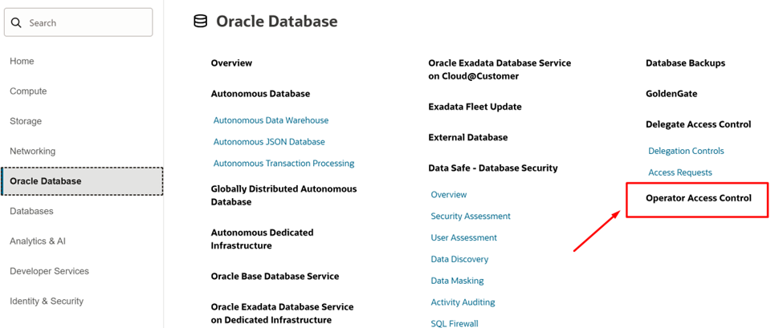
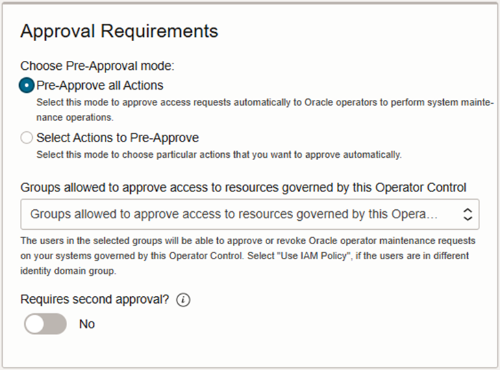
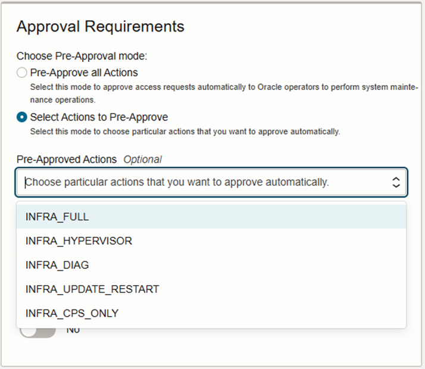
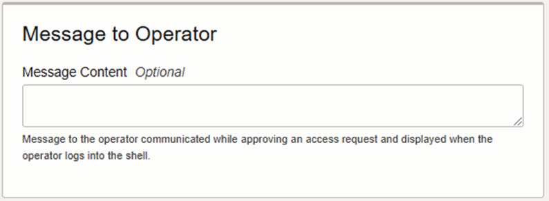
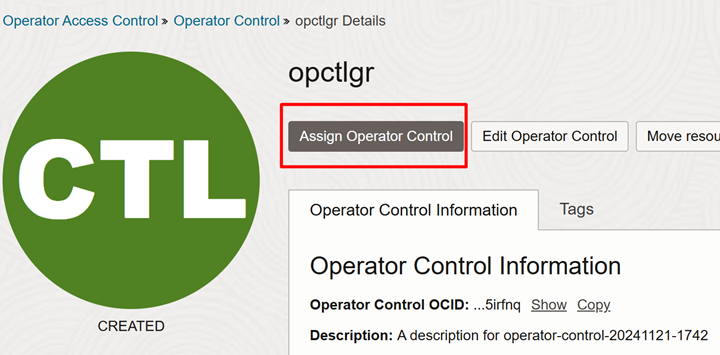
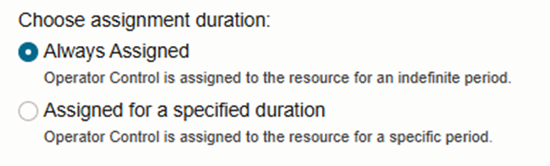
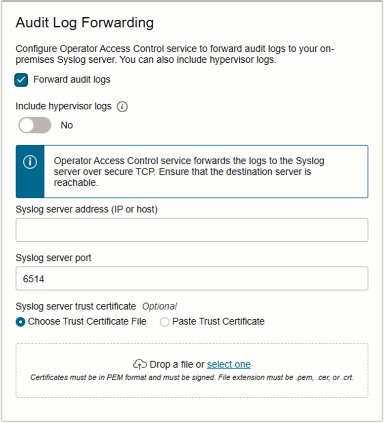

# ExaDB-C@C Operator Access Control (OpCtl)

Operator Access Control (OpCtl) is a security feature designed to manage and restrict what Oracle Cloud Operators (Cloud Ops) can do when accessing a customer’s Exadata Cloud@Customer infrastructure.

OpCtl allows the customer to perform the following:

- Control when and how much access Oracle staff have to ExaDB-C@C infrastructure
- Observe and record Oracle operator commands and keystrokes executed on ExaDB-C@C infrastructure
- Terminate Oracle operator connections at customer’s discretion

Oracle Cloud Ops may occasionally need to access the ExaDB-C@C system to perform maintenance, troubleshooting, or updates. However, some customers might not want them to have unrestricted access to sensitive data or certain administrative functions. This functionality can be switched on at any point during the subscribtion. 

## OpCtl Operational Workflow

1. Oracle internal process creates a Jira ticket for a Cloud Ops staff to perform a task on a specific ExaDB-C@C infrastructure, identified by OCID. Tasks could be either accessing the system for applying patches or performing diagnostics.
2. The Oracle Cloud Ops staff assigned to the Jira ticket creates an OpCtl Access request for a specific profile (chroot jail configuration) using FIPS 140-2 hardware MFA device (Yubikey)
3. The customer receives the access request
    - The customer can see the access request from the OpCtl interfaces (web UI, OCI CLI, REST API) in OCI
    - The customer can be notified of the access request via OCI notification service
4. Customer grants access via OpCtl interfaces, including the web UI, OCI CLI, and REST API
5. OpCtl software orchestrates the deployment of a temporary named user account in the specified chroot jail on the ExaDB-C@C infrastructure identified by the requested OCID
6. Oracle Cloud Ops staff accesses the temporary ExaDB-C@C infrastructure via ssh; authentication is performed via FIPS 140-2 compliant hardware MFA and authorization to connect is granted to the private key associated with the initial access request
7. The Linux auditing services record and publish commands and keystrokes entered by Oracle Cloud Ops
    - The audit log is available via the OCI Logging service
    - Direct send in syslog format from the Control Plane Server (CPS) to customer SIEM in syslog format
8. Customers monitor Cloud Ops actions from:
    - Their local SIEM receiving audit information from the CPS
    - OCI Logging Services
    - OCI streaming service
    - Any other customer SIEM integrated with the OCI streaming service

Customers can revoke access any time via OpCtl interfaces, such as web UI and REST API.

**Note:** Customers using OpCtl must be aware that any access Oracle operators require must be explicitly approved by the customer or their organization, as they control when and how Cloud Ops can access the system. Using OpCtl may have an impact on SLAs/SLOs depending on OpCtl pre-approval settings and customer’s reaction time.

## How to configure OpCtl on the OCI Console

Configuring OpCtl assumes the user is a member of a group that is permitted to administer OpCtl for the purpose of governing access to specific Exadata Cloud@Customer infrastructure.

OpCtl is a database-related service:

 

When creating OpCtl, you’ll get the option to pre-approve all actions or select actions to pre-approve:

Selecting **“Pre-Approve all Actions”** means that the OpCtl software will automatically generate the temporary credential and deploy the chroot jail to grant access to Oracle Cloud Ops in your behalf, but you will still retain all detective controls of command and keystroke logging, as well as the ability to revoke and terminate access.

Pre-approving all actions is ideal to reduce management effort and improve service quality and availability when the business and security risks of pre-approving access to the specific chroot jail are small compared to the value of reduced management effort and service quality.

Selecting the **“Select Actions to Pre-Approve”** option, gives you the option to select amongst the following:

- INFRA_FULL: Full System Access, to be used to offer the Oracle operator maximum flexibility to address complex or unusual situations, including diagnostics of kernel code, firmware, and hardware issues.
- INFRA_HYPERVISOR: System Maintenance with Hypervisor access / VM Control Privileges, to be used for diagnostics and maintenance scenarios where VM management on the Exadata Database Server is required.
- INFRA_DIAG: System Diagnostics, to be used for read-only diagnosing of issues in the ExaDB-C@C infrastructure layer when automated remote diagnosis is not sufficient for issue resolution.
- INFRA_UPDATE_RESTART: System Maintenance with Restart Privileges, to be used for operator access scenarios that require a system configuration change, or a restart of the system.
- INFRA_CPS_ONLY: Control Plane Server only, to be used for diagnostics and maintenance of the Control Plane Servers while preventing access beyond the Control Plane Servers, which includes preventing access to Exadata Database Servers, Exadata Storage Servers, management and storage networking switches, and Integrated Lights Out Management (ILOM) and serial ports on hardware components.

You can also choose not to pre-approve any actions.

Regardless of your choice, there should be an Operator Access Control group that is permitted to administrate OpCtl requests, review logs, etc.

You can also optionally send a message to the operator in the event you have a standard banner that you are required to show operators.

**Note:** Creating the OpCtl control does not assign the control to the infrastructure.

Before assigning the OpCtl policy to an ExaDB-C@C infrastructure, it’s recommended to configure a Notification with its corresponding Topic and subscription and create a Rule to drive the OpCtl notifications.

OpCtl audit logs are available to the customer via 2 interfaces:

- OCI Logging Service. You need to create a Log Group, which is a logical container that allows you to manage, organize and set access control to your logs.
- Direct send of audit logs in syslog format to customer-supplied IP address or hostname of a customer-controlled syslog server; this is useful for the transmission of the audit logs to a customer Security Information Event Management (SIEM) system.

To apply the OpCtl to a specific infrastructure, navigate to the control and click on “Assign Operator Control” at the top of the page:

First you have to select the Exadata Infrastructure that you would like to manage, and choose an assignment duration, which could be “Always Assigned” or “Assigned for a specific duration”:

You can also auto-approve access requests during the maintenance window. When Oracle does patching, there is a possibility that Cloud Ops will have to intervene to complete the patching process. The auto-approve access request during the maintenance window will speed the patching process and reduce any possibility of service outages.

You can optionally forward your OpCtl audit logs to an IP address or host name of a syslog server.

At this point you have completed the setup process, and now your system is ready to be governed for Operator Access authorized by you, and Oracle Cloud Ops will manage the infrastructure after you have approved an access request to the system.

Note that there is no Oracle override for this access request, so it’s very important that customers respond to access requests to ensure system availability and quality.

# Useful Links

- [Operator Access Control Documentation](https://docs.oracle.com/en/cloud/paas/operator-access-control/exops/overview-of-operator-access-control.html)
- [Operator Access Control Technical Brief](https://www.oracle.com/a/ocom/docs/engineered-systems/exadata/oracle-operator-access-control-tech-brief.pdf)
- [OpCtl configuration video](https://www.youtube.com/watch?v=nZaWa2Mfv_s)
- [OpCtl Access Control Request Processing Overview Video](https://www.youtube.com/watch?v=kExIxocLBJs)
- [OpCtl Access Request Processing Demo Video)](https://www.youtube.com/watch?v=ajz-gySXTHo)

Reviewed: 06/26/26

# License

Copyright (c) 2026 Oracle and/or its affiliates.

Licensed under the Universal Permissive License (UPL), Version 1.0.

See [LICENSE](https://github.com/oracle-devrel/technology-engineering/blob/main/LICENSE) for more details.
