# Part 1 - Set up OCI OpenSearch and configure Oracle Notification Service

## Introduction

In this part, you will configure the main parts. First, you will set up a VCN and configure the ports in the subnet. Then, you will create a new OCI OpenSearch cluster. Lastly, you will create a new ONS Topic. This will be used in the end to automatically notify you by e-mail of any anomalous behaviour in the data accessing OCI OpenSearch.

## Task 1: Create a VCN and configure the ports

1.	From the Oracle Cloud homepage, click on the hamburger icon, click on **Networking** and following click on **Virtual Cloud Networks**.

2.	Click on **Start VCN Wizard**, choose the **Create VCN with Internet Connectivity** option and click on **Start VCN Wizard** again.
   
    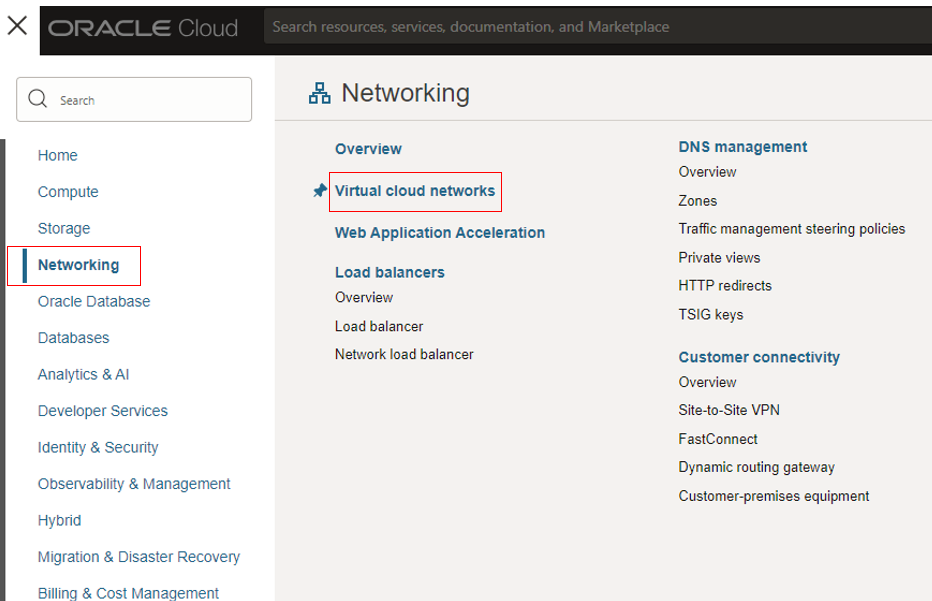
  	
  	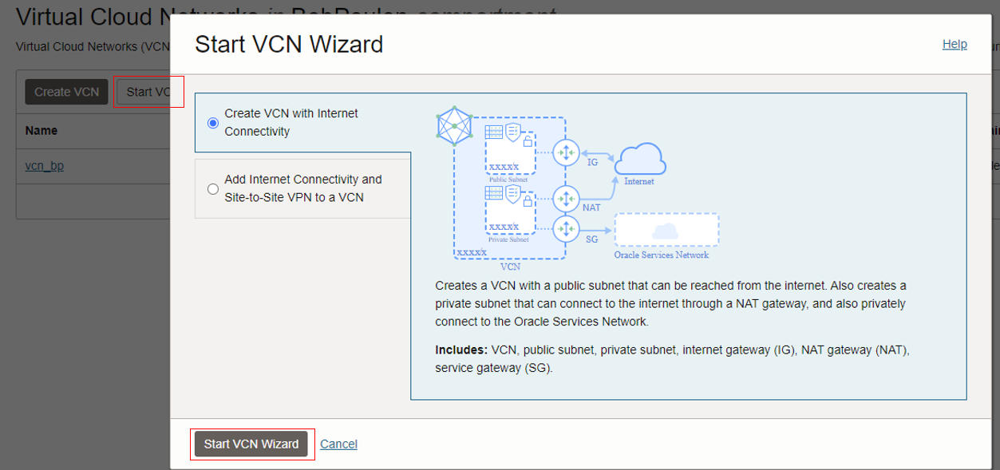

3. Add a logical name in the **VCN Name** box. Following, click on **Next** and then click on **Create**. This will create a VCN with a public and a private subnet. When all items are completed, click on **View VCN**.

    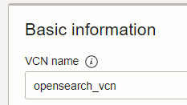
   
    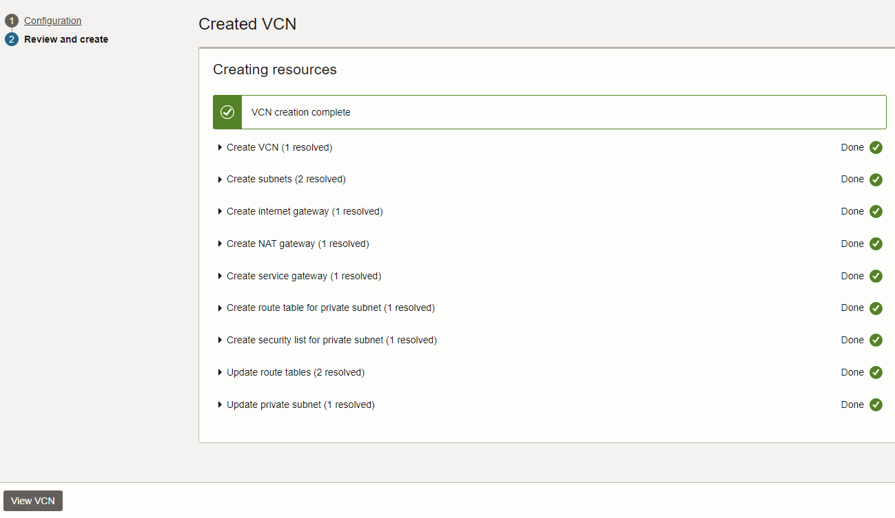
   
5. To make sure you can access the OCI OpenSearch cluster and dashboard, we have to open two ports. On the left side, click on **Security Lists** and following click on **Security list for private_subnet-[name of VCN]**
   
    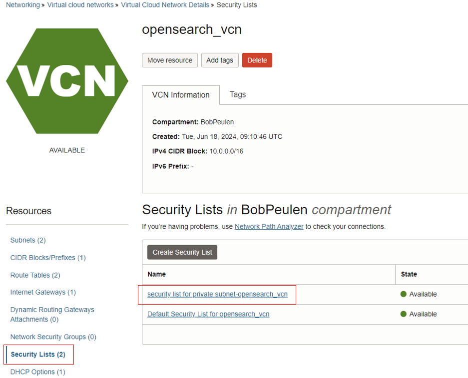

7. In the security list, click on **Add Ingress Rules**. Add "0.0.0.0/0" to the **Source CIDR** box and add "9200,5601" to the **Destination Port Range**. Leave the other boxes empty or default. Click on **Add Ingress Rules**.
   
    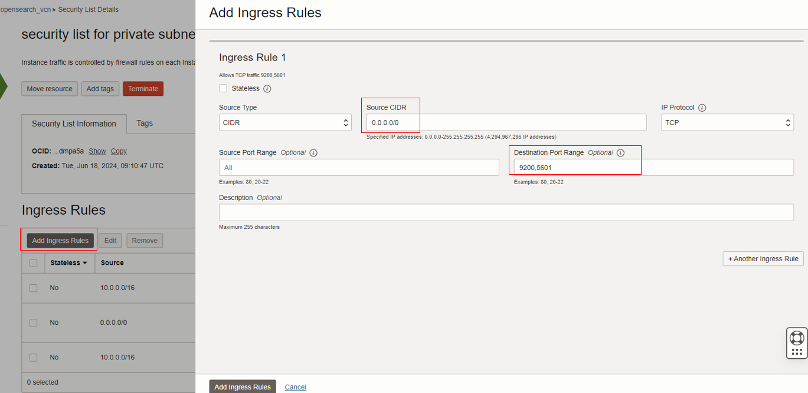

## Task 2: Create an OCI OpenSearch Cluster

1. Click on the hamburger menu, go to **Databases** and following click on **OpenSearch**. In the next screen, click on **Create Cluster**.

   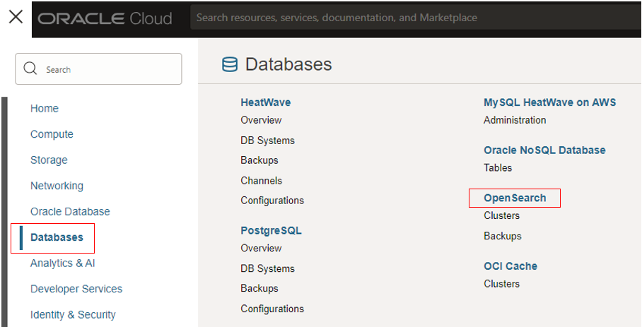

2. In the **Configure cluster** screen. Add a logical name to the **Name** box. Make sure the software version is 2.11.0. Optionally, add your e-mail to the contact e-mail box. Click on **Next**

3. In the **Configure security** screen, add a **username** and **password**. You will need these credentials later. Click on **Next**.

4. In the **Configure nodes** screen, leave the default settings as they are. Optionally, you may increase the nodes. Click on **Next**.

5. In the **Configure networking** screen, please select the VCN you just created and select the associated **Private subnet**. Click on **Next**.

6. Review the summary and click on **Create cluster**. Afterwards, click on **View details**. The creation of a cluster might take several minutes. Step inside the cluster by clicking the name.

   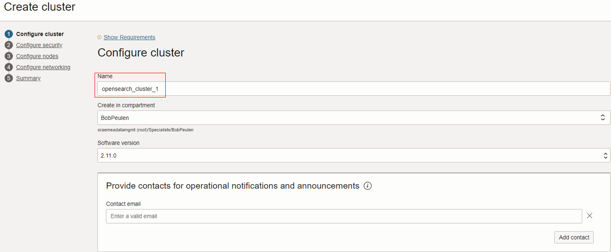

   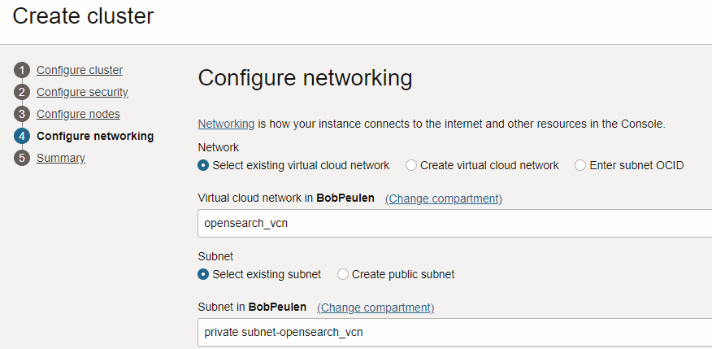

7. When the OpenSearch Cluster has the **State: Active** (green status), step inside the cluster overview page and copy to a local notepad the:
   * **API endpoint** This is the endpoint used to create the index and add your data.
   * **OpenSearch Dashboard private IP** This is the private IP of the dashboard. You will use this private IP to open the dashboard.

   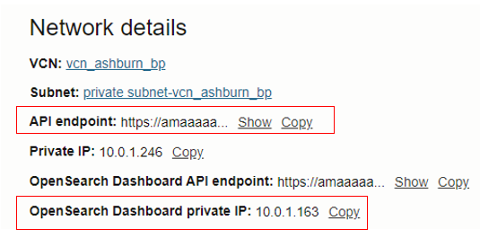

## Task 3: Create an Oracle Notification Service (ONS) topic

In this task, you will create an ONS topic and add your personal or work-related e-mail to the service. At the end of the workshop, the ONS topic will be invoked to report detected anomalies directly in your e-mail.

1. Go to the Oracle Cloud homepage and click on the hamburger menu. Following, click on **Developer Services** and click next on **Notifications**
2. On the next page, click on **Create Topic**. Add a name to the **Name** box and click on **Create**.
3. Click on the newly created topic to open the topic. When the topic is not directly visible, refresh the page.
4. Click on **Create Subscription**. Use **E-mail** as protocol and add your work or personal e-mail to the **Email" box. Click on **Create**.
   
   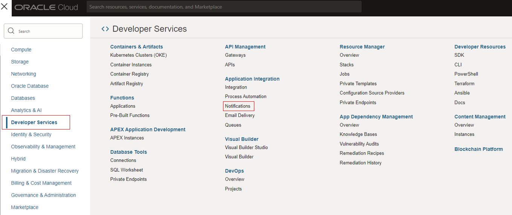
   
   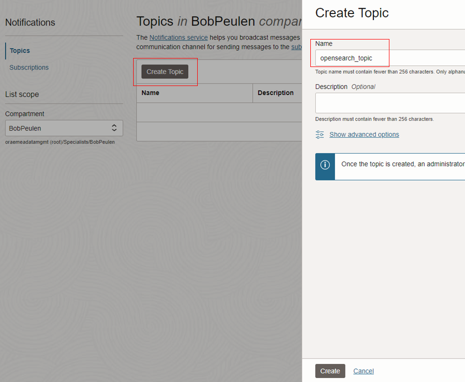
   
   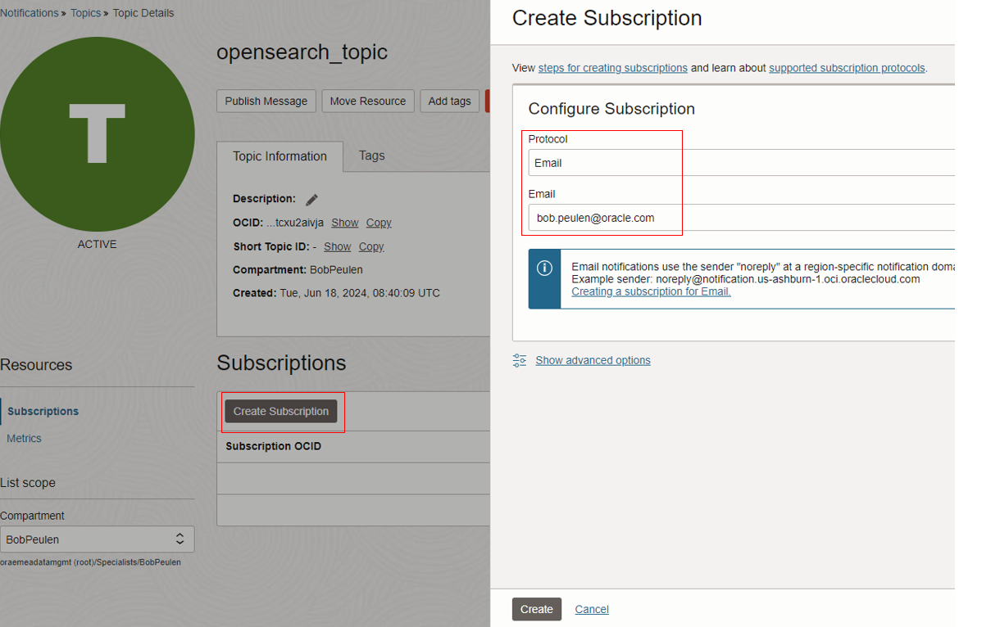

6. The notification service has sent you an e-mail. Please go to your personal or work-related inbox and click on **Confirm Subscription**.
7. Return to your created topic and copy the Topic's OCID. You will need this OCID later.
   
   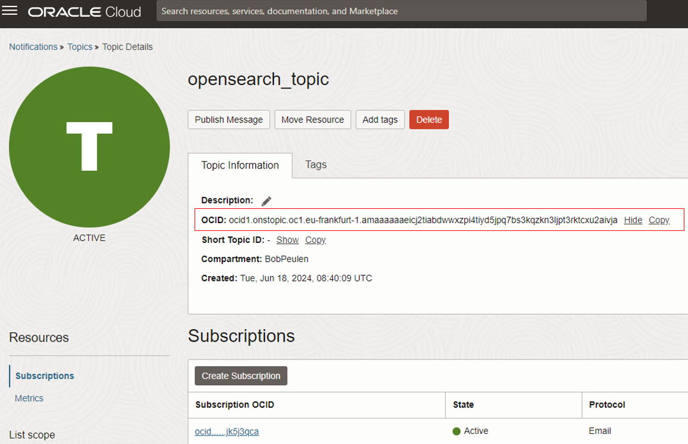

# Part 2 - Set up Anomaly Detection in OCI OpenSearch

## Introduction

In this part, you will first set up and start a Detector, focusing on Anomaly Detection. You will configure the detector and start it. Afterwards, you will set up a new trigger based on incoming values. The trigger will be integrated with the Oracle Notification Service (ONS). Based on the trigger and the result of the anomaly detection, you will be notified by e-mail when an anomaly hits a certain treshold.

The steps assume you have incoming traffic. The index used in an example.

## Task 1: Create an Anomaly Detection Detector in OCI OpenSearch

1.	Open the OpenSearch dashboard. Click on the hamburger menu button and under **OpenSearch Plugins** select **Anomaly Detection**

2.	Click on **Create detector** to configure the anomaly detection.

  	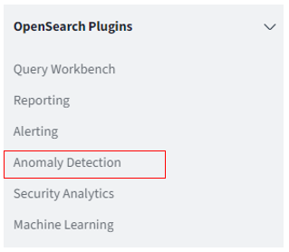
  	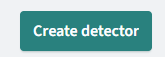

3. Change the **Name** to opensearch_detector_ad and select the index you just created in the **Index** tab.

   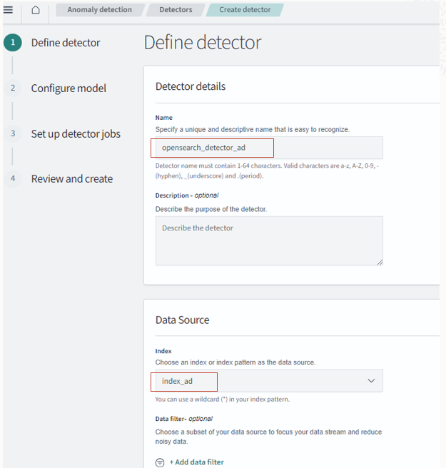

4. In the **Timestamp field** select @timestamp. Set **Detector interval** to 5 minutes and the **Interval** to 1 minute. When done, click on **Next**.

   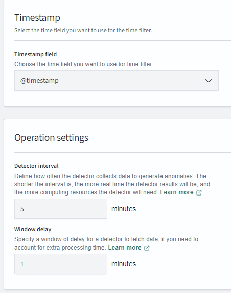

5. On the next page, you will define the features that are used to train and use in the anomaly detection. The features used are examples of incoming traffic. In the first feature, change:
   - Feature name: latency_max_ad
   - Aggregation method: max()
   - Field: latency_max

  When done, click on **Add another feature**.

  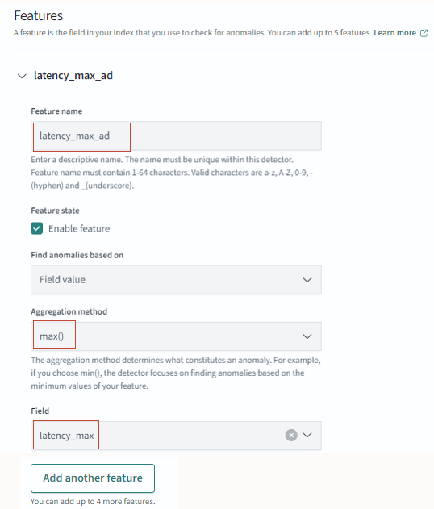

6. For the new feature, we will use the minimal latency. Add the following:
   - Feature name: latency_min_ad
   - Aggregation method: min()
   - Field: latency_min

    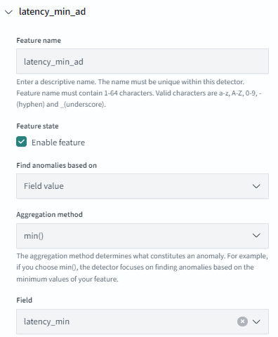

7. When you added both the maximum and minimal feature, scroll down and click on **Preview anomalies**. This will provide you with several graphs showcasing the data you are working with. When satisfied, click on **Next**

     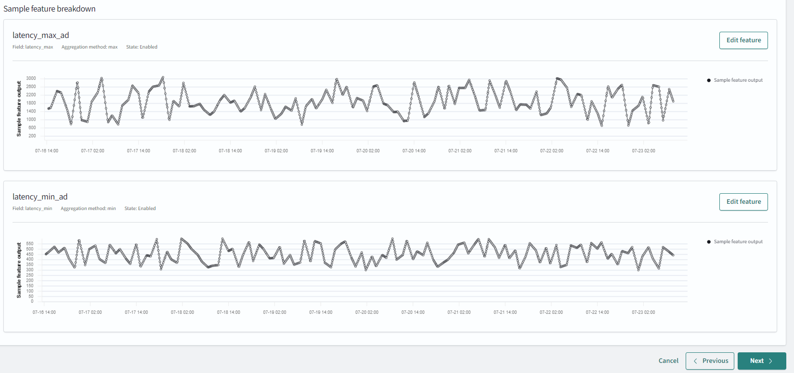

8. In the next page, make sure the **Start real-time detector automatically (recommended)** is enabled. Click on **Next**.

    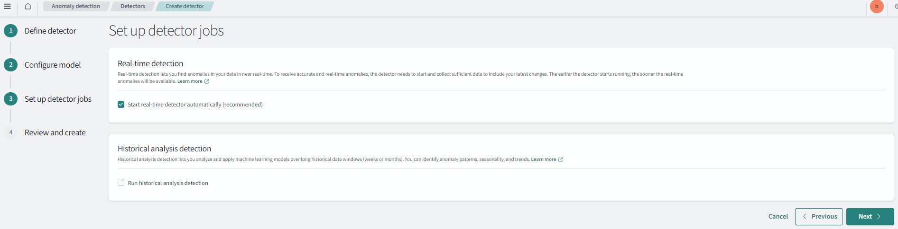

9. The next page is an overview of your selections and the anomaly detection. Review the settings and click on **Create detector** at the bottom of the page.

10. The anomaly detection will now be created, this may take a few seconds to minutes. In background, the available data will be used to train an anomaly detection and following this model will deployed. Afterwards, you can in real-time add more data to the index and the anomaly detection model will be automatically applied to the incoming data. Click on **Real-time results** to see the progress and the main dashboard.

    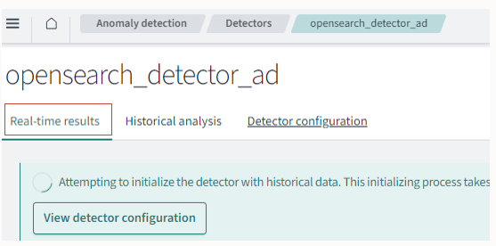

    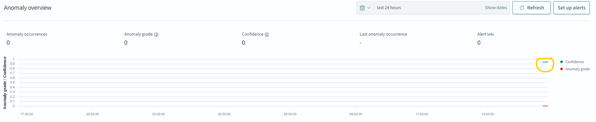

## Task 2: Set up automated e-mail notification using ONS

In this taks, you will set an alert based on the anomaly detection detector. When the alert is triggered, this will trigger the ONS service you configured before.

1. In the overview page of the just created detector, click on the **Set up alerts** button.

   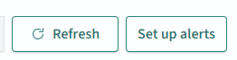

3. In the **Create Monitor** page, add a name to the **Monitor name**, select **Per query monitor** and select **Anomaly Detector** as the monitor defining method.

4. In the **Detector** list, make sure to select the detector you just created. 
   
   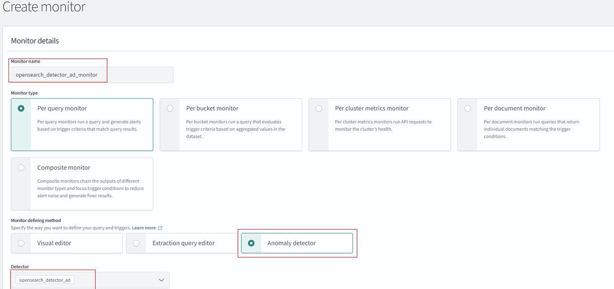

5. In the **Schedule** tab, change the **Run every** to **5 minutes**.
   
6. Click on **Add trigger**

   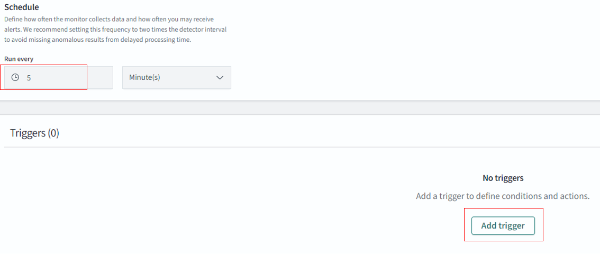

7. In the trigger overview, change the following:
   * Change the **name** to "trigger_anomaly_detection".
   * Make sure the **Trigger type** is "Anomaly Detection grade and confidence".
   * Change the **Anomaly grade treshold** to **IS ABOVE** 0.80.
   * Change the **Anomaly confidence threshold** to **IS ABOVE** 0.6.
  
     More information what algorithm is used and what the scores indicate can be found on the [OpenSearch pages](https://opensearch.org/docs/latest/observing-your-data/ad/index/).

   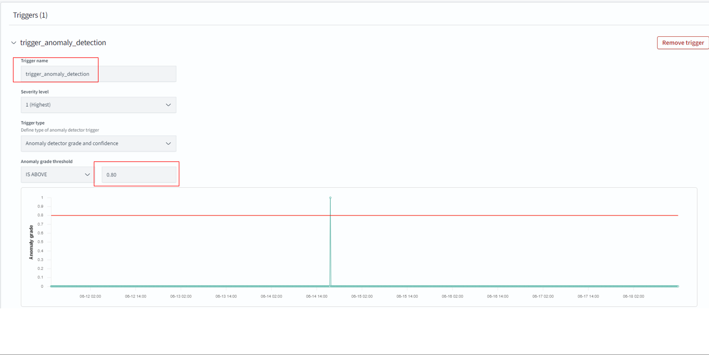

8. When you have changed the parameters of the trigger, click on **Manage channels**. This will open a new page in your browser. Do not close the previous page.

   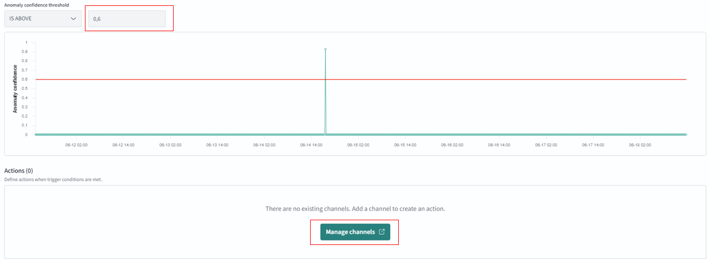

9. In the newly opened page, click on **Create channel**, please change:
   * Add a **name** for the channel
   * Select **Oracle ONS** as **Channel type**
   * Copy the ONS OCID in the **ONS Topic OCID**. You copied this OCID in Lab 1, Task 3.
     
    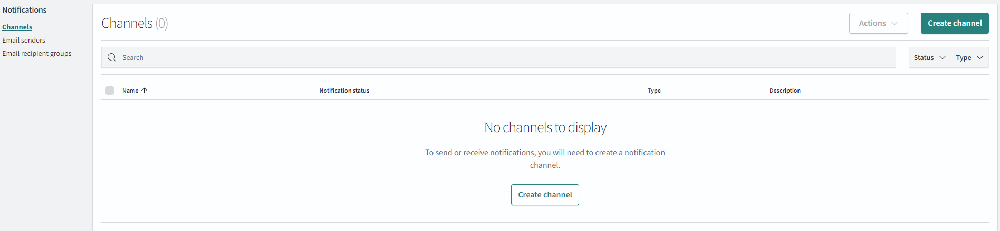
   
    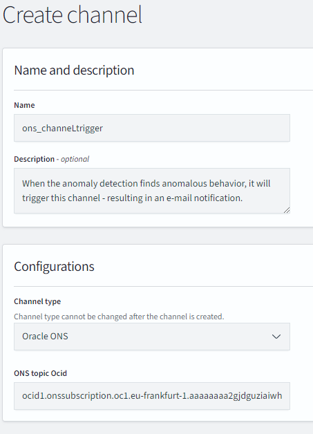

10. Click on **Send test message**. This will trigger an example message and should appear in your inbox. See an example of a successful response in the below screenshots.

    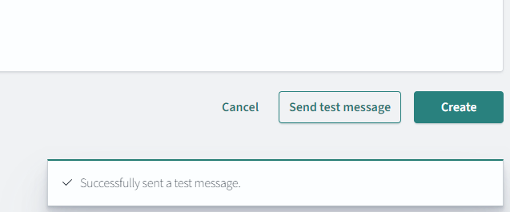

11. When successful, click on **Create**. This will create the channel.

12. Please go back to the previous page (different tab in your browser). Click on **Create**. This will create the alert. The last step is to add the newly created channel to the alert and configure the e-mail response.

13. In the overview page of the trigger, click on **Edit**. You are now at the same page when you were configuring the trigger. Scroll all the way down, expand the trigger, and click on **Add action**.

14. In Action page, add a **name** for the action (e.g., "notification_anomaly_too_high"), select the **channel** you just created. Click on **Preview message** to review the e-mail in full.

  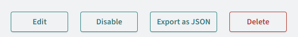

  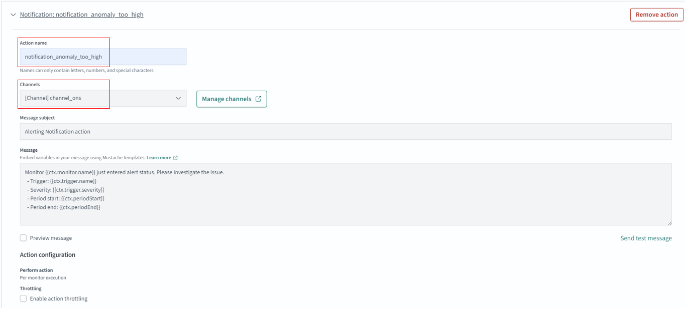

15. When done, scroll down and click on **Update**. This will update the trigger and when there is an anomaly based on the provided settings, you will receive an e-mail using the ONS.

16. Click on **View detector** to return to the real-time page running the anomaly detection.