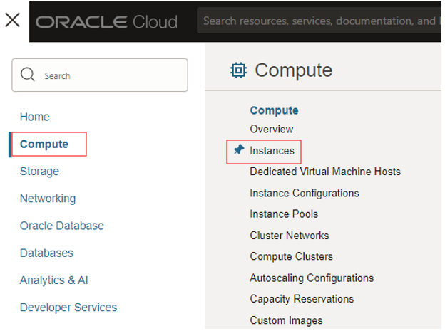
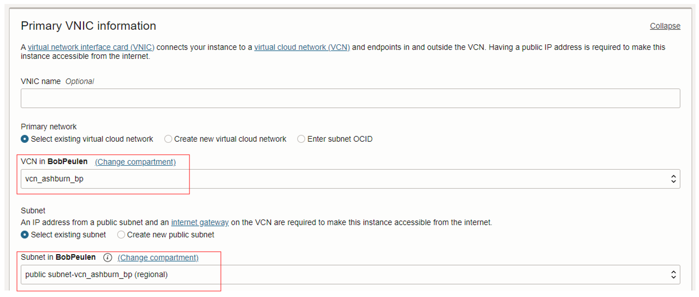
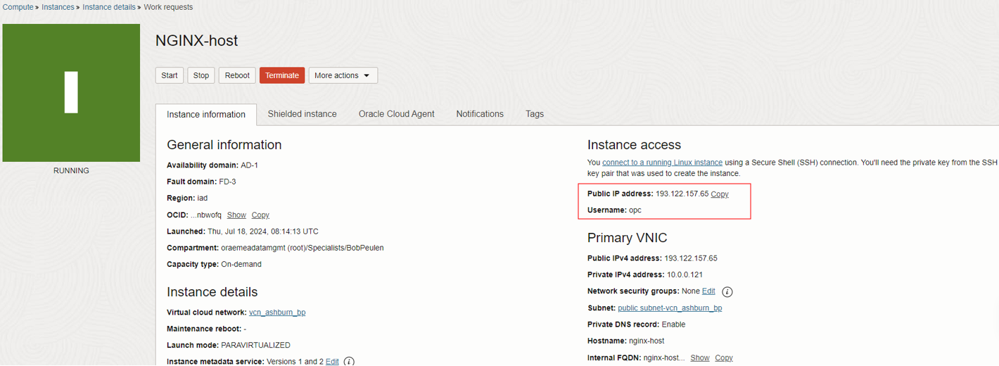
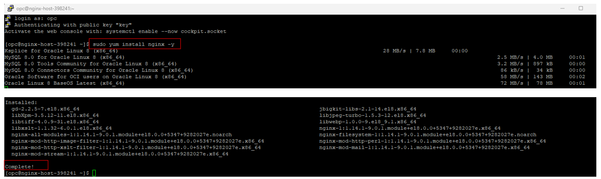
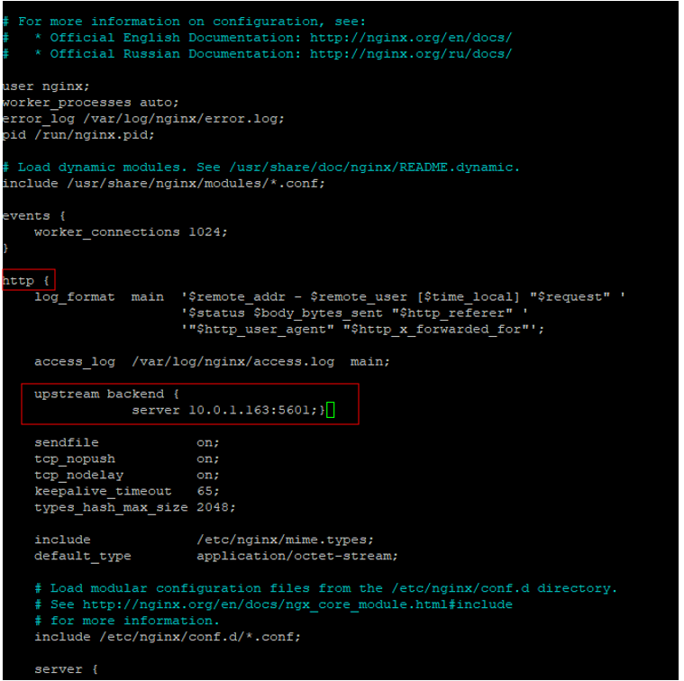
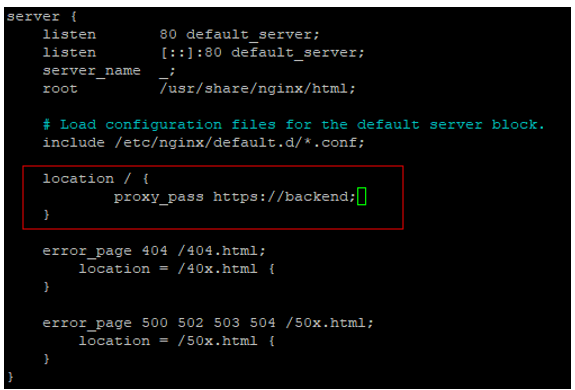
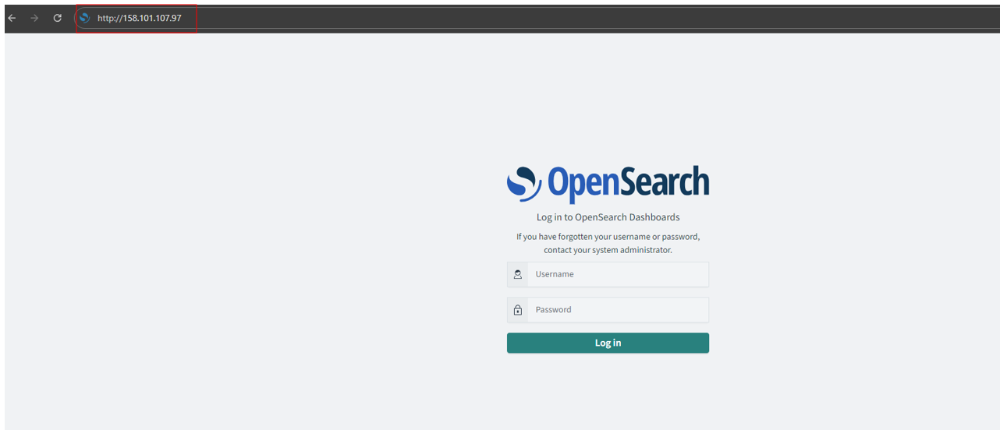

## Create a compute host with NGINX to access the dashboards

In this example we choose Oracle Linux, you can choose any O.S., please note that paths may be slightly different on specific opereating systems.

The below steps assume you have created an OCI OpenSearch cluster in the public subnet and that you have added the ports (9200, 80, 5601) to security list of the public subnet.

1.	Click on the hamburger menu, go to **Compute** and click on **Instances**. Click on **Create Instance**.

   
   
2.	Change the **Name** to NGINX-host. All default settings are fine, however, feel free to change the Instance Shape. In this example, we are using Oracle Linux 8 as image.
3.	In the **networking options**, make sure to select the same VCN as you just created. Select the **Public Subnet**.

   

4. In the **Add SSH Keys** box, make sure to either **Save private key** or upload your public key. For more information on the different options to connect to the instance, visit this [Connect to your instance](https://docs.oracle.com/en-us/iaas/Content/GSG/Tasks/testingconnection.htm) page.
5. When you completed the steps, click on **Create instance**. This will take 10 - 20 seconds before the instance is active.
6. When the instance is **Active**, use the Public IP address and Username to SSH into the instance. See [here](https://docs.oracle.com/en-us/iaas/Content/GSG/Tasks/testingconnection.htm) for more details on how to SSH into your instance.

   


7. In your terminal of choice, run the following command. This will set SELinux to permissive temporarily. To make the change persistent, [follow these steps](https://community.oracle.com/customerconnect/discussion/636723/how-to-set-selinux-to-permissive-mode).
    ```
    sudo setenforce 0
    ```

8. Next, run the following command. The below will install NGINX on your instance. When finished, the terminal should state **Complete!**.
    ```
    sudo yum install nginx -y
    ```

   


9. Run the below command in the terminal to make sure the NGINX service is enabled and that on reboot, the service automatically enables.
   ```
   sudo systemctl enable --now nginx.service
   ```
    
10. In Oracle Cloud, in the overview page of your OpenSearch cluster. You will find the **OpenSearch Dashboard Private IP**. NGINX will use this private IP to forward the HTTP traffic towards. Find the Private IP and use the private IP in the next step.

   

11. Copy the below statement and replace the **[ADD_YOUR_DASHBOARD_PRIVATE_IP_HERE]** with your dashboard's private IP. 
   ```
    upstream backend {
           server [ADD_YOUR_DASHBOARD_PRIVATE_IP_HERE]:5601;}
   ```

12. Go back to your terminal and run the below. This will open the config file for the NGINX. In this config file, we can add the routing: from https traffic towards the OpenSearch dashboards using the public IP of the instance you are working on.
       ```
       sudo nano /etc/nginx/nginx.conf
       ```

13. The previous command opens the file, you can now edit the file. Use the arrows to go down to the **http** section. Add between **access_log** and **sendfile** a new line, being the statement from step 9. Make sure you changed the Dashboard's private IP.

   

14. When you added the statement, scroll down until you see **location**. Similar to the previous step, change the file using the below statement. When done, hit **CRTL + X** to close the file, select **Y** to save the changes made and following hit enter to overwrite the current file.

    ```
    location / {
          proxy_pass https://backend;
        }
    ```

   


15. When you closed and saved the config file. Run the below statement in the terminal to open the instance's firewall so it can accept and process http traffic towards the OpenSearch dashboards. The result should **success**.

    ```
    sudo firewall-cmd --add-service=http --permanent
    sudo firewall-cmd --reload
    ```

16. Run the below commmand. This will reload the changed config and restart the NGIX service. After this change, the NGINX is active with the changes made.
      ```
      sudo systemctl restart nginx
      ```

17. Optionally. You can review the status of the NGINX server by running the below command.
      ```
      sudo systemctl status nginx
      ```

   

18. You can now open the OCI OpenSearch dashboard by using the public IP. Use the public IP of you compute instance in any browser. Make sure to use **http://**. and make sure you are not on VPN. You can log in using the credentials you provided when creating the OCI OpenSearch cluster. Example:
      ```
      http://158.101.107.97/
      ```
   


19. Optional. When you have to run debugging or you would like to see the access or error logs, run the below command. 
      ```
      sudo tail -f /var/log/nginx/access.log -f /var/log/nginx/error.log
      ```
