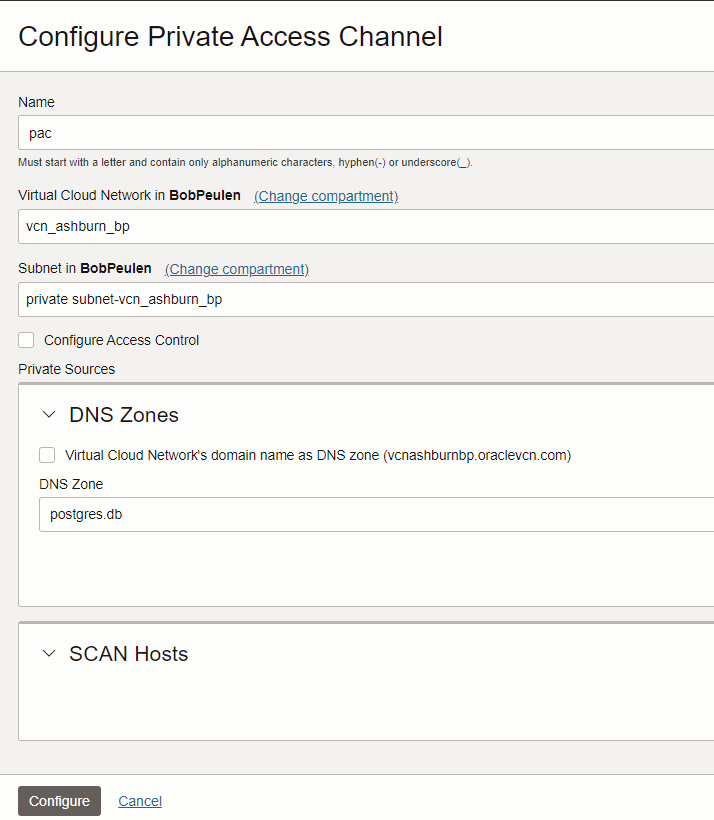
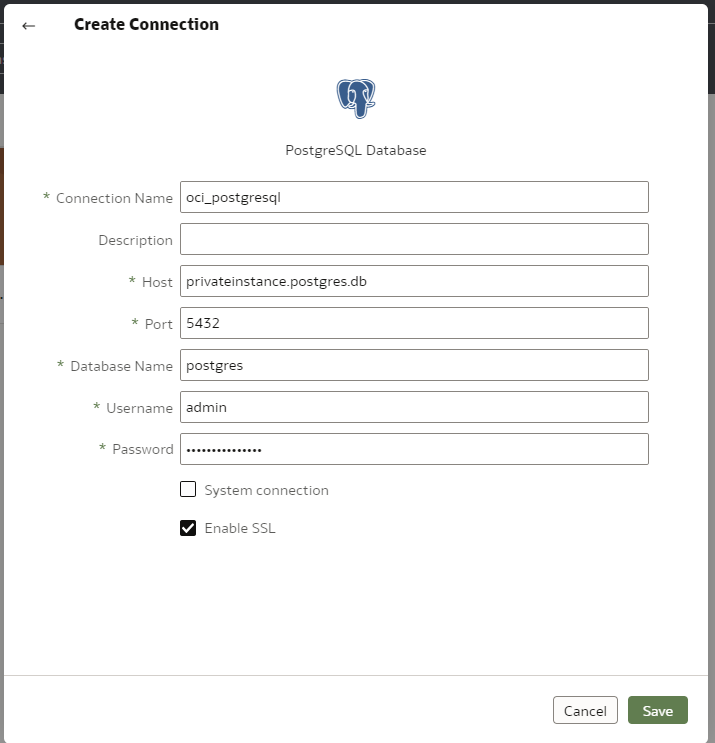

# Connect to OCI PostgreSQL, load data using DBeaver and connect to Oracle Analytics Cloud

Prerequisites
- Create a VCN with public and private subnet
- Create an OCI PostgreSQL database instance in the private subnet
- Create a Linux instance in public subnet, same VCN
- Add port 5432 to the private subnet security list

 For more details on using Linux instance to connect to PostgreSQL, [see documentation here](https://www.postgresql.org/download/linux/redhat/).

# Create and access an OCI PostgreSQL database

1. SSH into the Linux instance, make sure the instance is in the public subnet of the same VCN you provisioned the OCI PostgreSQL instance. Run the below command. This will install the client for PostgreSQL version 14. 
```
sudo dnf install -y https://download.postgresql.org/pub/repos/yum/reporpms/EL-8-x86_64/pgdg-redhat-repo-latest.noarch.rpm
sudo dnf -qy module disable postgresql
sudo dnf install -y postgresql14-server
sudo /usr/pgsql-14/bin/postgresql-14-setup initdb
sudo systemctl enable postgresql-14
sudo systemctl start postgresql-14
```

2. Following, run the below command.
```rm -rf ~/.pgpass```

3. Go to your OCI PostgreSQL overview page, click on **Copy** in the CA Certificate or download the certificate. Run the below command in the terminal.
```
sudo nano ./dbsystem.pub
```

4. Copy and paste the full certificate int he dbsystem.pub file. Save and close the file.

5. Test the connection using the following command. Change the private IP and user name.
```psql -h [DB Private IP] -U [user name] -d postgres```

Example of statement: *psql -h 10.0.1.81 -U admin -d postgres*

6. Run the below statement as test to review the connection.
```select version();```

7. Connect as user. Change the below command and run in the terminal.
```psql "sslmode=verify-full sslrootcert=./dbsystem.pub host=<endpoint_fqdn> hostaddr=[DB private IP] dbname=postgres user=<user_name>"```

Example of fulll statement: *psql "sslmode=verify-full sslrootcert=./dbsystem.pub host=e43jihot7lyhlnh6kat3io357iy43a-primary.postgresql.us-ashburn-1.oc1.oraclecloud.com hostaddr=10.0.1.81 dbname=postgres user=admin"*

8. Run something as test the connection is working.
```select version();```


# Connect using DBeaver

9. Install DBeaver locally

10. Add the credentials to connect to the OCI PostgreSQL. See the screenshots. DBeaver will use the same instance in the public subnet (using SSH) to be able to access the OCI PostgreSQL database.

  
  

11. Create a new table and load some data using DBeaver. See an example of loading .csv file [here](https://dbeaver.com/docs/dbeaver/Data-transfer/).


# Connect using Oracle Analytis Cloud (OAC).

12. Create on OAC instance. See documentation here to [create an OAC instance](https://docs.oracle.com/en/cloud/paas/analytics-cloud/acoci/create-services.html#ACOCI-GUID-47022452-65CC-4345-8F7F-A447BB24A48A).

13. Create a new Private Zone in DNS management. See the below screen or review the [documentation](https://docs.oracle.com/en-us/iaas/Content/DNS/Tasks/privatedns.htm#:~:text=Use%20private%20DNS%20to%20create,premises%20or%20other%20private%20networks.).

14. Add a new record in the new private zone, pointing to the private ip/endpoint of the OCI PostgreSQL database instance.

  
  

15. Create a PAC for the OAC instance. Use the zone just created (not the record). Select the private subnet. Review the steps in this [documentation](https://blogs.oracle.com/analytics/post/create-a-private-access-channel-in-oracle-analytics).

  

16. Open OAC and create the connection to the OCI PostgreSQL instance. Add the correct details: use the just created private zone and record as host. Add the correct username and password.
  
  
  
