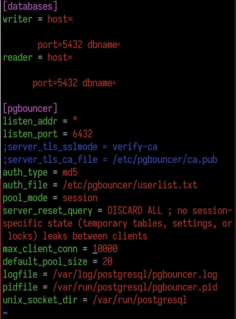
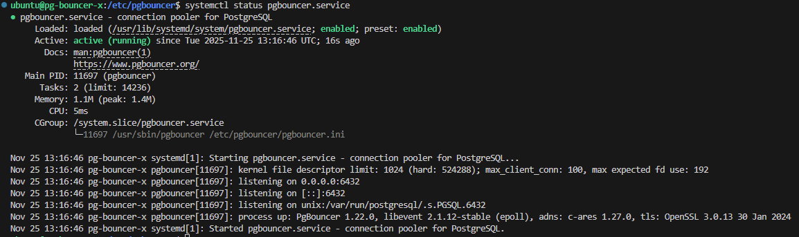

# Set up PgBouncer for Connection Pooling with OCI Database with PostgreSQL

Often, clients would like to add connection pooling to their OCI Database with PostgreSQL.
The following steps are an example to set up connection pooling, using [PgBouncer](https://www.pgbouncer.org/).

The set up is similar to below simplified architecture. Connections are passed through a Network Load Balancer, with the pg_bouncer instances as backend set.
Following, the pg_bouncer - as the connection pooler - connect to multiple PostgreSQL databases or the invidual nodes, to differentiate between read/write and read-only.


# 1. Set up OCI Database with PostgreSQL
Follow [these steps to set up one or more OCI Database with PostgreSQL deployments](https://docs.oracle.com/en-us/iaas/Content/postgresql/getting-started.htm#database)

- After creating the databases, review the max_connections you have in the database. 
- Make sure to open ports (5432) in your public/private subnet

# 2. Set up Network Load Balancer
Follow [these steps to set up a NLB on OCI](https://docs.oracle.com/en-us/iaas/Content/NetworkLoadBalancer/NetworkLoadBalancers/network-load-balancer-management.htm).
For the back end set, you will need to add the OCI Compute instances running pg_bouncer.

# 3. Set up multiple OCI Compute instances to run pg_bouncer

The below example uses Canonical Ubuntu 24.04 and assumes your PostgreSQL database is version 14.

- Install pg_bouncer on the compute. 
  ```
  sudo apt-get install pgbouncer
  ```

- Configure the user list. These are the admin credentials.
  ```
  sudo vim etc/pgbouncer/userlist.txt
  ```

- Add your username and password of your OCI Database with PostgreSQL instances.
  ```
  "Example_user" "example_password"
  ```

- Change the pg_bouncer config file. These determine the connection details to the database, the auth type, session type, etc.
  ```
  sudo vim etc/pgbouncer/pgbouncer.ini
  ```

  - Change the [database] section to the below. The hosts and dbname are examples.
    ```
    [databases]

    writer = host=primary.qlwcxxcenybecgyoxdw7upktikq-primary.postgresql.eu-frankfurt-1.oc1.oraclecloud.com port=5432 dbname=postgres
    reader = host=reader.qwcxxcenybecgyoxdw7upktikq-reader.postgresql.eu-frankfurt-1.oc1.oraclecloud.com port=5432 dbname=postgres
    ```

  - Change the list_addr to *
    ```
    listen_addr = *
    ```

  - Uncomment the below. Change the client connections and pool size to your needs.
    ```
    pool_mode = session
    server_reset_query = DISCARD ALL
    max_client_conn = 100
    default_pool_size = 20
    ```

  Save and close the file. An example of config file.
  
  

- Restart pg_bouncer and review status
  ```
  sudo systemctl restart pgbouncer.service
  systemctl status pgbouncer.service
  ````

  

# 4 Review PgBouncer connection

- Install PostgreSQL client if not done
  ```
  sudo apt-get install postgresql postgresql-client
  ```

- Connect using psql, through pg_bouncer. Add your password when prompted. 
  ```
  psql -h localhost -p 6432 -U pgadmin -d writer
  ```

  When working, you should see Writer =>.
    