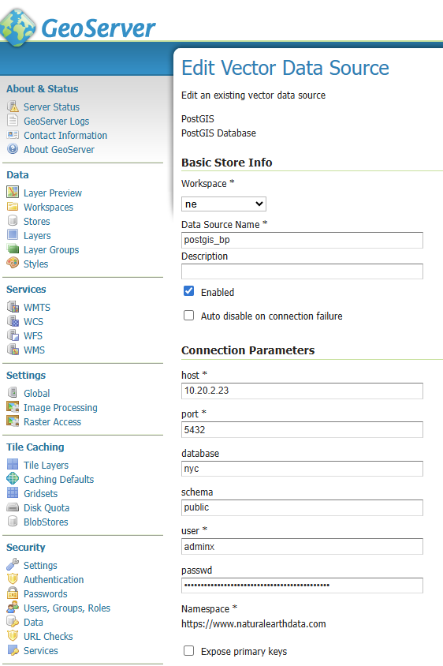
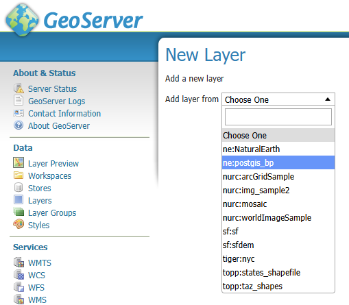

# Integrate Geoserver and PostGIS using OCI Database with PostgreSQL

# Prerequisites
- Oracle Linux 9 in public subnet, same VCN as the PostgreSQL database
- OCI Database with PostgreSQL and PostGIS extensions enabled in private subnet
- Open ports for PostgreSQL and Geoserver (8080)


# Install docker
```
sudo yum install -y yum-utils  
sudo yum-config-manager --add-repo https://download.docker.com/linux/rhel/docker-ce.repo
sudo yum install docker-ce docker-ce-cli containerd.io docker-buildx-plugin docker-compose-plugin
```

# Open ports
```
sudo firewall-cmd --permanent --add-port=8080/tcp
sudo firewall-cmd --reload
```

# Pull and Run Docker
```
sudo systemctl start docker
sudo docker pull docker.osgeo.org/geoserver:2.28.x
sudo docker run -it -p8080:8080 docker.osgeo.org/geoserver:2.28.x
```
# Open Geoserver
Open GeoServer using the below public IP/port. Log in. GeoServer's default username and password: Username: admin. Password: geoserver
```
http://[YOUR PUBLIC IP]:8080/geoserver/
```

# Optional. Install Geoserver without docker.
Link: https://freegistutorial.com/how-to-install-geoserver-in-oracle-linux-9/

# Load data into OCI Database with PostgreSQL
These steps describe an example of loading NYC spatial data into OCI Database with PostgreSQL. The steps use PgAdmin as tool.

1. Download and install PgAdmin on your local machine. [Download here](https://www.pgadmin.org/).
2. Connect to OCI Database with PostgreSQL using a jumphost (VM in public subnet). [See steps here](https://docs.oracle.com/en/learn/postgresql-pgadmin4-connection/index.html).
3. Once connected using PgAdmin, [follow the steps here](https://postgis.net/workshops/postgis-intro/loading_data.html) to load example NYC data

# Add a new Store in Geoserver
- Database = Name of database which includes the PostGIS extension and spatial tables, like 'nyc'.
- Schema = public
- Host: the private IP of the OCI Database with PostgreSQL instance
- Port: 5432
- Username/password: add your username and password when you created the OCI Database with PostgreSQL
- SSL MODE = Require
- Mark the "Enabled" button to enable the store once you save/apply the connection

 
 
# Add a new Layer and review preview
- Once the connection is established, click on "Layers" and following "add a new layer"
- Choose your just added store, like "ne:postgis_bp"

  
  
- The spatial tables should appear. Click on Publish.
- Click on Layer Preview and search for the Layer your just published. Click on on any of the formats or on "OpenLayers" to preview.