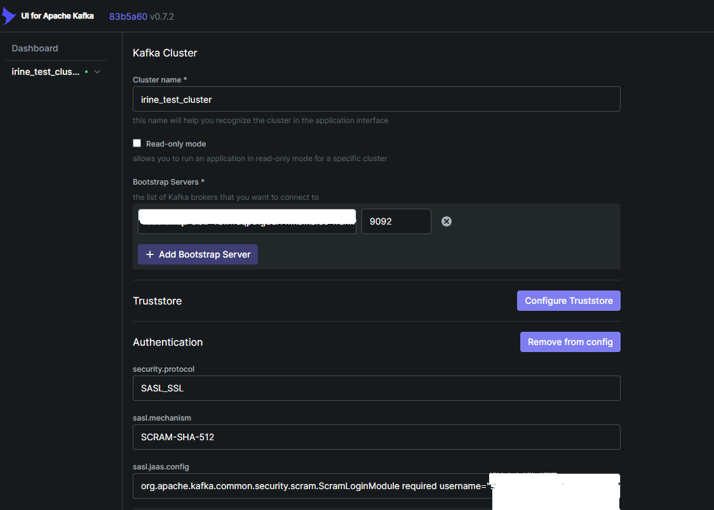
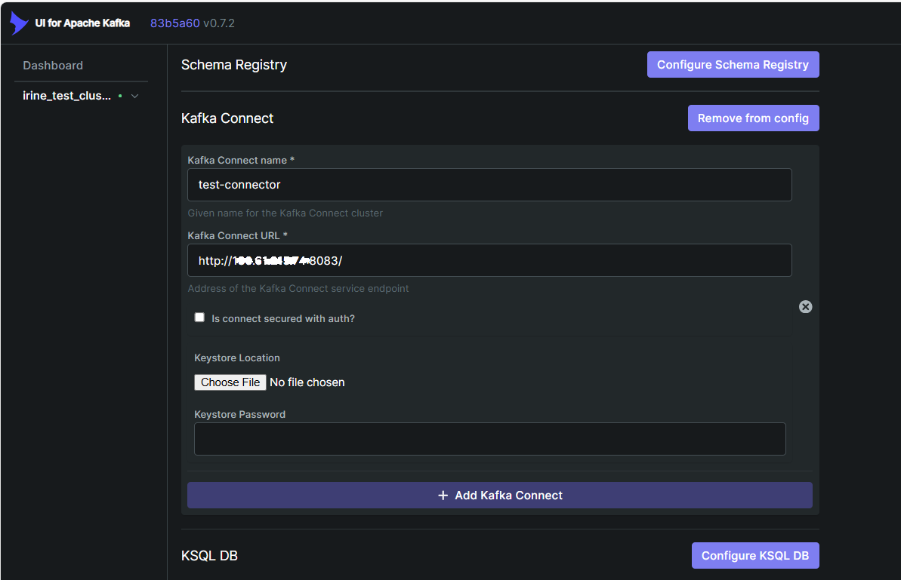

# Kafka UI & Kafka Connect Setup with OCI OpenSearch

This guide documents how to set up **Kafka UI** and **Apache Kafka Connect** on an OCI instance, configure it to run as a service, and use the **OpenSearch Sink Connector** to stream Kafka topic data into an OCI OpenSearch index.

---

## 1. Prerequisites

- Allow port 8080, 8083 in OCI security lists.
    - Enable firewall within instance
      * sudo firewall-cmd --permanent --add-port=8080/tcp
      * sudo firewall-cmd --permanent --add-port=8083/tcp


- install java-11-openjdk , jq, upzip, podman
  
  * **Java (java-11-openjdk)** - required runtime for Kafka and Kafka Connect
  
  * **unzip** - to extract connector plugin packages (e.g., OpenSearch sink)
  
  * **jq** - command-line tool to pretty-print JSON responses from the Kafka Connect REST API
  
  * **Podman** - container runtime used to run Kafka UI

---

## 2. Set Up Kafka UI using podman

```bash
podman run -d \
  --name kafka-ui \
  -p 8080:8080 \
  -e DYNAMIC_CONFIG_ENABLED=true \
  --restart=always \
  docker.io/provectuslabs/kafka-ui
```

---

## 3. Start Kafka UI

```bash
podman start kafka-ui
```

---

## 4. Set Up Kafka Cluster through UI




## 5. Download and extract Kafka

```bash
curl -L -o kafka_2.13-3.7.0.tgz \
  https://archive.apache.org/dist/kafka/3.7.0/kafka_2.13-3.7.0.tgz

tar -xvzf kafka_2.13-3.7.0.tgz
```

---

## 6. Set environment variables

```bash
echo 'export KAFKA_HOME=$HOME/kafka_2.13-3.7.0' >> ~/.bashrc
echo 'export PATH=$KAFKA_HOME/bin:$PATH' >> ~/.bashrc
source ~/.bashrc
```

---

## 7. Create base folders

```bash
mkdir -p /home/opc/kafka/{logs,plugins}
```

- `logs/` → holds Kafka Connect worker logs  
- `plugins/` → holds connector JARs (e.g., OpenSearch sink)

---

## 8. Configure Kafka Connect Worker

Copy the default distributed properties file:

```bash
cp $KAFKA_HOME/config/connect-distributed.properties \
   /home/opc/kafka/connect-distributed.properties
nano /home/opc/kafka/connect-distributed.properties
```

Edit the following:

```properties
# Kafka Cluster
bootstrap.servers=bootstrap-clstr-...:9092

# Worker group
group.id=connect-cluster

# Security
security.protocol=SASL_SSL
sasl.mechanism=SCRAM-SHA-512
sasl.jaas.config=org.apache.kafka.common.security.scram.ScramLoginModule required username="super-user-..." password="...";
# Connect Internal Topics created through Console under Kafka Connect Configurations
config.storage.topic=...-config
offset.storage.topic=...-offset
status.storage.topic=...-status
# REST API
rest.host.name=0.0.0.0
rest.port=8083
rest.advertised.host.name=<VM Public IP>

# Plugins
plugin.path=/home/opc/kafka/plugins
```

---

## 9. Create Systemd Service

Create `/etc/systemd/system/kafka-connect.service`:

```ini
[Unit]
Description=Kafka Connect Distributed
After=network.target

[Service]
User=opc
Environment="KAFKA_HOME=/home/opc/kafka_2.13-3.7.0"
ExecStart=/bin/bash -lc '/home/opc/kafka_2.13-3.7.0/bin/connect-distributed.sh /home/opc/kafka/connect-distributed.properties >> /home/opc/kafka/logs/connect.log 2>&1'
Restart=always
RestartSec=5

[Install]
WantedBy=multi-user.target
```

Reload and enable:

```bash
sudo systemctl daemon-reload
sudo systemctl enable --now kafka-connect
systemctl status kafka-connect --no-pager
```

---

## 10. Add Kafka Connect Connection details in Kafka UI



---

## 11. Install OpenSearch Sink Plugin

```bash
mkdir -p /home/opc/kafka/plugins/opensearch

curl -fL -o /home/opc/opensearch-sink.zip \
  "https://github.com/Aiven-Open/opensearch-connector-for-apache-kafka/releases/download/v3.1.1/opensearch-connector-for-apache-kafka-3.1.1.zip"

unzip -o /home/opc/opensearch-sink.zip -d /home/opc/kafka/plugins/opensearch
```

Restart Kafka Connect:

```bash
sudo systemctl restart kafka-connect
```

Verify the connector is loaded:

```bash
curl http://localhost:8083/connector-plugins | jq .
```

---

## 12. Create OpenSearch Sink Connector

Example connector config (`test-opensearch`):

```json
{
  "name": "test-opensearch",
  "connector.class": "io.aiven.kafka.connect.opensearch.OpensearchSinkConnector",
  "tasks.max": "1",
  "topics": "connecter-test",

  "connection.url": "https://<opensearch-endpoint>:9200",
  "connection.username": "irine235",
  "connection.password": "******",

  "index": "${topic}",
  "key.ignore": "true",
  "schema.ignore": "true",

  "key.converter": "org.apache.kafka.connect.json.JsonConverter",
  "key.converter.schemas.enable": "false",
  "value.converter": "org.apache.kafka.connect.json.JsonConverter",
  "value.converter.schemas.enable": "false",

  "errors.tolerance": "all",
  "errors.log.enable": "true",

  "consumer.override.security.protocol": "SASL_SSL",
  "consumer.override.sasl.mechanism": "SCRAM-SHA-512",
  "consumer.override.ssl.endpoint.identification.algorithm": "https",
  "consumer.override.sasl.jaas.config": "org.apache.kafka.common.security.scram.ScramLoginModule required username=\"super-user-...\" password=\"...\";"
}
```

Submit via Kafka UI

---

## 13. Produce Test Data

Create topic connecter-test and /home/opc/kafka/client.properties with the following credentials:

```bash
security.protocol=SASL_SSL
sasl.mechanism=SCRAM-SHA-512
sasl.jaas.config=org.apache.kafka.common.security.scram.ScramLoginModule required username="super-user-..." password="...";
```

Produce message:

```bash
$KAFKA_HOME/bin/kafka-console-producer.sh \
  --bootstrap-server bootstrap-clstr-...:9092 \
  --producer.config /home/opc/kafka/client.properties \
  --topic connecter-test
```

Enter messages:

```json
{"order_id":1,"customer":"Nora","total":49.99}
{"order_id":2,"customer":"Sam","total":79.99}
```

---

## 14. Verify in OpenSearch

Check document count:

```bash
curl -u 'user:pass' "https://amaaaaaae....opensearch.eu-frankfurt-1.oci.oraclecloud.com:9200/connecter-test/_count?pretty"


```

---


