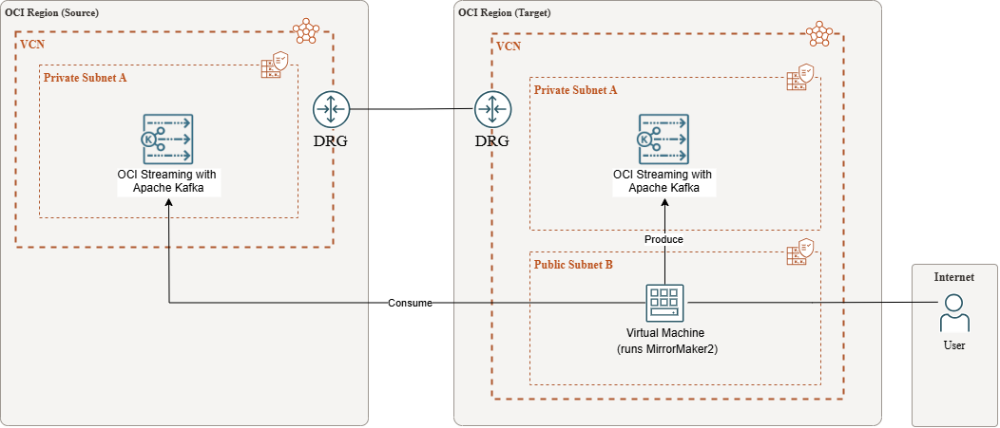

# MirrorMaker2 Setup Guide for Primary-DR Replication


## Table of Contents

- [0. How we use MirrorMaker2](#0-how-we-use-mirrormaker2)
- [1. Architecture](#1-architecture)
- [2. Inputs / Prerequisites](#2-inputs--prerequisites)
- [3. Network: DRG + Remote Peering (RPC)](#3-network-drg--remote-peering-rpc)
- [4. DNS: Private Views / Resolver](#4-dns-private-views--resolver)
- [5. VM Setup (Ubuntu)](#5-vm-setup-ubuntu)
- [6. Kafka Client Properties (SCRAM)](#6-kafka-client-properties-scram)
- [7. Connectivity Tests (must pass)](#7-connectivity-tests-must-pass)
- [8. MM2 Properties (Primary → DR)](#8-mm2-properties-primary--dr)
- [9. Start / Stop MM2 + Logs](#9-start--stop-mm2--logs)
- [10. Validate replication (end-to-end)](#10-validate-replication-end-to-end)
- [11. Verify "Everything is Replicated"](#11-verify-everything-is-replicated)
- [12. Big Message Support (10MB+)](#12-big-message-support-10mb)
- [13. Troubleshooting](#13-troubleshooting)
---

## 0. How we use MirrorMaker2

### Overview

MirrorMaker2 (MM2) provides **near real-time asynchronous replication** from Primary to DR cluster. This setup enables disaster recovery with minimal data loss.

### Replication Pattern

- **Primary → DR** (Active/Standby DR pattern)
- MM2 continuously replicates topics, consumer groups, and offsets from Primary to DR
- Replication is **asynchronous** - expect some lag (typically seconds to minutes)

### Key Benefits

- **DR readiness:** DR contains current data within the retention window
- **Low RPO:** Data loss is generally **replication lag**.
- **Faster cutover:** With checkpoints/offset sync, consumer groups can resume near the right place in DR
- **Longer DR retention:** You can set DR retention **longer** than Primary, so DR becomes a longer buffer

### Important Considerations

- **Asynchronous replication:** MM2 replication is **asynchronous**. Expect some lag. Plan for duplicates during failover and make consumers idempotent.
- **Message availability:** MM2 can only copy messages that still exist on Primary when MM2 reads them. If replication lag exceeds Primary retention window, data loss may occur.
- **Permanent history:** If you need permanent history/audit, use Kafka + durable storage (Object Storage / data lake / database) via sink connectors or stream processing
- This setup provides Disaster Recovery (DR), not active-active High Availability (HA). Failover is operational and may require manual intervention.

---

## 1. Architecture

- **Primary region (A):** OSAK Cluster A (source)
- **DR region (B):** OSAK Cluster B (target)
- **MM2 VM:** compute VM that can reach **both** clusters privately

Replication flow:

- **Primary → DR** (Active/Standby DR pattern)

### Architecture Diagram




---

## 2. Inputs / Prerequisites

### 2.1 Required inputs (placeholders)

- `<PRIMARY_BOOTSTRAP_FQDN>` (port 9092)
- `<DR_BOOTSTRAP_FQDN>` (port 9092)
- `<PRIMARY_USER>` / `<PRIMARY_PASS>` (SCRAM)
- `<DR_USER>` / `<DR_PASS>` (SCRAM)

### 2.2 VCN CIDRs must not overlap (required for peering)

Example:

- Primary VCN CIDR: `10.19.0.0/16`
- DR VCN CIDR: `10.30.0.0/16`

### 2.3 Ports

- TCP **9092** from MM2 VM to both clusters

---

## 3. Network: DRG + Remote Peering (RPC)

To connect to the Kafka clusters across regions, VCN peering must be set up using Dynamic Routing Gateway (DRG).

> **Note:** If you get `timeout` / "can't connect to broker", it is almost always routing/NSG/peering/DNS.

### 3.1 Create DRGs (one per region)

1. Create VCN in source region (Primary) and target region (DR) as per your requirement.
2. Create dynamic routing gateways (DRG) in source and target regions:
   - Create **DRG-A** in Primary region
   - Create **DRG-B** in DR region

For more information, see [Dynamic Routing Gateways](https://docs.oracle.com/en-us/iaas/Content/Network/Tasks/managingDRGs.htm).

### 3.2 Attach DRG to VCNs

1. To attach DRG to VCN, select your **DRG-A** in Primary region.
2. Click **VCN attachments** and **Create virtual cloud network attachment**.
3. In the **Create VCN attachment** page:
   - Enter the attachment name
   - Select **Primary VCN** (Source Region VCN)
   - Click **Create VCN attachment**
4. Repeat the same steps to attach your **DR VCN** to **DRG-B** in the DR region.

### 3.3 Create Remote Peering Connection (RPC)

1. **Create source region RPC (RPC-A):**
   - Go to the **DRG-A** detail page and click **Remote peering connection attachments**.
   - Click **Create remote peering connection**.
   - In the **Create remote peering connection** page:
     - Enter the connection name (e.g., `RPC-A`)
     - Select compartment
     - Click **Create remote peering connection**

2. **Create target region RPC (RPC-B):**
   - Repeat the same procedure to create **RPC-B** on **DRG-B** in the DR region.

### 3.4 Establish RPC Connection

Establish the connection from the Source region to the Target region through the **RPC-A** connection.

1. Go to the **DRG-A** detail page and click **Remote peering connection attachments**.
2. View the details of **RPC-A** by clicking the name of the connection in the **Remote Peering Connection** column.
3. In the connection details page, click **Establish Connection**.
4. In the **Establish connection** page:
   - Enter the connection name
   - Select compartment
   - Select the **target region name** (DR region)
   - Enter the OCID of target RPC (**RPC-B**)
5. When the connection is established, the RPC's state changes to **PEERED**.  
   Hence, **RPC-B** peering state also changes to **PEERED**.

### 3.5 Configure Route Table in VCNs to Send Traffic Destined to DRG Attachment

Assume:
- Primary VCN CIDR = `10.19.0.0/16`
- DR VCN CIDR = `10.30.0.0/16`

**Configure route table in Primary VCN:**

1. Go to the **Primary VCN** detail page and click **Route Tables**.
2. Under the list of route tables, click the **route table for private subnet-Primary-VCN** (or the route table for your Kafka endpoint subnet).
3. In the route table page, click **Add Route Rules** and enter:
   - **Target Type:** Dynamic Routing Gateway
   - **Destination CIDR Block:** `10.30.0.0/16` (DR VCN CIDR)
   - **Target:** Select **DRG-A**
   - Click **Add Route Rules**

**Configure route table in DR VCN:**

1. Go to the **DR VCN** detail page and click **Route Tables**.
2. Under the list of route tables, click the **route table for private subnet-DR-VCN** (or the route table for your Kafka endpoint subnet).
3. In the route table page, click **Add Route Rules** and enter:
   - **Target Type:** Dynamic Routing Gateway
   - **Destination CIDR Block:** `10.19.0.0/16` (Primary VCN CIDR)
   - **Target:** Select **DRG-B**
   - Click **Add Route Rules**

**If MM2 VM is in DR region, also configure MM2 subnet route table:**

1. Click the route table for the **MM2 subnet** in DR VCN.
2. Add route rule:
   - **Destination CIDR Block:** `10.19.0.0/16` (Primary VCN CIDR)
   - **Target:** Select **DRG-B**

### 3.6 Add Security Ingress Rule to Allow Traffic between VCNs' Private Subnets through DRG

**Add ingress rule to Primary VCN security list:**

1. Go to the **Primary VCN** detail page and click **Security List**.
2. Click **Security list for private subnet-Primary-VCN** (or the security list for your Kafka endpoint subnet).
3. In the **Security List** page, click **Add Ingress Rules** and enter:
   - **Source Type:** CIDR
   - **Source CIDR:** `10.30.0.0/16` (DR VCN CIDR, or MM2 subnet CIDR if more specific)
   - **IP Protocol:** TCP
   - **Destination Port Range:** `9092`
   - **Description:** Allow Kafka traffic from DR region
   - Click **Add Ingress Rules**

**Add ingress rule to DR VCN security list:**

1. Go to the **DR VCN** detail page and click **Security List**.
2. Click **Security list for private subnet-DR-VCN** (or the security list for your Kafka endpoint subnet).
3. In the **Security List** page, click **Add Ingress Rules** and enter:
   - **Source Type:** CIDR
   - **Source CIDR:** `10.19.0.0/16` (Primary VCN CIDR, or MM2 subnet CIDR if more specific)
   - **IP Protocol:** TCP
   - **Destination Port Range:** `9092`
   - **Description:** Allow Kafka traffic from Primary region
   - Click **Add Ingress Rules**

---

## 4. DNS: Private Views / Resolver

MM2 must resolve bootstrap FQDNs and **all broker endpoints** to **private IPs**.

### 4.1 Validate DNS from MM2 VM

```bash
getent hosts <PRIMARY_BOOTSTRAP_FQDN>
getent hosts <DR_BOOTSTRAP_FQDN>
# Also validate each broker endpoint
getent hosts <PRIMARY_BROKER_0_FQDN>
getent hosts <PRIMARY_BROKER_1_FQDN>
getent hosts <PRIMARY_BROKER_2_FQDN>
# ... and so on for all brokers
```

You want private IPs returned for all endpoints.

### 4.2 Configure A-Records in Private DNS Zone

**Option A (common): Private DNS Zone + Private View**

1. Switch to the target region (where MM2 VM runs), enter **DNS** in the search bar and select **Private Views**.
2. The VCN list for the current region will be displayed. Select the VCN where the MM2 VM is located.
3. The list of DNS zones will appear. If a zone for the remote region doesn't exist, create one:
   - Click **Create Zone**
   - In **Zone Name**, enter the domain of the Kafka cluster in the other region (extract the domain from your bootstrap FQDN)
   - Click **Create** to add the new zone entry

4. **Configure A-record entries for bootstrap and all brokers:**
   
   a. Open the newly created zone, click Manage Records and select Add Record.
   
   b. Create A-records for:
   - **Bootstrap FQDN:**
     - **Name:** `<PRIMARY_BOOTSTRAP_FQDN>` (e.g., `primary.xxxxxxxxx.streaming.us-ashburn-1.oci.oraclecloud.com`)
     - **Type:** Select **A (IPv4 Address)**
     - **TTL:** Enter **3600** seconds (modify as per your application requirement)
     - **RDATA Mode:** Select **Basic**
     - **Address:** Enter the private IP address that the bootstrap FQDN in the other region should resolve to from the MM2 VCN
     - Click **Save Changes**
   
   - **Each Broker Endpoint:**
     - **Name:** `<PRIMARY_BROKER_0_FQDN>` (e.g., `broker-0.xxxxxxxxx.streaming.us-ashburn-1.oci.oraclecloud.com`)
     - **Type:** Select **A (IPv4 Address)**
     - **TTL:** Enter **3600** seconds
     - **RDATA Mode:** Select **Basic**
     - **Address:** Enter the private IP address of broker-0
     - Click **Save Changes**
   
   - Repeat for all brokers (broker-1, broker-2, broker-3, etc.) with their respective private IPs.


---

## 5. VM Setup (Ubuntu)

### 5.1 Install Java + tools

```bash
sudo apt-get update -y
sudo apt-get install -y openjdk-17-jdk wget tar netcat-openbsd jq
java -version
```

### 5.2 Download Kafka (MM2 comes with Kafka)

```bash
cd /opt
sudo wget https://downloads.apache.org/kafka/3.7.0/kafka_2.13-3.7.0.tgz
sudo tar -xzf kafka_2.13-3.7.0.tgz
sudo ln -s kafka_2.13-3.7.0 kafka
sudo chown -R $USER:$USER /opt/kafka
```

### 5.3 Create config/log folder

```bash
sudo mkdir -p /opt/mm2
sudo chown -R $USER:$USER /opt/mm2
```

---

## 6. Kafka Client Properties (SCRAM)

### 6.1 /opt/mm2/client-primary.properties

```properties
security.protocol=SASL_SSL
sasl.mechanism=SCRAM-SHA-512
sasl.jaas.config=org.apache.kafka.common.security.scram.ScramLoginModule required username="<PRIMARY_USER>" password="<PRIMARY_PASS>";
```

### 6.2 /opt/mm2/client-dr.properties

```properties
security.protocol=SASL_SSL
sasl.mechanism=SCRAM-SHA-512
sasl.jaas.config=org.apache.kafka.common.security.scram.ScramLoginModule required username="<DR_USER>" password="<DR_PASS>";
```

**Truststore:** Try without truststore first. If you get PKIX/SSL handshake errors, add truststore settings to these files and MM2 properties.

---

## 7. Connectivity Tests (must pass)

### 7.1 Network port checks

```bash
nc -vz <PRIMARY_BOOTSTRAP_FQDN> 9092
nc -vz <DR_BOOTSTRAP_FQDN> 9092
```

### 7.2 Kafka handshake checks

```bash
/opt/kafka/bin/kafka-broker-api-versions.sh \
  --bootstrap-server <PRIMARY_BOOTSTRAP_FQDN>:9092 \
  --command-config /opt/mm2/client-primary.properties

/opt/kafka/bin/kafka-broker-api-versions.sh \
  --bootstrap-server <DR_BOOTSTRAP_FQDN>:9092 \
  --command-config /opt/mm2/client-dr.properties
```

---

## 8. MM2 Properties (Primary → DR)

Create the file: `/opt/mm2/connect-mirror-maker.properties`

## Configuration File

### connect-mirror-maker.properties

```properties
# =========================
# CLUSTERS
# =========================
clusters=primary,dr

primary.bootstrap.servers=<PRIMARY_BOOTSTRAP_FQDN>:9092
dr.bootstrap.servers=<DR_BOOTSTRAP_FQDN>:9092

# =========================
# AUTH (SCRAM)
# =========================
primary.security.protocol=SASL_SSL
primary.sasl.mechanism=SCRAM-SHA-512
primary.sasl.jaas.config=org.apache.kafka.common.security.scram.ScramLoginModule required username="<PRIMARY_USER>" password="<PRIMARY_PASS>";

dr.security.protocol=SASL_SSL
dr.sasl.mechanism=SCRAM-SHA-512
dr.sasl.jaas.config=org.apache.kafka.common.security.scram.ScramLoginModule required username="<DR_USER>" password="<DR_PASS>";

# =========================
# REPLICATION FLOW
# =========================
primary->dr.enabled=true
primary->dr.topics=.*       # IMPORTANT: regex. Use .* to match all topics
primary->dr.groups=.*       # replicate consumer groups

# Keep same topic names in DR (best for DR cutover)
replication.policy.class=org.apache.kafka.connect.mirror.IdentityReplicationPolicy

# =========================
# CHECKPOINTS / OFFSET SYNC (helps DR failover)
# =========================
primary->dr.emit.checkpoints.enabled=true
primary->dr.sync.group.offsets.enabled=true
primary->dr.consumer.auto.offset.reset=earliest

# =========================
# REFRESH + TASKS
# =========================
tasks.max=8
refresh.topics.enabled=true
refresh.topics.interval.seconds=60
refresh.groups.enabled=true
refresh.groups.interval.seconds=60

# =========================
# CONVERTERS (byte-safe)
# =========================
key.converter=org.apache.kafka.connect.converters.ByteArrayConverter
value.converter=org.apache.kafka.connect.converters.ByteArrayConverter
key.converter.schemas.enable=false
value.converter.schemas.enable=false

# =========================
# BIG MESSAGE SUPPORT (example ~10MB)
# Adjust to match your max message sizes.
# =========================
primary.consumer.max.partition.fetch.bytes=10485760
primary.consumer.fetch.max.bytes=52428800
dr.producer.max.request.size=11534336
dr.producer.buffer.memory=134217728
```

## 9. Start / Stop MM2 + Logs

### 9.1 First run (foreground for debugging)

```bash
/opt/kafka/bin/connect-mirror-maker.sh /opt/mm2/connect-mirror-maker.properties
```

### 9.2 Run in background + write logs to file

```bash
nohup /opt/kafka/bin/connect-mirror-maker.sh /opt/mm2/connect-mirror-maker.properties \
  > /opt/mm2/mm2.log 2>&1 &
tail -f /opt/mm2/mm2.log
```

### 9.3 Stop MM2

```bash
pkill -f connect-mirror-maker || true
```

## 10. Validate replication (end-to-end)

### 10.1 Create test topic on Primary

```bash
/opt/kafka/bin/kafka-topics.sh \
  --bootstrap-server <PRIMARY_BOOTSTRAP_FQDN>:9092 \
  --command-config /opt/mm2/client-primary.properties \
  --create --topic dr_test --partitions 3 --replication-factor 3
```

### 10.2 Produce on Primary

```bash
echo "mm2-test-$(date +%s)" | /opt/kafka/bin/kafka-console-producer.sh \
  --bootstrap-server <PRIMARY_BOOTSTRAP_FQDN>:9092 \
  --producer.config /opt/mm2/client-primary.properties \
  --topic dr_test
```

### 10.3 Consume on DR

```bash
/opt/kafka/bin/kafka-console-consumer.sh \
  --bootstrap-server <DR_BOOTSTRAP_FQDN>:9092 \
  --consumer.config /opt/mm2/client-dr.properties \
  --topic dr_test --from-beginning --max-messages 1
```

## 11. Verify "Everything is Replicated"

### 11.1 Topic coverage (exclude internal topics)

This verifies that all **user-created application topics** are replicated to DR, excluding internal Kafka and MM2 topics:

- **`__*` topics:** Kafka internal topics (e.g., `__consumer_offsets`, `__transaction_state`)
- **`mm2-*` topics:** MirrorMaker2 internal topics (checkpoints, offset sync)
- **`primary.*` topics:** MM2-prefixed topics (if not using IdentityReplicationPolicy)

```bash
PRIMARY=<PRIMARY_BOOTSTRAP_FQDN>:9092
DR=<DR_BOOTSTRAP_FQDN>:9092
PRIMARY_CFG=/opt/mm2/client-primary.properties
DR_CFG=/opt/mm2/client-dr.properties

/opt/kafka/bin/kafka-topics.sh --bootstrap-server "$PRIMARY" --command-config "$PRIMARY_CFG" --list \
  | grep -vE '^__|^mm2-|^primary\.' | sort > /tmp/primary_topics.txt

/opt/kafka/bin/kafka-topics.sh --bootstrap-server "$DR" --command-config "$DR_CFG" --list \
  | grep -vE '^__|^mm2-|^primary\.' | sort > /tmp/dr_topics.txt

echo "Topics missing in DR:"
comm -23 /tmp/primary_topics.txt /tmp/dr_topics.txt
```

### 11.2 Replication Lag Validation

To ensure DR is fully synchronized, validate that:  

- All expected application topics exist in DR.
- Partition counts match between Primary and DR. If partition counts differ, consumers may fail or process unevenly during failover.
- The latest (log-end) offsets per partition in DR are close to or equal to Primary.
- Replication lag is stable (not continuously increasing).

### 11.3 Topic Configuration Parity

For DR readiness, ensure that topic configurations in DR match those in Primary.

Key settings to verify:

- retention.ms
- cleanup.policy (delete vs compact)
- max.message.bytes
- min.insync.replicas
- segment.bytes
- compression.type (if customized)

Differences in these settings may result in different behavior during failover. If ACLs are used, ensure equivalent permissions exist in the DR cluster prior to failover.

## 12. Big Message Support (10MB+)

If your topic config uses large messages:

- Ensure DR topic/broker allow the size.
- Ensure MM2 can fetch and produce them.

### 12.1 Check topic max.message.bytes

```bash
/opt/kafka/bin/kafka-configs.sh \
  --bootstrap-server <DR_BOOTSTRAP_FQDN>:9092 \
  --command-config /opt/mm2/client-dr.properties \
  --entity-type topics --entity-name <TOPIC> --describe | egrep "max.message.bytes"
```

### 12.2 MM2 settings to adjust

- `primary.consumer.max.partition.fetch.bytes`
- `primary.consumer.fetch.max.bytes`
- `dr.producer.max.request.size`

## 13. Troubleshooting

### 13.1 Timeout / cannot connect to broker

**Check DNS:**

```bash
getent hosts <PRIMARY_BOOTSTRAP_FQDN>
```

**Check port:**

```bash
nc -vz <PRIMARY_BOOTSTRAP_FQDN> 9092
```

**Fix:** DRG peering, routes, NSGs, private DNS.

### 13.2 SASL auth errors

Fix SCRAM credentials and permissions/ACLs.

### 13.3 SSL/PKIX handshake errors

Add truststore config (client + MM2 properties).

### 13.4 RecordTooLarge

Increase MM2 fetch/request sizes and confirm DR topic/broker allow it.

### 13.5 View logs

```bash
tail -n 300 /opt/mm2/mm2.log | egrep -i "ERROR|WARN|Exception|Sasl|Auth|SSL|Timeout|TooLarge"
```


