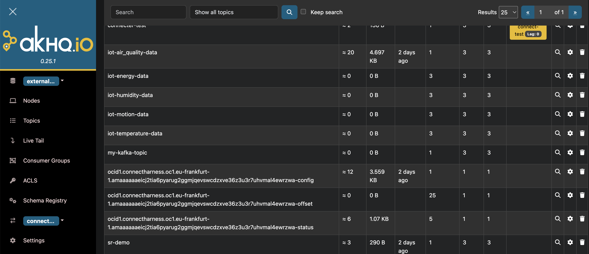

# Configuring Schema registry and Kafka connect with AKHQ(UI) for OSAK

Review: 11.11.2025

### Prerequistes
    
    Working instance of OCI Streaming with Apache Kafka
    Bootstrap server infonrmation
    Login credentials = username, password
    VM on the same VCN as Kafka instance

### Installation of AKHQ
    Follow instructions as per document at  [Use the open source Kafka UI AKHQ to view and create topics](https://confluence.oraclecorp.com/confluence/display/OMKS/Deploying+OCI+Streaming+with+Apache+Kafka+Service)


When installing AKHQ, if you have multiple java version run the following command:

 ```bash
    sudo update-alternatives --config java
 ```
 Select the required java version      
    
### Configuring Schema Registry

For this installation we select schema registry from Confluent, under the community license

``` bash
   wget https://packages.confluent.io/archive/7.5/confluent-community-7.5.0.tar.gz
   tar -xvzf confluent-community-7.5.0.tar.gz
   cd confluent-7.5.0
```
Edit the /home/opc/confluent-7.5.0/etc/schema-registry/schem-registry.properties

``` bash

listeners=http://0.0.0.0:8081
kafkastore.bootstrap.servers=10.50.3.65:9092
kafkastore.security.protocol=SASL_SSL
kafkastore.sasl.mechanism=SCRAM-SHA-512
kafkastore.sasl.jaas.config=org.apache.kafka.common.security.scram.ScramLoginModule required \
  username="registry-user" \
  password="registry-password";
  ```

### Start service
  /home/opc/confluent-7.5.0/bin/schema-registry-start etc/schema-registry/schema-registry.properties

 Test
   curl http://localhost:8081/subjects 

### Configuring Kafka Connect
We can use kafka-connect that ships with the kafka client or kafka-connectfrom the confluent install under schema registry
Edit /home/opc/confluent-7.5.0/etc/kafka/connect-distributed.properties:

```bash
bootstrap.servers=bootstrap-clstr-...:9092

#Worker group
group.id=connect-cluster

#Security
security.protocol=SASL_SSL
sasl.mechanism=SCRAM-SHA-512
sasl.jaas.config=org.apache.kafka.common.security.scram.ScramLoginModule required username="username"  password="password";

config.storage.topic=...-config
offset.storage.topic=...-offset
status.storage.topic=...-status
#REST API
rest.host.name=0.0.0.0
rest.port=8083
rest.advertised.host.name=130.61.100.254

key.converter=org.apache.kafka.connect.storage.StringConverter
value.converter=org.apache.kafka.connect.json.JsonConverter
value.converter.schemas.enable=false
```

#### Start kafka-connect service
/home/opc/confluent-7.5.0/bin/connect-distributed etc/kafka/connect-distributed.properties

#### Test
   curl http://localhost:8083/connectors

### Configuring the application.yml for AKHQ
``` bash
  akhq:
  connections:
    external-cluster:
      properties:
        bootstrap.servers: "bootstrap-clstr-........:9092"
        security.protocol: "SASL_SSL"
        sasl.mechanism: "SCRAM-SHA-512"
        sasl.jaas.config:org.apache.kafka.common.security.scram.ScramLoginModule required \ 
        username="username" \
        password="password";
      schema-registry:
        url: "http://schema-registry:8081"
      connect:
        - name: connect-cluster
          url: "http://connect:8083"
```

### Access in UI
Open AKHQ at http://<VM IP>:8080

Under clusters -> external clusters the below will be available
* Nodes
* Topics
* Schema Registry
* Connect



Click Schema Registry. 


