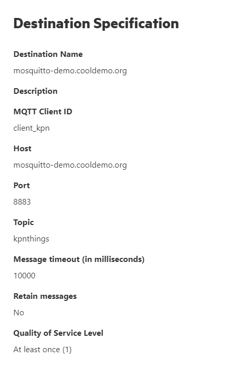
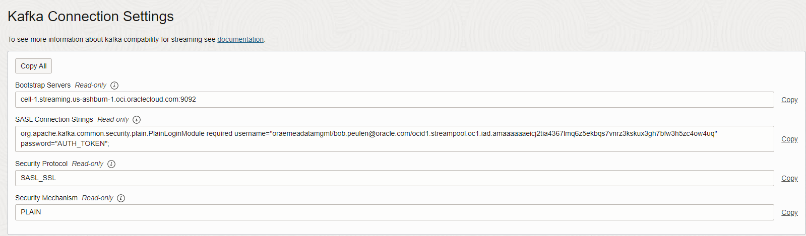
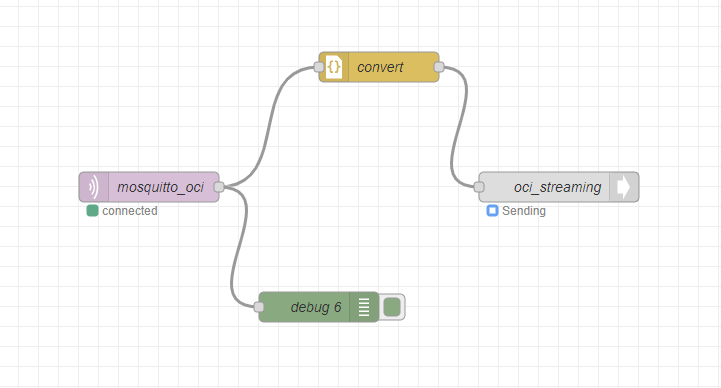
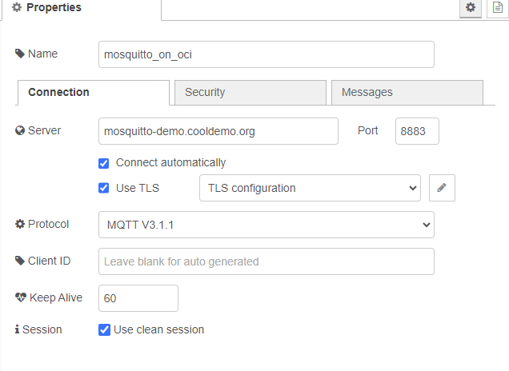
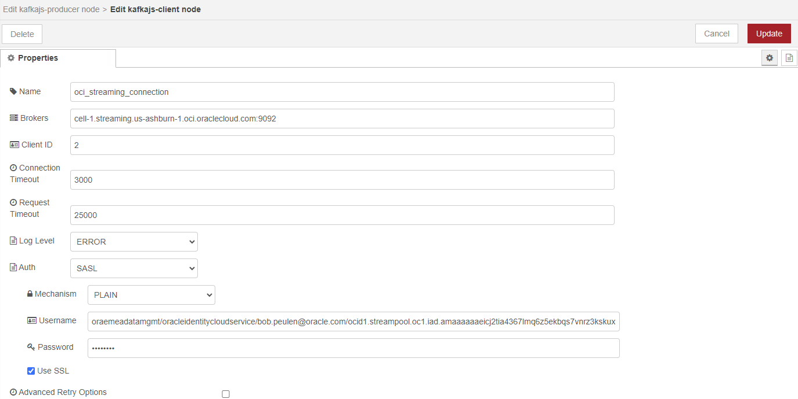

# Create and run Mosquitto & Node-RED, connecting to OCI Streaming

Reviewed: 11.11.2025

The below creates a Mosquitto instance on OCI and adds configuration to handle the incoming KPN IoT platform traffic. KPN needs CA signed certificates and encrypted messages, and username/password auth.

- Create instance with CentOS 7 image
- Follow these steps to update a file for use of yum. https://dev.to/franzwong/fix-cannot-find-a-valid-baseurl-for-repo-in-centos-1h07
- Based on the public IP of the compute, create a public DNS. This is needed to create CA certificates.

- SSH into compute. Install and enable mosquitto:

  ```
  sudo yum -y install epel-release
  sudo yum -y install mosquitto
  sudo systemctl start mosquitto
  sudo systemctl enable mosquitto
  ```

- Firewall settings:
  ```
  sudo firewall-cmd --permanent --add-service=http
  sudo firewall-cmd --permanent --add-port=1883/tcp
  sudo firewall-cmd --permanent --add-port=8883/tcp
  sudo firewall-cmd --reload
  ```

- Test the Mosquitto broker. Open two terminals and run in the different terminals:
  ```
  mosquitto_sub -h localhost -t test_topic
  mosquitto_pub -h localhost -t test_topic -m "hello world"
  ```

- Create a password file. Run the below. In the example, 'username' is the username. Password will be prompted when you run.
  ```
  sudo mosquitto_passwd -c /etc/mosquitto/passwd username
  ```

- Create the CA keys. Public IP should be added to public DNS. When prompted for domain, use the full Domain.
  ```
  sudo yum -y install certbot
  sudo certbot certonly --standalone
  ```


- Change the Mosquitto config settings.
  ```
  sudo rm /etc/mosquitto/mosquitto.conf
  sudo nano /etc/mosquitto/mosquitto.conf
  ```
  
- Add the below to the file. Change the domain name to the one you are using (mosquitto-demo.cooldemo.org). 
  ```
  allow_anonymous false
  password_file /etc/mosquitto/passwd
  listener 8883
  certfile /etc/letsencrypt/live/mosquitto-demo.cooldemo.org/cert.pem
  cafile /etc/letsencrypt/live/mosquitto-demo.cooldemo.org/fullchain.pem
  keyfile /etc/letsencrypt/live/mosquitto-demo.cooldemo.org/privkey.pem
  ```

- Restart
  ```
  sudo systemctl daemon-reload
  sudo systemctl restart mosquitto
  ```

- Test with credentials
  ```
  mosquitto_sub -h localhost -t kpnthings -u "username" -P "password" -p 8883
  mosquitto_pub -h localhost -t "kpnthings" -m "hello world" -u "username" -P "password" -p 8883

- Test with credentials and certificate. 
  ```
  mosquitto_pub -h mosquitto-demo.cooldemo.org -t kpnthings -m "hello again" -p 8883 --cafile /etc/ssl/certs/ca-bundle.crt -u "username" -P "password"
  mosquitto_sub -h mosquitto-demo.cooldemo.org -t kpnthings -p 8883 --cafile /etc/ssl/certs/ca-bundle.crt -u "username" -P "password"
  ```


- Create Cron job to create new certificates every day
  ```
  sudo EDITOR=nano crontab -e
  15 3 * * * certbot renew --noninteractive --post-hook "systemctl restart mosquitto"
  ```


# Add a connection to KPN IoT hub. Like screenshot.
  

# Create OCI Streaming, Kafka Connect Configuration and get streaming credentials to connect, like:
  

# Set up Node-RED and create flow from Mosquitto to OCI Streaming
  
  
  

# License

Copyright (c) 2026 Oracle and/or its affiliates.

Licensed under the Universal Permissive License (UPL), Version 1.0.

See [LICENSE](https://github.com/oracle-devrel/technology-engineering/blob/main/LICENSE) for more details.