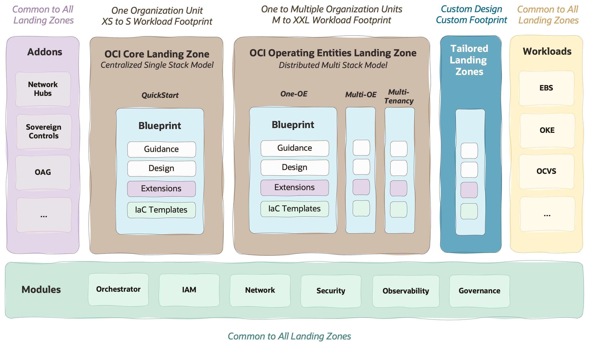

# **OCI Landing Zones**

&nbsp; 

Welcome to the **EMEA OCI Landing Zones**.

This area is owned by the EMEA Landing Zone Specialists, collaborating with worldwide Oracle, customers, and partners, to **simplify the OCI onboarding experience** and **reduce OCI day-one and day-two efforts**. It provides **best practices** covering the complete spectrum of OCI landing zones, from the **standards** to the **tailored** approaches, including landing zone extensions for specific **workloads**.

Before starting we recommend viewing a [13-minutes video](https://www.linkedin.com/feed/update/urn:li:activity:7206600588216659968/) with EMEA OCI Landing Zones **approach** and **strategy**. Note that all the EMEA OCI Landing Zones elements are aligned with [OCI Landing Zones Framework](https://blogs.oracle.com/cloud-infrastructure/post/new-standardized-oci-landing-zones-framework) and are part of the [OCI Landing Zones Git Organization](https://github.com/oci-landing-zones) - excluding Tailored Landing Zones. 

&nbsp; 

&nbsp; 

| AREA  |  OBJECTIVE | DESCRIPTION | 
|---|---|---|
|   | **Best Practices 4 Blueprints** | **Standard shapes/blueprints** for different organization scopes, **ready to use** with **design blueprints** and  **IaC configurations**. Use these models directly or tailor them to your needs.  | 
|   | **Tailored Design   Any Shape** | An EMEA specialists approach to solve **specific requirements** when the standard models are not enough. A tailored model has **dedicated design views** to match requirements and an IaC runtime. This approach is commonly used to bridge **existing customer practices** in other CSPs. |  
|   | **Workload Ready Plug & Play** | **Complement your landing zone** with extensions ready for **specific workloads**. Each flavor has a **design** with **IaC configurations** ready to be deployed on top of standard or tailored landing zone. Examples are EBS, ExaCC, OCVS, OIC, OKE, CCC, etc. |  
|   | **Addons Plug & Play** | **Complement your landing zone** with **addons** full of best practices. Each **addon** can be used on top of standard or tailored landing zone. Examples are Network Hubs, Oracle Access Governance, Sovereign Controls etc. |  
|   | **Declarative Terraform Modules** | Use the highly **generic** OCI Landing Zones Terraform **modules** to configure your Landing Zone instead of coding it.  |  

&nbsp; 

If you're **starting with OCI landing zones**:
1. Start with [**Standard Landing Zones**](/landing-zones/standard_landing_zones/readme.md) as they're full of best practices. There are [**several blueprints**](/landing-zones/standard_landing_zones/readme.md#2-what-are-the-models-available) available for different scopes, we'll help you find the best fit [**here**](/landing-zones/standard_landing_zones/readme.md#3-decide-on-the-model-to-use).
2. If your design is very **customized**, requiring **structural changes** to a standard landing zone (IAM or Network), and/or you need a **highly scalable operating model**, use the [**Tailored Landing Zones**](/landing-zones/tailored_landing_zones/readme.md) approach to create your solution.
3. Complementary, if you have a **specific target workload** that is available as [**Workload Extensions**](https://github.com/oci-landing-zones/oci-landing-zone-operating-entities/tree/master/workload-extensions), use it directly on top of your landing zone. If it's not available, feel free to reach out to us or use the tailored approach to set up your extensions.

&nbsp; 

The following **assets** are also available to improve the OCI landing experience:
1. **Landing Zones**: [How a Complete OCI Landing Zone Looks Like (**OCI Open LZ**)](https://github.com/oci-landing-zones/oci-landing-zone-operating-entities)
2. **Workloads Extensions**: [How an OCI Workload Extensions Looks Like (**EBS Extension**)](https://github.com/oci-landing-zones/oci-landing-zone-operating-entities/tree/master/workload-extensions/ebs)
3. **Infrastructure-as-Code (IaC)**: [How We Configure and Not Code Landing Zones **(Terraform Modules)**](/landing-zones/commons/oci_landingzones_iac.md).
4. **Network Hubs**: [How OCI Network Hubs Look Like and How They Work (**Network Addons**](https://github.com/oci-landing-zones/oci-landing-zone-operating-entities/tree/master/addons/oci-hub-models))
5. **Learn/DIY**: [How to Design and Configure OCI Landing Zones (**OCI Learn LZ**)](https://github.com/oracle-quickstart/terraform-oci-open-lz/tree/master/addons/oci-learn-lz)
6. **Naming Conventions**: [Resource Naming Conventions for OCI](/landing-zones/commons/resource_naming_conventions.md)
7. **Identity**: [OCI User Identity Management](/landing-zones/commons/user_identity_management.md)
8. **Budgets**: [OCI Budgets and Tagging Recommendations](/landing-zones/commons/budgets_and_tagging.md)
9. **Solution Definition**: [Creating a Landing Zone Solution Definition (**SDD**)](/landing-zones/commons/lz_solution_definition.md)

&nbsp; 

&nbsp; 

# License

Copyright (c) 2024 Oracle and/or its affiliates.

Licensed under the Universal Permissive License (UPL), Version 1.0.

See [LICENSE](https://github.com/oracle-devrel/technology-engineering/blob/main/LICENSE) for more details.
