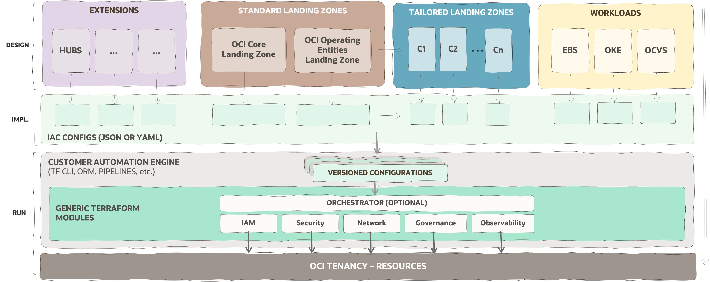
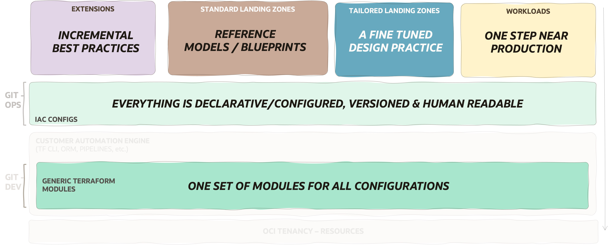

# **OCI Landing Zones - Infrastructure As Code**

**Table of Contents**

[1. Approach (What)](#1-approach) 
[2. Architecture (How)](#2-the-runtime-architecture) 
[3. Modules Engine (Where to Start)](#3-the-iac-engine) 

&nbsp; 

## 1.  Approach 

To simplify and reduce overall efforts on OCI Landing Zones creation, deployment, and operations, we moved from classic Terraform programmatic/coded Landing Zones to **completely declarative IaC Landing Zones**. In other words, for [**Standard Landing Zones**](../standard_landing_zones/readme.md), [**Tailored Landing Zones**](../tailored_landing_zones/readme.md), and [**Workload Extensions**](../workload_extensions/readme.md), all OCI core resources are human-readable configuration files (json or yaml) - with zero coding needs.

&nbsp; 

&nbsp; 

By using this approach, in terms of IaC, all OCI Landing Zones share the following principles:

1. **Runnable Design**: All OCI Landing Zones designs or workload extensions are translatable into declarative runnable IaC configurations.
2. **Configurable**: All OCI Landing Zones are purely declarative with **IaC Configurations** - and not code.
3. **One Engine**: All OCI Landing Zones use **one common Terraform engine**.

&nbsp; 

Several benefits can be achieved with this approach, such as:
- **Reduced efforts** from our customers and partners as they will not spend time coding or time enabling their operations teams in deep terraform skills.
- **Reduced time-to-value** or **time-to-production** from our customers and partners, as workloads can land earlier in OCI.
- **Simpler provisioning and change** operations and fewer errors with human-readable files. Cloud operations teams don't require coding skills.
- **Security with separation of duties** as the IaC developers do not interact with real configurations and cloud operations don't access code. 
- **Eliminate waste/rework** by reinventing the wheel with new Terraform modules.
- **A Scalable and secure operating model** can be used based on GitOps, where Git is the source of truth for any cloud operation. Versioning configuration files in repositories also provides a great audit capability.

&nbsp; 

## 2. The Runtime Architecture 

The diagram below presents the runtime architecture following a top-down flow, from design to configuration, and from configuration to the creation of OCI resources.

&nbsp; 

&nbsp; 

1. **The first layer** presents the **design** elements for the [Standard Landing Zones](../standard_landing_zones/readme.md), [Tailored Landing Zones](../tailored_landing_zones/readme.md), and [Workload Extensions](../workload_extensions/readme.md).
2. **The second layer** (green) presents the IaC Configurations for all the design elements of the layer above. All designs are translated into declarative configurations.
3. **The third layer** (grey) presents the **tooling** used to run the **configurations** (green) against one set of **modules** (yellow). Note all the terraform modules available including the orchestration on top of core resources. Any automation tool, or even a manual command, can provide this execution.
4. **In the last layer**, it's possible to see the **OCI resources** instantiated by the Terraform modules in the previous layer.

&nbsp; 

The next diagram depicts the key capabilities/benefits enabled by each building block. The design strategy towards standard and tailored landing zones and workload extension, followed by the "**everything configured**" and the "**one single-engine**" principles, are key to **simplifying OCI onboarding and running experience**.

&nbsp; 

&nbsp; 

## 3. The IaC Engine 

The following Git repositories contain the Terraform engine that enables the IaC Configurable approach. For a high-level overview please refer to [OCI CIS Landing Zone Modules](https://www.ateam-oracle.com/post/cis-landing-zone-enhanced-modules).

Name         | Description
------------ | -------------
[OCI Landing Zones Orchestrator][oci-lz-orchestrator] | Provides the ability to declare and relate several resource from the modules below into one consolidated operation (i.e., one plan/apply).
[OCI Landing Zones IAM][oci-lz-iam] | Provides the ability to declare Compartments, Groups, Policies, Dynamic Groups, etc.
[OCI Landing Zones Network][oci-lz-network]| Provides the ability to declare all OCI Core Network Resources for any network topology.
[OCI Landing Zones Security][oci-lz-security] | Provides the ability to declare OCI Security Resources (e.g., Cloud Guard, VSS, Security Zones, Vaults, etc.).
[OCI Landing Zones Observability][oci-lz-observability] | Provides the ability to declare OCI monitoring resources (e.g., Logging, Events, Alarms, Notifications, etc.).
[OCI Landing Zones Governance][oci-lz-governance] | Provides the ability to declare OCI Tagging.

&nbsp; 

For **unitary examples** of usage please review the examples on each repository. For **complete end-to-end examples** using the orchestrator and several other modules please refer to the [OCI Open LZ Blueprints](https://github.com/oracle-quickstart/terraform-oci-open-lz).

&nbsp; 
&nbsp; 

# License

Copyright (c) 2024 Oracle and/or its affiliates.

Licensed under the Universal Permissive License (UPL), Version 1.0.

See [LICENSE](https://github.com/oracle-devrel/technology-engineering/blob/main/LICENSE) for more details.

[oci-lz-orchestrator]: https://github.com/oracle-quickstart/terraform-oci-landing-zones-orchestrator
[oci-lz-iam]: https://github.com/oracle-quickstart/terraform-oci-cis-landing-zone-iam
[oci-lz-network]: https://github.com/oracle-quickstart/terraform-oci-cis-landing-zone-networking
[oci-lz-security]: https://github.com/oracle-quickstart/terraform-oci-cis-landing-zone-security
[oci-lz-observability]: https://github.com/oracle-quickstart/terraform-oci-cis-landing-zone-observability
[oci-lz-governance]: https://github.com/oracle-quickstart/terraform-oci-cis-landing-zone-governance