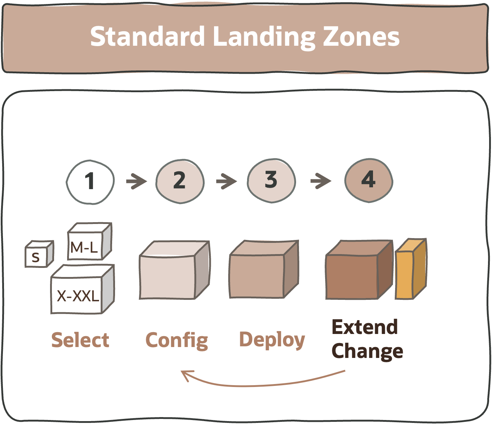

# **Standard Landing Zones**

&nbsp; 

&nbsp; 

## 1. What Are Standard Landing Zones

A Standard Landing Zone (SLZ) is a reference design blueprint, full of best practices, to onboard and run OCI.

A SLZ has the following characteristics:

1. **Complete**. A coherent – security, network, and operations – design views.
2. **Scalable**. Scalable by design throughout organizations, teams, platforms, and projects, or workload types.
3. **Runnable**. Tangible designs that are translatable into customer IaC Configurations.
4. **Configurable**. Designs are implemented by human-readable IaC configurations and not code using the [CIS Terraform Modules]. 
5. **Versionable**. IaC configurations are the source of truth, versioned on Git repositories.
6. **Reusable**. Design blueprints and IaC are created, used, and adapted to new use cases.
7. **Extendable**. Addon design and configurations are pluggable and non-disruptive. 
8. **Open**. Design blueprints, IaC configurations, and IaC modules are publicly open to be used by Oracle, Customers, and Partners.

&nbsp; 

## 2. What Are the Models Available

&nbsp; 

There are **three landing zone models** available for different business needs. The following table presents these models, their shapes, descriptions, and links to more details. Note that the diagrams for all the models follow the color code below for resource types.

&nbsp; 

| MODEL  |  SHAPE | DIAGRAM | DESCRIPTION | DETAILS  |  
---|---|---|---|---|
| **1. CIS OCI Landing Zone** | **XS-S** |  | A simple landing zone model that meets the security guidance prescribed in CIS Oracle Cloud Infrastructure Foundations Benchmark and brings in the ability to provision a Hub and Spoke architecture. The VCNs can either follow a general purpose standard three-tier network topology or are oriented towards specific topologies. | [View](/landing-zones/standard_landing_zones/cis_lz_v2/cis_landing_zone_v2.md)
| **2. OCI Operating Entities Landing Zone** | **M-L** |   | A landing zone model - with several flavors - that provides the ability to onboard several operating entities (OEs) into OCI, such as organization units, LoBs, customers, partners, OpCos, subsidiaries, or any type of managed services. It provides shared central services capabilities to all the OEs with a strong security posture and network segregation, with environments, projects, and platfoms adaptable for each OE.   | [View](https://github.com/oracle-quickstart/terraform-oci-open-lz)
| **3. OCI Multitenancy Landing Zone** | **L-XXL** |  | This landing zone model provides the ability to onboard several organizations into OCI introducing the multi-tenancy capabilities with tenancies for shared/central services (e.g., Connectivity Hub) and tenancies dedicated to complete enterprise organizations such as customers, countries businesses, sub-organizations, departments, etc. It's a highly adaptable blueprint with the concept of landing zone environments, workload environments, hub-hub models, projects, and platforms, providing the highest levels of segregation on OCI. This model fits any OCI flavor and it's ideal for the OCI DRCCs use cases.  | Available Soon / On Demand

&nbsp; 

## 3. Decide on the Model to Use

&nbsp; 

&nbsp; 

## 4. How to Start

&nbsp; 

| STEP  |   DESCRIPTION | 
|:---:|---|
| 1 | **Select the most suitable shape/model** taking into account organization scope and workload footprint size. | 
| 2 | **Review the Landing Zone Design and potentially adjust** the required elements. For tailored guidelines review the [**Tailored Landing Zones**](/landing-zones/tailored_landing_zones/readme.md).| 
| 3 | **Review the operations and related IaC Configurations**. Reflect your design on resource types and their configuration values. For guidelines review the [OCI Learn LZ](https://github.com/oracle-quickstart/terraform-oci-open-lz/tree/master/examples/oci-learn-lz) and [end-to-end operations examples](https://github.com/oracle-quickstart/terraform-oci-open-lz/tree/master/examples/oci-open-lz). | 
| 4 | **Run your model** with OCI Terraform CLI, Oracle Resource Manager or your automation tooling.
| 5 | **Extend your landing zone** with [**Workload Extensions**](/landing-zones/workload_extensions/readme.md) to reduce your efforts and time-to-value.

   
&nbsp; 

# License

Copyright (c) 2024 Oracle and/or its affiliates.

Licensed under the Universal Permissive License (UPL), Version 1.0.

See [LICENSE](https://github.com/oracle-devrel/technology-engineering/blob/main/LICENSE) for more details.