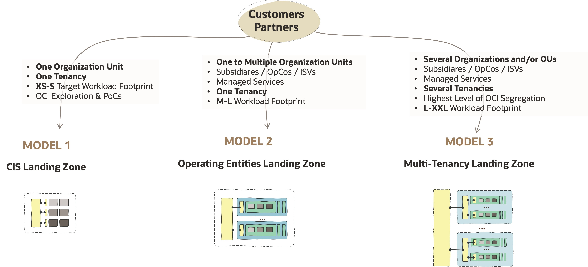

# **Standard Landing Zones**

&nbsp; 

&nbsp; 

## 1. What Are Standard Landing Zones

A Standard Landing Zone is a reference design blueprint, full of best practices, to onboard and run OCI. It contains the following characteristics:

1. **Complete**. A coherent – security, network, and operations – design views.
2. **Scalable**. Scalable by design throughout organizations, teams, platforms, and projects, or workload types.
3. **Runnable**. Tangible designs that are translatable into customer IaC Configurations.
4. **Configurable**. Designs are implemented by human-readable IaC configurations and not code using the [OCI Landing Zone Modules](/landing-zones/commons/oci_landingzones_iac.md). 
5. **Versionable**. IaC configurations are the source of truth, versioned on Git repositories.
6. **Reusable**. Design blueprints and IaC are created, used, and adapted to new use cases.
7. **Extendable**. Addon designs and configurations can be pluggable in a non-disruptive way. 
8. **Open**. Design blueprints, IaC configurations, and IaC modules are publicly open to be used by Oracle, Customers, and Partners.

&nbsp; 

## 2. Recommended Blueprints 

&nbsp; 

There are several **landing zone blueprints** available for different business needs. The following table presents these models, their shapes, descriptions, and links to more details. Note that the diagrams for all the models follow the color code below for resource types.

&nbsp; 

| LANDING ZONE | BLUEPRINTS  |  SIZE | DIAGRAM | DESCRIPTION | 
---|---|---|---|---|
| **[OCI Core LZ](https://github.com/oci-landing-zones/terraform-oci-core-landingzone)** |  **Quickstart** | **XS-S** |  | A quickstart landing zone blueprint that meets the ability to provision a hub and spoke topology and follow a general purpose three-tier architecture. 
| **[OCI Open LZ](https://github.com/oracle-quickstart/terraform-oci-open-lz)** | **[One-OE](https://github.com/oci-landing-zones/oci-landing-zone-operating-entities/blob/master/blueprints/one-oe/readme.md) & [Multi-OE](https://github.com/oci-landing-zones/oci-landing-zone-operating-entities/tree/master/blueprints/multi-oe)** | **M-L** |   | A landing zone - with several blueprints - that provides the ability to onboard **one** or **multiple operating entities (OEs)** into **one OCI tenancy**. An OE can be an organization unit, LoB, customer, partner, OpCo, subsidiary, or any type of managed service. It provides shared central services capabilities with a strong security posture and network segregation, with environments, projects, and platfoms adaptable for each OE.   | [OCI Open LZ](https://github.com/oracle-quickstart/terraform-oci-open-lz) [One-OE](https://github.com/oci-landing-zones/oci-landing-zone-operating-entities/blob/master/blueprints/one-oe/readme.md)  [Multi-OE](https://github.com/oci-landing-zones/oci-landing-zone-operating-entities/tree/master/blueprints/multi-oe)
| **[OCI Open LZ](https://github.com/oracle-quickstart/terraform-oci-open-lz)**|  [**Multi-Tenancy**](https://github.com/oci-landing-zones/oci-landing-zone-operating-entities/blob/master/blueprints/multi-tenancy/readme.md) | **L-XXL** |  | This landing zone blueprint provides the ability to **onboard several organizations** into OCI using the **multi-tenancy** capabilities, with tenancies for shared/central services (e.g., Connectivity Hub) and tenancies dedicated to complete enterprise organizations such as customers, countries businesses, sub-organizations, departments, etc. It's a highly adaptable blueprint with the concept of landing zone environments, workload environments, hub-hub models, projects, and platforms, providing the highest levels of segregation on OCI. This blueprint fits any OCI flavor and it's ideal for the OCI **DRCCs** and **Alloy** use cases.  

&nbsp; 

## 3. Decide on the Blueprint to Use

&nbsp; 

&nbsp; 

## 4. How to Start

&nbsp; 

| STEP  |   DESCRIPTION | 
|:---:|---|
| 1 | **Select the most suitable shape/blueprint** taking into account **organization** scope and **workload** footprint size. | 
| 2 | **Review the Blueprint Design and potentially adjust** the required elements. For tailored guidelines review the [**Tailored Landing Zones**](/landing-zones/tailored_landing_zones/readme.md).| 
| 3 | **Review the operations and related IaC Configurations**. Reflect your design on resource types and their configuration values. For guidelines review the [OCI Learn LZ](https://github.com/oci-landing-zones/oci-landing-zone-operating-entities/tree/master/addons/oci-learn-lz) and [end-to-end operations examples](https://github.com/oci-landing-zones/oci-landing-zone-operating-entities/tree/master/blueprints/one-oe/runtime/one-stack) available on the [OCI Open LZ Blueprints](https://github.com/oci-landing-zones/oci-landing-zone-operating-entities/tree/master/blueprints). | 
| 4 | **Run your model** with OCI Terraform CLI, Oracle Resource Manager or your automation tooling.
| 5 | **Extend your landing zone** with [**Workload Extensions**](https://github.com/oci-landing-zones/oci-landing-zone-operating-entities/tree/master/workload-extensions) to reduce your efforts and time-to-value.

   
&nbsp; 

# License

Copyright (c) 2025 Oracle and/or its affiliates.

Licensed under the Universal Permissive License (UPL), Version 1.0.

See [LICENSE](https://github.com/oracle-devrel/technology-engineering/blob/main/LICENSE) for more details.