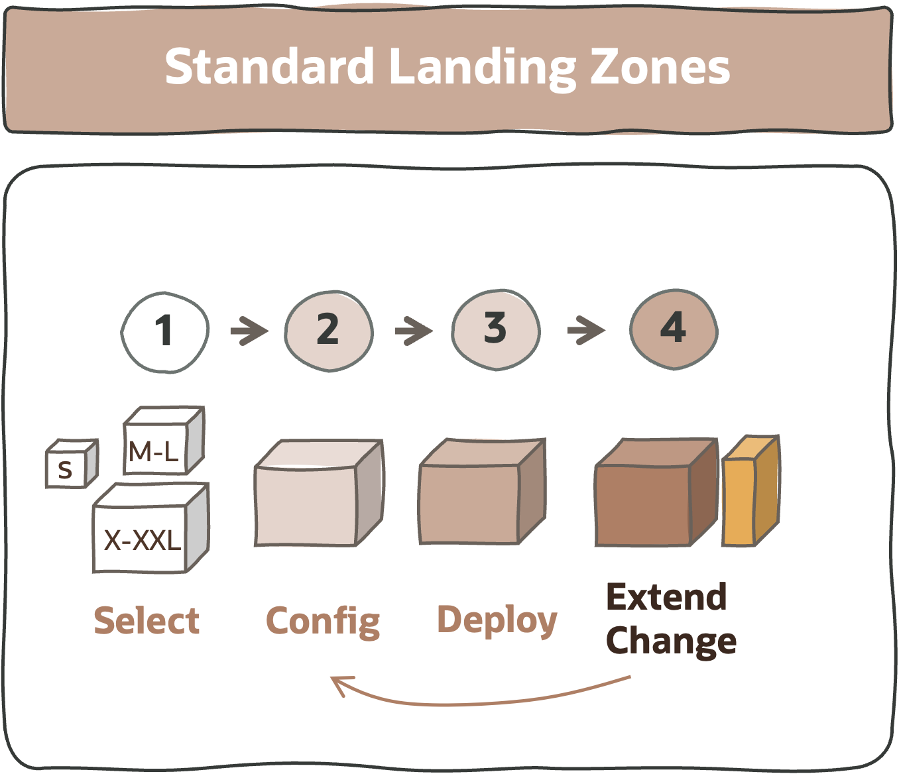

# **Standard Landing Zones**

&nbsp; 

&nbsp; 

## 1. What Are Standard Landing Zones

A Standard Landing Zone (SLZ) is a  **prescriptive approach** to landing zones. To achieve this, a **set of configurations** are available with a predefined structure. This is the **recommended approach for initial landing zone deployments** covering the most-common workload scenarios. An SLZ can also be extended to implement specific requirements, but those **extension** resources, or **add-ons**, would be manually created or by custom code.

Some characteristics of an SLZ:

- It provides a set of **best practices** and a prescriptive solution to deploy secure landing zones.
- It creates a **pre-defined** landing zone structure (compartments, networks, groups, policies, etc.)
- It’s a **configurable** setup, with no design or implementation activities.
- It provides a **secure footprint** to safely land and uses workloads.
- It has an **automated deployment** with **public Infrastructure as Code (IaC)**.

&nbsp; 

## 2. What Are The Solutions Available

There are **two solutions** OCI Standard Landing Zones:

* **[CIS LANDING ZONE (CIS LZ)](/landing-zones/standard_landing_zones/cis_lz_v2/cis_landing_zone_v2.md)**:  This solution provides a Terraform-based landing zone template that meets the security guidance prescribed in CIS Oracle Cloud Infrastructure Foundations Benchmark. This LZ brings in the ability to provision multiple VCNs, either in standalone mode or as constituent parts of a Hub and Spoke architecture. The VCNs can either follow a general purpose standard three-tier network topology or are oriented towards specific topologies. 
  * The current version is v2.x.
  * The **version 3** is coming and a highly configurable set of terraform modules are already available to configure with json/hcl any landing zone structure. For more details refer to the [Tailored Landing Zones](/landing-zones/tailored_landing_zones/tailored_landing_zones.md) approach. 

&nbsp; 
* **[ORACLE ENTERPRISE LANDING ZONE (OELZ)](/landing-zones/standard_landing_zones/oelz_v2/oelz_v2.md)**: This is the new version of the enterprise version of the Cloud Adoption Framework (CAF) landing zone. This solution provides a scalable architecture and deployment that includes designs for governance, security segmentation, and separation of duties. It's possible to deploy multiple workloads with separate networks for isolation and access.
  * The current version is v2.x.

&nbsp; 

## 3. How Do You Decide Which Solution

Find below an executive review of some key requirements that will influence the standard landing zone decision - without any customization:

&nbsp; 
| # | DOMAIN  |  REQUIREMENT (The customer requires...)| SOLUTION  |  
|:-:|---|---|---|
| 1 | **Segregation of Duties** | A dedicated **Network** Team, **Security** Team, **Database** Team, and **Applications** Team, operating their respective resources. | CIS LZ v2 |
| 2 | **Segregation of Duties** | A dedicated **Network** Team, **Security** Team, and possibly **one Team per Application** operating their respective resources. | OELZ v2 |
| 3 | **Network** | Strong workload network isolation with **NSGs**. | CIS LZ v2 |
| 4 | **Security** | **CIS Compliant** solution with embedded **CIS validations**. | CIS LZ v2 |
| 5 | **IAM** | A target tenancy **without Identity Domains**. | CIS LZ v2 |
| 6 | **Workloads** | The main use case focused on **database workloads** and there is **one team responsible** for these workloads. Relates to point 1. | CIS LZ v2 |
| 7 | **Cost** | Starting with **no initial OCI consumption**. | CIS LZ v2 |

&nbsp; 

For other design considerations (such as hub & spoke, several environments, ExaCS ready, etc.), both solutions will tend to fit. Note the **support model for both solutions is UPL 1.0**. 

If after reviewing the table above the solution is not clear: 
1. Visit [**landing zone landscape**](/landing-zones/commons/select_your_solution.pdf) for further consideration.
2. Might be the case that a **customization** is required for a standard landing zone, which should be treated as an extension of it, and **not** as rebuilding it into a different shape. Choose the solution that is nearer to the requirements.
3. If it's required to r**ebuild/restructure** a standard landing zone then  use it's recommended to use the [**tailored landing zone**](/landing-zones/tailored_landing_zones/tailored_landing_zones.md) approach.
4. If none of the above is sufficient, reach out to us for a recommendation.

&nbsp; 

## 4. How to Start

&nbsp; 

| STEP  |   DESCRIPTION | 
|:---:|---|
| 1 | Review the previous section. | 
| 2 | Select the solution: a. For the **CIS LZ [start here](/landing-zones/standard_landing_zones/cis_lz_v2/cis_landing_zone_v2.md)**.  b. For the **OELZ [start here](/landing-zones/standard_landing_zones/oelz_v2/oelz_v2.md)**.
| 3 | If it's required a **custom design extending the standard landing zone**, there are three alternatives:  **a. OCI Console**: Update the resources after deploying the solution. The impact of this is operating the OCI landing zone with the OCI console, i.e., manually. **b. Extended IaC**: Update the code to fit the needs and deploy the solution. The impact of this might be the effort and skills required.  **c. Tailored with IaC**: If it's required more design flexibility or the extensions break the standard solution and require structural changes, use the [tailored landing zone](/landing-zones/tailored_landing_zones/tailored_landing_zones.md) approach.

   
&nbsp; 

# License

Copyright (c) 2024 Oracle and/or its affiliates.

Licensed under the Universal Permissive License (UPL), Version 1.0.

See [LICENSE](https://github.com/oracle-devrel/technology-engineering/blob/main/LICENSE) for more details.