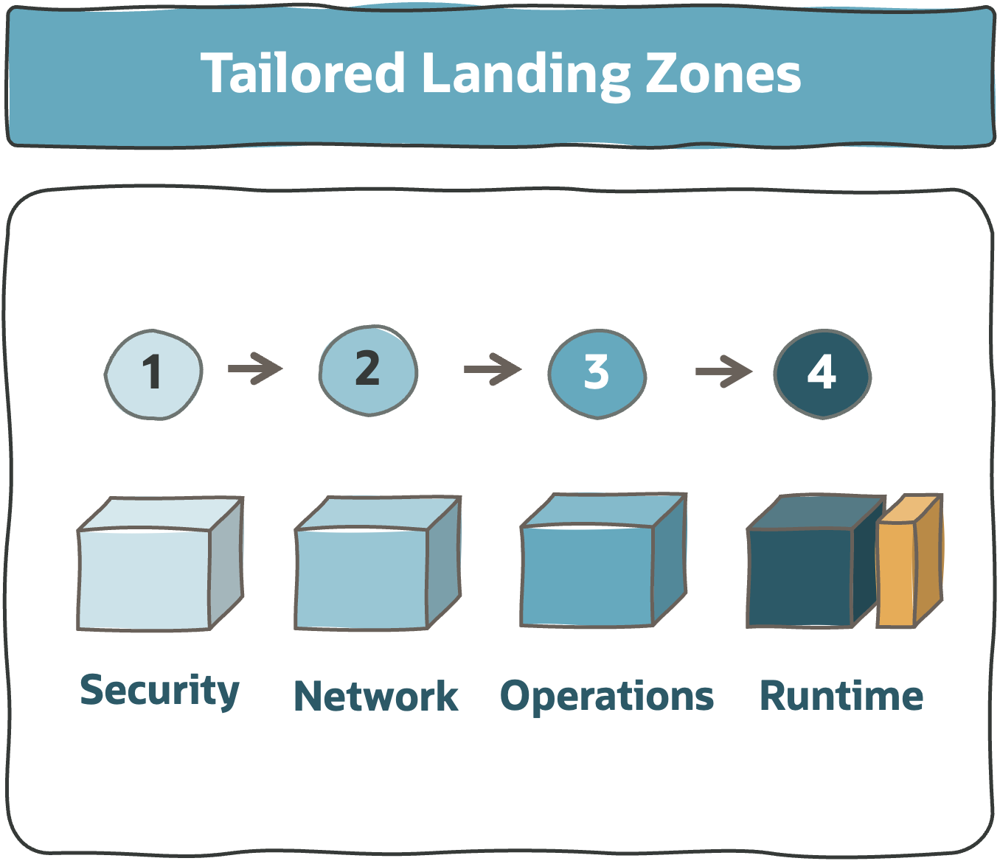

# **Tailored Landing Zones**

&nbsp; 

&nbsp; 

## 1. What are Tailored Landing Zones 

A tailored landing zone is a solution designed to fit specific requirements. This approach is normally used in these **use cases** (but not limited to):
- **Mirroring existing landing zones** on other CSPs.
- **Onboarding and reflecting organization structures** such as business units, operating entities, OpCos, into a cloud operating model.
- **Fine-grained segregation of duties** and responsibilities across resources and teams.
- **Network structure** with **different areas and security postures**, with fine-tuned **north-south** and **east-west** traffic scenarios.
- **Heterogeneous** and/or **large workloads** landscape.
- **Adopting a highly scalable operating model**, such as control versioned operations.

&nbsp; 

In terms of **design**, this approach is simple and repeatable, and can involve the following OCI views (see section 2.1):
- **Security View**: covering the segregation of duties, with Tenancy Structure, IAM, and Posture Management.
- **Network View**: covering the Network Structure, Network Isolation, Connectivity, Most-Significant Traffic Scenarios, and possibly DNS.
- **Operations View** which can include the operating model with automation scenarios, monitoring, and possible integrations. This view highly depends on the existing IT systems context and day-two running objectives.

&nbsp; 

In terms of **running**, a tailored landing zone will be an **IaC-configured solution**, and not a coded one, as described in section 2.2.

&nbsp; 

## 2. What Are The Assets Available
There are **two assets** for creating OCI-tailored landing zones, one for **design** and the other for **running** OCI.

&nbsp; 

### **2.1 Design** &ndash; With a Blueprint
To tailor a landing zone we recommend starting with the [Standard Landing Zone Model 2](/landing-zones/standard_landing_zones/readme.md#2-what-are-the-models-available), called the **[OCI Operating Entities Landing Zone](https://github.com/oracle-quickstart/terraform-oci-open-lz)** (aka OCI Open LZ), which is a **reference solution** designed and documented with a **repeatable design process**. It presents an end-to-end coherent solution &ndash; with the security, network, and operations views &ndash; of what an organization-wide landing zone looks like, with fine-grained segregation of duties, strong isolation of resources, and a scaleable operating model.

The **benefit** of this blueprint is that it can be completely **adjusted and easily simplified** into any other type of landing zone, by following the design steps towards your needs.  Using this reference blueprint will help **create a day-two operational model ready to scale** &ndash; using the IaC solution presented in the next section.

&nbsp; 

### **2.2 Run** &ndash; with IaC Configurations
For this type of approach we recommend the use of the **[CIS Landing Zone  Modules](/landing-zones/commons/oci_landingzones_iac.md)**, to **configure** the resources with *json/hcl* terraform native interfaces, or *yaml*, instead of coding them.

The **benefits** of using this approach are: 
- **Focus on Value**: Focus on configuring the design and resources, instead of coding them. This means shorter time-to-value, lower effort, and lower risk.
- **Best Practices**: Use existing top-quality Terraform modules that are open and full of best practices. It's possible to leverage this to evolve OCI Terraform skills and apply future IaC best practices. This also means lower risk and lower efforts.
- **Scale Day Two**: Being able to split operational configurations from code it's a game change in cloud operations, and will simplify drastically the day-two operations, opening the path for a **GitOps** operating model and potentially simpler automation. The cloud operators will only work with configurations, not code.

&nbsp; 

To learn how to **design**, **create**, and **run IaC configurations** we recommend reviewing the exercises on the [**OCI Learn LZ**](https://github.com/oracle-quickstart/terraform-oci-open-lz/tree/master/examples/oci-learn-lz). It's a guided approach to OCI Landing Zones configurations.

&nbsp; 

## 3. How to Start 
   

&nbsp; 

| STEP  |   DESCRIPTION | GUIDANCE  |  
|:---:|---|---|
| 1 | **Understand OCI core resources**, such as compartments, groups, policies, and network elements. They are the foundations of any OCI landing zone. | [OCI Foundations](https://mylearn.oracle.com/learning-path/become-an-oci-foundations-associate/108448)  [OCI Architect Associate](https://mylearn.oracle.com/learning-path/become-an-oci-architect-associate/108703)  [OCI Architect Professional](https://mylearn.oracle.com/learning-path/become-an-oci-architect-professional/108709) |
| 2 | **Review a Standard Landing Zone Design**: The **OCI Open LZ Blueprint** is a pedagogical and coherent end-to-end landing zone design. The **OCI Open LZ** is a reference of what a landing zone "looks like", and it's not prescriptive. The git repository contains also several useful resources and recordings to help with the next steps. | [OCI Open LZ Blueprint](https://github.com/oracle-quickstart/terraform-oci-open-lz) |
| 3 | **Design the Security View first**, with a focus on the tenancy structure and IAM, as all resources and access to them will be defined here. | [OCI Open LZ Security View](https://github.com/oracle-quickstart/terraform-oci-open-lz/blob/master/docs/OCI_Open_LZ.pdf)  [OCI Open LZ Draw.io](https://github.com/oracle-quickstart/terraform-oci-open-lz/blob/master/docs/OCI_Open_LZ.drawio)
| 4 | **Design the Network View**, with a focus on the network structure, connectivity, and isolation. | [OCI Open LZ Network View](https://github.com/oracle-quickstart/terraform-oci-open-lz/blob/master/docs/OCI_Open_LZ.pdf)  [OCI Open LZ Draw.io](https://github.com/oracle-quickstart/terraform-oci-open-lz/blob/master/docs/OCI_Open_LZ.drawio)
| 5 | If applicable, **design the Operations View**, and set up the cloud operating model. It can contain also monitoring and integrations with IT Systems. | [OCI Open LZ Operations View](https://github.com/oracle-quickstart/terraform-oci-open-lz/blob/master/docs/OCI_Open_LZ.pdf) 
| 6 | **Learn** how to create and run **IaC configurations** with examples and exercises. | [OCI Learn LZ](https://github.com/oracle-quickstart/terraform-oci-open-lz/tree/master/examples/oci-learn-lz) |
| 8 | Create the **IaC configurations** for your design using the CIS Landing Zone Enhanced Modules.| [OCI Open LZ Rumtime View](https://github.com/oracle-quickstart/terraform-oci-open-lz/blob/master/docs/OCI_Open_LZ.pdf)  [CIS Landing Zone Enhanced Modules](https://www.ateam-oracle.com/post/cis-landing-zone-enhanced-modules)

&nbsp; 

## 4. Other Considerations
   
Note that the **alternative** for not using the configurable approach described in [section 2.2](#2_2) is to **code your own solution**, from zero or reuse existing modules. The CIS Landing Zone Modules allow any configuration topology and allow to focus on business resources (workloads) instead of investing time coding to create OCI core resources. By using the recommended approach it's possible to avoid the **common pitfalls** associated with complex customizations:
- **Hard-coding**. Changing or adapting code to create a new landing zone different than the original is complex and time-consuming. This also means that any change to the landing zone will be executed by code and not configurations.
- **Waste & Late Time-to-Value**. The time spent on adapting code, or re-coding over and over for the OCI landing/core resources is time wasted and not used on the business value/workloads.
- **Limited Scaling**. Doing OCI changes manually can work for some tactical solutions, but it will always limit the scaling and add complexity and cost to the day-two operations. Note that, for example, CIS LZ creates 100+ OCI resources.
- **Scarce Skills**. IaC Terraform coding skills are not as common as we should expect, which makes these efforts a higher risk and challenge to solve. 

&nbsp; 

# License

Copyright (c) 2024 Oracle and/or its affiliates.

Licensed under the Universal Permissive License (UPL), Version 1.0.

See [LICENSE](https://github.com/oracle-devrel/technology-engineering/blob/main/LICENSE) for more details.
