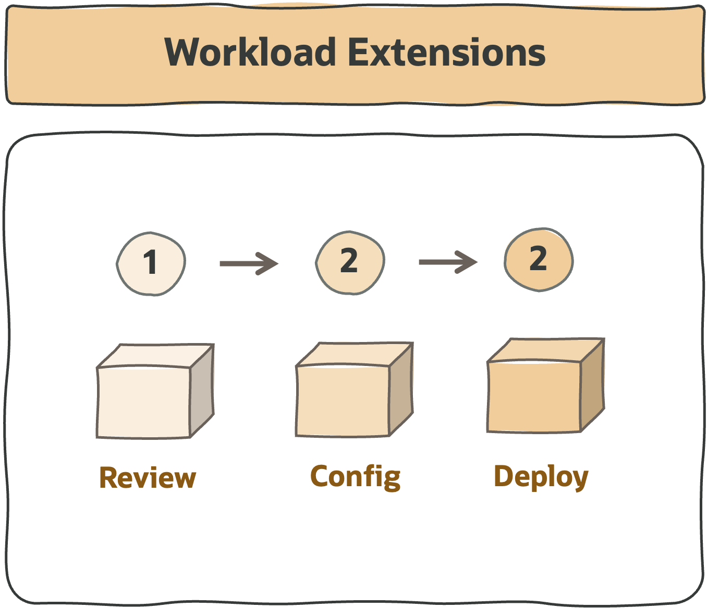

# **Workload Landing Zones**

&nbsp; 

&nbsp; 

## 1. What are Workload Extensions 

A workload extension is an **OCI solution design ready to receive specific workloads** on top of a landing zone. Each of these extensions follows the [tailored landing zone approach](/landing-zones/tailored_landing_zones/tailored_landing_zones.md) and has a design and runtime, ready for deployment:

- In terms of **design**, each solution will contain the security, network, and runtime views. 

- In terms of **running**, each solution will have a runtime view with **IaC configurations**, pluggable to an existing landing zone, and ready to be deployed. Please note that the workload elements (VMs, Databases, etc.) are not deployed.

&nbsp; 

## 2. What Are The Assets Available

Find below the list of available workload landing zones and our backlog. Be free to reach out if you require any other flavor.

&nbsp; 

| WORKLOAD  | CONTENT | DESCRIPTION |
|---|---|---|
| [**EBS**](https://github.com/oracle-quickstart/terraform-oci-open-lz/tree/master/examples/oci-ebs-lz) | Public | An EBS Landing Zone as an extension of the CIS Landing Zone.
| **OKE** | On Demand | An ExaCC Landing Zone as an extension of the CIS Landing Zone.
| **ExaCS** | On Demand | An ExaCC Landing Zone as an extension of the CIS Landing Zone.
| **ExaCC** | On Demand | An ExaCC Landing Zone as an extension of the CIS Landing Zone.
| **OCVS** | On Demand | An OCVS Landing Zone, as an extension of the CIS Landing Zone.
| **CCC** | On Demand | A Compute Cloud @ Customer Landing Zone, as an extension of the CIS Landing Zone.

&nbsp; 

## 3. How to Start 

   
| STEP  | DESCRIPTION |
|---|---|
| 1 | Review the design artefact in drawio format.
| 2 | Configure the runtime view with IaC configurations.
| 3 | Run IaC configurations with ORM. Your Workload will be on a dedicated stack.
| 4 | Workload Landing Zone is ready. Deploy your workload resources. 

&nbsp; 

# License

Copyright (c) 2024 Oracle and/or its affiliates.

Licensed under the Universal Permissive License (UPL), Version 1.0.

See [LICENSE](https://github.com/oracle-devrel/technology-engineering/blob/main/LICENSE) for more details.
