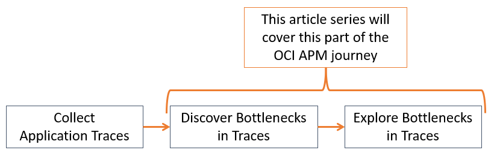

# How to get started with OCI Application Performance Monitoring (APM)

This asset is a series of articles to help get started with Application Performance Monitoring (APM) on Oracle Cloud Infrastructure (OCI). After you have instrumented you own application and begun ingesting traces, these articles will introduce you to the basics of how to move forward with OCI APM as a tool.

The asset is broken down into three sections:

- **[What does OCI APM do?](./what-does-oci-apm-do.md)**: This is a basic introduction to what OCI APM actually does: the telemetry it collects and the value of this for monitoring.

- **[Discover Application Bottlenecks](./discover-application-bottlenecks.md)**: How do you detect application performance bottlenecks in OCI APM? This part will focus on **dashboards, alarms, and proactive availability monitors** as tools to spot or notify you about bottlenecks to be explored further.

- **[Explore Application Bottlenecks](./explore-application-bottlenecks.md)**: After discovering a bottleneck, how do you explore the related telemetry of traces and spans? What exactly are you looking for? This part will focus on APM's **Trace Explorer**, a tool to dig around your traces freely.

Reviewed: 24.04.2026

# When to use this asset?

Once an application is instrumented and traces are collected by agents, it can be challenging to begin exploring the data in OCI APM. With potentially thousands of traces being ingested and different ways of investigating them, it can be a bit of a daunting task - like looking for a needle in a haystack. This asset is meant to help get started with basic exploration of your traces for bottlenecks using OCI APM.

# How to use this asset?

When an application is instrumented and traces are being collected, this asset can be used to get some guidance on how to approach OCI APM as a tool.

If possible, it's recommended to instrument an application with OCI APM first and look at the data while reading these articles. APM has a free version that can be used to try out all the capabilities discussed in this asset (click [here](https://docs.oracle.com/en-us/iaas/application-performance-monitoring/doc/create-apm-domain.html) for more).

# License

Copyright (c) 2026 Oracle and/or its affiliates.

Licensed under the Universal Permissive License (UPL), Version 1.0.

See [LICENSE](https://github.com/oracle-devrel/technology-engineering/blob/main/LICENSE) for more details.