# Discover Application Bottlenecks

This part will focus on awareness before investigation: how to initially detect or be notified about performance bottlenecks before diving deeper into OCI APM's Trace Explorer (see [Explore Application Bottlenecks](./explore-application-bottlenecks.md)). Before you explore traces and spans for more details, you must first be made aware that there's an issue worth investigating. We will have a look at the following three tools. These can be used to spark the initial awareness of danger and kickstart the APM journey:

1. **[Dashboards](#dashboards)**: These can either be the ones provided by APM out-of-the-box or your own custom dashboards. Dashboard widgets highlight issues detected in areas of concern both from the frontend and backend perspective.

2. **[Availability Monitoring](#availability-monitoring)**: Synthetic monitors that continuously test the availability and performance of application services to discover whether key features or key tasks are completed successfully with the expected performance. This enables proactive monitoring by acting on performance issues discovered by your own tests - rather than reacting to complaints from real users.

3. **[Alarms](#alarms)**: These can notify you about issues such as those highlighted by dashboards or Availability Monitoring.

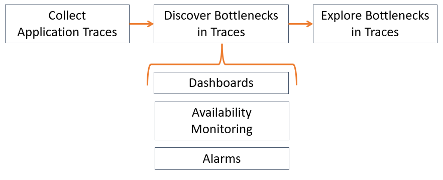

## Dashboards

A dashboard widget highlights issues in application services. It also lets you drill down to related spans and traces in the Trace Explorer to examine things more freely. As an example, below is a simple widget dividing traces by Application Performance Index (Apdex):

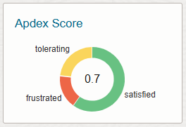

Click on a section of the widget to see a section of the trace data, or on the widget's title to see all trace data in the Trace Explorer:

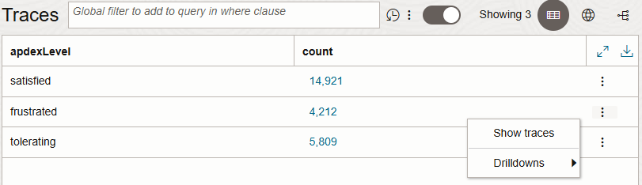

>**What is Application Performance Index (Apdex)?**
>
>Apdex is a value between 0 (a frustrating user experience) and 1 (a satisfying user experience) based on span execution time. For example, if a page load lasts for longer than 6 seconds, that span will probably get a frustrating score.
>
>Different spans have different expectations in terms of execution times. For example, a full page load is normally expected to take longer than getting a response from a request to a servlet. This is why different span types should have different execution time thresholds, determining what's considered satisfying (score of 1), tolerating (score of 0.5), or frustrating (score of 0). OCI APM sets several of these Apdex thresholds out-of-the-box, but you can also create your own (click [here](https://docs.oracle.com/en-us/iaas/application-performance-monitoring/doc/configure-apdex-thresholds.html) for more).
>
>When the Apdex thresholds are in place, you can easily check or create alarms for any span activity with a score below 1 while still using different thresholds to reflect different performance requirements.

OCI APM provides several dashboards out-of-the-box with insights into issues both in the frontend and backend of the application, such as:

- Where do performance bottlenecks occur?

- How is trace activity volume divided by context attributes to determine where to prioritize good performance?

- Where is there potentially malicious activity?

We will look at the out-of-the-box dashboards for this article. You can also customize your own dashboards to highlight additional performance or security issues more specific to your application services (click [here](https://docs.oracle.com/en-us/iaas/application-performance-monitoring/doc/create-custom-dashboard.html) for more). My advice is to design your dashboard widgets so they can give a proper overview of application health and drill down to relevant data in the Trace Explorer for further investigation.

### Real User Monitoring Overview: Drill down to traces based on frontend request performance

Real User Monitoring shows not only the performance of requests made at the browser level, but also the profile of your users in terms of how and from where in the world they interact with your web application. This highlights where your application is having performance issues at the frontend, but also where performance matters for your users. When investigating bottlenecks, it's often good to start with the user experience by applying a frontend perspective before investigating the backend. Troubleshooting something might only really matter if users in the frontend can feel the difference:

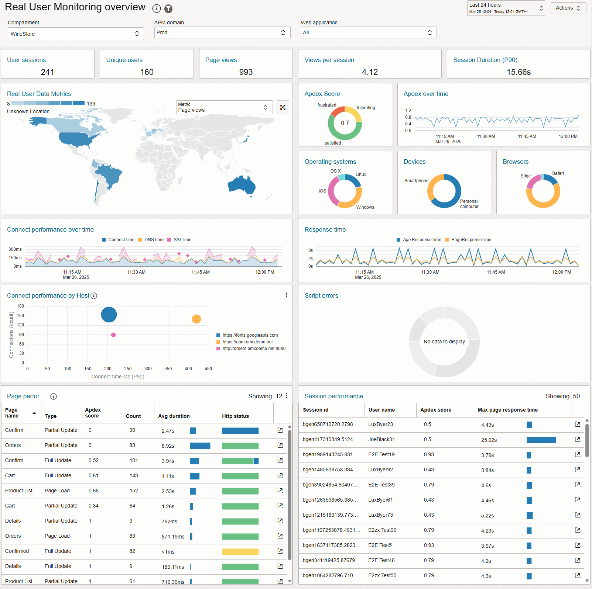

With Real User Monitoring, you are starting your investigation based on questions like:

- Are there any JavaScript errors?

- Networking-wise, is time spent on connections, DNS lookups, or SSL handshakes?

- Which pages and sessions have the most activity, and how is their overall performance?

- Which host URLs do browsers connect to during user sessions? Which host handles most activity, and which are the slowest to initiate connections through TCP handshakes? This is useful when only frontend instrumentation with APM is possible, such as with cloud SaaS services. It gives visibility into which backend hosts impact the frontend - even if cloud applications don't give you visibility into the internal spans of backend services.

As an example, the widgets shown below let you drill down to the Trace Explorer based on either the Apdex score of page request spans or based on client characteristics such as browsers, operating systems, or devices. This underscores the importance of not only analyzing traces for performance bottlenecks but also aggregating them by contextual attributes to identify and prioritize areas of high activity or interest. For instance, while you might find performance bottlenecks in traces affecting Chrome users, if most of your users rely on Safari, it's crucial to prioritize performance there:

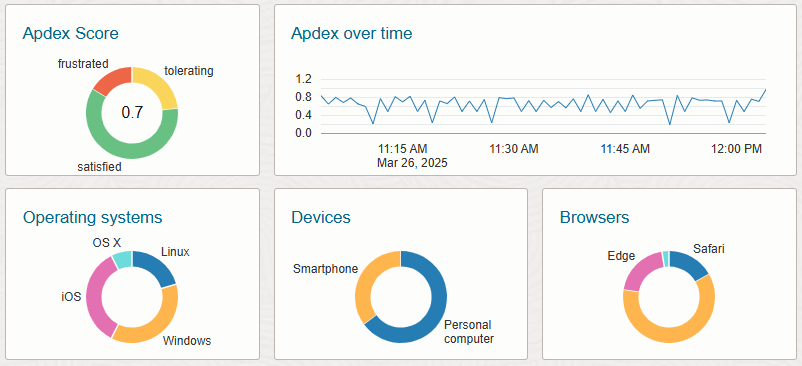

### Service Monitoring: Drill down to traces from backend application services or server requests

The Service Monitoring dashboards give performance insights about server requests made by clients to your application services in the backend. Within OCI APM, these are typically called **service requests**, but it means the same. Drilling down to the Trace Explorer from these dashboards means investigating traces either due to bad performance from service requests in terms of response time or error rate, or drilling down due to high CPU or memory usage in app services caused by the workload. Service Monitoring in APM is divided into two sections: [**Services**](#services) and [**App Servers**](#app-servers).

#### Services

The Services dashboards show service request throughput and performance, either by app services or by specific endpoints associated with individual service requests. You can begin with a high-level overview of the app services, then explore an individual service's requests in greater detail.

At the app service level, you can drill down to the Trace Explorer based on backend server request performance measured by Apdex scores, execution time, client/server/database errors, and throughput as call count. Again, the throughput can help with determining where good performance is critical:

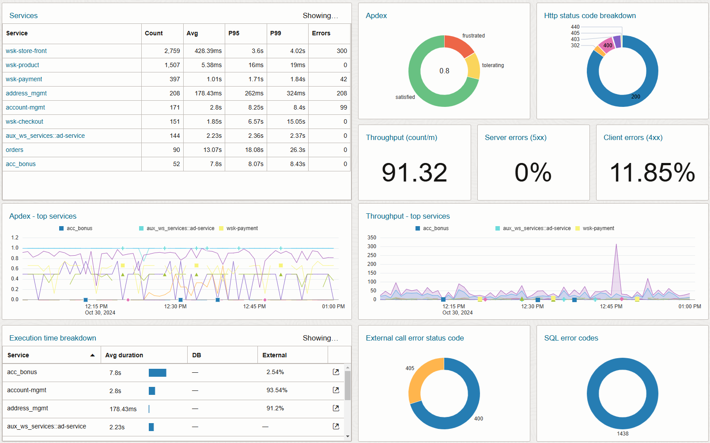

The table in the upper left corner lets you drill down to a dashboard with insights about a specific app service, the requests it handles,and their performance. The widgets are similar in terms of visualizing performance and throughput as execution count values - but from here you can drill down to the Trace Explorer based on information from a specific service request rather than information from an overall app service:

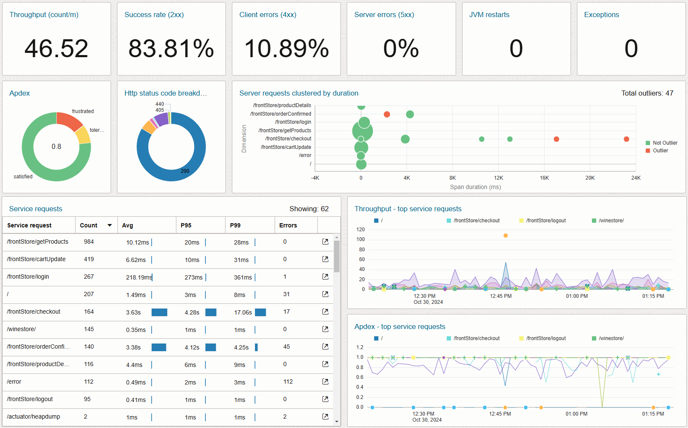

>**What are cluster widgets?**
>
>The dashboard above also contains a cluster widget called **Server requests clustered by duration**. This is useful for detecting performance outliers. In this example, server request spans are clustered by duration and receiving endpoint. This way, we can see how requests of the same type are distributed in terms of their duration. Furthermore, the widget establishes a baseline of green clusters, determining where most of the spans are located on the chart for a given server request endpoint. Any execution outside of that baseline is marked as a red outlier, which is either unusually slow or fast compared to the baseline. Cluster widgets let you drill down to the Trace Explorer by clicking on one of the clusters. This way, you investigate based on baselines and outliers rather than just values crossing fixed thresholds:
>
>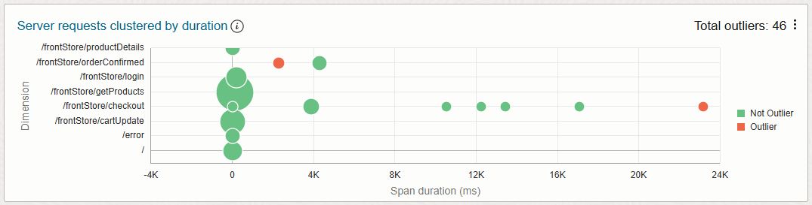

#### App Servers

Service Monitoring also has a dashboard for app servers. This gives an overview of the state, workload as request rate, CPU/memory consumption, and garbage collection on your servers as caused by operations captured in the trace data. When you drill down to the Trace Explorer from here, it's not just about the performance of traces, but also the concrete effect they have on your server resources:

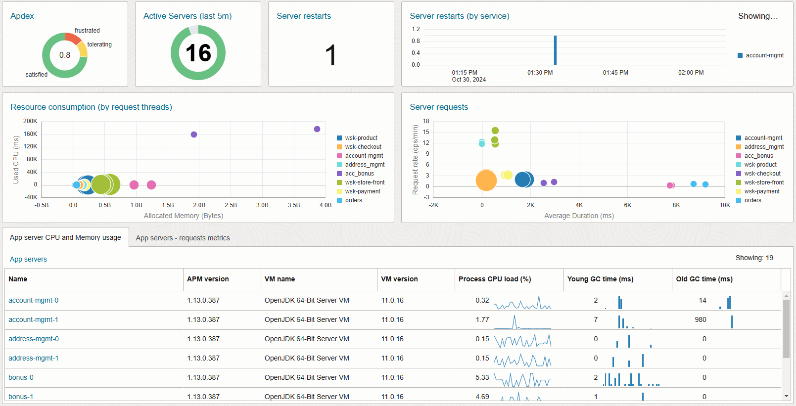

### Threat Activity Monitoring Overview: Drill down to traces from malicious IPs

>**NOTE**: The Threat Activity Monitoring dashboard is not a dedicated section of APM like the other dashboards we've seen so far. Go to **Observability & Management > Management Dashboards**. Then search for a dashboard called **Threat Activity Monitoring Overview**.

Oracle Cloud Infrastructure has a threat intelligence feed of potentially malicious client IP addresses collected by Oracle's own security researchers, but also from open source feeds like abuse.ch and Tor exit relays, and third party partners. Each registered client IP is related to a threat type and a confidence score based on the related recorded information (click [here](https://docs.oracle.com/en-us/iaas/Content/threat-intel/using/overview.htm) for more).

OCI APM uses the threat intelligence feed to help you drill down to traces caused by registered malicious client IPs. This lets you see what requests they have made to critical app services, including database calls triggered by their requests:

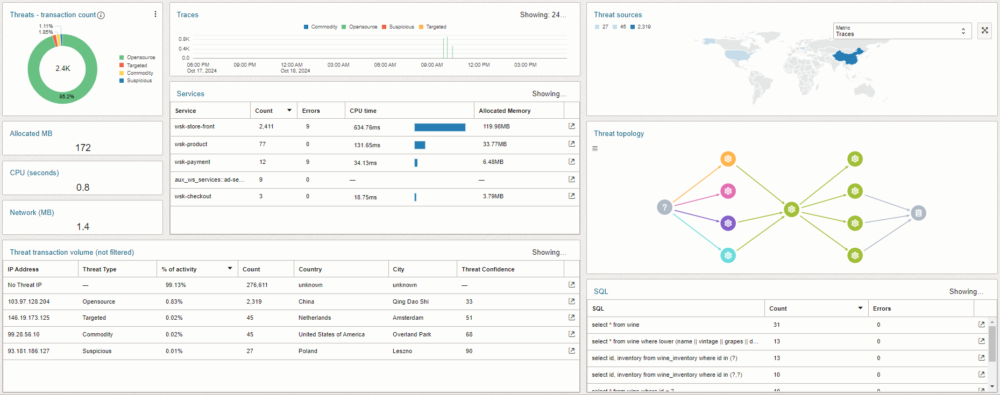

For example, if you drill down on a listed SQL query, it will take you straight to related database calls caused by risky clients in the Trace Explorer:

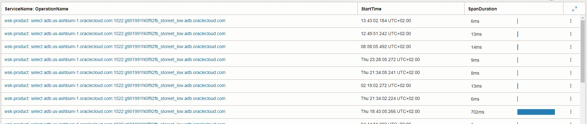

## Availability Monitoring

So far, we've looked at dashboards that help you react to issues already occurring in your application services. But what if you could proactively catch problems before users experience them? That's where availability monitors come in.

**Availability monitors** proactively test the availability and performance of your application services' core features and critical user flows at set intervals, e.g., once per hour or once per day. Every monitor has a vantage point, which is a host running your tests from a certain geographic location. You can select vantage points managed by Oracle that run in one of their data centers around the world - or use your own managed host with a Docker container running as a vantage point (click [here](https://docs.oracle.com/en-us/iaas/application-performance-monitoring/doc/set-synthetic-monitoring.html) for more about the setup of availability monitors).

Different types of availability monitors test different aspects of your application. You can get a full overview of these in the official documentation (click [here](https://docs.oracle.com/en-us/iaas/application-performance-monitoring/doc/create-monitor.html) for more). In this article, I will mention two types:

- **Browser monitor**: Tests a single URL load like your application's login page.

- **Scripted Browser monitor**: Tests a user flow of multiple browser actions in a script written with Selenium or Playwright. An example could be a dummy user in an online web shop. The user puts some items in a shopping cart and then completes the purchase. This flow tests multiple core features for users. It should preferably be fast and encounter no errors.

Like with dashboards, you can use an availability monitor as the starting point for a deeper investigation of related data in the Trace Explorer. Below is the run history of a single Scripted Browser monitor, which performs the web shop test I just described above. One of the monitor runs is considerably slower than the others:

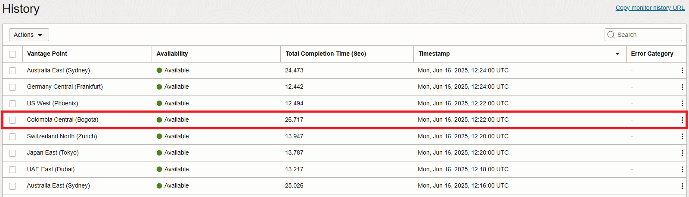

Click on the three dots at the end of the monitor run record to see more options. **View Trace Details** drills down to the monitor run's traces in the Trace Explorer:

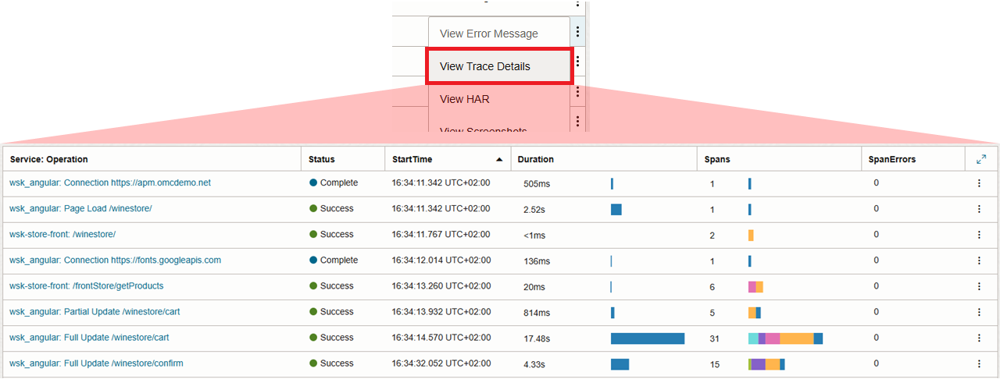

The availability monitor also collects other kinds of data on its own without the use of APM agents. **View HAR** shows the kind of data you would see in your browser's developer tools, including the HTTP requests' state, kind, and amount of network traffic. You can also have a quick look at what request contributed the most to execution time - like the POST request to a checkout endpoint shown below:

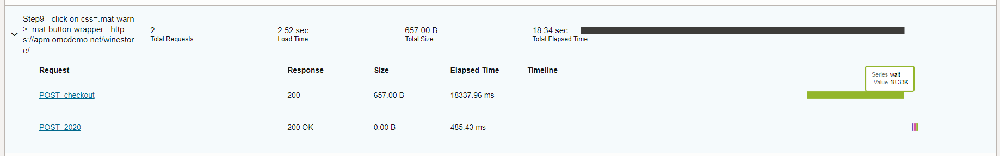

Remember, this is only from the frontend as collected by the availability monitor during a scripted session. Other spans in the backend belonging to the browser request's trace could be the actual cause of the execution time. This is likely the case given that most of the execution time in the POST request is spent in a wait state. But it's an excellent example of how to start your exploration of traces using bad results from an availability monitor run, rather than exploring because a user shared their bad experience with the application.

Availability Monitoring has its own dashboard as well. It gives an overview of the monitor runs' failure rates, connect time breakdown (connect/SSL/DNS time), and how much of the execution time is spent on loading content. At the bottom, you can click on the name of an availability monitor to see its run history:

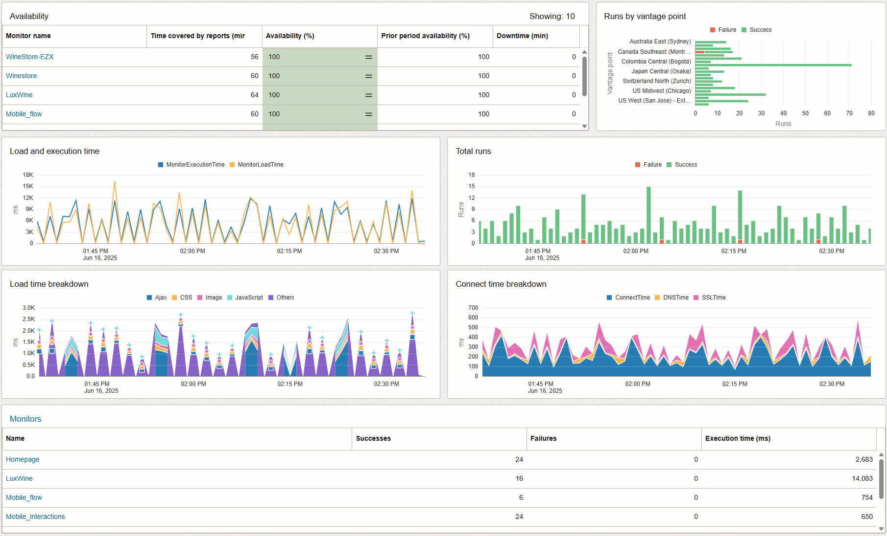

## Alarms

Alarms deserve their own deep dive, but here's what you need to know to get started. All the information shown by dashboards and Availability Monitoring can be used for alarms as well. Don't just drill down to trace data when you happen to spot an issue in the APM UI. Be notified about it and investigate further in the Trace Explorer immediately. You create APM alarms the same way you create other alarms in OCI (click [here](https://docs.oracle.com/en-us/iaas/Content/Monitoring/Tasks/create-alarm.htm) for more). The alarms are based on metrics from the following namespaces (click [here](https://docs.oracle.com/en-us/iaas/application-performance-monitoring/doc/application-performance-monitoring-metrics.html) for more):

- **oracle_apm_rum**: This namespace contains the same metrics used by the Real User Monitoring dashboard. This means you can define alarms based on user experience in the frontend about the performance of page clicks, updates, and loads.

- **oracle_apm_monitoring**: Contains metrics collected by APM agents running on backend servers, like those displayed in the Service Monitoring dashboards. Define alarms based on application servers and spans triggered by server requests.

- **oracle_apm_synthetics**: Metrics emitted by availability monitor runs. Use this namespace to create alarms for issues with availability or performance encountered by all defined monitors.

Remember to take advantage of Apdex thresholds set in your APM domain to easily send alarm notifications about any span not living up to expectations for "satisfying" or "tolerating" execution times. For instance, you might create an alarm that triggers when your checkout service's Apdex score drops below 0.8 for more than 5 minutes. When triggered, the alarm could send notifications via email or Slack, prompting immediate investigation in the Trace Explorer.

**Span Metric Groups with Anomaly Detection for Advanced Alarms**

Metric groups let you filter out-of-the-box span metrics using attribute filters. This allows you to query or trigger alarms based on a specific subset of spans, rather than across all spans.

For example, you can define a metric group with the attribute filter "ClientIpThreatType IS NOT OMITTED" to isolate metrics from spans triggered by client IPs flagged as malicious in threat intelligence feeds.

You can also enable anomaly detection for span metric groups. Instead of relying on fixed thresholds, alarms can be triggered based on an **Anomaly** dimension automatically added to your data points. This dimension can take the value:

- -1: below the expected baseline

- 0: within the baseline

- 1: above the baseline

Use span metric groups with anomaly detection to monitor performance patterns and detect unexpected behavior in specific subsets of your trace data (click [here](https://docs.oracle.com/en-us/iaas/application-performance-monitoring/doc/configure-metric-groups.html) for more).

## Summary

In these first steps into the APM journey, we have covered how to become aware of issues in trace data before drilling down for more details in the Trace Explorer. To wrap up:

- **Dashboards**: Use the widgets to highlight issues with response times, errors, resource consumption, threats, etc., before drilling down.

- **Availability Monitoring**: Create availability monitors to proactively test the availability and performance of critical features and tasks in your application. Then drill down to the Trace Explorer once you get a bad monitor run.

- **Alarms**: Create alarm definitions to be notified about issues like those seen in dashboards or from availability monitor results.

Next we will look into [how to explore performance bottlenecks in APM's Trace Explorer](./explore-application-bottlenecks.md).

# License

Copyright (c) 2026 Oracle and/or its affiliates.

Licensed under the Universal Permissive License (UPL), Version 1.0.

See [LICENSE](https://github.com/oracle-devrel/technology-engineering/blob/main/LICENSE) for more details.