# Explore Application Bottlenecks

This article is all about OCI APM's **Trace Explorer** for delving into the details of traces and spans. In [Discover Application Bottlenecks](discover-application-bottlenecks.md), we discussed how to identify performance and security issues in OCI APM using tools outside of the Trace Explorer, including dashboards, Availability Monitoring, and alarms. It's finally time to drill down and explore the traces behind everything.

For this section, we will cover the following:

1. [Querying traces and spans in the Trace Explorer](#query-traces-and-spans)

2. [Drilling down to trace and span details](#drill-down-to-trace-and-span-details-to-locate-bottlenecks-and-their-context)

3. [Continue exploring traces and spans based on previously discovered bottlenecks and their context](#continue-exploration-of-traces-and-spans-based-on-contextual-attribute-values)

4. [Enhance trace data for better exploration with OCI APM configurations](#enhance-trace-exploration-with-apm-configurations)

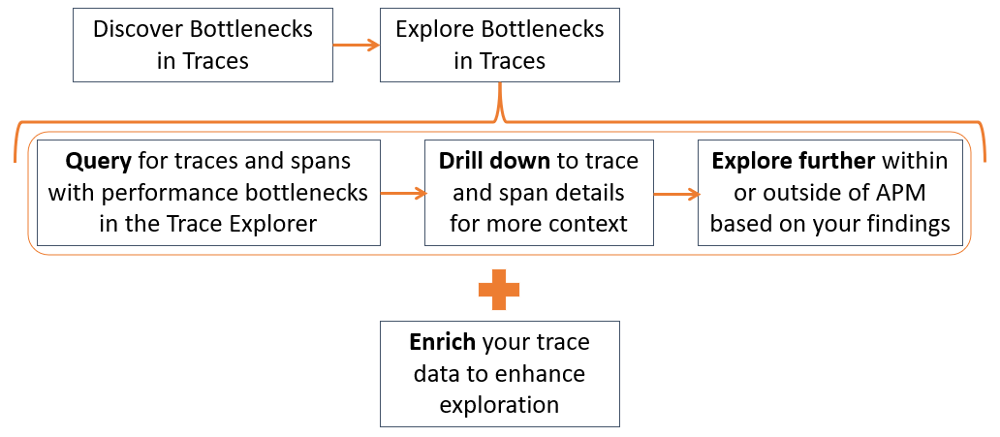

## Query Traces and Spans

Let's have a look at what you see when accessing APM's Trace Explorer:

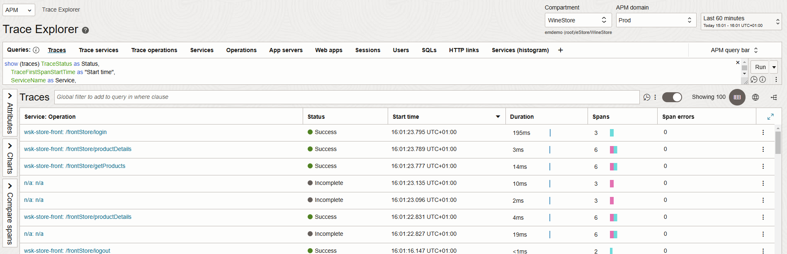

>**Trace Explorer Tour**
>
>If this is the first time you access the Trace Explorer, you might see a pop-up box inviting you on a quick tour of the UI. If you ever need to take the tour again, you can do so by clicking on the little question mark highlighted below:
>
>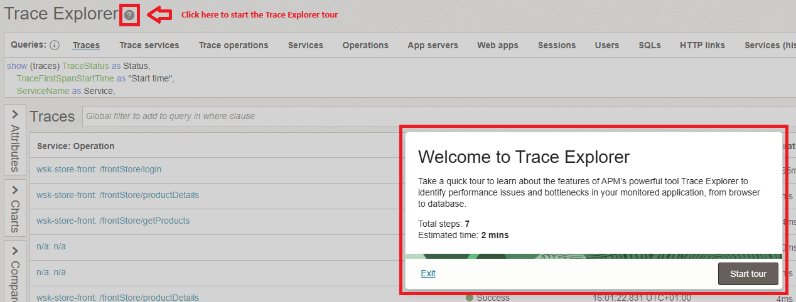

If you go straight to APM's Trace Explorer after logging into OCI, it usually lists traces collected in the last hour. The data is presented in a table highlighting vital information to understand performance: status (did the span/trace succeed or fail?), duration in milliseconds, and error counts. You can visualize this data in various ways, but you will often investigate how performance bottlenecks correlate with specific trace and span attributes.

The attributes associated with traces and spans provide more context and come in two shapes: **dimensions** and **metrics**. The former are text strings (such as the display name of the associated app server/container) while the latter are numbers (such as error counts or CPU time spent on a given span). Both can be used with query expressions and functions to display, aggregate, or compute attribute data.

Here is a short list of some attributes (click [here](https://docs.oracle.com/en-us/iaas/application-performance-monitoring/doc/trace-and-span-attributes.html) for a more complete list):

Dimensions:

- **OperationName**: The actual name of a trace or span, such as "Page Load /winestore/" representing a browser page load with that endpoint, or "ProductService.checkInventory" for a method executed in the backend. The entire trace uses the same OperationName as the root span that started it. So, if a longer trace starts out with a page load request span to /winestore, both the root span and the trace will be called "Page Load /winestore/".

- **ServiceName**: The name of the application service where an APM agent is collecting the queried traces and spans. Each service represents a different part of your application, such as frontend code running in clients and backend code running on servers/containers. Tracing is about exploring how these services talk to and depend on each other to fulfill tasks. While each span is only associated with a specific ServiceName, the trace is distributed across multiple clients and servers/containers. For traces, the official ServiceName is the same as for the root span.

- **TraceStatus**: The status of the trace's root span, which determines whether the entire trace is successful. For example, if the initial page load works, the entire trace is a success. The possible trace states are "Success", "Complete", "Incomplete", and "Error". Complete means that APM has the root span of the trace. Incomplete means no root span was collected, so the trace only consists of child spans. If we only have child spans, we don't know the root of it all or what overall purpose the trace serves. We only have underlings responding to the requests of "something". If a trace is complete, and the root span has a dimension indicating state (such as **HttpStatusCode**), TraceStatus will be more descriptive and use Success/Error rather than Complete/Incomplete.

- **DisplayName**: This is the name of the app server/container associated with a trace's root or child span.

- **ClientIpThreatAddress** and **ClientIpThreatType**: A suspicious IP address detected by Threat Intelligence, and its threat type, such as "Bruteforce" or "Phishing".

Metrics:

- **Trace-**/**SpanDuration**: This is the execution time in milliseconds of the trace's root span or a child span.

- **ErrorCount**: The number of errors caught for a single span or across all the spans of a trace (not just the root). If you look at single spans, ErrorCount will at most be 1. If you group spans by, e.g., the app server's DisplayName, the ErrorCount can be the sum of all spans.

- **ClientIpThreatConfidence**: A score from 0 to 100 of how confident the Threat Intelligence is that the IP address is malicious based on previously recorded activity in the threat indicator database.

The Trace Explorer has an **Attributes** submenu listing what's available to you. You can search attribute names and filter the results based on whether you are interested in dimensions or metrics for spans or traces:

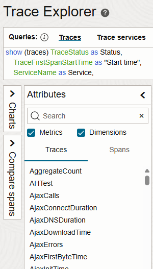

Let's have a closer look at the query field:

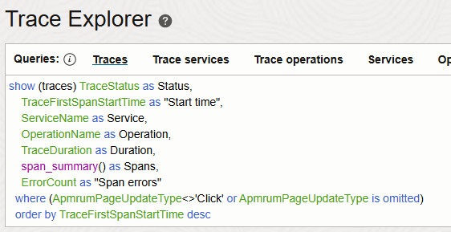

Here is a quick overview of the different components in the query field:

```md
SHOW <TRACES or SPANS>
<ATTRIBUTES to be displayed with traces/spans>
WHERE <ATTRIBUTES used to filter traces/spans>
GROUP BY <ATTRIBUTES used to group traces/spans>
HAVING <ATTRIBUTES used to filter trace/span groups>
ORDER BY <ATTRIBUTE to order traces/spans in ascending or descending order>
```

Most queries either start with "show traces" or "show spans" (if this isn't specified, Trace Explorer will show you traces by default). Everything coming after that determines how the traces or spans are presented (click [here](https://docs.oracle.com/en-us/iaas/application-performance-monitoring/doc/work-queries-trace-explorer.html) for more on this topic):

- **Displayed attributes**: Trace or span attributes displayed as columns in the result table. You can use "\*" to get a default set of attributes instead of naming specific ones. For example, write "show traces \*" rather than "show traces ServiceName, OperationName". You can also combine "\*" with other attributes not part of the default set: "show spans \*, DisplayName".

- **Grouping (GROUP BY)**: Whether traces or spans should be presented individually or grouped by selected attribute(s). For example, you can group traces and spans by DisplayName to see average duration and error count at this level: "show spans \* group by DisplayName".

- **Filtering (WHERE/HAVING)**: Where-clauses filter individual traces/spans and having-clauses filter grouped data: "show spans \* where SpanDuration > 4 group by DisplayName having DisplayName like 'alpha%'". This statement also uses **%** as a wildcard, so we only see groups with server/container names starting with "alpha".

- **Ordering (ORDER BY)**: Whether data is ordered in an ascending or descending fashion according to selected attribute(s). For example, "show traces \* order by TraceDuration desc". This will display the slowest traces at the top, while "asc" would do the opposite.

- **Functions**: You have multiple functions for returning aggregate attribute values rather than raw values. For example, "show traces ServiceName, OperationName, count(\*), avg(TraceDuration), count(SpanErrorCount) group by ServiceName, OperationName order by count(\*) desc". Besides **avg()**, there's also **max()**, **min()**, **sum()**, etc. The **count(\*)** statement computes the number of traces/spans per group. In this case, you get the number of traces returned for each ServiceName/OperationName-pair. Functions like these require you to group the traces/spans by some attribute to determine which values are aggregated.

- And so much more...

When you have written your query, click the **Run** button to the right of the query field and check the results.

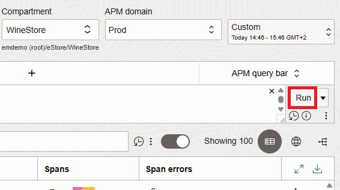

There are other ways of viewing trace data in the Trace Explorer. We have viewed it in a table format so far, but queried traces/spans can also be spread over a map to track geographic origin. This can help with analyzing performance by location or the location of a malicious client IP. Click on the **Globe** icon below the **Run** button to change the view:

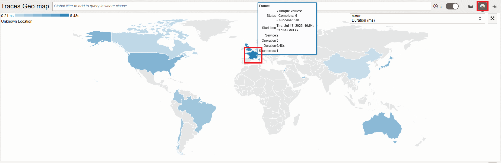

This is the query the geo map is based on:

```md
show (traces)
geoCountryCode,
unique_values(TraceStatus) as "Status",
min(TraceFirstSpanStartTime) as "Start time",
count_distinct(ServiceName) as "Service",
count_distinct(OperationName) as "Operation",
avg(TraceDuration) as "Duration",
sum(ErrorCount) as "Span errors"
where (ApmrumPageUpdateType<>'Click' or ApmrumPageUpdateType is omitted) and geoCountryCode is not omitted
group by geoCountryCode
```

You can also view the end-to-end topology of the traces and spans. For example, view the call topology from OperationName to OperationName and differentiate between calls with higher overall execution time or error counts. The topology could start with a page load operation, leading to an Ajax call operation, then a servlet operation, etc.:

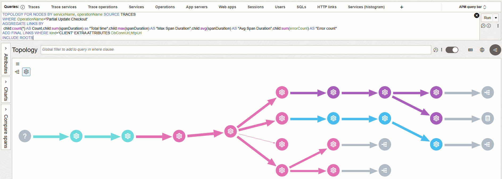

Here is an overview of the components of topology queries:

```md
TOPOLOGY FOR NODES BY <ATTRIBUTES to aggregate traces/spans by as nodes>
SOURCE <TRACES or SPANS>
WHERE <ATTRIBUTES used to filter traces/spans>
AGGREGATE LINKS BY <METRICS to be displayed for call links>
ADD FINAL LINKS <If specified, displays calls to external services not instrumented by APM agents, such as databases>
INCLUDE ROOTS <If specified, displays calls that represent the initial calls to root spans>
```

Topologies have their own dedicated query language. It consists of two main components: **nodes** and **call links**. The nodes are the colored circles aggregating spans or traces by a chosen attribute. The links are the arrows connecting the node circles based on how the spans in the aggregated groups call each other in traces. For example, the nodes could be spans grouped by OperationName or ServiceName, while the links would be the calls between different operations or services. In fact, that's how it's visualized by default, and how you might see it a lot of the time.

The thickness of the call links can then vary based on metrics such as avg(SpanDuration), max(SpanDuration), and sum(ErrorCount) for all the call links between nodes. Grey links are calls for external endpoints represented by grey nodes. These are external services not instrumented by APM agents. Because APM captures all outgoing calls from instrumented application services, we can track all external dependencies that might affect performance, even if these dependencies have no local agent watching them directly.

A bit more about the syntax of topology queries:

- **TOPOLOGY FOR NODES BY:** This is how a topology query starts, followed by one or more attribute names to create the colored node circles. Usually, the nodes are grouped by either ServiceName, OperationName, or both. The point is to decide which kinds of nodes you want to see calls to and from.

- **SOURCE TRACES**/**SPANS**: Do you want the aggregation of nodes and their calls to be based on queried traces or spans? It is like "show traces/spans..." in other trace queries.

- **AGGREGATE LINKS BY**: What metrics are you interested in getting from the call links between nodes? For example, you can compute avg() or max() SpanDuration for all the calls between two nodes. You can also differentiate between parent and child metrics. For example, "AGGREGATE LINKS by child:sum(SpanDuration)" returns the sum of SpanDuration datapoints for a child node's aggregated spans at the receiving end of a call link - meaning the node the arrow points to. "AGGREGATE LINKS by parent:sum(SpanDuration)" does the opposite. It's the sum of datapoints from the parent node - meaning the node the arrow points from. By default, the topology query aggregates links by the metrics of the child spans. This is based on the logic that you are interested in the performance of child spans as they affect all operations preceding them.

- **ADD FINAL LINKS**: Adds the grey links and nodes to the topology view to display external calls and the endpoints receiving them.

- **INCLUDE ROOTS**: Shows links representing calls to the initial root span. That is why there's a grey node with a question mark at the beginning of a lot of topologies. It represents whatever initial action led to the root span. For example, a user click that leads to a page update.

That's it for how to use queries in the Trace Explorer. Covering every part of the query language is too extensive for this article. For now, just remember that **a query will display either traces or spans in a particular way based on attributes. Use this to find performance bottlenecks and any relevant context attributes surrounding them.**

Two more tips:

1. Right under the **Run** button, click on the info symbol to get a helpful overview of the query language syntax and functions with or without examples:

   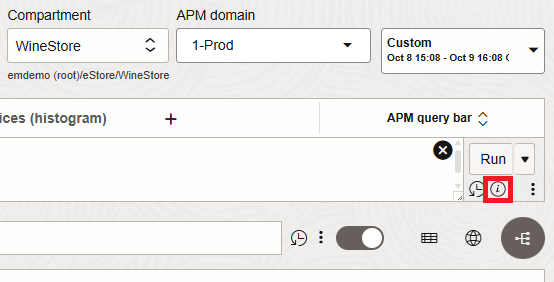

2. If the geo map and topology queries seem overwhelming, there's a shortcut:

   a. Do a normal table query and make sure it returns your desired traces/spans and attributes.

   b. Now simply click on the Geo Map- or Topology-button highlighted in the red box below. The view and query will change, but inherit the filters from the previous query.

   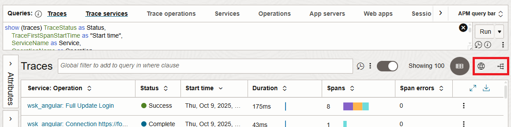

It's possible to save your queries to be reused later from the options-submenu:

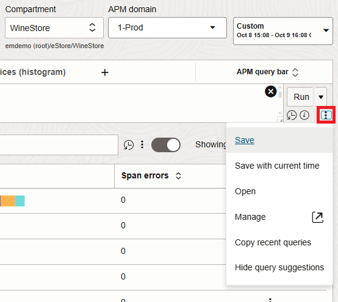

Above the query field, you also have the **query bar**. It contains shortcuts to saved queries. You can add your own queries to the default bar or even create different query bars for different situations:

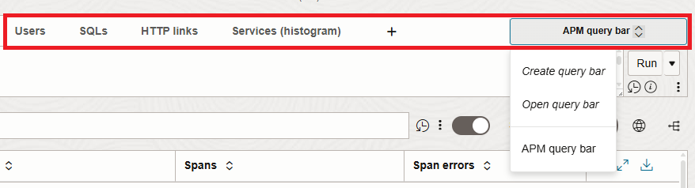

In relation to premade queries, the **global filter** can be a helpful tool. It's like a where-filter separated from the main query field. Reuse generic queries while using the global filter with criteria fitting only specific scenarios without overwriting the saved query. The global filter can also be used when exploring with different queries that all need to be filtered the same way. Instead of writing the same where-clause in every query, just write it once in the global filter, so it's applied no matter what. You can even flip a switch to enable and disable the global filter criteria as needed.

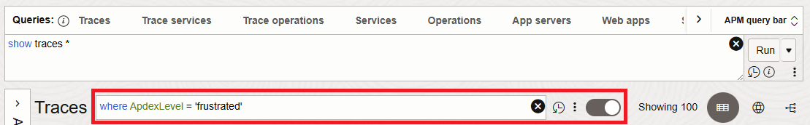

With the right query in place, the next step is examining the trace and span details to understand the context behind the results.

## Drill Down to Trace and Span Details to Locate Bottlenecks and their Context

After you've queried either traces or spans according to your needs, you will likely want to see more details about the resulting data to understand the context of performance bottlenecks. As you might have guessed, you can see details at the trace and span level. Either click on the OperationName of one of the traces or spans returned by a query - or click on the three dots to the right of the result to ask for more details that way:

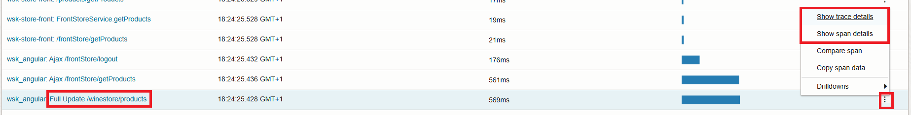

Let's start with the **Trace details** page and work towards the **Span details** page. Below are the details of a trace initiated by a full page update with the endpoint /winestore/cart:

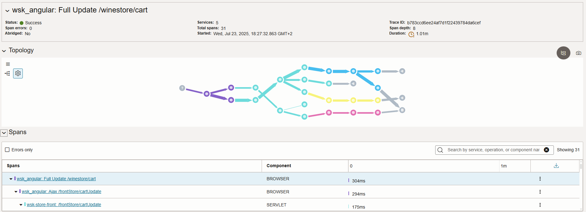

We can see the trace's spans in a topology and list view. The topology shows the span nodes and the call links between them. The nodes are colored according to the ServiceName capturing the span. This way, you can differentiate between the different services in the distributed app environment that the trace travels through. The width of the call links can be set in the diagram controls. By default, it's based on the total execution time of calls, but this can be changed to, e.g., call count and error count:

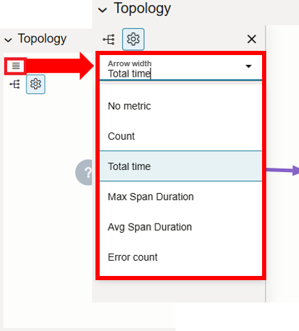

For now, we will stick with the default setting of arrow width defined by the total call execution time - meaning the time measured from the moment a call starts until it receives a response:

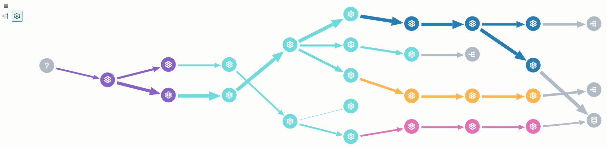

The thick arrows lead us to the child span that slows everything else down. When it comes to traces, a slow span or a span with errors may not be to blame for its own degradation. A parent span will be affected by subsequent child spans following it in the same trace. If a later span is slow, its predecessors or parents will also be slow because they must wait for all the children to finish their homework. The same applies if a span has an error. It might be caused by a later span in the trace encountering an error, leading to an error status code for the parent span.

For time-related bottlenecks in traces, we want to follow the thick arrows until we find the last child span that slows everything else down. If we come across a span node making calls to multiple subsequent nodes in the trace, follow the thickest call link:

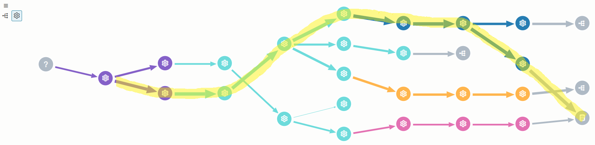

In this example, the child span causing the bottleneck is an external call to a database at the end. It takes up most of the trace's execution time. Hover over critical calls like this one with the mouse to see more details:

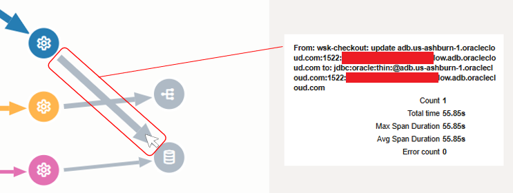

Trace details also present the spans in a list format. The list is divided into collapsible sections for each parent span with one or more child spans. Clicking on a listed span shows its attributes:

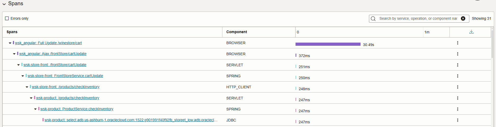

Like before, we want to find the slowest child. As shown below, collapse different sections of the list as appropriate until you find the problem child. Start with the root span at the top, which in this case is "Full Update /winestore/cart". Continue to the second span on the list, which is the first child of the root. This second span is itself a parent with its own child spans. Is the second span on the list particularly slow? If not, collapse that section of the list and continue with the next child. Continue like this until you find a slow child under the root span. Then look at the spans of this section until you find the last slow child. Again, it's the database call we also encountered in the topology view. Click on the name of the span to see its attribute values:

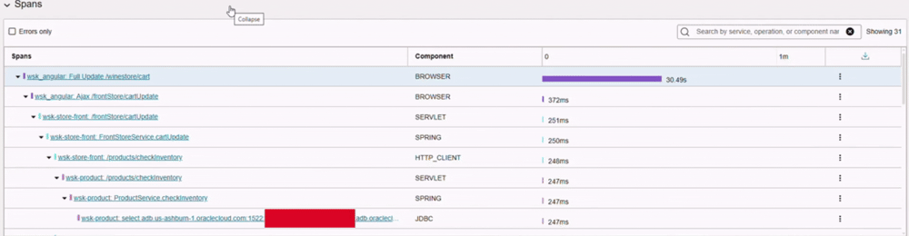

Since it's a call for an Oracle database, relevant context attributes could be **DbOracleSqlId** or **DbStatement** to investigate further.

At other times, you might drill down to trace/span details to investigate errors rather than slowdowns. In the trace details page, the thickness of the call links between span nodes in the topology view can be made to reflect error counts instead of call execution time. This lets you see when errors occurred in the trace. Again, you might be interested in finding the last child span with an error because it can affect everything preceding it.

In the list view, any span with an error will be highlighted with a red square containing an exclamation point. This means that one or more error-related values are present in the span's attributes, e.g., an error message or a status code. Some spans will have white squares with exclamation points. This means the span is the parent of one or more child spans with errors. The parent span itself does not have an error:

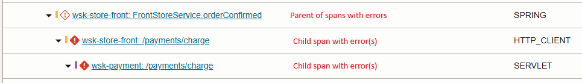

Whatever information is available at the time of the error will be collected by the APM agent. This includes status codes and messages among the span attributes. It even includes entire error stacks. Expand the **Logs** section in the span details to see the error stack if available:

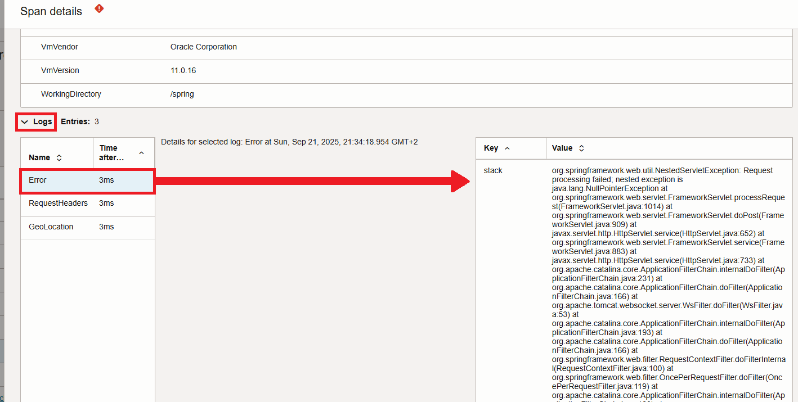

## Continue Exploration of Traces and Spans based on Contextual Attribute Values

After drilling down to trace details and then to span details, you can continue exploring either within APM or elsewhere. This is where **custom drilldowns** come in. These are buttons with built-in URLs in the span details page. The URLs dynamically update themselves according to the attribute values of the span in question.

If we go back to the slow database call found previously, it would be good to create a drilldown with a hyperlink leading to information about the specific DbOracleSqlId value in Performance Hub. Below is an example of an out-of-the-box drilldown configuration for Performance Hub in OCI Database Management:

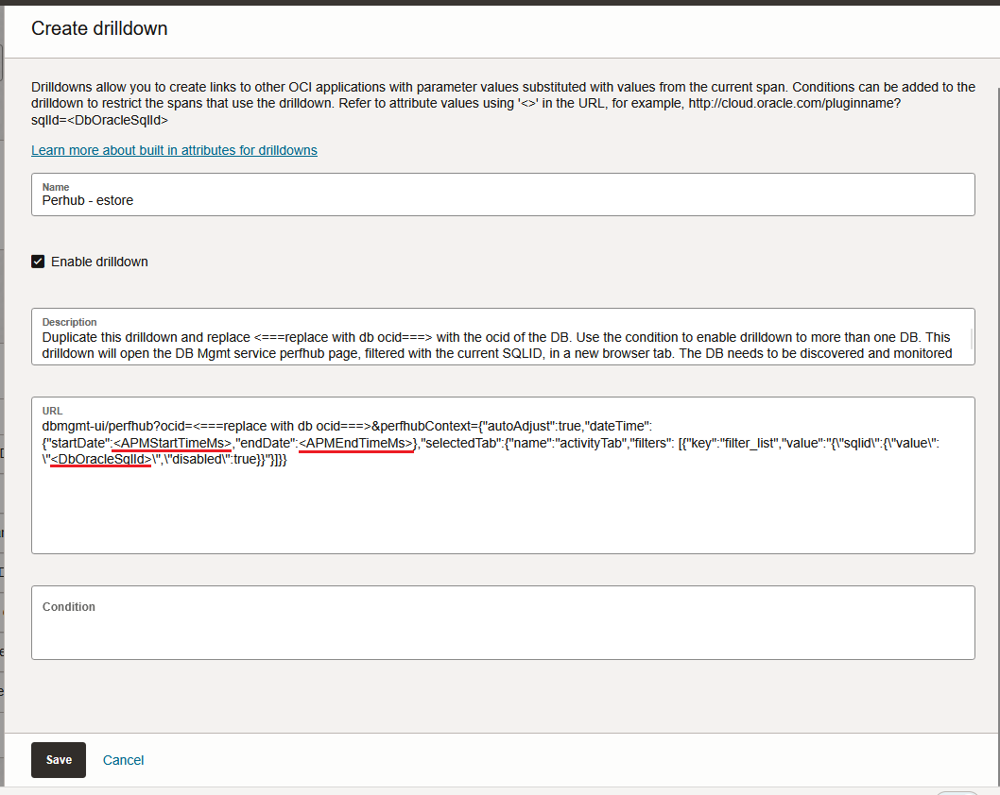

Anything with <>'s is a placeholder replaced by actual span attribute values. In this case, the drilldown URL takes the values of **APMStartTimeMs**, **APMEndTimeMs**, and **DbOracleSqlId**, so it leads to information about that specific query in that period in Performance Hub. When the configuration is complete and enabled, it will show up as part of span details when the relevant attributes have values:

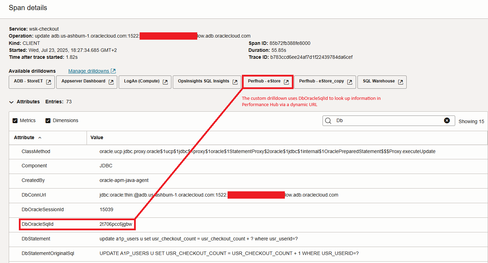

There are other drilldown configurations out-of-the-box like this one, but you can also create your own from scratch based on a URL template with <>-placeholders like the one for Performance Hub. As long as the URL works with the dynamically inserted attribute values, you can create a drilldown to anywhere for any purpose (click [here](https://docs.oracle.com/en-us/iaas/application-performance-monitoring/doc/configure-drilldown-configurations.html) for more).

There is also more you can do within APM itself. On the span details page, you will see little plus signs next to attribute names and values. By clicking on one or more of these plusses, a Trace Explorer query will be prepared for you like below:

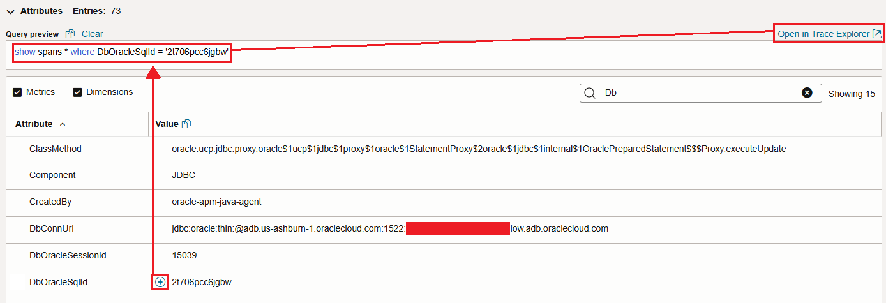

By clicking on **Open In Trace Explorer**, APM will present the query results in Trace Explorer in a separate browser tab. Now you are investigating not just a single database call executed at a particular point in time, but all database calls with the same DbOracleSqlId attribute value over a longer period to check for general performance patterns:

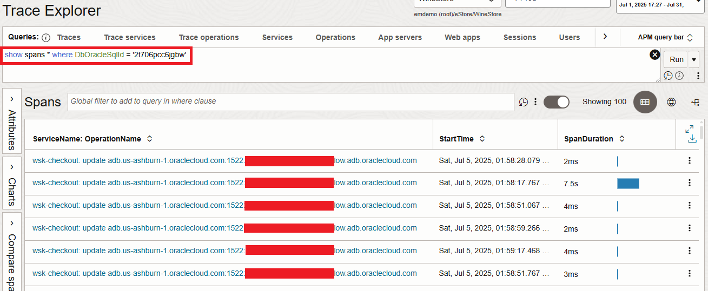

For example, it could be good to know if the database call slowdown just happened once, is intermittent, or constant. In this case, you can create a **histogram** to divide spans into different execution time intervals like below. Here it seems the database call occasionally runs slowly, but not constantly, so it's an intermittent issue:

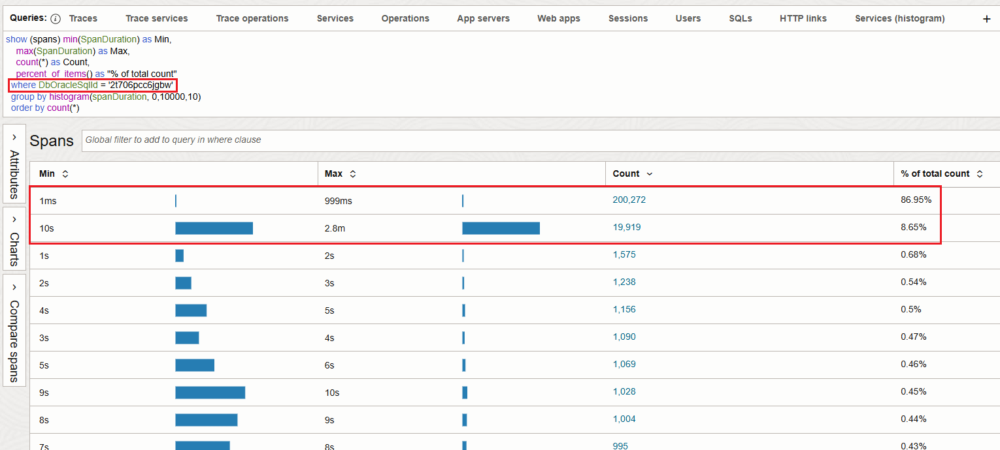

Topology queries are also useful here. You can use them to aggregate traces like the one we previously looked at ("Full Update /winestore/cart"). You can interact with this topology view exactly like before by adjusting the arrow width to reflect either call duration or error counts. However, you are no longer looking at data from a single trace. You are looking at data from multiple traces layered on top of each other. Use this to check for things like the average or max duration of span calls such as the database call:

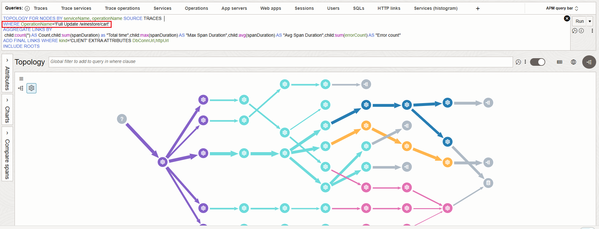

It's also possible to perform **span comparisons** where you select one or more spans and compare their attribute values side by side. For example, if you have a span with an intermittent performance issue, you could select one or more poorly performing spans as well as one or more well-performing spans of the same type. Then compare their attribute values side by side. This lets you determine which contextual attribute correlates to the bottleneck. You can add a span to a comparison by clicking **Compare span** in the span details page - or by clicking **Compare span** in the action menu on the Trace Explorer with a list of spans (**NOTE**: It must be a list of individual spans. This will not work with grouped results since each line would represent multiple spans):

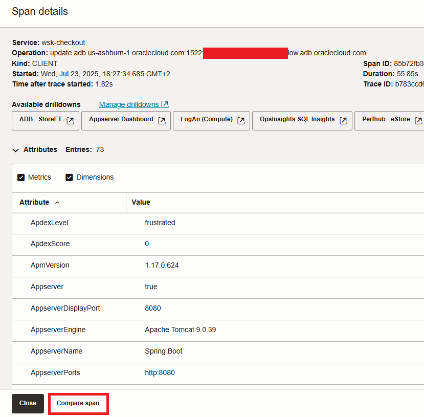

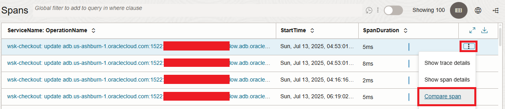

Now click **Compare** in the Trace Explorer's **Compare spans** submenu to get the attribute values side by side:

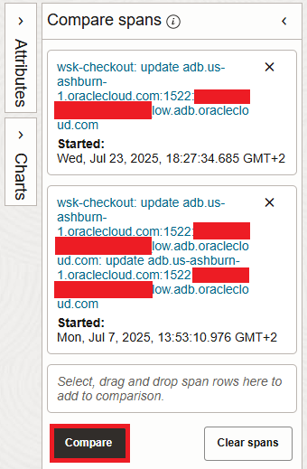

Whenever the selected spans have different values for the same attribute, it will be highlighted with yellow. If a value is completely missing for the same attribute in one span while being present in the other, it will be highlighted with red:

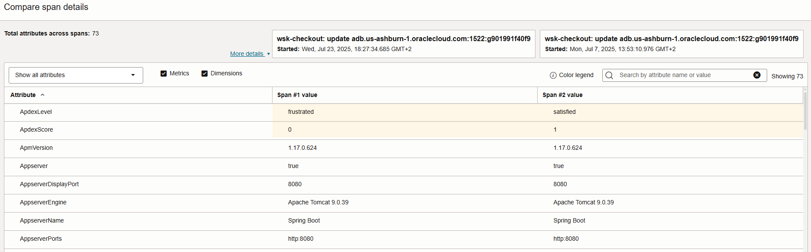

Lastly, one more query is worth sharing. After drilling down into trace and span details to understand the context, we now know that there could be performance issues related to a specific DbOracleSqlId. Are there other traces that include the same database call span? Often when you query traces, you are exploring based on the attributes of the root span. But it's also possible to query traces based on the attributes of the child spans or vice versa using "from spans" or "from traces" clauses. For example, the query below returns all traces which contain spans with a specific DbOracleSqlId. It's required to specify the number of resulting rows to return. The "\*" at the end just means you want to see the default set of attributes for the resulting traces. It's essentially just a normal query with an extra section between "show traces" and the attributes you want to display in the result table:

```md
show traces from spans where DbOracleSqlId='XXXXXXX' first 100 rows *
```

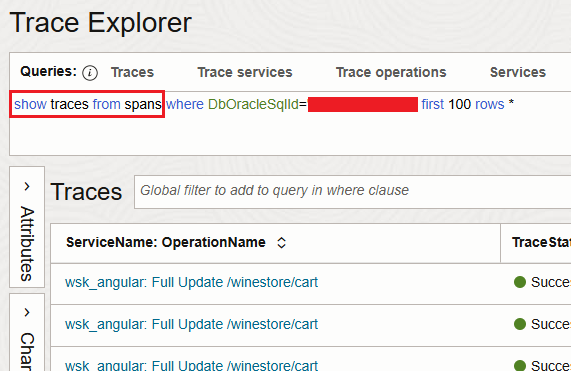

## Enhance Trace Exploration with APM configurations

OCI APM captures a lot of metrics and dimensions along with the traces of your application - especially from Oracle applications such as E-Business Suite, SOA, Visual Builder Studio Apps, PeopleSoft, etc. But there are also several ways to customize the trace collection to enrich your exploration with more context attributes, e.g., for custom applications. The key question to consider is "in relation to which context do we need to see the slowdowns, errors, and threats"?

There are two areas to configure: the APM domain as a data store, and the APM agents as data sources. These configurations involve creating custom attributes, sampling trace data according to your preferences, or configuring different agent components or span groups.

For more about how to configure your APM experience on the agent side, click [here](https://docs.oracle.com/en-us/iaas/application-performance-monitoring/doc/configure-application-performance-monitoring-data-sources.html).

For more about how to configure the APM domain receiving trace data, click [here](https://docs.oracle.com/en-us/iaas/application-performance-monitoring/doc/configure-apm-domain.html).

## Summary

In this blog, we have covered some of the most essential parts of OCI APM:

- How to query traces or spans and visualize the results in the Trace Explorer.

- How to drill down to trace and span details to locate performance bottlenecks and extrapolate relevant context from span attributes.

- How to continue exploration based on the extrapolated context values for performance bottlenecks. Bottlenecks can be investigated further either outside of APM with dynamic custom drilldowns or inside APM with the Trace Explorer.

- How to enhance trace exploration by configuring APM either at the agent or domain level.

# License

Copyright (c) 2026 Oracle and/or its affiliates.

Licensed under the Universal Permissive License (UPL), Version 1.0.

See [LICENSE](https://github.com/oracle-devrel/technology-engineering/blob/main/LICENSE.txt) for more details.