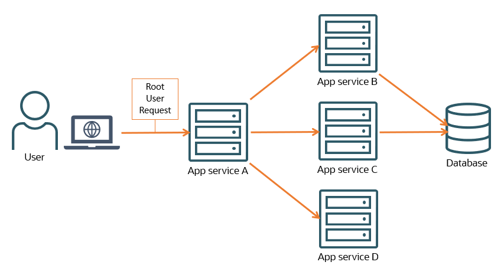
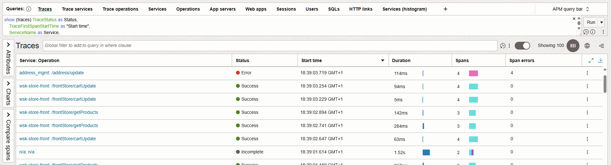

# What does OCI Application Performance Monitoring (APM) do?

On a day-to-day basis, you want to keep your IT estate and critical applications running smoothly. For this, you want to be aware of two kinds of performance bottlenecks: Slowdowns and errors. When are tasks too slow or not completed successfully? You also want contextual information about these bottlenecks to correlate them to potential root causes. For example, it would be beneficial to know the function name that triggers an error, or the geographical location when users experience network-related issues with the application.

Today, IT observability is made up of three types of telemetry, which all show the state of applications in different ways:

- **Logs**: Discrete text events of different severity levels helpful for troubleshooting.

- **Metrics**: Shows the health and performance of underlying infrastructure and applications in numbers aggregated as different types of statistics. These are easy to gauge over time, such as error rate, resource usage, and throughput.

- **Traces**: Hierarchical records of execution showing how operations call each other, captured either within a single process (stack trace) or across distributed systems of servers/containers (distributed trace). Each level records what operation ran, how long it took, and its relationship to parent and child operations. This structure helps understand execution flow for troubleshooting and identify bottlenecks.

OCI's Observability & Management platform provides tools for all telemetry, but I want to focus on the distributed traces. OCI APM collects frontend-to-backend traces. This helps you spot performance bottlenecks in a distributed application environment running as servers or containers:

If a user clicks on a button in a browser, this creates a request to a service that runs some methods or maybe sends additional requests to more services, such as other servers/containers or databases. All of this is related to the user clicking on a button in a browser as a root request. If you want to know why the user had to wait 30 seconds for the work to finish, or why the user received an error after pressing the button, capturing the resulting trace of operations across application services is helpful to locate the origin of the problem. Maybe it was caused by a faulty method execution in one container. Maybe it was a slow piece of code in a second container. In OCI APM, you can explore distributed traces to discover the root causes of performance bottlenecks in your application as they unfold during a request's journey - from its initial steps in a browser to traversing the backend services. The main tool for this is called the **Trace Explorer** shown below:

Some basic APM terminology that we are going to stick to from now on:

- The servers/containers of distributed environments are referred to as **services**.

- A sequence of operations is called a **trace**.

- Individual operations in a trace are called **spans**. A trace starts with a **root span**, which can be the parent of several **child spans**.

- Enabling APM trace collection on an application is called **instrumentation** or **to instrument**.

We will first have a look at [how to discover performance bottlenecks in APM](./discover-application-bottlenecks.md) before investigating the relevant traces for more details in the Trace Explorer.

# License

Copyright (c) 2025 Oracle and/or its affiliates.

Licensed under the Universal Permissive License (UPL), Version 1.0.

See [LICENSE](https://github.com/oracle-devrel/technology-engineering/blob/main/LICENSE) for more details.