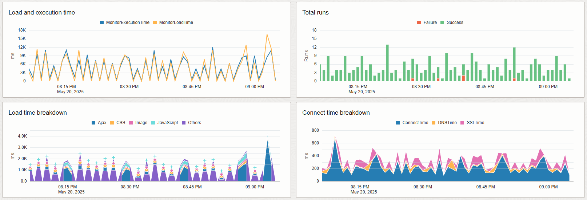

# **[OCI Landing Zone Application Performance Monitoring Service](#)**
## **Design Decisions During Setup of OCI Application Performance Monitoring**
&nbsp; 

To setup and configure OCI Application Performance Monitoring (OCI APM), you will need to make some key design decisions:

* **Domains**. Create one APM domain per application to segregate trace data. As an optional extension, configure APM domain(s) to adjust trace data and metrics for analysis and alerting purposes.

* **Data sources**. Determine whether APM agent data sources cover all programming languages and application servers/frameworks used by environment to be monitored. Select appropriate additional 3rd party tracers from the OpenTelemetry community as alternative data sources where needed. As an optional extension, configure data sources to cover requirements unique to the monitored application.

* **Availability Monitors**. Determine test cases, execution intervals, and whether to use vantage points provided by Oracle or privately managed vantage points to execute monitors. 

* **Alarms**. Determine performance indicators of application(s) and define appropriate alarms for these in accordance to available metrics and dimensions.
&nbsp; 

### Domains

Domains contain all trace data explored in APM. It's recommended to create one APM domain per application to segregate trace data. This means that traces from one applications are not mixed with the traces of another application when analyzing performance bottlenecks and their root causes.

To test APM with applications and estimate hourly cost, it's recommended to start out with a free domain before a paid domain. A free domain limits hourly span ingestions and availability monitor executions to 1,000 and 10 respectively. However, a free domain also lets you test out all APM features and estimate cost in paid domains by calculating hourly average of ingested and rejected spans with the following query in OCI Monitoring for the oci_apm namespace:

INSERT QUERY HERE

Optionally, an APM domain can be configured to adjust the trace data and metrics produced by the monitored application services (click [here](https://docs.oracle.com/en-us/iaas/application-performance-monitoring/doc/configure-apm-domain.html) for more). Below are some import configuration to have in mind:

* **Apdex thresholds (click [here](https://docs.oracle.com/en-us/iaas/application-performance-monitoring/doc/configure-apdex-thresholds.html) for more)**. Apdex scores categorize spans as "satisfying", "tolerating", or "frustrating" based on execution time. Apdex is good for analysis and alerting of span execution time. For example, there's a difference between the average execution time of ajax spans and servlet spans. Apdex thresholds allow you to set different execution time thresholds for different span types. It's then possible to query or trigger alerts in a straight-forward way based on spans categorized as "frustrating" rather than basing it on changing execution time thresholds. APM does set several Apdex thresholds by default, but it's important to confirm whether these default values should be changed.
* **Enrichment rules [click [here](https://docs.oracle.com/en-us/iaas/application-performance-monitoring/doc/configure-span-rules.html) for more]**. Span enrichment rules allows the creation or modification of ingested spans and their attributes based on their pre-existing attributes set by instrumentation with agents or tracers. It's possible to create completely custom enrichment rules, but APM does provide several pre-made rules. It's recommmended to use these when applicable:
  * **E-Business, JD Edwards, and Fusion Suite templates**. These enrichment rules add additional attributes to spans from these application environments for more meaningful context in relation to alerting and analysis.
  * **Client IP address attribute**. Adds the client IP address to a span as an attribute named ClientIP. Be aware to follow all privacy standards that apply to your scenario.
  * **OpenTelemetry to APM naming conventions**. If 3rd party tracers from the OpenTelemetry community is used to instrument applications, the attribute names defined by OpenTelemetry semantic conventions (click [here](https://opentelemetry.io/docs/concepts/semantic-conventions/) for more) can be converted to an APM naming scheme. This way the attributes from APM agents and 3rd party tracers will follow similar naming conventions.
* **Metric groups and anomaly detection (click [here](https://docs.oracle.com/en-us/iaas/application-performance-monitoring/doc/configure-metric-groups.html) for more)**. APM provides several metrics about span performance (click [here](https://docs.oracle.com/en-us/iaas/application-performance-monitoring/doc/application-performance-monitoring-metrics.html) for more). Metric groups apply custom filters based on span attribute values for specified metrics. It's also possible to enable anomaly detection for metric groups to allow for analysis and alerting of metrics with more than just fixed value thresholds.

If it's decided to move from a free to a paid APM domain, it's possible to export and import all domain configurations to facilitate the move (click [here](https://docs.oracle.com/en-us/iaas/application-performance-monitoring/doc/configure-apm-domain-export-import.html) for more).
&nbsp;

### Data sources

A data source is any component made to collect data from applications for the sake of monitoring. It's important to clarify the programming languages, application servers, and frameworks used by the application environment to determine what data sources can be used for the APM domain. OCI APM provides Java and .NET agents for back-end monitoring out-of-the-box. These back-end agents are also able to automatically inject the browser agent as JavaScript for front-end monitroring. Click [here](https://docs.oracle.com/en-us/iaas/application-performance-monitoring/doc/configure-application-performance-monitoring-data-sources.html) for more about the deployment and configuration of these out-of-the-box data sources. Click [here](https://mosemp.us.oracle.com/epmos/faces/DocumentDisplay?id=2759709.1) to see what kinds of application environments they support.

In cases where certain application services are not compatible with APM's own back-end data sources or cannot use the automatic injection of the browser agent JavaScript, the following options should be considered instead:

* **APM Java tracer**. When the APM Java agent is somehow not workable for the application environment, the APM Java tracer is available as well to collect trace data and JVM metrics. Click [here](https://docs.oracle.com/en-us/iaas/application-performance-monitoring/doc/configure-apm-tracer.html) for more about the APM Java tracer.
* **OpenTelemetry tracers**. For programming languages outside of Java and .NET, OCI APM is compatible with any tracer following the OpenTelemetry standard. A good starting point is to check the official OpenTelemetry website (click [here](https://opentelemetry.io/) for more) for available stable tracers developed by the community. These tracers would need to export the data using the endpoint and private key of the APM domain (click [here](https://docs.oracle.com/en-us/iaas/application-performance-monitoring/doc/configure-open-source-tracing-systems.html) for more).
* **Manual injection of browser agent JavaScript**. Whenever automatic injection is not possible, the JavaScript can be manually added to web application pages for front-end monitoring. Make sure to find an appropriate and efficient way to add the JavaScript, so all necessary browser actions are captured (click [here](https://docs.oracle.com/en-us/iaas/application-performance-monitoring/doc/deploy-browser-agent-your-application.html) for more).

Any data source needs to be able to reach the APM domain endpoint via HTTPS (Port 443) using either the private or public key. See section 3 for more about the overall deployment scenario.

As an optional extension, data sources can be configured to personalize what and how application data is collected . Data sources like APM agents or OpenTelemetry tracers will instrument applications according to general requirements common to most scenarios. Data sources with default settings do not consider any requirements applying to specific applications such as correlating performance to specific business logic or adjusting the resource usage caused by data collection. While data sources are configured to be as useful and as efficient as possible for most situations, it's important to identify any unique requirments applying to the application and configure the data sources as needed.

Data source configurations either serve to modify collected data or the amount of resources consumed by the data collection process:

* **OCI APM back-end agents for Java and .NET applications**. There are many configurations that can be done for these agents. Please see [here](https://docs.oracle.com/en-us/iaas/application-performance-monitoring/doc/optional-configuration-tasks.html) for all configurations options available to the APM Java agent. Please see [here](https://docs.oracle.com/en-us/iaas/application-performance-monitoring/doc/perform-optional-configuration-tasks-dotnet-agent.html) for all configuration options available to the APM .NET agent. In this section, the following configuration options will be high-lighted:
  * **Java probe configurations**. The APM Java agent consists of probes instrumenting different application components to collect certain traces with certain context attributes. It's possible to modify or enable/disable agent probes in the config file ProbeConfig.acml. It's also possible to create a custom probe which instrument and monitor additional classes for application-specific details applying to unique requirments. For more about modifying agent probes, please see [here](https://docs.oracle.com/en-us/iaas/application-performance-monitoring/doc/modify-probe-settings.html).
  * **Custom Java application server metrics**. The APM Java agent collects server metrics such as CPU, heap usage, and garbage collection. It's also possible to define custom metrics extracted from MBeans. Please see [here](https://docs.oracle.com/en-us/iaas/application-performance-monitoring/doc/metrics-collection.htm) for more.
  * **Thread snapshots**. The APM Java agent is able to collect Java thread snapshots related to traces and spans for callstack visibility. This agent feature is disabled by default. Please see [here](https://docs.oracle.com/en-us/iaas/application-performance-monitoring/doc/configure-thread-snapshots-apm-agent.html) for more.
  * **Abridged traces**. This reduces the amount of spans captured for a trace according to certain settings. A good example is database call spans. Whenever an applications performs many database calls, traces can be abridged to only include database call spans which exceed e.g., 10 milliseconds. This way, only slow database calls are captured in traces which reduces noise and makes analysis easier. Please see [here](https://docs.oracle.com/en-us/iaas/application-performance-monitoring/doc/introduction-apm-java-agent.html#GUID-FF58739D-5C53-4192-8342-D4452AAFD78F__GUID-FB079806-D2A9-4768-94C5-26E8DFD4BB04) for more.
  * **Circuit breakers**. These are settings disabling the APM agent due to overhead caused by heap memory usage and garbage collection time. APM agents are generally configured to consume as few resources as possible, but does still come with default circuit breaker settings if necessary. These settings can also be adjusted if needed. Please see [here](https://docs.oracle.com/en-us/iaas/application-performance-monitoring/doc/introduction-apm-java-agent.html#GUID-FF58739D-5C53-4192-8342-D4452AAFD78F__GUID-3C8DBEF1-C47B-4C5C-99BF-4280703C4FA8) for more.
* **OCI APM browser agent for front-end monitoring**. The browser agent is written in JavaScript and can technically be rewritten as needed. However, this should be done carefully to avoid unexpected effects. It's adviced to follow guidelines for the browser agent in official OCI APM documentation (click [here](https://docs.oracle.com/en-us/iaas/application-performance-monitoring/doc/configure-browser-agent-real-user-monitoring.html) for more). In this section, the following configuration options will be high-lighted:
  * **Automatic injection settings**. The APM back-end agents can be configured to automatically inject the browser agent code into appropriate web application pages. This is recommended for most use cases to simplify setup. The injection can also be configured with different settings or be disabled to remove JavaScript previously injected. For more about this, please see [here](https://docs.oracle.com/en-us/iaas/application-performance-monitoring/doc/inject-apm-browser-agent-using-apm-java-agent.html) for APM Java agent, and [here](https://docs.oracle.com/en-us/iaas/application-performance-monitoring/doc/configure-apm-browser-agent-injection-using-apm-dotnet-agent.html) for the APM .NET agent.
  * **User name capture**. This part of the browser agent often needs to be customized because the user name is collected differently from application to application. Please see [here](https://docs.oracle.com/en-us/iaas/application-performance-monitoring/doc/configure-attributes-real-user-monitoring.html#GUID-B668189F-72E6-4585-803D-E73448B47A92__GUID-0EE1C333-A87A-4491-9BC1-E271A92E52BE) for more.
  * **Custom span attributes**. It's possible to add JavaScript which collects values saved as custom context attributes to browser spans using the udfAttributes property of the apmrum JavaScript object. Please see [here](https://docs.oracle.com/en-us/iaas/application-performance-monitoring/doc/configure-attributes-real-user-monitoring.html#GUID-B668189F-72E6-4585-803D-E73448B47A92__GUID-13D78B7F-81D0-4F5B-9F99-BF9BE2F57682) for more.
  * **Context propagation headers for Ajax calls**. End-to-end tracing in OpenTelemetry works by sharing trace context from span to span. This way the next span will know it's a continuation of a trace started by a root span. When Ajax calls are made from browsers to servers, trace context is propagated by adding it to requests as special headers. OCI APM browser and back-end agents already know how to propagate trace context to each other. For use cases involving 3rd party OpenTelemetry tracers, it's recommended to review the exact propagation headers they use. Ensure the APM browser agent uses the same propagation format during Ajax calls. Please see [here](https://docs.oracle.com/en-us/iaas/application-performance-monitoring/doc/configure-automatic-end-end-tracing-same-domain.html#GUID-37C5A79C-F02E-475F-8381-85E68F874701__GUID-71BF84E4-46DC-46F7-86EB-490E56EE721A) for more.
* **Sampling**. This is a trace collection technique to capture a fraction of the trace data based on sampling rules for the traces' root spans. If a rule applies to a root span, the entire trace is sampled. Everything else is ignored. When defining rules, sampled data should be seen as representatives for everything that isn't sampled. That way, data volume is reduced while still collecting meaningful traces. For more about sampling with the APM Java agent, please see [here](https://docs.oracle.com/en-us/iaas/application-performance-monitoring/doc/configure-apm-sampling-apm-agent.html) for more.
* **OpenTelemetry tracers**. Review any available documentation for any selected 3rd party tracer. As mentioned previously in section 2.1, you can set an enrichment rule in the APM domain to convert OpenTelemetry semantic conventions to OCI APM naming conventions. This is recommended when using a non-Oracle tracer.
&nbsp;

### Availability Monitors

OCI APM can be used in two ways:

* Reactively monitor the application by reacting to problems when they occur during real user sessions.
* Proactively monitor the application by creating an availability monitor which tests core features and user flows. The monitor can trigger a notification about critical issues without requiring them to occur in real user sessions first.

An availability monitor consists of two components:

* **Monitor**. The monitor itself is a synthetic test consisting of one to multiple steps to confirm application performance in different ways. Common examples are single page loads or Selenium-scripts performing full application sessions with synthetic users. Please see [here](https://docs.oracle.com/en-us/iaas/application-performance-monitoring/doc/create-monitor.html) for more about different monitor types.
* **Vantage points**. A vantage point is a server or container where the actual monitor runs at a given interval (from 5 to 120 minutes). There are two kinds of vantage points:
  * **Oracle-managed vantage points**. OCI APM provides vantage points in different regions which can be used by monitors belonging to any APM domain in any region. The vantage points are either internal or external. Internal vantage points run availability monitors from within the OCI region network. External vantage points run availability monitors from outside the OCI region network. The latter can be used to determine accessibility to the application from outside OCI networks. **NOTE**: When using external vantage points, a single monitor execution counts as three runs. This is important as APM cost changes for every unit of 10 monitor runs per hour.
  * **Customer-managed vantage points**. It's possible to deploy your own vantage points to execute the monitors. This can either be a dedicated vantage points which runs as a customer-managed Kubernetes cluster with an OCI VCN subnet (click [here](https://docs.oracle.com/en-us/iaas/application-performance-monitoring/doc/use-dedicated-vantage-points.html) for more). Or it can be an on-prem vantage point which runs as a container on a customer-owned host (click [here](https://docs.oracle.com/en-us/iaas/application-performance-monitoring/doc/use-onpremise-vantage-points.html) for more).

It's recommended to create availability monitors which regularly test key features and user flows. This is to continuously ensure that core tasks can be completed with the application with satisfying performance. When planning the availability monitoring for applications, there are three main topics:
* Which core features and user flows should be tested regularly and with which monitor type (e.g. a REST API call, a single page load or a Selenium-script)?
* Having planned all availability monitors, what run interval should they have? How many monitor runs will that result in per hour? Remember, availability monitoring pricing is not about the number of monitor definitions, but the number of times they run overall per hour. Also remember, that every run on an external vantage point managed by Oracle is multiplied by 3.
* Which vantage points should be used? This is mainly a matter of convenience vs. networking. When possible, it´s recommended to use Oracle-managed vantage points for the sake of convenience. However, no matter where the availability monitors run, the vantage point both needs to be able to reach the APM domain as well as the application itself. If it´s not feasible to connect to or resolve an application URL to an IP address from a Oracle-managed vantage point, a customer-managed vantage can work as an alternative.
&nbsp;

### Alarms

There are a lot of different metrics provided by OCI APM and a lot of different alarm definitions that can be made from them. Please see [here](https://docs.oracle.com/en-us/iaas/application-performance-monitoring/doc/application-performance-monitoring-metrics.html) for more about all available metrics in OCI APM. Please see [here](https://docs.oracle.com/en-us/iaas/Content/Monitoring/Tasks/managingalarms.htm) for more about creating alarm definitions in OCI.

For this section, the following topics will be high-lighted:

* **Availability monitor alarms**. The main purpose of availability monitoring is to proactively test critical application capabilities. Therefore, it´s highly recommended to create alarms for all running availability monitors using the metrics in the oracle_apm_synthetics namespace (click [here](https://docs.oracle.com/en-us/iaas/application-performance-monitoring/doc/application-performance-monitoring-metrics.html#GUID-A99D3A13-A7CC-4E18-A6AD-D73F30E57641) for more).
* **Apdex-based alarms**. As previously covered in section 2.1 about APM domains, Apdex thresholds can be used to trigger alarms about "frustrating" performance based on different execution time thresholds for different span groups. It´s much easier to create one alarm definition sending notifications whenever any span group becomes "frustrating" rather than creating several alarm definitions each definining execution time thresholds for a single span group. It´s recommended to take advantage of Apdex-thesholds for alerting whenever possible.
* **Custom metric alarms with anomaly detection**. It´s possible to create custom metrics from existing metric sources in APM namespaces. For these custom metrics, it´s also possible to enable anomaly detection which establishes a baseline to detect unusually high or low values. Custom metrics with anomaly detection activated will add an additional dimension to all data points. This metric dimension can have one of three values: 0 (data point is close to baseline), 1 (data point is above baseline), or -1 (data point is above baseline). This dimension can be used as an alternative to fixed threshold alerting. Please see [here](https://docs.oracle.com/en-us/iaas/application-performance-monitoring/doc/configure-custom-metric.html) for more about custom metrics.
&nbsp;

# License

Copyright (c) 2025 Oracle and/or its affiliates.

Licensed under the Universal Permissive License (UPL), Version 1.0.

See [LICENSE](/LICENSE.txt) for more details.