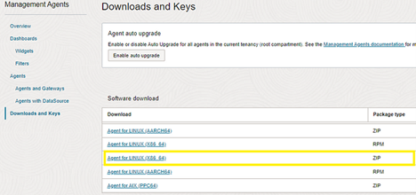
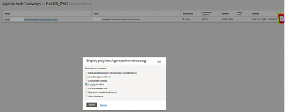
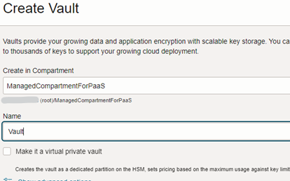
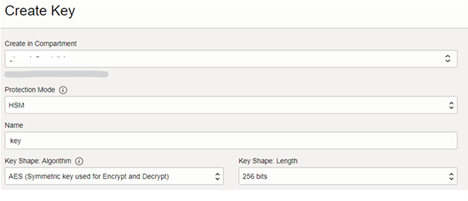
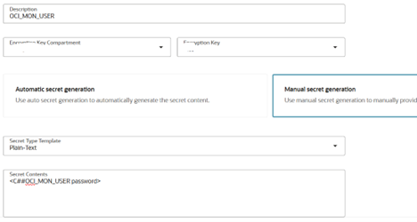
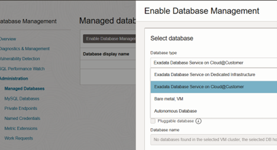
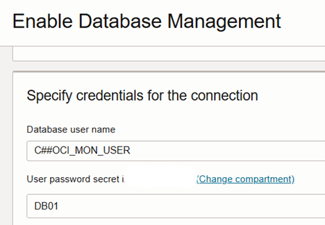

## **Database Management Enabling Steps for ExaCC**


<table>
<tbody>
<tr>
<th align="left">Steps</th>
<th align="left">Description</th>
<th align="left">Notes</th>
</tr>
<tr>

<td align="left">0</td>
<td align="left">
Please ensure you have the OCI Operating Entities Landing Zone deployed 
 
 [info here](https://github.com/oracle-devrel/technology-engineering/tree/main/landing-zones)

<td align="left"> 
 
</td>
</tr>
<tr>


<td align="left" >1</td>
<td align="left">

__Management Agent Installation__

On each VMCluster Node:


Download the agent from OCI Console Observability and Managment to each single box



On the box install the agent Doc ID [3015115.1](https://support.oracle.com/epmos/faces/DocumentDisplay?&id=3015115.1)

```
sudo mkdir -p /devext/oracle/mgmt_agent
cat<<EOF>/devext/oracle/mgmt_agent/input.rsp
managementAgentInstallKey = 'key you created above'
CredentialWalletPassword = 'YOUR_PASSWORD'
GatewayServerHost = <
GatewayServerPort = 4480
EOF
cd /devext/oracle/mgmt_agent
sudo ln -s /devext/oracle/mgmt_agent /opt/oracle/mgmt_agent
unzip oracle.mgmt_agent.<version>.Linux-x86_64.zip

sudo /bin/bash
export OPT_ORACLE_SYMLINK=true
./installer.sh ./input.rsp

usermod -a -G asmadmin mgmt_agent
usermod -a -G oinstall mgmt_agent
```
Now you can see the agent check-in Observability and Management →Management Agent. Click on the three dots and enable OpsInsight and Database management and Logging Analytics Plugin

 

</td>
<td align="left"> 


</td>
</tr>

<tr>
<td align="left" rowspan="2" >2</td>


<td align="left">

__Create the Monitor user__

Creeate a user on each CDB
Download grantPrivileges.sql MOS Doc ID [2857604.1](https://support.oracle.com/epmos/faces/DocumentDisplay?&id=2857604.1) and run on the Container Database.
```
sqlplus sys/<YOUR_PASSWORD>@(DESCRIPTION=(ADDRESS_LIST=(ADDRESS=(PROTOCOL=TCP)(HOST=<host>.<domain>)(PORT=1521)))(CONNECT_DATA=(SERVICE=<CDB Servicename>))) as sysdba @grantPrivileges.sql C##OCI_MON_USER <YOUR_PASSWORD> N Y N> grantPrivileges.log
sqlplus 
sys/<YOUR_PASSWORD>@(DESCRIPTION=(ADDRESS_LIST=(ADDRESS=(PROTOCOL=TCP)(HOST=<host>.<domain>)(PORT=1521)))(CONNECT_DATA=(SERVICE=<CDB Servicename>))) as sysdba @grantPrivileges.sql C##OCI_MON_USER <YOUR_PASSWORD> Y Y N> grantPrivileges.log
```
For each PDB/CDB
```
ALTER SESSION SET CONTAINER=pdb1;
GRANT CREATE PROCEDURE to C##OCI_MON_USER;
GRANT SELECT ANY DICTIONARY, SELECT_CATALOG_ROLE to C##OCI_MON_USER;
GRANT ALTER SYSTEM to C##OCI_MON_USER;
GRANT ADVISOR to C##OCI_MON_USER;
GRANT EXECUTE ON DBMS_WORKLOAD_REPOSITORY to C##OCI_MON_USER;
```
</td>  

</td>
</tr>

<tr>


</td>      
</tr>


<td align="left">3</td>
<td align="left">

Create a secret key for C##OCI_MON_USER password (No for Autonomous).
>Go to Identity&Security → Key Management →Secret Management




>Go to Identity&Security → Key Management & Secret Management → Create a key → Create a secret for C##OCI_MON_USER password.



</td>
<td align="left">


</td>
</tr>

<td align="left">4</td>
<td align="left">

__Enable Database Management__
>Go to Observability →Database Management →Administration → Managed databases.



Select the user secret key you have just created.



First you need to register CDB after that you repeat the steps for each PDB.
</td>
<td align="left">

</td>
</tr> 


<tr>

</td>
</tr> 
 
</tbody>
</table>


# License <!-- omit from toc -->

Copyright (c) 2025 Oracle and/or its affiliates.

Licensed under the Universal Permissive License (UPL), Version 1.0.

See [LICENSE](/LICENSE) for more details.
