## **Database Management Enabling Steps**


<table>
<tbody>
<tr>
<th align="left">Steps</th>
<th align="left">Description</th>
<th align="left">Notes</th>
</tr>
<tr>

<td align="left" >1</td>
<td align="left">
The database should be created in the appropriate project compartment at the database layer. Ensure that the 'Network Access' option is set to 'Private Endpoint Access Only.' Then, assign the database subnet and select the NSGs provisioned in the database compartment.

Example for Prod database: 

* **Compartment**-> cmp-landingzone-p:cmp-lzp-prod:cmp-lzp-p-projects:cmp-lzp-p-proj1:cmp-lzp-p-proj1-db
* **Network**-> vnc:vcn-fra-lzp-p-projects; subnet:ssn-fra-lzp-p-db
* **nsg**-> nsg-lzp-p-projects-mon-pe-db1
  

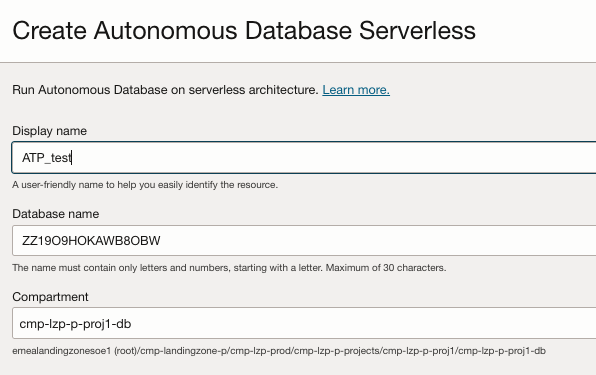  

&nbsp; 


&nbsp; 

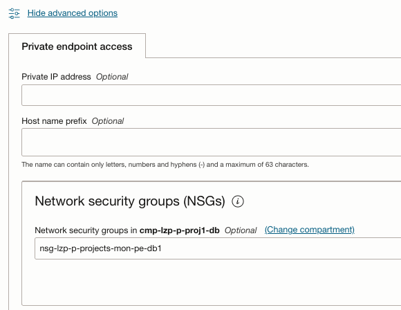

&nbsp; 

</td>
<td align="left"> 

If the database was created previously, ensure it is placed in the correct cmp, assigned to the proper subnet, and configured with the appropriate NSG.

All resources needed like compartments, subnets and Network Security Groups (NSGs) were previously provisioned by the LZ.
</td>
</tr>

<tr>
<td align="left" rowspan="2" >2</td>


<td align="left">
Create the DMA private endpoint. 

* In a **global approach**, DMA PEs will be placed in the monitoring subnet (sn-fra-lzp-hub-mon) in the hub vcn and should be assigned to the GLOBAL PE NSGs (nsg-fra-lzp-hub-global-mon-pe). Example: pe_lz_global_dma.

&nbsp; 
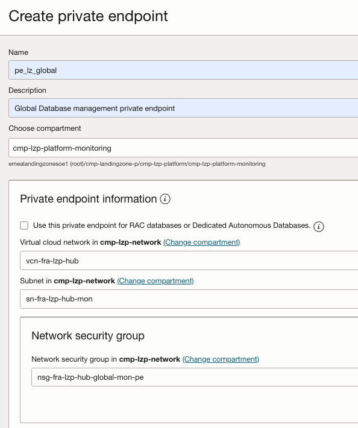
</td>


<td align="left" rowspan="2">      
All resources needed like Subnets, route tables (RT), Gateways (RT),security lists (SL), and Network Security Groups (NSGs) were previously provisioned by the LZ.

This operation can be easily automated with [Terraform](https://registry.terraform.io/providers/oracle/oci/latest/docs/resources/database_management_db_management_private_endpoint).
</td>
</tr>

<tr>

<td align="left">

* In a **local approach**, DMA PEs and the ATP PE will reside in the same database subnet (ssn-fra-lzp-p-db), and the nsg-lzp-p-projects-mon-pe-db1 NSGs will allow communication between them. Example: pe_lz_p_dma.

&nbsp; 
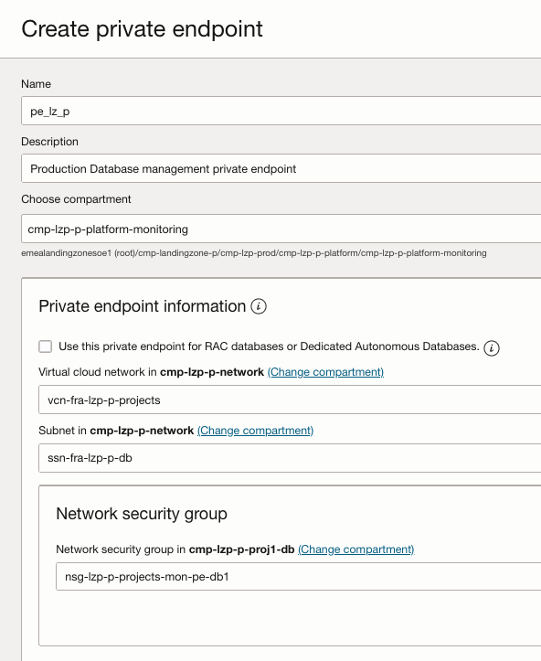
</td>      
</tr>


<td align="left">3</td>
<td align="left">
Unlock and change the password for adbsnmp.

```
ALTER USER adbsnmp ACCOUNT UNLOCK;
ALTER USER adbsnmp IDENTIFIED BY adbsnmp_password; 
grant SELECT ANY DICTIONARY to adbsnmp;
grant SELECT_CATALOG_ROLE to adbsnmp;
grant read on awr_pdb_snapshot to adbsnmp;
grant execute on dbms_workload_repository to adbsnmp;
```

</td>
<td align="left">

To connect to a database placed in a private subnet you can follow this [blog](https://blogs.oracle.com/datawarehousing/post/4-ways-to-connect-to-autonomous-database-on-a-private-network).
</td>
</tr>

<td align="left">4</td>
<td align="left">

Create a secret in the vlt-lzp-shared-mon-security vault located within the cmp-landingzone-p:cmp-lzp-security compartment.

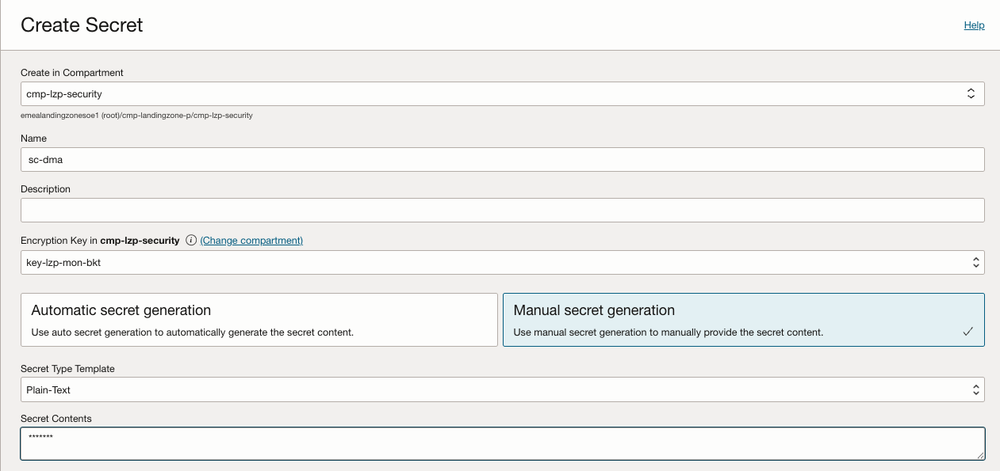

</td>
<td align="left">
All resources needed like the dedicated Vault and required policies was previously provisioned by the LZ.
</td>
</tr> 


<tr>
<td align="left" rowspan="2" >5</td>
<td align="left">

Enable [Database Management](https://docs.oracle.com/en-us/iaas/database-management/doc/enable-database-management-autonomous-databases.html).

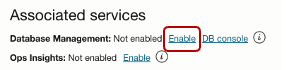</img>
&nbsp; 
</td>

<td align="left" rowspan="2">      
Remember to select the private DMA endpoint created in step2.

</td>
</tr>

<tr>
<td align="left">

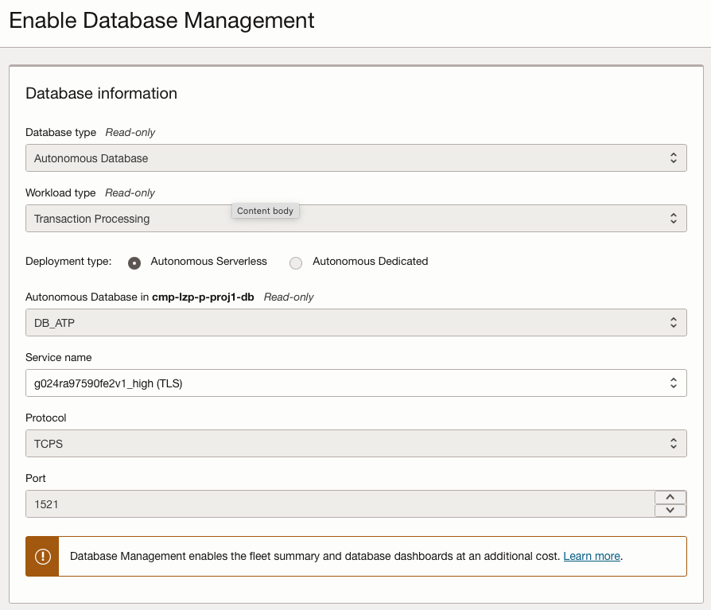</img> 
&nbsp; 

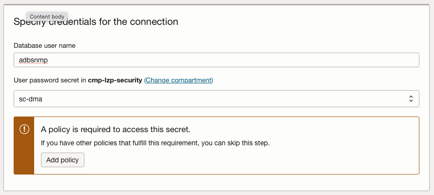</img>
&nbsp; 

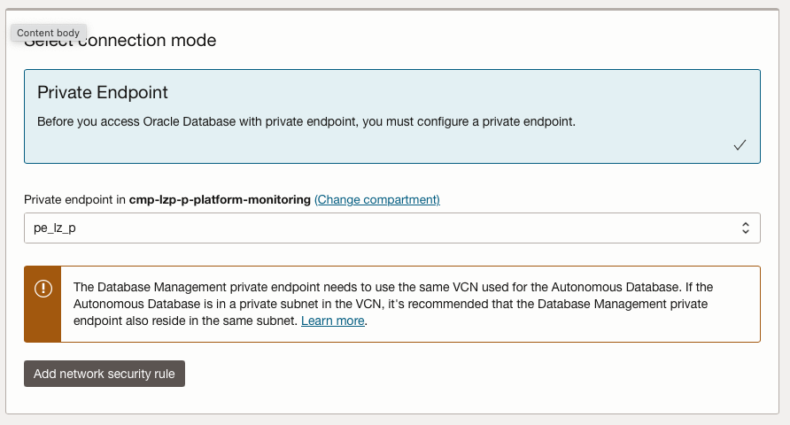</img>
&nbsp; 
</td>      
</tr>


<td align="left">6</td>
<td align="left">

Click the 'Enable Database Management' button. Then, go to the work request and check the progress.

&nbsp; 
</img>
&nbsp; 
&nbsp; 
&nbsp; 

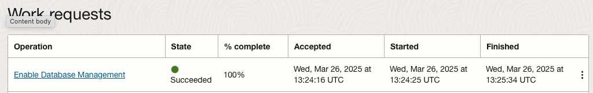</img>
&nbsp; 
&nbsp; 
&nbsp; 

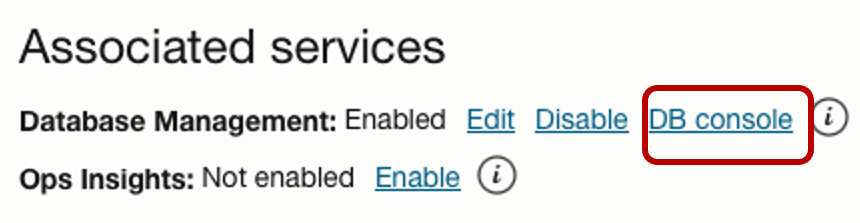 </img>
&nbsp; 
&nbsp; 
&nbsp; 

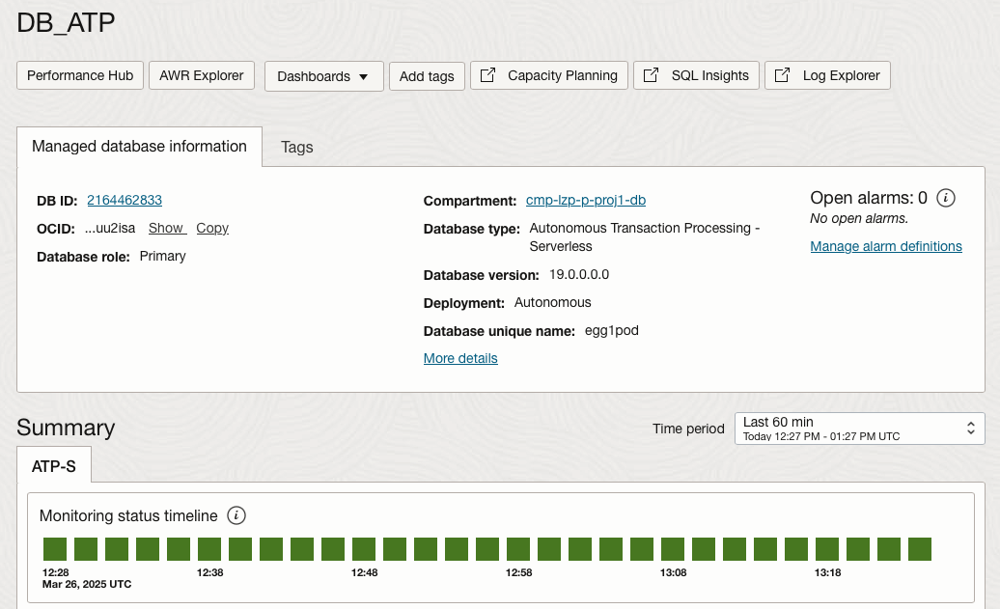 </img> 
&nbsp; 
&nbsp; 

</td>
<td align="left">
</td>
</tr> 
 
</tbody>
</table>


## **Operation Insights Enabling Steps**


<table>
<tbody>
<tr>
<th align="left">Steps</th>
<th align="left">Descriptón</th>
<th align="left">Notes</th>
</tr>
<tr>

<td align="left">1</td>
<td align="left">
The database should be created in the appropriate project compartment at the DB layer, using the DB subnet and assign the NSGs to the database. 

Example for Prod database: 

* **Compartment**-> cmp-landingzone-p:cmp-lzp-prod:cmp-lzp-p-projects:cmp-lzp-p-proj1:cmp-lzp-p-proj1-db
* **Network**-> vnc:vcn-fra-lzp-p-projects; subnet:ssn-fra-lzp-p-db
* **nsg**-> nsg-lzp-p-projects-mon-pe-db1
</td>
<td align="left"> 

If the database was created previously, ensure it is placed in the correct CMP, assigned to the proper subnet, and configured with the appropriate NSG.

All resources needed like compartments, subnets and Network Security Groups (NSGs) were previously provisioned by the LZ
</td>
</tr>
<tr>

<tr>
<td align="left" rowspan="2" >2</td>

<td align="left">
Create the OPSI private endpoint. 

* In a **global approach**, OPSI PEs will be placed in the monitoring subnet (sn-fra-lzp-hub-mon) in the hub and should be assigned to the PE NSGs (nsg-fra-lzp-hub-global-mon-pe). Example: pe_lz_global_opsi.

 </img>


</td>
<td align="left" rowspan="2">      
All resources needed like Subnets, route tables (RT), Gateways (RT),security lists (SL), and Network Security Groups (NSGs) were previously provisioned by the LZ.

This operation can be easily automated with [Terraform](https://registry.terraform.io/providers/oracle/oci/latest/docs/data-sources/opsi_operations_insights_private_endpoints).
</td>
</tr>


<tr>
<td align="left">

* In a **local approach**, OPSI PEs and the ATP PE will reside in the same database subnet (ssn-fra-lzp-p-db), and the nsg-lzp-p-projects-mon-pe-db1 NSGs will allow communication between them. Example: pe_lz_p_opsi.

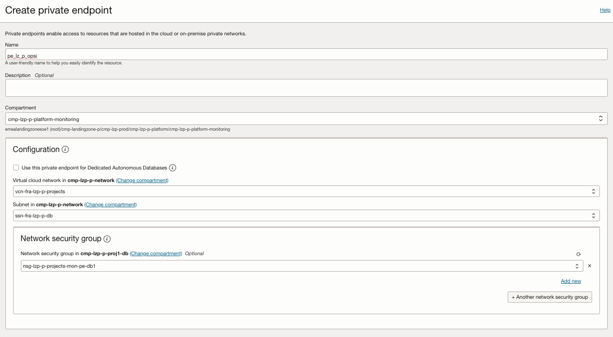 </img>

</td>      
</tr>

<td align="left">3</td>
<td align="left">
Unlock and change the password for adbsnmp.

**Note**: If you have already completed this step to enable Database Management, you can skip this step.

```
ALTER USER adbsnmp ACCOUNT UNLOCK;
ALTER USER adbsnmp IDENTIFIED BY adbsnmp_password; 
grant SELECT ANY DICTIONARY to adbsnmp;
grant SELECT_CATALOG_ROLE to adbsnmp;
grant read on awr_pdb_snapshot to adbsnmp;
grant execute on dbms_workload_repository to adbsnmp;
```

</td>
<td align="left">

To connect to a database placed in a private subnet you can follow this [blog](https://blogs.oracle.com/datawarehousing/post/4-ways-to-connect-to-autonomous-database-on-a-private-network)

</td>
</tr>

<td align="left">4</td>
<td align="left">
Create a secret in vlt-lzp-shared-mon-security vault that is place in cmp-landingzone-p:cmp-lzp-security compartment.

**Note**: If you have already completed this step to enable Database Management, you can skip this step.

</td>
<td align="left">
All resources needed like the dedicated Vault and required policies was previously provisioned by the LZ.
</td>
</tr> 


<tr>
<td align="left" rowspan="2" >5</td>
<td align="left">

Enable [Operation Insights](https://docs.oracle.com/en-us/iaas/autonomous-database/doc/enable-operations-insights-dedicated-autonomous-database.html).

</img>
&nbsp; 
</td>

<td align="left" rowspan="2">     

Remember to select the private OPSI endpoint created in Step 2. Choose the appropriate PE based on whether you're using a Global or Local approach.

</td>
</tr>

<tr>
<td align="left">
&nbsp; 
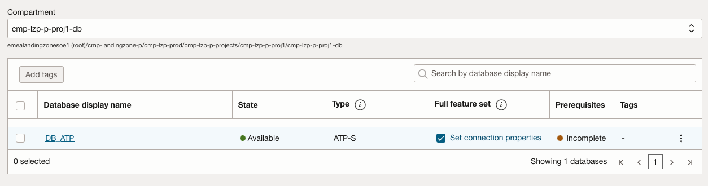</img> 
&nbsp; 
&nbsp; 
&nbsp; 

</img>
&nbsp; 
&nbsp; 
&nbsp; 

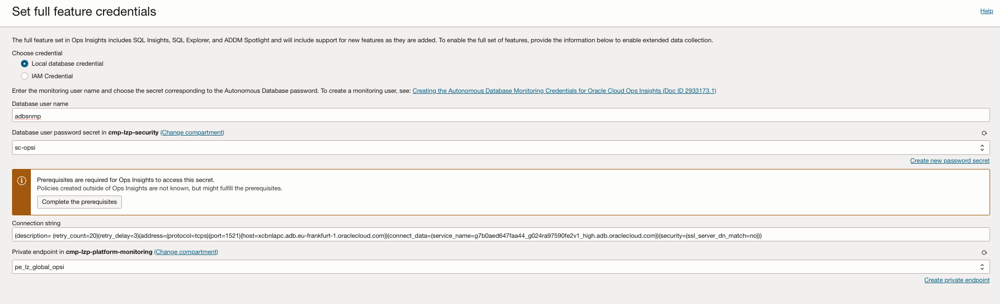</img>
&nbsp; 
&nbsp; 
&nbsp; 


</td>      
</tr>


<td align="left">6</td>
<td align="left">

Click the 'Add database' button. Then, go to the work request and check the progress.


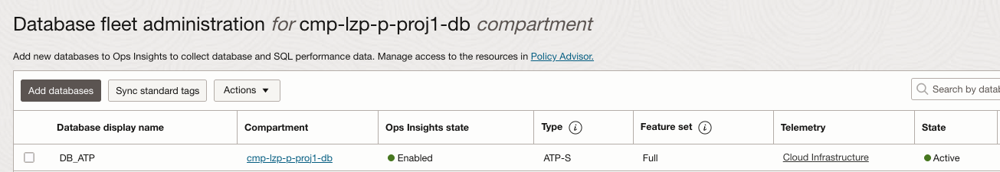</img>

</td>
<td align="left">
</td>
</tr> 
 
 
</tbody>
</table>


These diagrams illustrate the final result:


|  Approach  | Description | 
|:--:|---|
| Using Global PEs | | 
| Using Local PEs | | 


# License <!-- omit from toc -->

Copyright (c) 2025 Oracle and/or its affiliates.

Licensed under the Universal Permissive License (UPL), Version 1.0.

See [LICENSE](/LICENSE) for more details.


