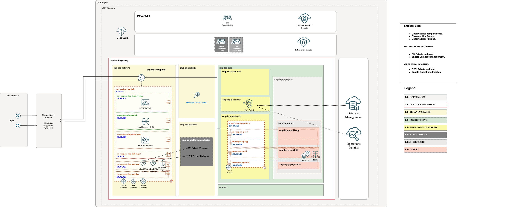
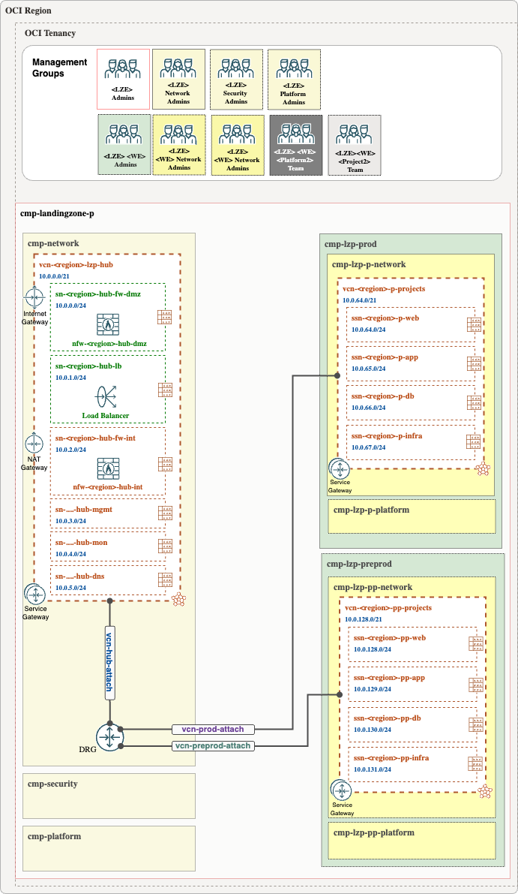
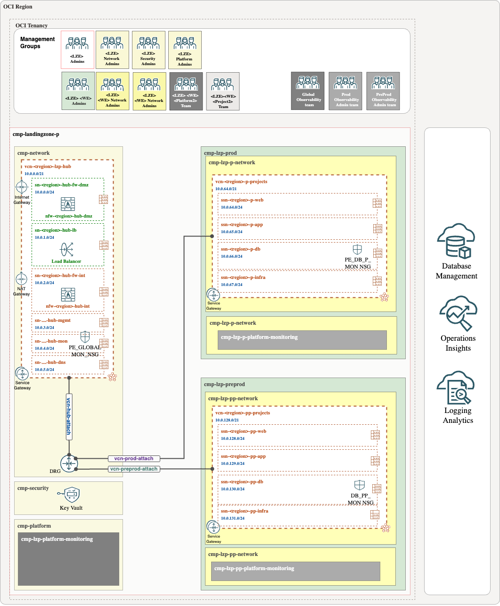

# **[Autonomous Databases ](#)**
## **An OCI Open LZ Addon to help you enable Database Management & Operation Insights for Autonomous Databases**

## Design

To enable **Database Management** or **Operational Insights** for Autonomous Databases, you must deploy Private Endpoints that have access to the database you wish to configure. A Private Endpoint acts as a representation of OCI O&M Services within the VCN.

Both DMA Private Endpoints and OPSI Private Endpoints need visibility into the ATP Private Endpoint. To enable this, the add-on includes Network Security Groups (NSGs).

To check the documentation you can use these links: [DMA PE](https://docs.oracle.com/en-us/iaas/Content/Network/Concepts/privateaccess.htm#private-endpoints) (Database Management Private Endpoint). or [OPSI PE](https://docs.oracle.com/en-us/iaas/Content/Network/Concepts/privateaccess.htm#private-endpoints) (Operation Insights Private Endpoint).

**GLOBAL APPROACH**

For customers with multiple OEs and environments, it's crucial to consider the service limits for Private Endpoints. In such cases, we recommend a shared approach using global Private Endpoints, which should be deployed in the HUB VCN and considered shared resources.

In this **global approach**, PEs will be placed in the monitoring subnet (sn-fra-lzp-hub-mon) in the hub vcn and should be assigned to the PE NSGs (nsg-fra-lzp-hub-global-mon-pe). In the other hand the database will be placed in cmp-lzp-p-proj1-db compartment using the database subnet (ssn-fra-lzp-p-db) and assigned to the DB NSGs (nsg-lzp-p-projects-mon-pe-db1).
  
In this add-on, we will deploy a Shared Observability Platform compartment, a dedicated Observability Vault, and include the necessary groups and policies to manage native observability, along with the previously mentioned NSGs

&nbsp; 

**LOCAL APPROACH**

Customers with simpler infrastructures, using a single OE and fewer environments, may choose to deploy dedicated Private Endpoints (PEs) for each environment. This approach is often preferred when there is a dedicated monitoring team for each environment.

In a **local approach**, DMA/OPS PEs and the ATP PE will reside in the same database subnet (ssn-fra-lzp-p-db), and the nsg-lzp-p-projects-mon-pe-db1 NSGs will allow communication between them.
  
In this case, a dedicated Environment Observability platform compartment, a dedicated Observability Vault, along with the necessary groups and policies to manage native observability, will be included, in addition to the previously mentioned NSGs.

  
Private endpoints will be placed in the observability compartments, accessing the required subnets.

During the process of enabling Database Management or Operation Insights in an Autonomous Database, the user and password will be required. These credentials must be stored as secrets in a dedicated Vault within the shared security compartment. All necessary policies to access the secret are already included in the add-on.

> [!WARNING]  
> You can create the Private Endpoint in the same VCN or a different VCN. Please disregard the information stated in the [Database Management documentation](https://docs.oracle.com/en-us/iaas/database-management/doc/create-database-management-private-endpoint-adb.html#GUID-EBA1A30F-96E9-412D-836F-5ED57FC74D99) or [Operations Insights documentation](https://docs.oracle.com/en-us/iaas/operations-insights/doc/create-private-endpoint.html).
>
> There is a limitation: only one Private Endpoint can be created per VCN.
&nbsp; 

## Implementation

Our add-on template includes all the necessary components, such as CMP, groups, a dedicated monitoring Vault, policies, and NSGs, to enable Database Management and Operations Insights.

Follow these steps to extend your Landing zone:

**Step 1**. 

(Prerequisite) Deploy ONE-OE landing Zone. You can follow next [steps](https://github.com/oci-landing-zones/oci-landing-zone-operating-entities/tree/master/blueprints/one-oe/runtime/one-stack).

&nbsp; 

**Step 2**. 

Enable Observability adding this Add-on, use the ATP JSONs files provided in this asset. To check step by step how to do it check [here](./Implementation_addon_steps.md).

&nbsp; 

Now, the landing zone is ready to proceed with the necessary steps to enable the observability services. Follow these [steps](./steps_to_enable_DMA_OPSI.md).

&nbsp; 

# License

Copyright (c) 2025 Oracle and/or its affiliates.

Licensed under the Universal Permissive License (UPL), Version 1.0.

See [LICENSE](/LICENSE.txt) for more details.
