# Implementation Steps

<table>
<tbody>
<tr>
<th align="left">Steps</th>
<th align="left">Description</th>
<th align="left">Notes</th>
</tr>

<tr>
<td align="left">1</td>
<td align="left">
<b>Navigate to Database Management</b> 
<ul>
<li>Go to OCI Console &gt; Observability &amp; Management &gt; Database Management.</li>
<li>Click on <b>Administration &gt; Metric Extensions</b>.</li>
<li>Choose the target database for which you want to create the metric extension.</li>
</ul>

</td>
<td align="left">
Ensure that Database Management is already enabled for your target database before proceeding with metric extension creation.
</td>
</tr>

<tr>
<td align="left">2</td>
<td align="left">
<b>Create a Metric Extension at the CDB Level</b> 
<ul>
<li>Click on <b>Create Metric Extension</b>.</li>
<li>Fill in the metric extension details as shown below:</li>
</ul>

<b>Example: Current Number of Active Sessions</b> 

<pre><code>SELECT COUNT(*) AS active_sessions 
FROM V$SESSION 
WHERE STATUS = 'ACTIVE';</code></pre>

Use this when the target level is CDB.

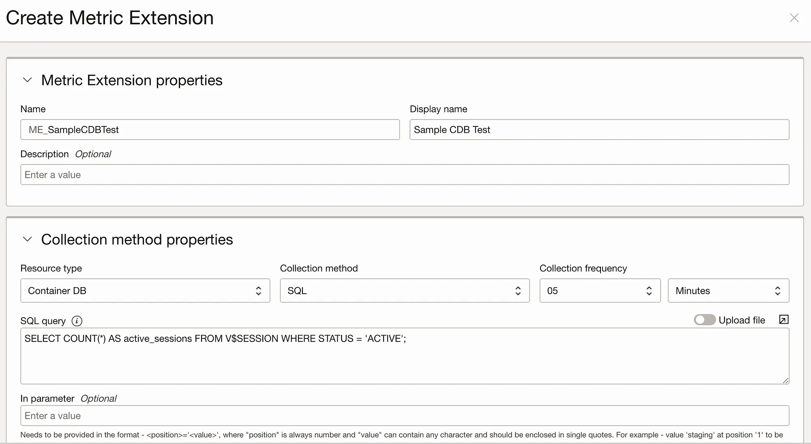  
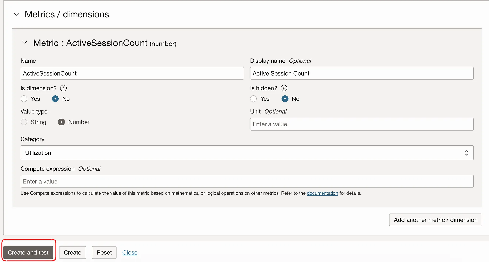 
</td>
<td align="left">
The SQL must return only one value to represent the metric point on the graph. It must be a numeric value.  
The unit field must be a valid unit: <code>percent</code>, <code>count</code>, <code>seconds</code>, <code>MB</code>, etc.
</td>
</tr>

<tr>
<td align="left">3</td>
<td align="left">
<b>Test the Metric Extension</b> 
<ul>
<li>Enter the details as shown in the example above and click on <b>Create and test</b>.</li>
<li>In the next window, select the database to test with and click on <b>Test</b> as shown below.</li>
</ul>
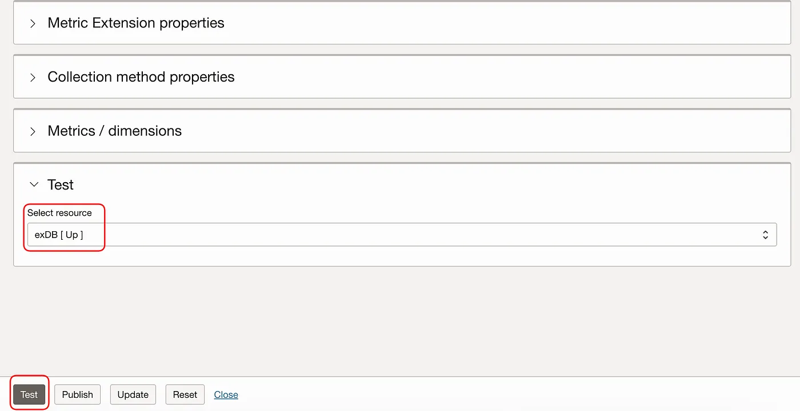 

It may take a few seconds to a couple of minutes to complete the test and return the results. Once you see “Success,” the results will be displayed.

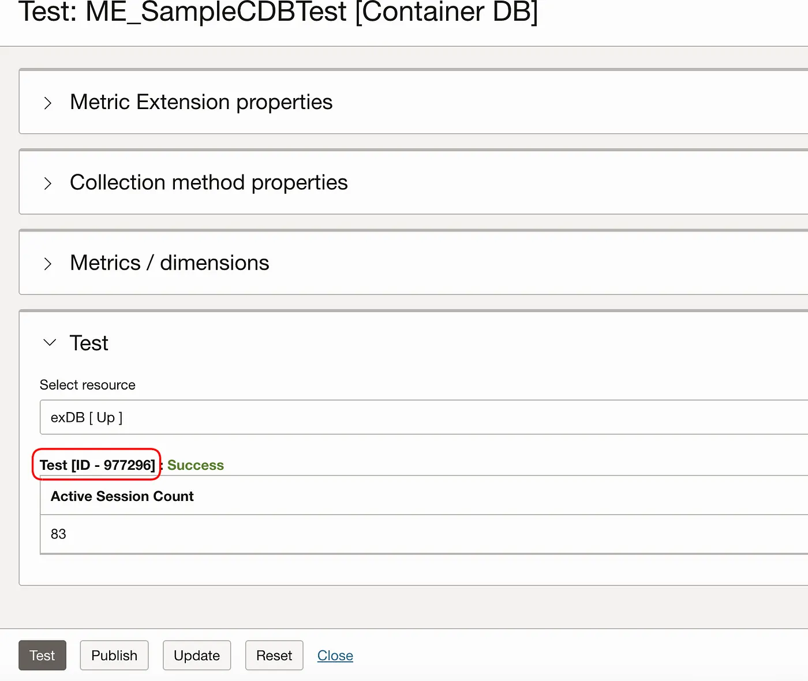 

Note the Test ID here.

</td>
<td align="left">
The metric extension will fail if: 
- The SQL is invalid. 
- Required privileges are missing. 
- Output columns or data types are incorrect. 
 
It is recommended to log in to the database and test your SQL query beforehand to ensure it is valid and returns the expected data.
</td>
</tr>

<tr>
<td align="left">4</td>
<td align="left">
<b>Verify Metric in Monitoring Service</b> 
<ul>
<li>Leave the previous page as is, and open a new tab (or duplicate the tab) to follow these steps:</li>
<li>From the main menu, go to OCI Console &gt; Observability &amp; Management &gt; Monitoring &gt; Metrics Explorer.</li>
<li>Select the following options as shown. Note that the metric namespace will end with <code>appmgmt_test</code>. Click on <b>Update Chart</b>.</li>
</ul>
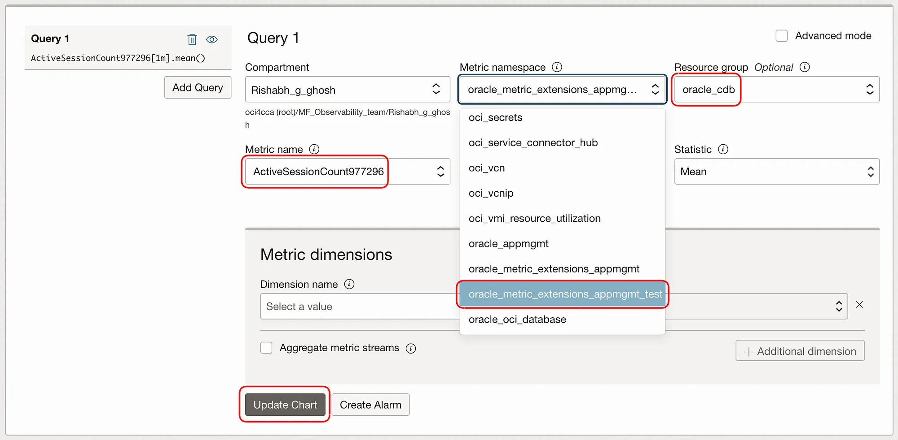 
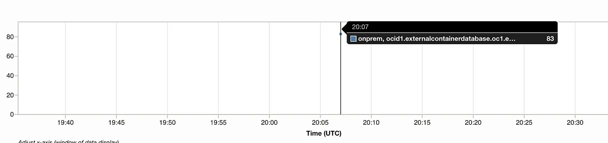 

You will be able to view the metric in the chart above.

</td>
<td align="left">
During the testing phase, use the namespace ending with <code>appmgmt_test</code> to verify that the metric is working as expected before publishing.
</td>
</tr>

<tr>
<td align="left">5</td>
<td align="left">
<b>Publish the Metric</b> 
<ul>
<li>Once you have confirmed the metric is working, return to the metric extension page and click on <b>Publish</b>. Then confirm the publish operation.</li>
</ul>
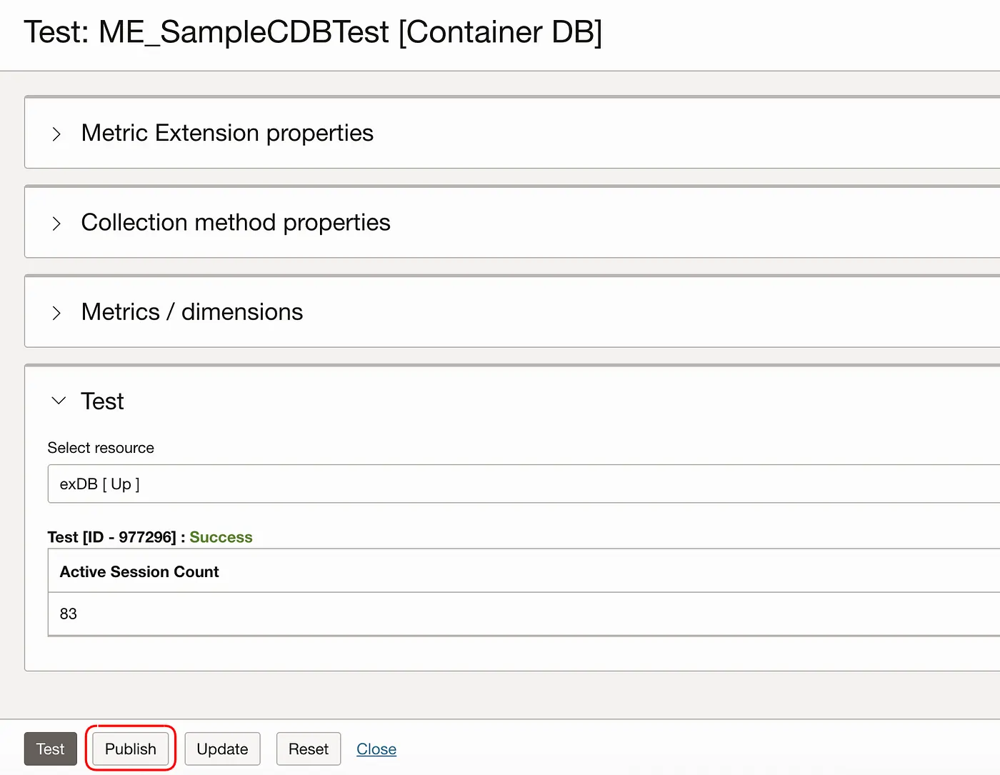 

The metric extension will now be listed on the main page of Metric Extensions as shown:

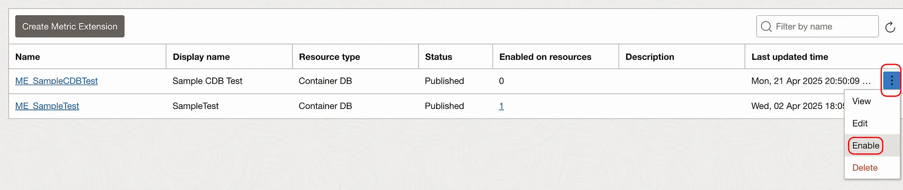 
</td>
<td align="left">
Publishing makes the metric extension available for enabling on target databases in production.
</td>
</tr>

<tr>
<td align="left">6</td>
<td align="left">
<b>Enable the Metric Extension</b> 
<ul>
<li>Click on the three-dots menu and select <b>Enable &gt; Select resources</b>.</li>
<li>Select the database from the list and click <b>Enable on selected resources</b>.</li>
<li>Confirm the enable action when prompted.</li>
</ul>
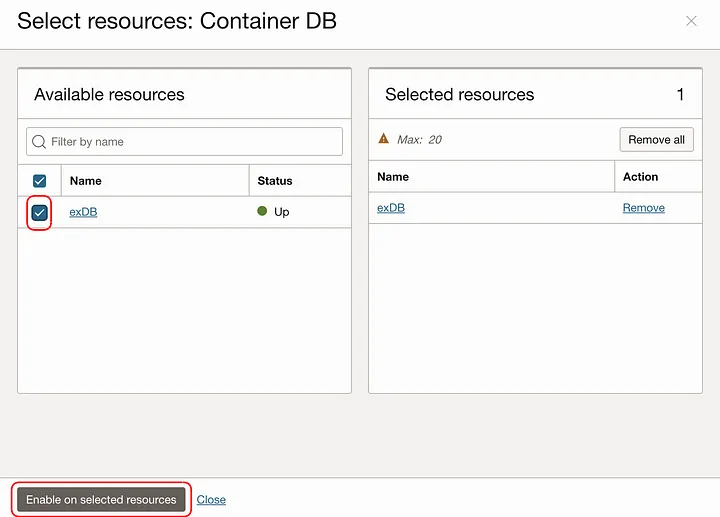  
  
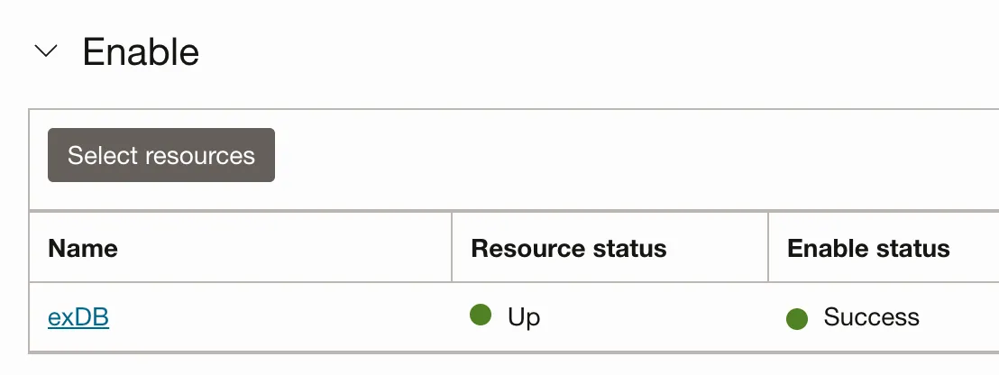 

This may take some time to execute. After you see success, check back after at least 5–6 minutes to see at least two metric points on the Metrics Explorer graph, as shown below.

</td>
<td align="left">
Allow sufficient time for metric collection to start. Initial data points may take 5–6 minutes to appear in the monitoring system.
</td>
</tr>

<tr>
<td align="left">7</td>
<td align="left">
<b>View Metrics in Monitoring Service</b> 
<ul>
<li>After publishing the metric extension, make sure to select the namespace <code>appmgmt</code> (not the test one used earlier).</li>
</ul>
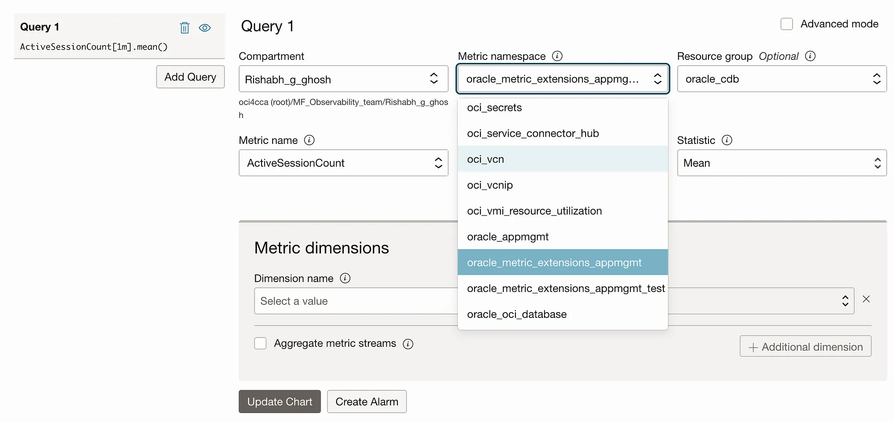 

Click on <b>Update Chart</b> and review the graph:

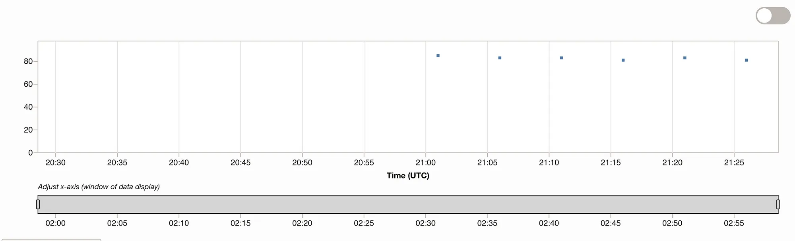 

Click on <b>Show Data Table</b> to see the metric values clearly:

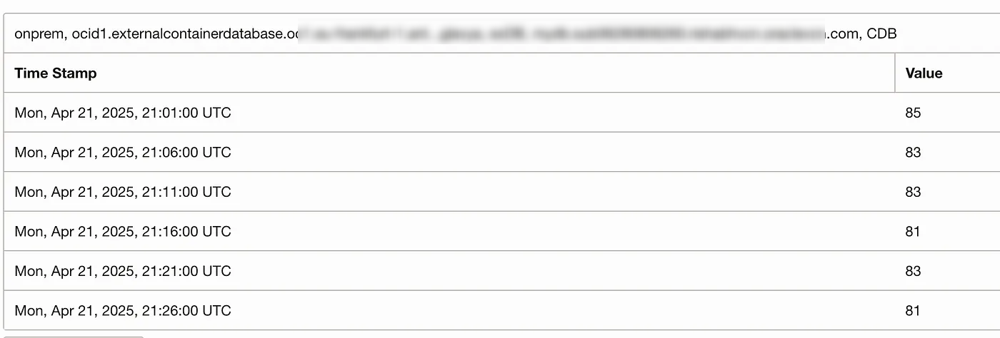 
</td>
<td align="left">
After publishing, use the <code>appmgmt</code> namespace (not the test namespace) to view production metrics data.
</td>
</tr>

<tr>
<td align="left">8</td>
<td align="left">
<b>Create a Metric Extension at the PDB Level — % Storage Used in SYSTEM Tablespace in PDB</b> 
 
<pre><code>SELECT
    ROUND((1 - (b.BYTES_FREE / a.BYTES_ALLOC)) * 100, 2) AS pct_used
FROM
    (SELECT SUM(BYTES) AS BYTES_ALLOC
     FROM DBA_DATA_FILES
     WHERE TABLESPACE_NAME = 'SYSTEM') a,
    (SELECT SUM(BYTES) AS BYTES_FREE
     FROM DBA_FREE_SPACE
     WHERE TABLESPACE_NAME = 'SYSTEM') b;</code></pre>

Use this when the target level is PDB.

<ul>
<li>Follow the same steps as for the CDB-level query above. Note the following changes:</li>
</ul>
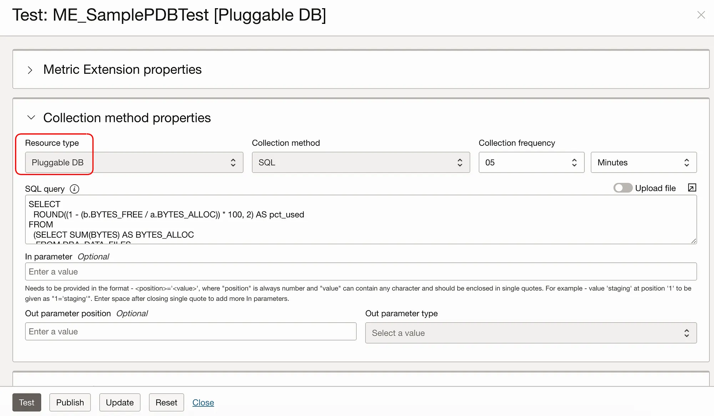 

Select Pluggable DB for PDB-level queries. Test, publish, and enable as before.

 
</td>
<td align="left">
For PDB-level metrics, ensure you select "Pluggable DB" as the target level and that the SQL query is appropriate for the PDB context.
</td>
</tr>

<tr>
<td align="left">9</td>
<td align="left">
<b>View PDB Metrics</b> 
<ul>
<li>Go to Monitoring &gt; Metrics Explorer and select the appropriate options.</li>
</ul>
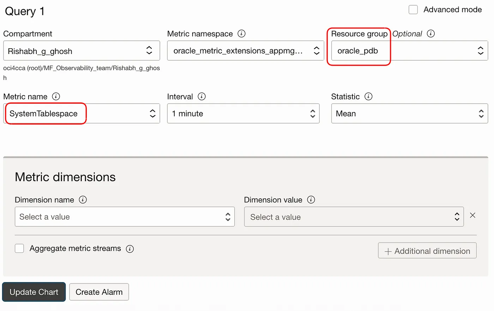 

Click <b>Update</b> to view the captured metrics.

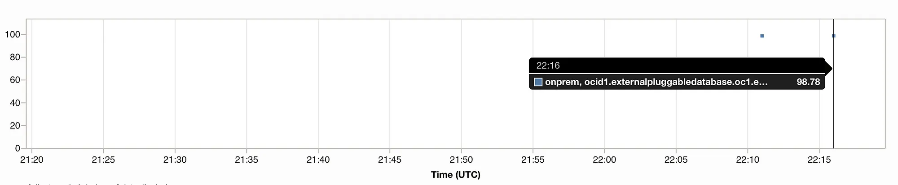 
</td>
<td align="left">
PDB-level metrics will appear under the same monitoring namespace but will be specific to the pluggable database context.
</td>
</tr>
</tbody>
</table>

## Important Notes

- The SQL must return only one value to represent the metric point on the graph. It must be a numeric value.
- The unit field must be a valid unit: <code>percent</code>, <code>count</code>, <code>seconds</code>, <code>MB</code>, etc.
- The metric extension will fail if:
  - The SQL is invalid.
  - Required privileges are missing.
  - Output columns or types are incorrect.

Here is an example of an error that would occur with an incorrect SQL query during the test phase: 
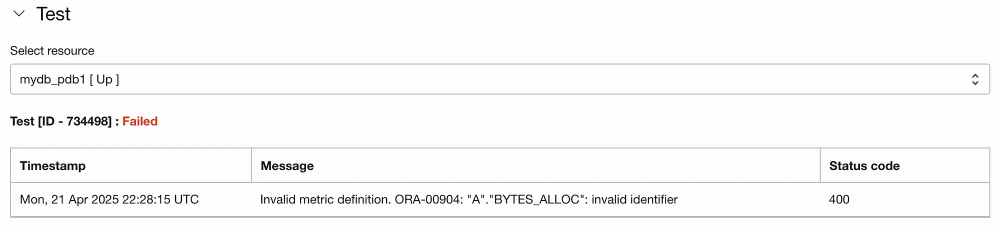 
It is recommended to log in to the database and test the SQL first to ensure the queries are valid and return the expected data.

---

# License <!-- omit from toc -->

Copyright (c) 2025 Oracle and/or its affiliates.

Licensed under the Universal Permissive License (UPL), Version 1.0.

See [LICENSE](/LICENSE) for more details.