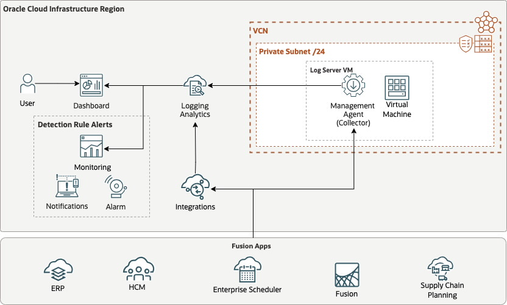

# <Asset Name> How to inject Oracle Fusion HCM logs in Logging Analytics
 
Since last year we have got many requests on how to gain more visibility in Oracle Fusion HCM using Logging Analytics. Since then Logging Analytics team simplified the collection model of the logs, and now we have predefined Parsers and Sources for Fusion Logs.
 
 
Reviewed: 30.06.2025
 
# When to use this asset?
 
[**Logging Analytics: Support for ingesting Fusion Apps logs**](https://docs.oracle.com/en-us/iaas/releasenotes/logging-analytics/nov24-ingest-new-logs.htm) - Logging Analytics now supports the collection of the following 10 Fusion Apps logs. Oracle-defined sources and parsers are now available for ingesting the logs.

During a POC for ingesting this Logs I have used this resources:
- [**OCI Logging Analytics Collect Logs Using REST API Collection Method**](https://www.ateam-oracle.com/post/oci-logging-analytics-collect-logs-using-rest-api-collection-method)
- [**Fusion Applications Observability by Collecting ESS Logs Using OCI Logging Analytics REST API**](https://www.ateam-oracle.com/post/fusion-apps-observability-by-collecting-ess-logs-using-oci-logging-analytics-rest-api-ingestion) - Oracle Fusion Applications Enterprise Scheduler Service (ESS) is a critical component that manages scheduled processes

For the HCM Rest API's I used this page to test the calls:
[**REST API for Oracle Fusion Cloud HCM**](https://docs.oracle.com/en/cloud/saas/human-resources/25b/farws/rest-endpoints.html) - Last Updated April 2025 You can use Oracle REST APIs to view and manage data stored in Oracle Fusion Cloud HCM.

For latest changes in REST API log collection in Logging Analytics I have used the official documentation:
[**Using Logging Analytics**](https://docs.oracle.com/en-us/iaas/logging-analytics/doc/set-rest-api-log-collection.html) - Oracle Logging Analytics enables you to set up continuous REST API based log collection from endpoint URLs that respond.

 
# How to use this asset?
 
You can follow the instruction of the [step by step guide](./files/fusion-hcm-to-la.md)
 
 
# License
 
Copyright (c) 2025 Oracle and/or its affiliates.
 
Licensed under the Universal Permissive License (UPL), Version 1.0.
 
See [LICENSE](https://github.com/oracle-devrel/technology-engineering/blob/main/LICENSE) for more details.

