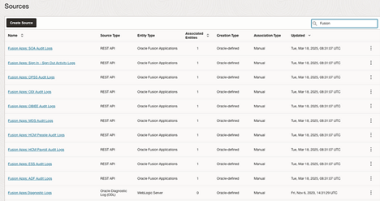

<table>
<tbody>
<tr>
<th align="left">Step</th>
<th align="left">Description</th>
<th align="left">Notes</th>
</tr>
<tr>

<td align="left">1</td>
<td align="left">
**Create proper IAM policies for Logging analytics to allow Management Agent to upload the collected logs:**

[Using Logging Analytics - Allow continuous log collection using Management Agents](https://docs.oracle.com/en-us/iaas/logging-analytics/doc/allow-continuous-log-collection-using-management-agents.html#GUID-AA23C2F5-6046-443C-A01B-A507E3B5BFB2)

The missing policy was:
```
ALLOW DYNAMIC-GROUP Management-Agent-Dynamic-Group TO {LOG_ANALYTICS_LOG_GROUP_UPLOAD_LOGS} IN TENANCY
```

Without this policy, you will get error:
```
17:30:55,010 [SendQueue.2 (SenderManager_sender)-41]
INFO --- LogUploadInvocation
←rsp[2MQ0U4Xxxxxxxxxxxxxx1D6865BE/9C1D623xxxxxxxxF3111B8ADFAEE373E]←
POST https://loganalytics.eu-frankfurt-1.oci.oraclecloud.com/20200601/namespaces/yourtenancyname/actions/uploadAgentLogFile?logSet=&payloadType=ZIP: [404]
```

</td>
<td align="left">
When you perform the prerequisites for deploying Management Agents, you will need proper IAM policies configured.

Make sure the dynamic group for Management Agents has the necessary permissions.
</td>
</tr>

<tr>
<td align="left">2</td>
<td align="left">
**Install Management agent on a VM (Oracle Linux in OCI).**

Upload the JRE and Oracle agent to OCI Object Storage and get the file using wget from the PAR link:

```bash
ssh -i ssh-key.key opc@YourIPAddress
wget https://objectstorage.eu-frankfurt-1.oraclecloud.com/p/Xxxxxxxxxxxxxxxxxxx/n/YourNameSpace/b/Observability/o/oracle.mgmt_agent.250414.2239.Linux-x86_64.rpm
wget https://objectstorage.eu-frankfurt-1.oraclecloud.com/p/XXxxxxxxxxxxxxxxxx/n/YourNameSpace/b/Observability/o/jre-8u381-linux-x64.rpm
sudo rpm -ivh jre-8u381-linux-x64.rpm
source /etc/profile.d/java.sh
sudo rpm -ivh oracle.mgmt_agent.250414.2239.Linux-x86_64.rpm
sudo /opt/oracle/mgmt_agent/agent_inst/bin/setup.sh opts=/opt/oracle/mgmt_agent/agent.rsp
```

After the agent is installed, add the RestAPI connections to emd.properties:

```bash
cd /opt/oracle/mgmt_agent/agent_inst/config
vi emd.properties

#Add at the end of the file:
loganalytics.rest_api.enable_oci_api=true
loganalytics.rest_api.report_interval=600

#Restart the agent
systemctl restart mgmt_agent
```

&nbsp; 


&nbsp; 

</td>
<td align="left">
For a more detailed Management Agent installation guide you can use the first parts from these blogs:

- [Using OCI Management Agent to collect performance metrics for cloud-native environments](https://blogs.oracle.com/observability/post/using-oci-management-agents-to-collect-performance-metrics-for-cloud-native-environments)
- [How to ingest Linux Logs into OCI Logging Analytics and use the Mitre ATT&CK AuditD keys](https://learnoci.cloud/how-to-ingest-linux-logs-into-oci-logging-analytics-and-use-the-mitre-att-ck-auditd-keys-to-create-49d6714ecdf2)
</td>
</tr>

<tr>
<td align="left">3</td>
<td align="left">
**After the agent is installed we need to collect the details about Fusion environment:**

- Your Fusion Application Instance URL, e.g.: https://fa-xxxx-saasfademo1.xx-xx.oraclepdemos.com
- Based on this URL, the REST API to use is: https://fa-xxxx-saasfademo1.xx-xx.oraclepdemos.com/fscmRestApi/fndAuditRESTService/audittrail/getaudithistory
- Your login credential to the FA instance. In our case we are using basic authentication with username and password.
</td>
<td align="left">
Make sure you have the correct Fusion Application URL and proper credentials with appropriate permissions to access the REST APIs.
</td>
</tr>

<tr>
<td align="left">4</td>
<td align="left">
**Create the Fusion Apps credentials on the OS:**

```bash
sudo su -
vi /tmp/FA-CREDS.json
```

Add the credential here:
```json
{
"source":"lacollector.la_rest_api",
"name":"FA-CREDS",
"type":"HTTPSCreds",
"description":"These are HTTPS (BasicAuth) credentials.",
"properties":
[
{ "name":"HTTPSUserName", "value":"CLEAR[YourFusionUsername]" },
{ "name":"HTTPSPassword", "value":"CLEAR[YourFusionPassword]" },
{ "name":"ssl_trustStoreType", "value":"JKS" },
{ "name":"ssl_trustStoreLocation", "value":"/etc/pki/ca-trust/extracted/java/cacerts" },
{ "name":"ssl_trustStorePassword", "value":"changeit" }
]
}
```

Run Credential_mgmt.sh script to define the Fusion Apps Credentials:

```bash
cat /tmp/FA-CREDS.json | sh /opt/oracle/mgmt_agent/agent_inst/bin/credential_mgmt.sh -o upsertCredentials -s logan
systemctl restart mgmt_agent
```

If you are using Oracle Cloud Agent plugin:
```bash
cat /tmp/FA_CREDS.json | sh /var/lib/oracle-cloud-agent/plugins/oci-managementagent/polaris/agent_inst/bin/credential_mgmt.sh -o upsertCredentials -s logan
```

After running the command you will get a message like:
```
Effect Credential Source
--- --- --- --- --- --- --- --- --- --- --- --- --- --- --- --- --- --- --- --- --- --- --- --- --- --- --- --- --- --- --- --- --- --- --- --- --- --- -
ADDED RestAPICreds lacollector.la_rest_api
Type: HTTPSBasicAuthCreds [HTTPSUserName, HTTPSPassword]
Description: SaaS API Credentials
1 credential(s) added to the logan service.
```
</td>
<td align="left">
I have used the name FA-CRED because it's already configured in Logging Analytics Source.

Make sure to use the exact credential name as expected by the Logging Analytics sources.
</td>
</tr>

<tr>
<td align="left" rowspan="6">5</td>
<td align="left">
**Configure Logging Analytics for log collection:**

**Create a dedicated log group for Fusion Apps:**

Logging Analytics → Administration → Log Groups → Create Log Group

&nbsp; 


&nbsp; 

</td>
<td align="left" rowspan="6">
We will move now to logging analytics to configure the log collection.

All Fusion-related parsers and sources are pre-configured in Logging Analytics, making the setup process much simpler.
</td>
</tr>

<tr>
<td align="left">
**Check the Fusion Log Parsers:**

Parsers → Search for Fusion

&nbsp; 


&nbsp; 


&nbsp; 

</td>
</tr>

<tr>
<td align="left">
**Check the Fusion Log Sources:**

Administration → Sources

&nbsp; 



&nbsp; 

Click on a source and check the used credentials (The ones we defined earlier):

&nbsp; 


&nbsp; 

</td>
</tr>

<tr>
<td align="left">
**Create a new entity and associate it with the Fusion Sources:**

Administration → Entity → Create Entity

[Configure New Source-Entity Association](https://docs.oracle.com/en-us/iaas/logging-analytics/doc/manage-source-entity-association.html#GUID-C4604513-1D68-4F19-9352-8DE60C5788A5)

&nbsp; 


&nbsp; 

Define the Host URL's in the properties part (CREDS can be used to define other credentials, not the ones already defined):

&nbsp; 


&nbsp; 

</td>
</tr>

<tr>
<td align="left">
**Configure Agent-based Log Collection:**

Administration → Click Add Data → Custom Selection → Select the Fusion Apps Entity created earlier:

&nbsp; 


&nbsp; 


&nbsp; 

Select the Oracle Fusion Applications Entity and press next:

&nbsp; 


&nbsp; 

</td>
</tr>

<tr>
<td align="left">
**Select all the wanted sources for Log Collection:**

Press Validate and configure log collection:

&nbsp; 


&nbsp; 

If all configurations are done correctly in a few minutes you should see the logs in Logging Analytics Log Explorer. If something was missed, you can check Agent Collection Warnings:

&nbsp; 


&nbsp; 

</td>
</tr>

</tbody>
</table>

**Congratulations!** You have configured Logging Analytics to collect Oracle Fusion logs. In my next blog I will show how to create queries for different Fusion detection rules, and create Dashboards that fits your daily needs.

# License 

Copyright (c) 2025 Oracle and/or its affiliates.

Licensed under the Universal Permissive License (UPL), Version 1.0.

See [LICENSE](/LICENSE) for more details.
