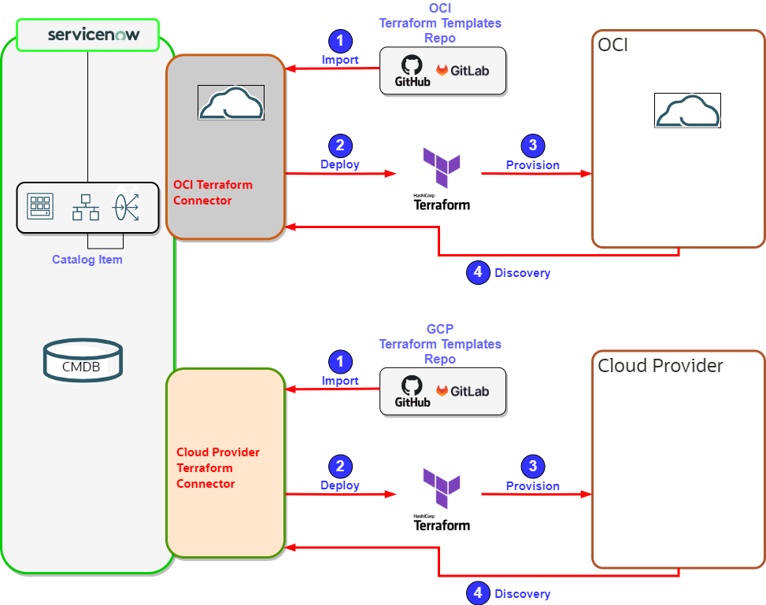

<!--
    Owner: Manuela Fioramonti
    Last Change: 11 April 2024
    Review Status: Live
    Review Notes: -
-->

This chapter briefly introduces Operations, a list of best practices, and a collection of useful resources for a unified operating model in a multi-cloud scenario.

As a quick reminder, Day-1 Operations: these are the operations related to deploying relevant resources in the tenancy, and their configurations.

Day-2 Operations: These are the operations related to being aware of everything going from computing usage and performance to application health, automation, D&R, and lifecycle management.

Operational Excellence means operating your deployments efficiently while focusing on maximum results. It ranges from automated deployments and patching to monitoring and getting ready for peaks, creating a culture of reliability, and accurate cost management.

Multi-Cloud context adds complexity: enterprises and companies must face dependencies and constraints while maintaining operational efficiency. A unified operating model allows them to leverage existing knowledge and processes, orchestrating operations. For this reason, it needs to be cloud-agnostic and provide guidance and best practices that can be applied independently of the technology of choice.

Let's start with the basics:

# Automation &  Infrastructure as Code

1. Make Automation part of your culture, if this is not the case.
If in a single-cloud provider scenario, its importance is not always perceived as crucial, except for large-scale deployments, automation becomes paramount in a multi-cloud scenario.

a.Define which Operating scenarios you need to automate: what will be the most frequent operations you will	need to run? what are the most complex and prone to human errors?

b.Adopt DevOps philosophy to allow for quick changes and releases.

c. Define the roles: Two typical roles in Infrastructure as Code (IaC) are IaC Developer and Cloud Operator. The IaC Developer provides essential building blocks--modules in Terraform, and Playbooks in 	Ansible--which are used by the Cloud Operator to deploy resources. The same module or playbook will be used many times to create the same type of resource, each time providing specific parameters for the instantiation. Reusable Terraform modules and Ansible playbooks ensure deployed resources adhere to company-wide or organizational standards.
		
d. Define Approval workflows for changes: typically you will want to protect resources from unwanted changes.

e. Make your coding provider agnostic and modular.

2. Decide on the repository structure: this will need to support your Multi-cloud approach.

3. Decide what tool you will use to operate. If in your practice you are already using a preferred one, and previous practices have been put in place, you will have no issue in expanding its usage to additional cloud providers.

**Example**

The following Diagram depicts as an example, the use of ServiceNow ITOM to operate across cloud vendors, using two different repositories.

# Implement SRE Function

SRE inputs and on-call work is crucial to maximize reliabilty, hence this function should always be implemented for mission-critical workloads.

# Embrace FinOps Practice

Just like Automation and Observability practices, keeping consumption and usage under control and forecastable across cloud providers is another key element to be kept into consideration in a Multi-Cloud Operating Model.
FinOps FOCUS Group, started in April 2023, defined open standard for cloud cost, usage, and billing data, followed by the creation of FOCUS Converters, aimed at providing billing data conversions for FOCUS compliance for AWS, Azure, GCP, and OCI.
