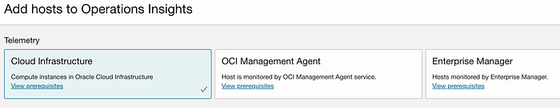
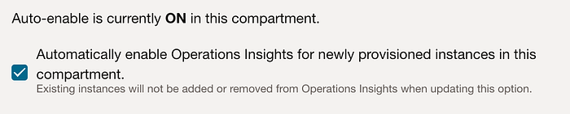
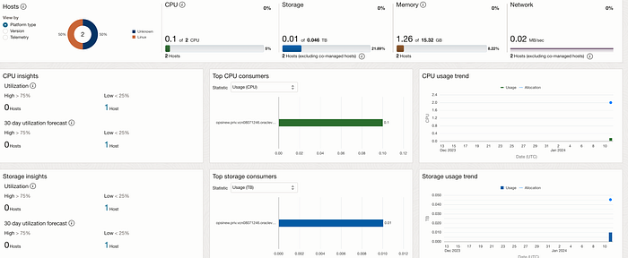
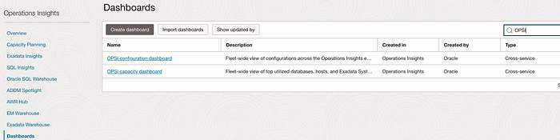
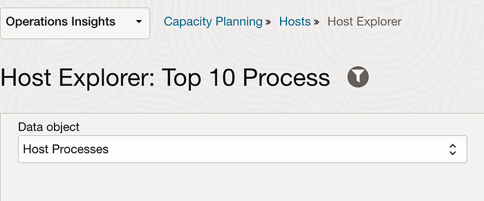
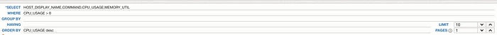

# Auto enable hosts for Operation Insights in OCI

Operation Insights is an OCI(Oracle Cloud Infrastructure) native service that provides holistic insight into database and host resource utilisation and capacity.

Previously to enable OCI compute hosts for operation insights you have to add it manually via OCI console or enable it via REST API.
Operation Insights → Administration → Host Fleet → Add hosts

Add hosts to operation insights via OCI console

With the new feature you can automatically enable operation insights for OCI compute in a compartment when its created.

Navigate to Operation Insights → Administration → Host Fleet

Create the required policies using Policy Advisor for compute or you can create the policy via console as well.For example:

Allow any-user to use instance-family in compartment X where ALL { request.principal.type = ‘opsihostinsight’ }
Allow any-user to manage management-agents in compartment X where ALL { request.principal.type = ‘opsihostinsight’ }

Once you launch a compute instance the workflow will trigger and enable the management agent and the operation insight plugin will get deployed.

After few mins you can see the host is added to Operation Insights and wait for max 24 hours to see the data .

You can use prebuilt dashboards available or can create your own customised ones.

You can create customised widgets from Host Explorer .For example to know top 10 process having higher CPU usage you can write a query and save it.

You can get weekly report by using [News Report feature](https://blogs.oracle.com/cloud-infrastructure/post/operations-insights-actionable-workload-news) as well.

To learn more about other features please refer the operation insights [blog](https://blogs.oracle.com/observability/category/oem-operations-insights).
