# Use Cloud Guard Insight Recipes to monitor Windows Instances against Interesting Windows Event IDs for Malware-General Investigation

Recently Oracle lunched a new Recipe called Insight. With this service you will be able to leverage the OCI logging service Search Options and also the advanced Threat detection Engine from Cloud Guard.

[Getting Started with Data Sources (oracle.com)](https://docs.oracle.com/en-us/iaas/cloud-guard/using/datasrc-start.htm)

In this blog entry I will try to showcase how easy is to create a Data Source and a Recipe based on the Saved Log Searches/New Searches.

The Event ID’s that I will add in this Search are from this Sophos page, and the ID’s are found in the Windows events if the instances are compromised.

[Interesting Windows Event IDs — Malware/General Investigation (sophos.com)](https://support.sophos.com/support/s/article/KB-000038860?language=en_US)

So the first thing we need to do is to create the OCI AuthZ policies that will allow the Logging Service to be used by Cloud Guard.

Go to Cloud Guard, click on Data Sources and copy the needed policies:
```test
allow service logging to {LOG_DEFINITION_READ, LOG_DEFINITION_WRITE, LOG_WRITE, LOG_NAMESPACE_READ, LOG_CONTENT_READ, AUDIT_EVENT_READ,LOG_CONTENT_PUSH} in tenancy
```
allow service logging to {INTERNAL_AUDIT_EVENT_READ} in tenancy

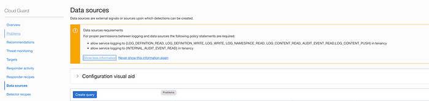

The policy needs to be enabled at the root level.

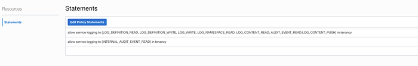

Next step would be to go to OCI Logging, and create a Search for certain event ID from a Custom Agent Log for Windows.

```text
search “ocid1.compartment.oc1..xxx/ocid1.loggroup.oc1.eu-frankfurt-1.xxxx/ocid1.log.oc1.eu-frankfurt-1.xxx”| data.event_id=’7036' or data.event_id=’4688' or data.event_id=’4740'| sort by datetime desc
```
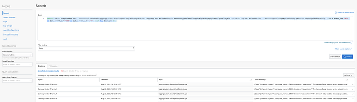

You can press Save Search, and this search can be choose when you create the rule. If you don’t want to save the search, you can also copy and paste.

After you have the proper search for your events of interest, you can go to Cloud Guard and Press Create Query:

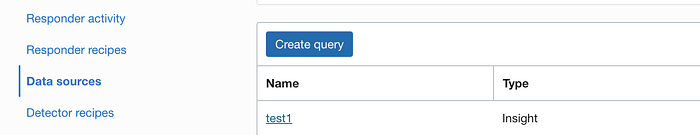

\

After you select the Region, give query a name, you can click Import Saved Search Query

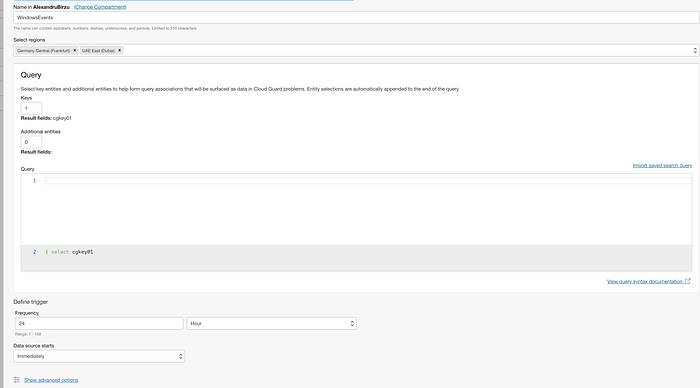

Based on how often you want to have the problems created you can change the trigger from 24h to once per hour or once at 5 minutes for testing.

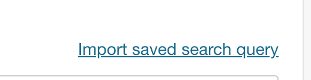

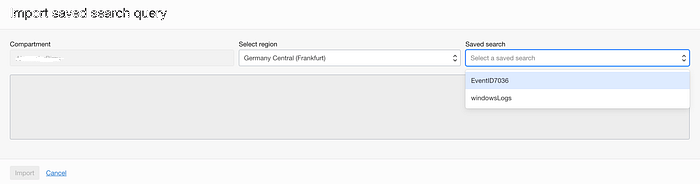

And press import:

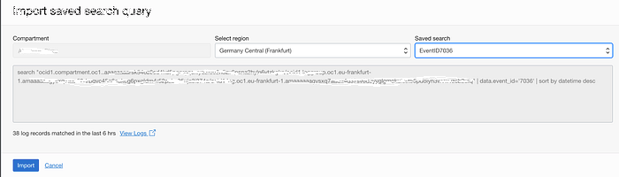

After the Query is imported, you need to define the keys used by the query and mapping with Logging as seen below on the code:

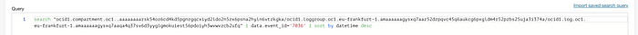

```text
search “ocid1.compartment.oc1..xxx/ocid1.loggroup.oc1.eu-frankfurt-1.xxx/ocid1.log.oc1.eu-frankfurt-1.xxx” | data.event_id=’7036' or data.event_id=’4688'or data.event_id=’4740' or data.event_id=’4648'| select data.event_id as cgkey01
```

If mapping is not done, you will receive this error:

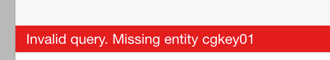

Now with the first query created, we can go with the Recipe creation. Go to Cloud Guard → Detector recipes → Create recipes

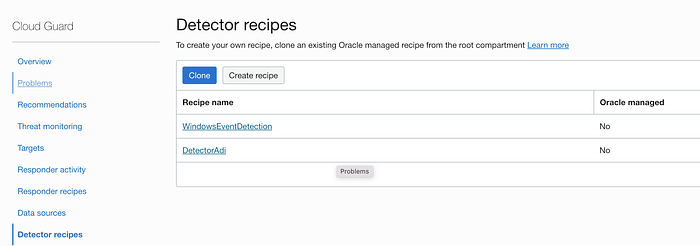

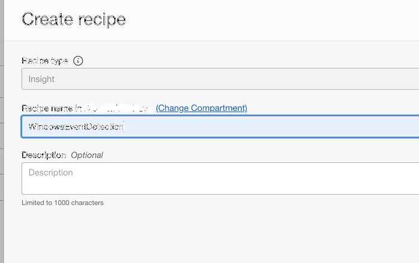

After the Recipe is created, we can go and add the rules by clicking on Create rule:

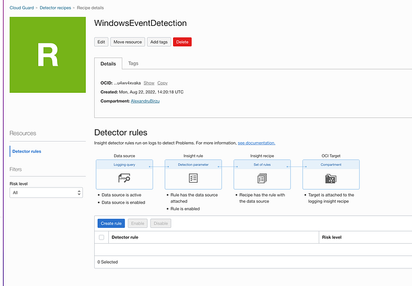

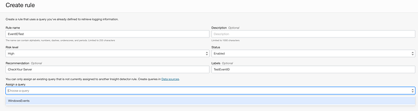

After the rule is added and Enabled, you can see how the log entity is mapped with the Cloud Guard Entity.

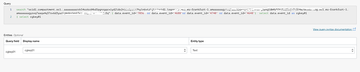

After you have added the rule, you need to wait for new Events to be generated on your Windows Machine and a new Problem will be created in the Cloud Guard Problems page:

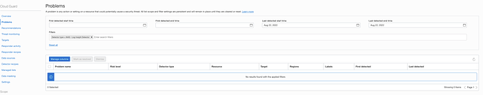

Other Method to check for the events is by Clicking the Data Source and Click Events under Resource:

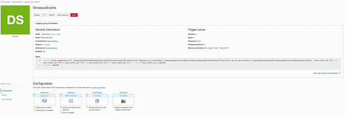

Once the data source is added to the Rule, you will not be able to update the rule. As the events I have added initially are not generated all the time, I needed to add an additional login eventID.

Go to the Data Source:

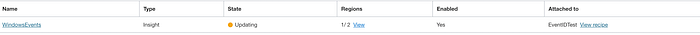

Click on Data Source and detach it from the Recipe

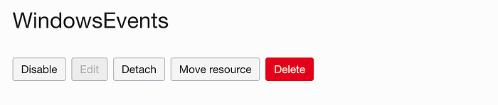

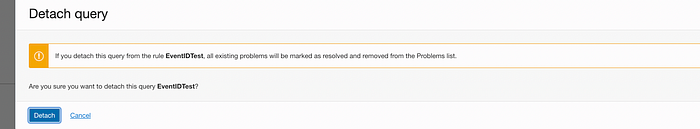

After you detach it, you can edit it and add additional EventID’s like 4672 , save the new search and create a new rule back in the Detection Insight Policy:

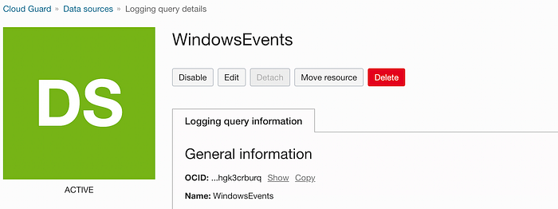

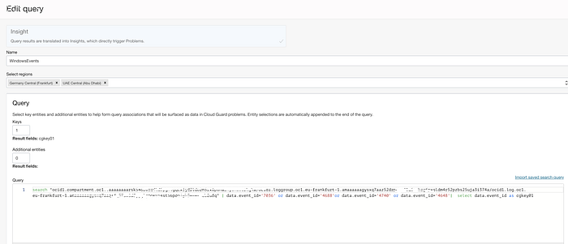

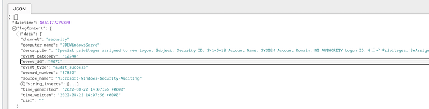

```test
search “ocid1.compartment.oc1..xxx/ocid1.loggroup.oc1.eu-frankfurt-1.xxx/ocid1.log.oc1.eu-frankfurt-1.xxx” | data.event_id=’7036' or data.event_id=’4688'or data.event_id=’4740' or data.event_id=’4648' or data.event_id=’4740' | select data.event_id as xxx
```

Last step now is to attach Rule to the needed compartment by clicking Cloud Guard → Targets and create new Target:

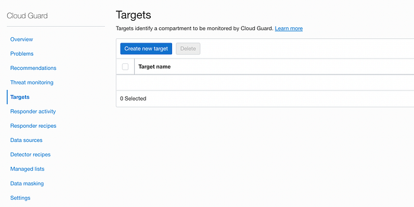

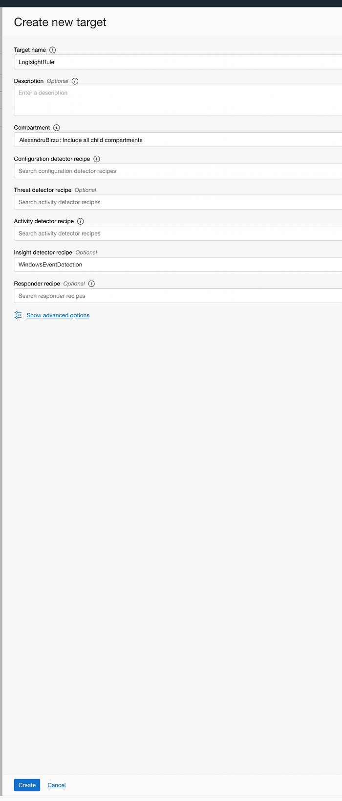

Attach the mandatory policies and wait for the Events to be generated in the Cloud Guard.

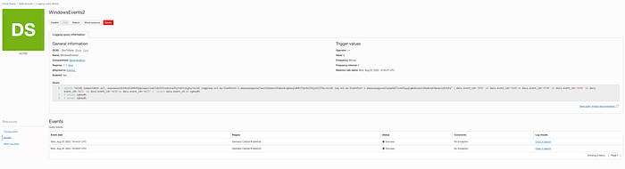


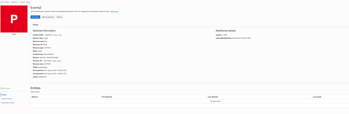

Congratulation! Now you can create proper Monitoring rules for Threat Hunting and Security Event Notifications.

Note: When you update an existing Data Source, there is a slight delay in updating the Data Source and the state will be Updating for a few minutes.

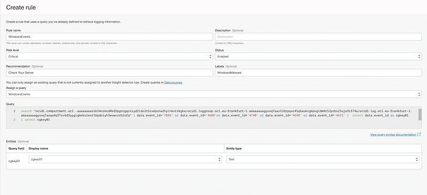
