# Use CloudGuard to search for MITRE ATT&CK Techiniques detections

Previously, I have shown how to leverage AuditD data in OCI Logging service. Now I will use the OCI Logging Service search option to create some MITRE ATT&CK Searches that will be used by Cloud Guard Insight Rules.

From this rule mapping and the Attack Rules, I am able to create the searches that I need:

linux-audit/DS-to-audit.MD at main · izysec/linux-audit

Some resources to facilitate my blog on auditd for security monitoring - linux-audit/DS-to-audit.MD at main ·…

github.com

auditd-attack/auditd-attack.rules at master · bfuzzy1/auditd-attack

A Linux Auditd rule set mapped to MITRE's Attack Framework - auditd-attack/auditd-attack.rules at master ·…

github.com

As seen in this picture you can go and do your mapping manually:

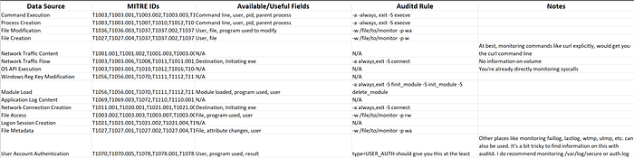

In my auditd custom rules, I only have enabled this rules:

T1107_File_Deletion T1070_Indicator_Removal_on_Host T1055_Process_Injection T1072_third_party_software T1219_Remote_Access_Tools T1005_Data_from_Local_System T1057_Process_Discovery T1081_Credentials_In_Files T1049_System_Network_Connections_discovery T1082_System_Information_Discovery T1082_System_Information_Discovery T1016_System_Network_Configuration_Discovery T1082_System_Information_Discovery T1033_System_Owner_User_Discovery T1087_Account_Discovery T1068_Exploitation_for_Privilege_Escalation T1166_Seuid_and_Setgid T1169_Sudo T1043_Commonly_Used_Port T1021_Remote_Services T1201_Password_Policy_Discovery T1071_Standard_Application_Layer_Protocol T1021_Remote_Services T1108_Redundant_Access T1052_Exfiltration_Over_Physical_Medium T1078_Valid_Accounts T1168_Local_Job_Scheduling T1079_Multilayer_Encryption T1099_Timestomp T1215_Kernel_Modules_and_Extensions locklvm

as this rules are mapped as keys, I will use them in the OCI Logging Search.

Now if we go to OCI Logging, and look at the Auditd generated logs, we can go and drill down on more specific searches by clicking Filter matching:

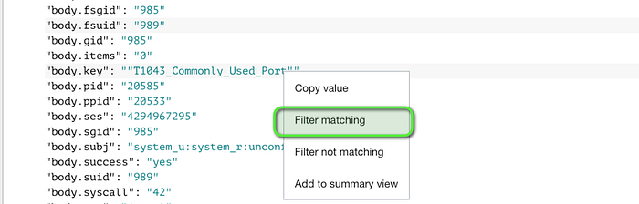

If we select Show Advanced Mode, we will see a simular query, and in there we will see that the selected query will not return anything.

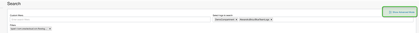

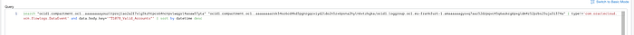

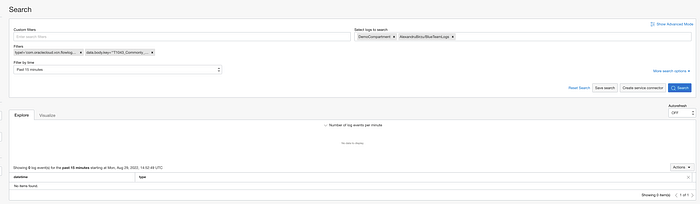

Now, in the Advanced Mode, we can change the format from:

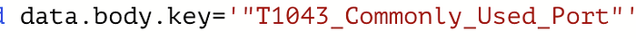

to

data.”body.key”=’ ”T1043_Commonly_Used_Port”’

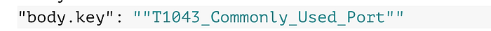

We need to do this, as the proper log field is “body.key” not key.

With this format you will be able to see the proper logs and save the searches:

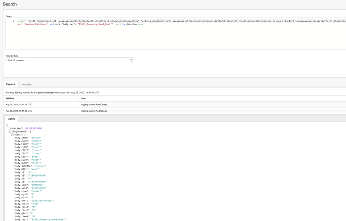

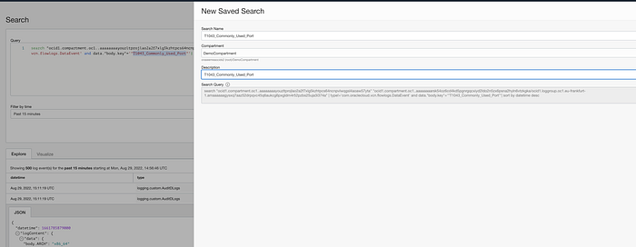
```text
search “ocid1.compartment.oc1..xxxxxxxx” “ocid1.compartment.oc1..xxxx/ocid1.loggroup.oc1.eu-frankfurt-1.xxxx” | data.”body.key”=’”T1078_Valid_Accounts”’ | sort by datetime desc
```
In this query I have removed the exclusion of VCN Flow Logs, as this was used by me to filter only certain logs when I created the search.

Using this search, and changing the filed value I have created multiple searches based on MITRE ATT&CK Techiques:

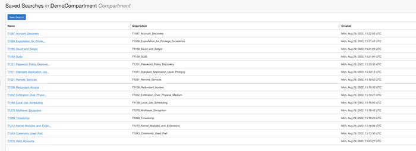

Next step will be to set up Cloud Guard to use Insight logging as described in my first blog entry from this series and will use the saved Searches for detection.

Use Cloud Guard Insight Recipes to monitor Windows Instances against Interesting Windows Event IDs…

Recently Oracle lunched a new Recipe called Insight. With this service you will be able to leverage the OCI logging…

learnoci.cloud

Go to Data Sourrces and create a new Query:

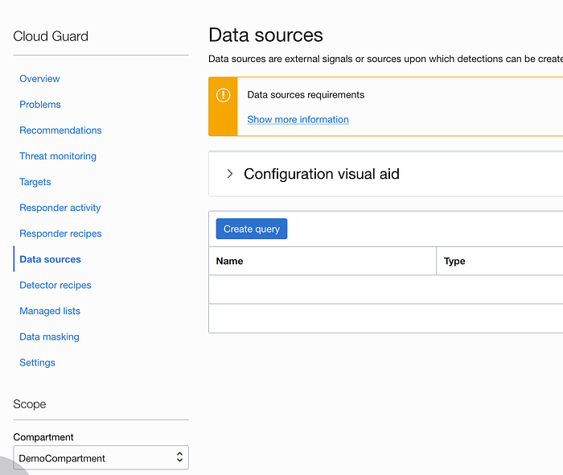

Give the Query the proper name and Press Import Saved Search Query:

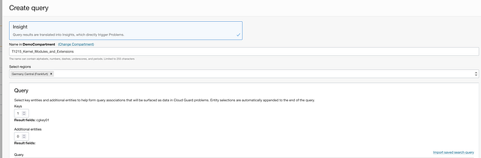

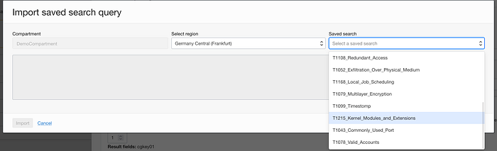

Select the Saved Search and press Import:

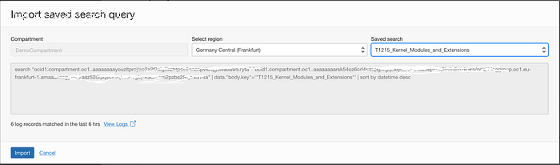

After the import map the body.jey field with the Cloud Guard key

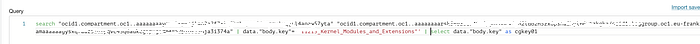

search “ocid1.compartment.oc1..xxxxx” “ocid1.compartment.oc1..xxxxx/ocid1.loggroup.oc1.eu-frankfurt-1.xxxxx” | data.”body.key”=’”T1215_Kernel_Modules_and_Extensions”’ | select data.”body.key” as cgkey01

and select the trigger time:

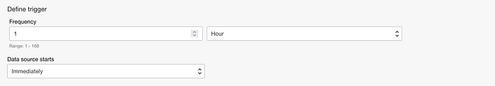

If you want to decrease the number of detected events, you can remove additional fields in the OCI Logging search, like removing the body.euid for Oracle-cloud-agent:

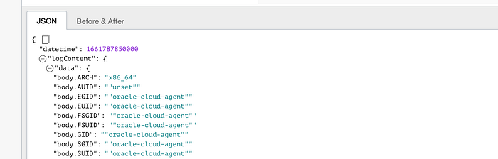
```text
search “ocid1.compartment.oc1..xxxxx” “ocid1.compartment.oc1..xxxxx/ocid1.loggroup.oc1.eu-frankfurt-1.xxxxxxx” | data.”body.key”=’”T1166_Seuid_and_Setgid”’ and data.”body.EUID”!= ‘“oracle-cloud-agent”’ | sort by datetime desc
```
After the Query is created, you need to attach it to a new Detector or you can attach it to an existing one.

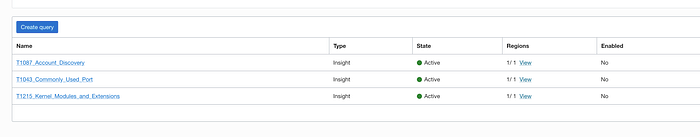

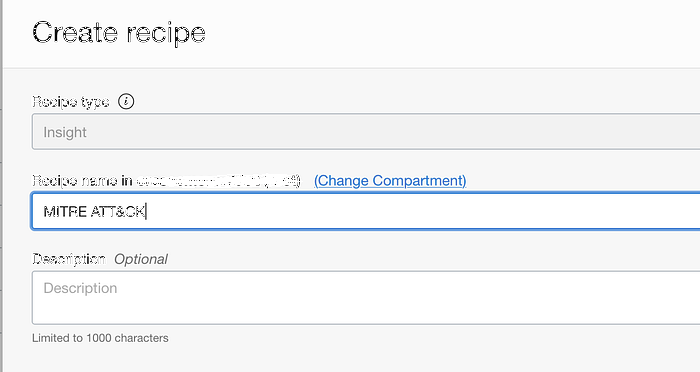

Now Press Create Rule and select the created techniques:

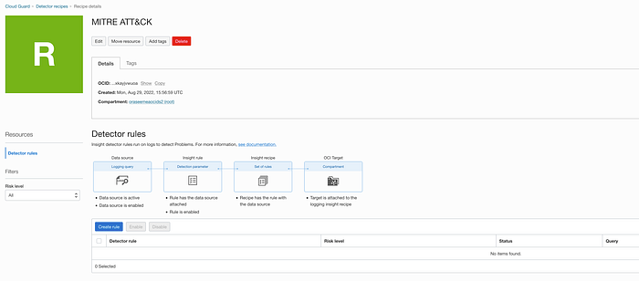

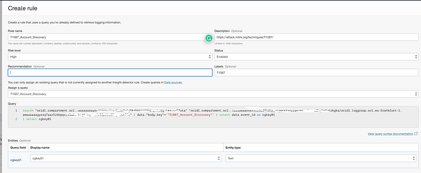

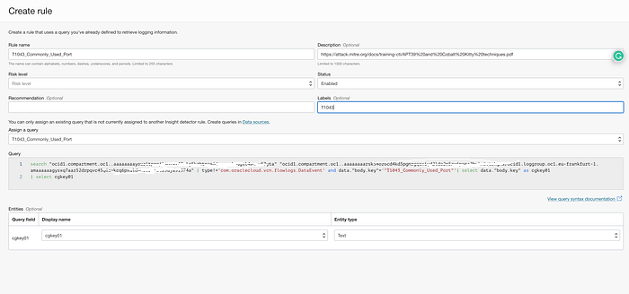

Please note that some of the Techniques had their number changes, so it’s better to use the Navigator [https://attack.mitre.org/techniques/enterprise/](https://attack.mitre.org/techniques/enterprise/) .

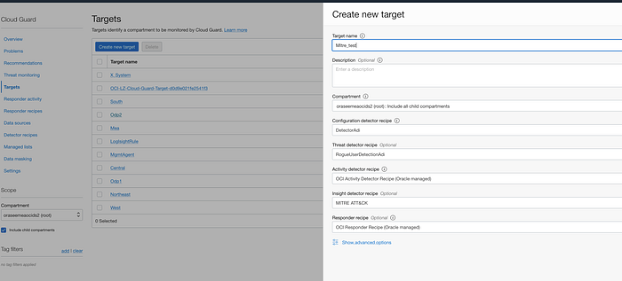

Last step is to create a new target and attach the detector recipes and enable the queries. You can also reuse existing ones.

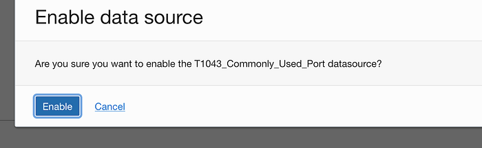

If you select any of the Queries, and you see that you have green checks on all steps, Congratulations, you have finished configuring the Cloud Guard detection.

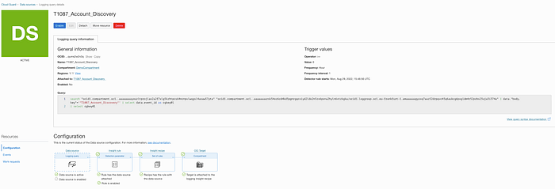

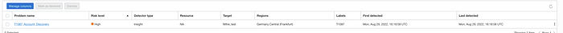
