# How to enable custom logs in OCI Instances

One of the features of the logging service is the ability to collect logs directly from the running instance using the existing Oracle Cloud Agent. The only thing you need to do is to enable the Custom Agent Plug-in and create an Agent Configuration.

Custom Logs Diagnostic information from custom applications, other cloud providers, or an on-premise environment. To ingest custom logs, call the API directly or configure the unified monitoring agent.

Go to Menu → Observability&Management → Agent Configurations

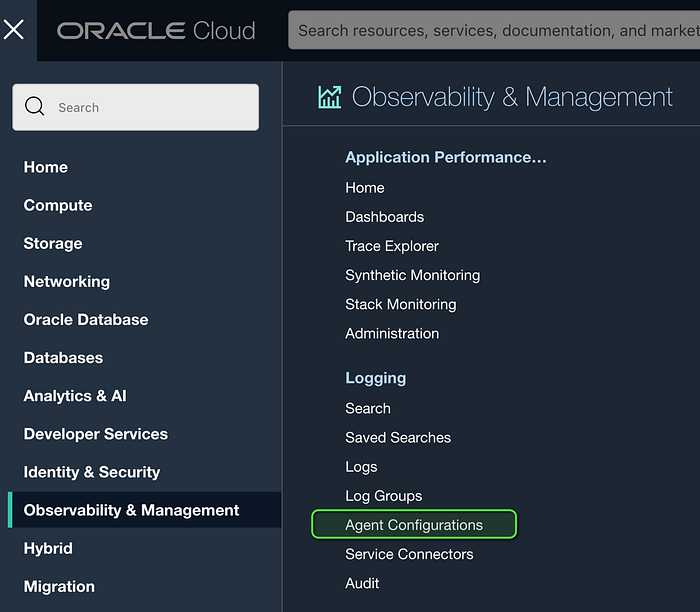

Click Create Agent config:

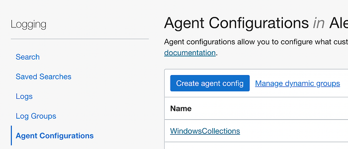

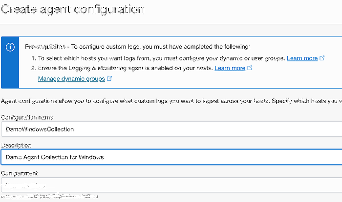

As you can see, there are 2 pre-requisites before the custom logs will work:

1- Configure the user group or Dynamic Group to use all instances from a compartment, or different instances to allow log collection

2- Create the Dynamic Group in Menu →Identity & Security → Dynamic Groups and press Create Dynamic Group

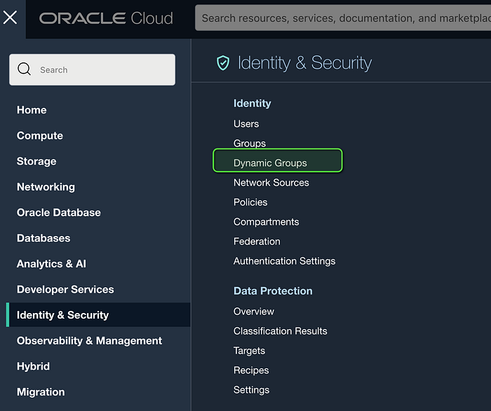

Add the matching rule Following the Service documentation:

[Agent Management (oracle.com)](https://docs.oracle.com/en-us/iaas/Content/Logging/Concepts/agent_management.htm)

An example is this:

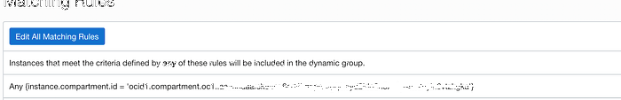

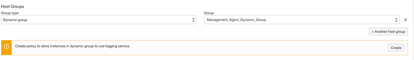

Specify what you want to collect with the Agent

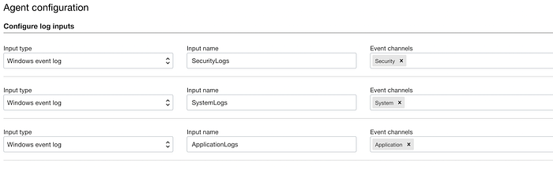

If you want to monitor logs from files, you can also specify the location of the log.

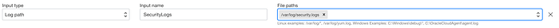

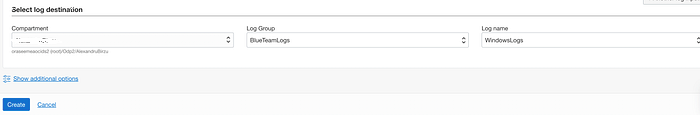

Select the Log Group destination and press Create.

Ensure that Logging&Monitoring agent is enabled on the monitored hosts

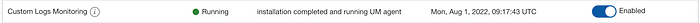

After a few minutes go to one instance where you have the Custom Logging enabled and check if the logs are there.

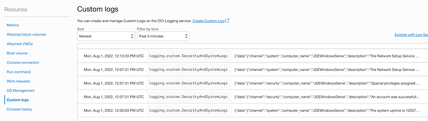

You can also check the Logs in OCI Logging Service:

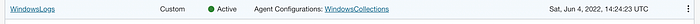

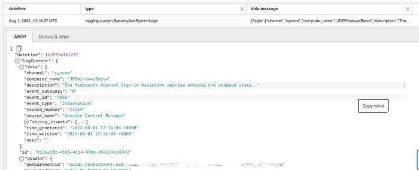

On my next blog entry, I will show you how to use the collected Windows logs with Logging Analytics to do a basic Threat Hunting.
