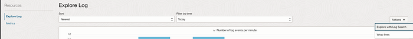
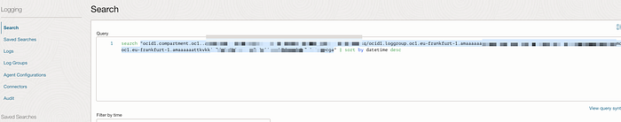
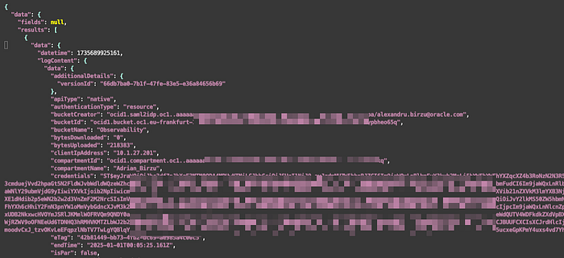
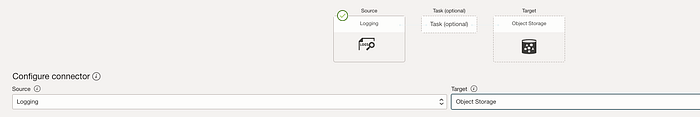
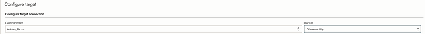
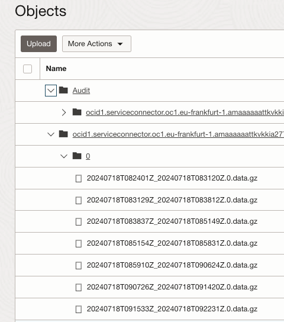

# How to export OCI logs to file

This document e shows how to export the logs from OCI logging to files.

To do this you have multiple options, but today I will only talk about 2 of them:

1- Using OCI CLI to export the logs to a file ( log.json)

[Install OCI CLI](https://docs.oracle.com/en-us/iaas/Content/API/SDKDocs/cliinstall.htm) on your computer, or use Cloud Shell.

The command we will use is

```text
oci logging-search search-logs ""
```

[https://docs.oracle.com/en-us/iaas/tools/oci-cli/3.51.0/oci_cli_docs/cmdref/logging-search/search-logs.html](https://docs.oracle.com/en-us/iaas/tools/oci-cli/3.51.0/oci_cli_docs/cmdref/logging-search/search-logs.html)

Search query needs to have this format:

```text
search "compartmentOcid/logGroupNameOrOcid/logNameOrOcid", "compartmentOcid_2/logGroupNameOrOcid_2", "compartmentOcid_3"
```

Logging Query Language Specification

Use query syntax components with Advanced mode custom searches on the Logging Search page.

docs.oracle.com

In my case, I have logged in OCI, and used Explore with Log Search option for the required logs:



I have copied the auto populated log query in my command:



```text
oci logging-search search-logs — search-query ‘search “ocid1.compartment.oc1..xxxxxx/ocid1.loggroup.oc1.eu-frankfurt-1.YOUROCID/ocid1.log.oc1.eu-frankfurt-1.YOUROCID”’ — time-start 2025–01–01 — time-end 2025–01–09 > logs2.json
```


Congratulations, you have exported all logs locally in JSON format.



2- Using OCI Connector to export the logs to Object Storage

Create a new Connector with Source Logging and Targer Object Storage:



Select the log Group/log (This will send the last 6h logs only)


Select the Bucket and press create:



Check the Bucket and download the logs ( CLI, [3rd Party tools](https://learnoci.cloud/how-to-connect-to-your-oci-object-storage-bucket-from-cyberduck-winscp-commander-one-and-rsync-be9c2f799b7a?sk=7fe44bdd6300a48b909e13c32628aa20), PAR, Etc.)


