# How to feed OCI metrics to Security Onion Grafana

This is a step-by-step guide to add the OCI metrics into Security Onion Grafana Module.

Some useful links I have used to prepare this:

Oracle Cloud Infrastructure Metrics plugin for Grafana | [Grafana Labs](https://grafana.com/grafana/plugins/oci-metrics-datasource/?source=post_page-----2dd1ceac3f71---------------------------------------)

oci-grafana-metrics/linux.md at master · oracle/oci-grafana-metrics |
[Link](https://github.com/oracle/oci-grafana-metrics/blob/master/docs/linux.md?source=post_page-----2dd1ceac3f71---------------------------------------)
 

Oracle Cloud Infrastructure as a Data Source for Grafana | [Link](https://blogs.oracle.com/cloudnative/post/oracle-cloud-infrastructure-as-a-data-source-for-grafana?source=post_page-----2dd1ceac3f71---------------------------------------)

Grafana Plug-in | [Link](https://docs.oracle.com/en-us/iaas/Content/API/SDKDocs/grafana.htm?source=post_page-----2dd1ceac3f71---------------------------------------)

### Accounts

By default, you will be viewing Grafana as an anonymous user. If you want to make changes to the default Grafana dashboards, you will need to log into Grafana with username admin and the randomized password found via sudo salt-call pillar.get secrets.

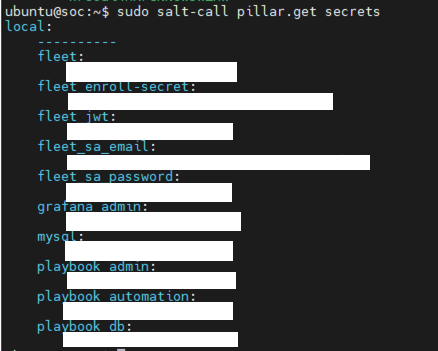

Configuration

Grafana configuration can be found in /opt/so/conf/grafana/etc/. However, please keep in mind that most configuration is managed with Salt, so if you manually make any modifications in /opt/so/conf/grafana/etc/, they may be overwritten at the next salt update. The default configuration options can be seen in /opt/so/saltstack/default/salt/grafana/defaults.yaml. Any options not specified in here, will use the Grafana default.

Press enter or click to view image in full size

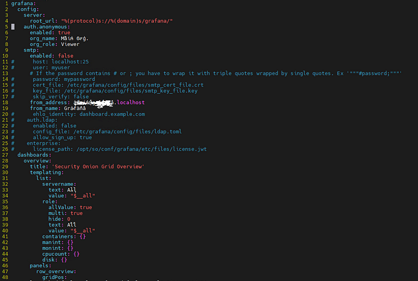

1- Install OCI-CLI on the Ubuntu Host

sudo bash -c “$(curl -L [https://raw.githubusercontent.com/oracle/oci-cli/master/scripts/install/install.sh](https://raw.githubusercontent.com/oracle/oci-cli/master/scripts/install/install.sh))"

Press enter or click to view image in full size

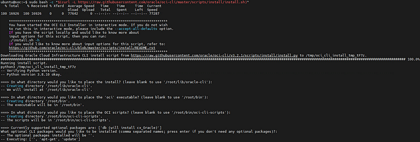

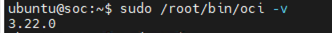

2- Create a dedicated user and group (You can also use Dynamic Groups as this instance runs on OCI) for monitoring

Press enter or click to view image in full size

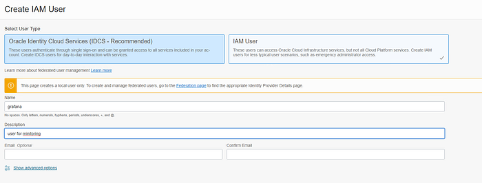

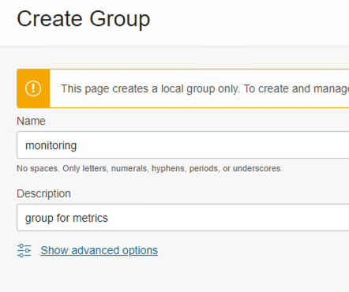

Press enter or click to view image in full size

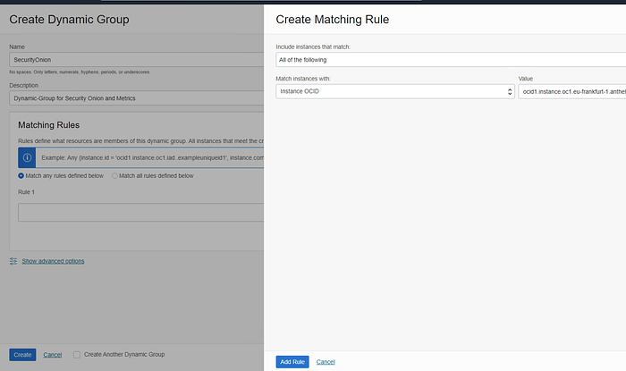

3 — Create the proper policy for monitoring:

allow group monitoring to read metrics in tenancy
allow group monitoring to read compartments in tenancy

If you are using Dynamic Groups:

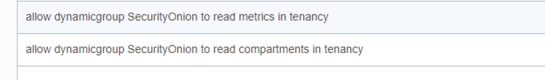

allow dynamicgroup SecurityOnion to read metrics in tenancy

allow dynamicgroup SecurityOnion to read compartments in tenancy

sudo /root/bin/oci os ns get -–auth instance_principal

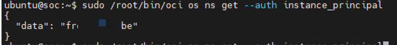

The command will tell you that the instance has the rights to do calls against OCI resources. ( In this case list the Object Storage namespace). Check the link below for more details.

Authorize Instances Principal to call services in Oracle Cloud Infrastructure

Overview

medium.com

4 — Install the OCI Metrics Datasource

as Security Onion doesn’t have the Grafana CLI configured/installed we need to add the Datasource Manually:

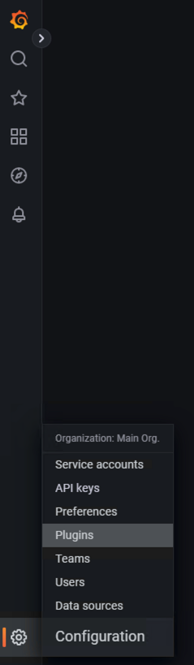

Press enter or click to view image in full size

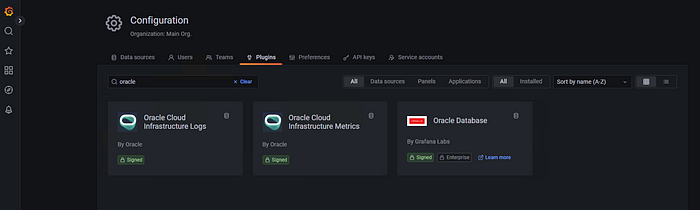

Press Install:

Press enter or click to view image in full size

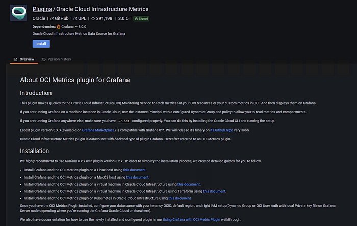

After press Create a Oracle Cloud Infrastructure metrics data source:

Press enter or click to view image in full size

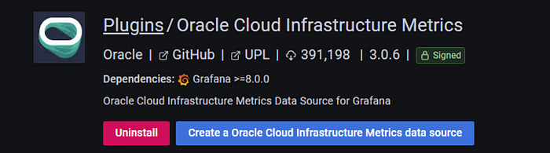

Press Save&test

Press enter or click to view image in full size

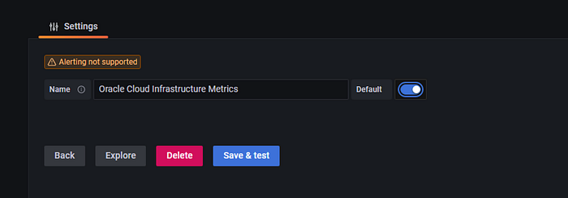

If you get this, then you need to check the configuration:

Press enter or click to view image in full size

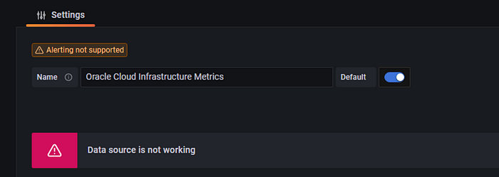

Go to Configuration==>Data Sources

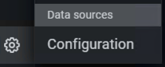

Click on Oracle Cloud Infrastructure Metrics:

Press enter or click to view image in full size

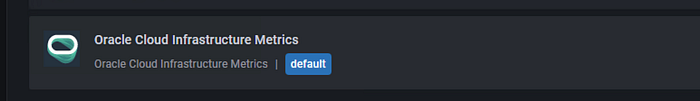

Populate with he Tenancy OCID , Region and Enviornment:

Press enter or click to view image in full size

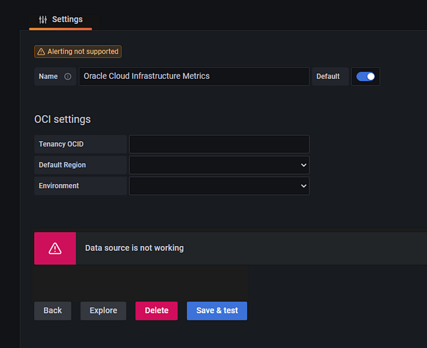

Go to Explore and see the collected metrics.

Press enter or click to view image in full size

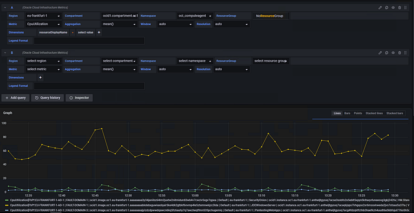

You can create your own Grafana Dashboard from here with the imported metrics.
