# How to get logs into Splunk from OCI object storage

One of the methods of Ingesting OCI Logs into a Splunk Instance without using a public-facing endpoint is by using and OCI Object Storage as the source of the Logs. This solution is not a Near-Real time one, but it has the capability to move the logs using Oracle Backbone without using any Internet facing solution.

The solution that I proposed is based on:

1. OCI Logging/OCI Audit

2. Service Gateway

3. Object Storage

4. OCI CLI

5. OCI VCN

6. Service Connector

7. Splunk capability to read files from folders (In my case, the VM is the Splunk instance, running in OCI)

In the Diagram, the Splunk instance can reside on-premise or in OCI as is in my case and will use OCI CLI to get the logs locally.

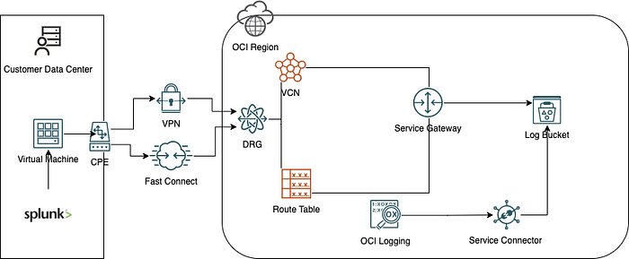

1 — Create a new OCI Bucket used for logs Storage →Buckets

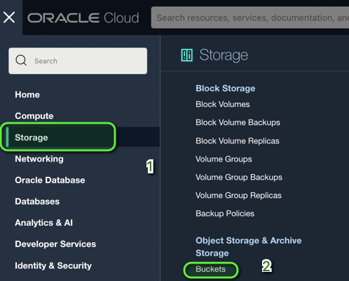

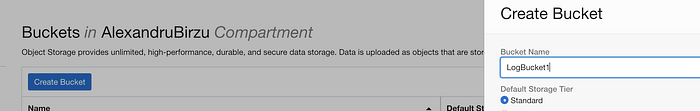

2 — After the bucket is selected, you need to create a Service Connector that will send the logs to the Bucket.

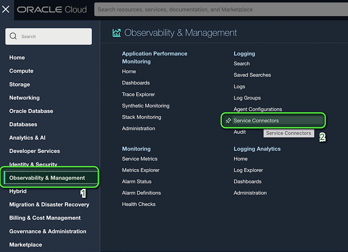

3 — Give the Service connector a name, and select the Source as Logging:

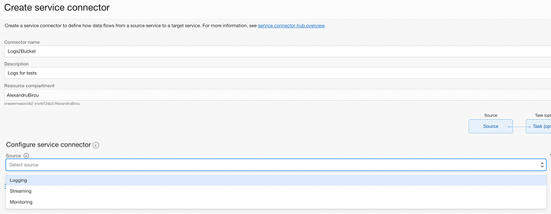

and the Target Object Storage

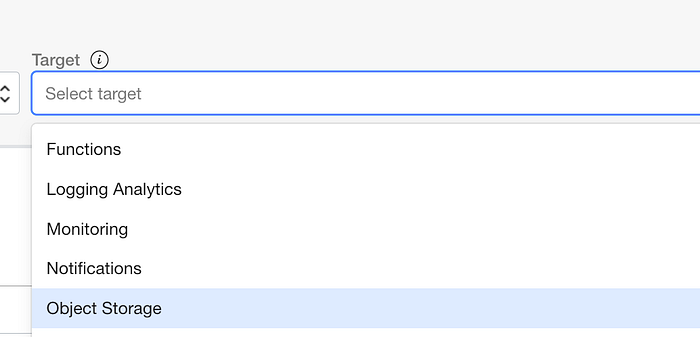

4 — Select the Logs you want to send to Splunk:

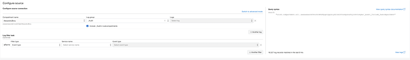

5 — Select the Target Bucket that you previously created:

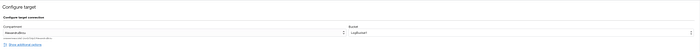

6 — Press Create to allow Service Connector to use the bucket:


7 — Press Create again to create the Service Connector:


8 — Your Service Creator should be Active and showing the Source and the Target.


9 — If you click on the connector you should see the configured Sources and you can edit it to add more logs.

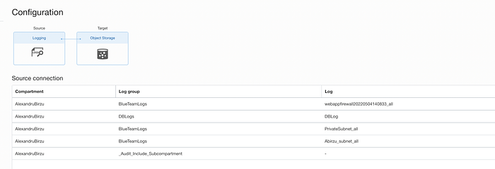

10 — Next step on my enviornment was to connect to my splunk instance (ssh)

11 — Create a folder for the logs( any location from where Splunk can read)

mkdir /home/opc/logs

12 — Make sure you have OCI CLI Installed. You can use this page for your your OS of choice:

Quickstart

This section contains quick installation instructions for the following environments: If you're using Oracle Linux 8…

docs.oracle.com

I have used the bash script:

```text
bash -c "$(curl -L https://raw.githubusercontent.com/oracle/oci-cli/master/scripts/install/install.sh)"
```

I have also used oci setup command to generate the configuration file and generate the API key that I have uploaded to a dedicated user. The configuration file will contain this data into the profile.

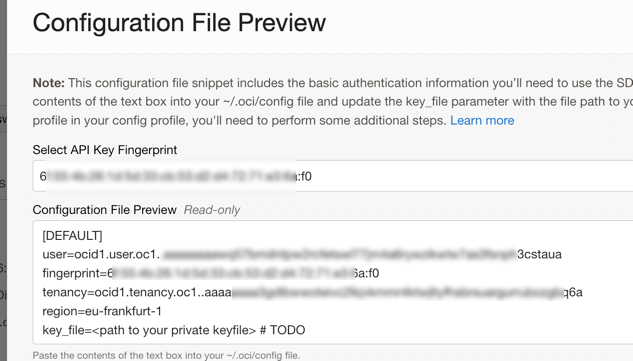

Go to the user → Resources and press [API Keys](https://docs.cloud.oracle.com/Content/API/Concepts/apisigningkey.htm). Add the key that was generated by oci setup command.

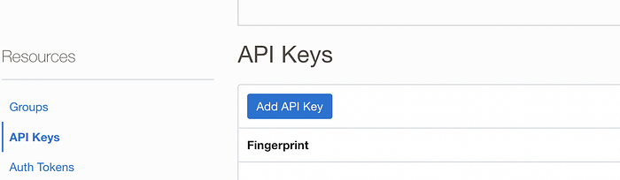

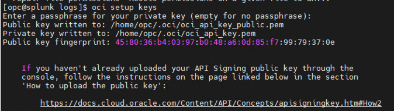

Check if the configuration file was succesful by running any oci cli command. I have used oci ds ns get

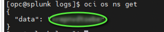

Now that OCI CLI works I will run a bulk download command to get the logs:

```text
oci os object bulk-download — bucket-name LogTest1— download-dir ocid1.serviceconnector.oc1.eu-frankfurt-1.amaaaxcxxxxxx / — no-overwrite
```

Replace LogTest 1 and Directory name with your own .

Logs will go to the folder:

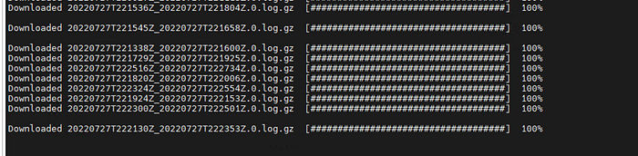

Next step is to go to Splunk and specify the folder from where to read the data Login → Press Settings → Data Inputs:

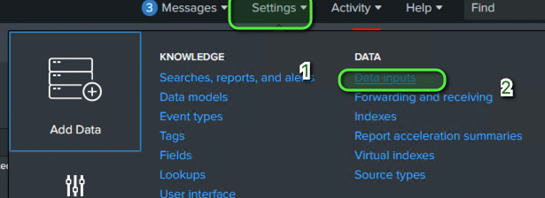

Click Files and Directory → Add New:


Press Browse and select the location where the files are downloaded:

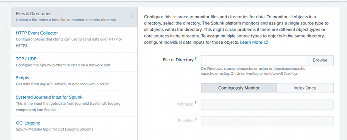

You can enforce the file type by using a regex. OCI Logs are in log.gz format.

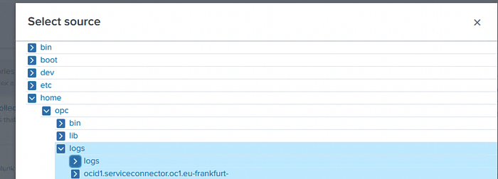

Click on Files and Directories and you should see the logs being ingested by splunk:


If you have installed Splunk App for OCI logs, you will be able also to see the data parsed in that app with different dashboards:

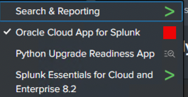

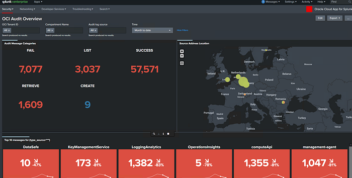

Congratulations! You have ingested now logs into Splunk using OCI Object Storage.

To be sure that your traffic is private, you need to check the private route table and see that All FRA Services are routed through your VCN Service Gateway.

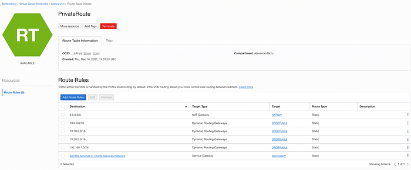
