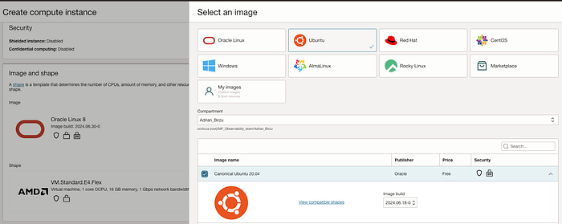
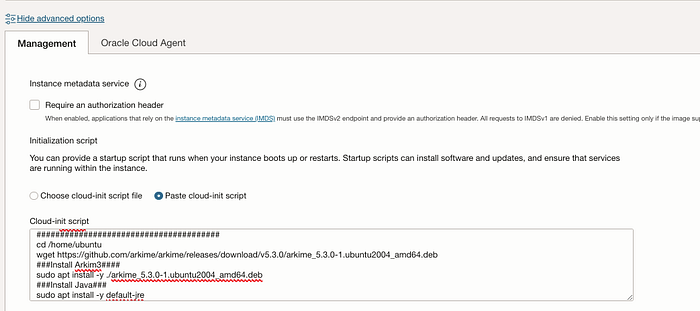
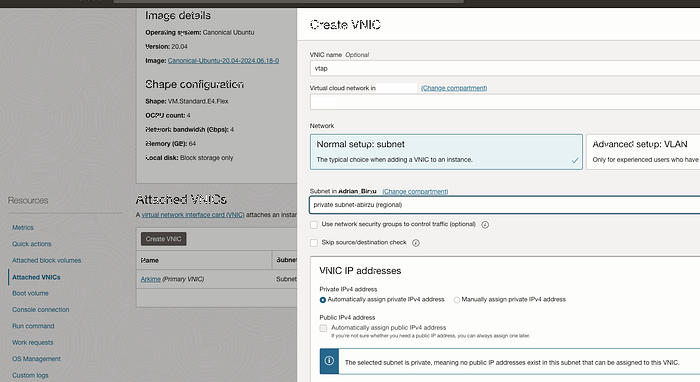
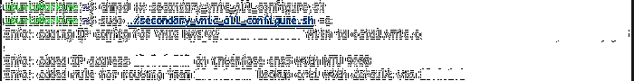
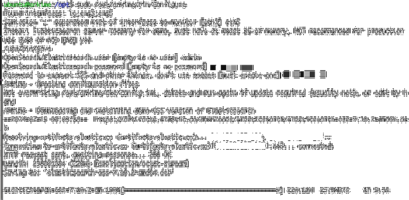
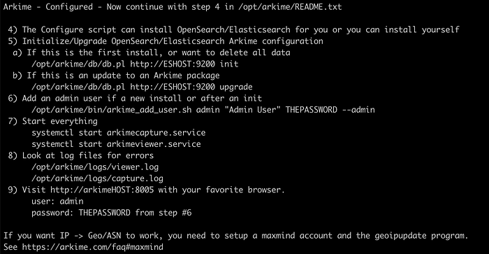
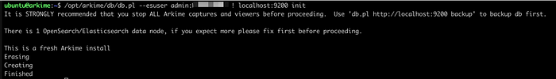
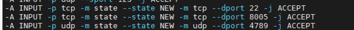
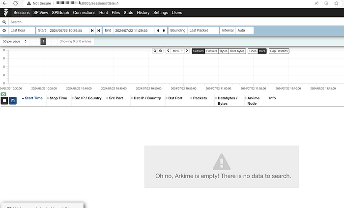

# How to install Arkime(Moloch) using embedded Open Search

How to install Arkime(Moloch) using embedded Open Search:

1- Create the Ubuntu VM(I will use Ubuntu 20 as I tested before and worked perfectly) — make sure to increase the size of the disk to 500GB at least.



Add this cloud Init Script:

```text
#!/bin/bash
sudo apt-get -y update
sudo apt-get -y upgrade
#######################################
# Get Arkime#
#######################################
cd /home/ubuntu
wget https://github.com/arkime/arkime/releases/download/v5.3.0/arkime_5.3.0-1.ubuntu2004_amd64.deb
###Install Arkim3####
sudo apt install -y ./arkime_5.3.0-1.ubuntu2004_amd64.deb
###Install Java###
sudo apt install -y default-jre
```



2- After the instance is created add the 2nd VNIC(Under resources →Attached VNIC’s → Create VNIC):



3- Ssh to the instance and run:

```text
curl https://docs.oracle.com/en-us/iaas/Content/Resources/Assets/secondary_vnic_all_configure.sh -O
chmod +x secondary_vnic_all_configure.sh
sudo ./secondary_vnic_all_configure.sh -c
```



ls

4- Run Arkime Config and select ens5 as the monitoring interface ( 2nd VNIC):

```text
sudo /opt/arkime/bin/Configure
```



8 — After the configuration is finished, proceed with the steps 5 and forward:



9 —Start opensearch:

```text
sudo systemctl start elasticsearch
/opt/arkime/db/db.pl --esuser admin:ThePasswordDefinedEarlier localhost:9200 init
/opt/arkime/bin/arkime_add_user.sh admin "Admin User" THEPASSWORD --admin
sudo systemctl start arkimecapture.service
sudo systemctl start arkimeviewer.service
```



10. Open port 8005 on Ubuntu Instance and also port 4789 for the VTAP on 2nd NIC. In OCI Ubuntu is not using ufw, so you need to add this manually:

```text
sudo vi /etc/iptables/rules.v4
sudo iptables-restore < /etc/iptables/rules.v4
```

```text
-A INPUT -p tcp -m state --state NEW -m tcp --dport 8005 -j ACCEPT
-A INPUT -p udp -m state --state NEW -m udp --dport 4789 -j ACCEPT
```




