# How to install Security Onion on OCI

If you plan to create your own Security Operation Center using open-source solutions, one of the best Threat Detection and Monitoring, threat hunting, enterprise security monitoring, and log management is [Security Onion](https://securityonionsolutions.com/software/).

In this guide I will show you how to manually install Security Onion, and how to add an additional VNIC Adapter for VCN Traffic Capturing.

Install Ubuntu

Go to OCI →Menu →Compute →Instances and click Create Instance:

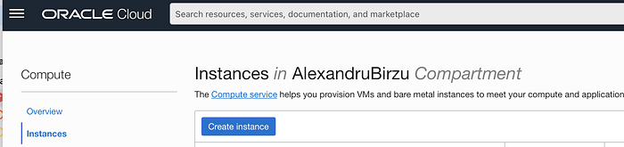

Fill the fields, Select the compartment and Ad and select Ubuntu Shape:

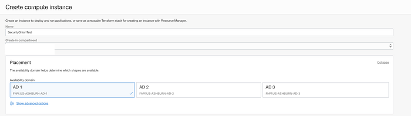

Select Ubuntu 20 from Browse all Images menu:

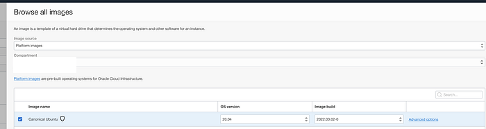

Select the Shape you want to use ( Build it your self as you want) :

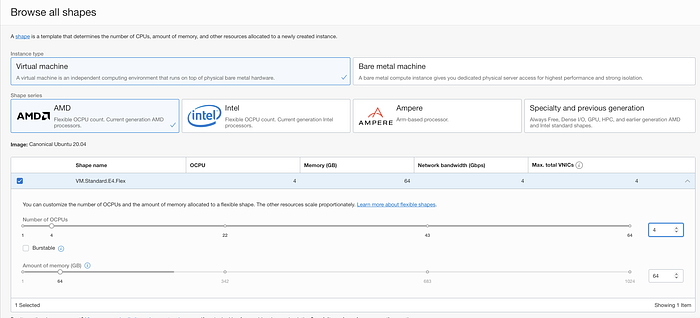

Select the VCN and the subnet:

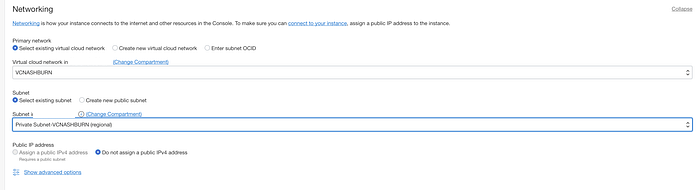

Upload or generate the new ssh key for Ubuntu user:

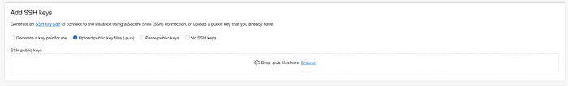

Increase the boot volume of the server, as you will need more then 50 GB on the long run for security monitoring and press create. Recommended is 250 to start, as Security Union is asking 200 GB on setup.

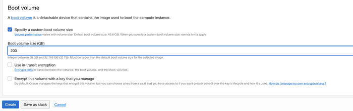

After the Instance is created, click on the Attached VNICs and add the additional VNIC that will capture the network traffic.

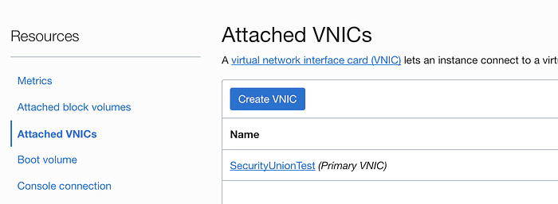

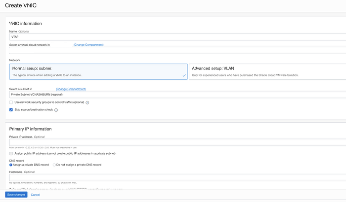

Next step is to SSH to the newly created instance and start the Installation by running this commands:

sudo so-allow is used for opening the Security Onion Service ports.


After the 2nd VNIC is added it will appear as ens5

```text
curl https://docs.oracle.com/en-us/iaas/Content/Resources/Assets/secondary_vnic_all_configure.sh -O
chmod +x secondary_vnic_all_configure.sh
sudo ./secondary_vnic_all_configure.sh -c
```

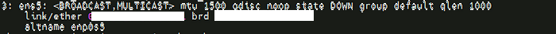

After running sudo bash so-setup-network command you will be redirected to Security Onion Install menu:

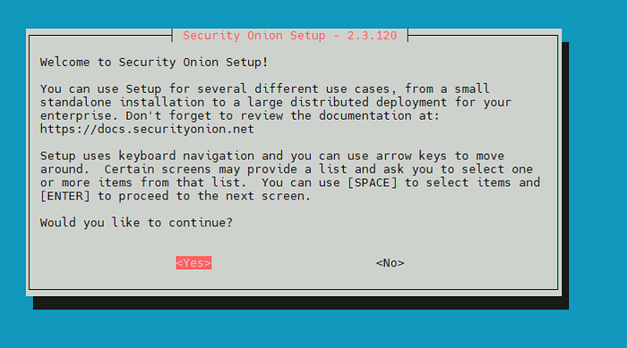

Press Yes

Select Install Type and press OK. I have selected Evaluation mode.

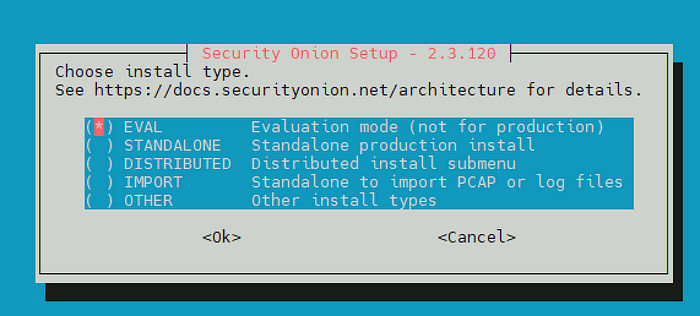

Type AGREE to Agree with the Elastic Stack Licensing.

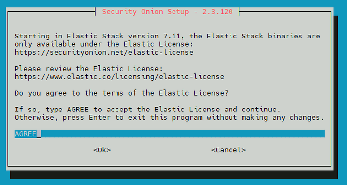

As I selected less space for the Boot Volume that the required space I got this error, but I continued the installation:

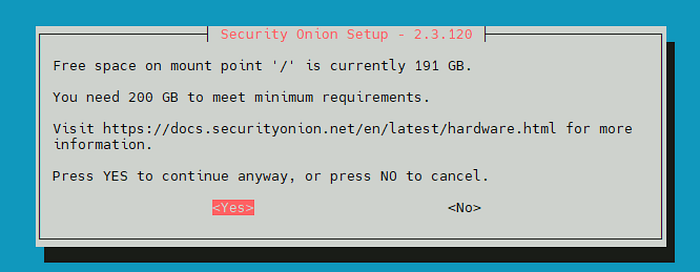

Next you enter the hostname and press Ok:

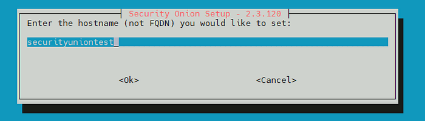

And you select Yes that the DNS and other prerequistes are configured.

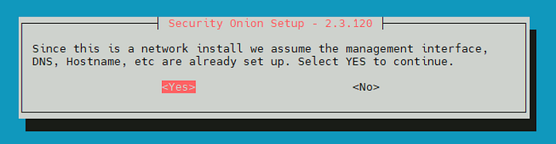

You accept the risk of DHCP IP Changing:

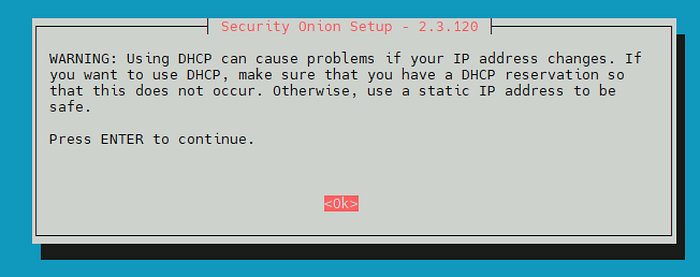

You select ens3 as the management VNIC:

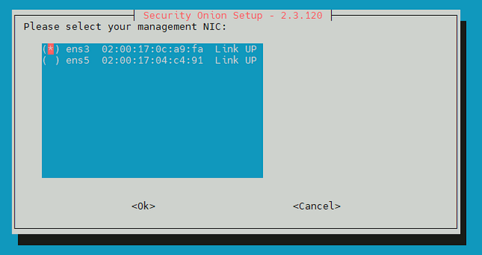

Press OK on next step and select connection as Direct, if you don’t have a proxy in place:

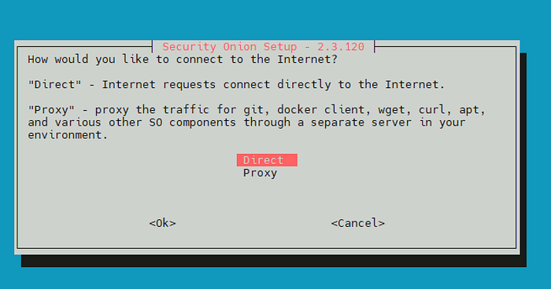

Wait for checks to be done:

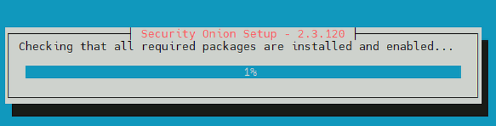

Select ens5 as the monitoring interface:

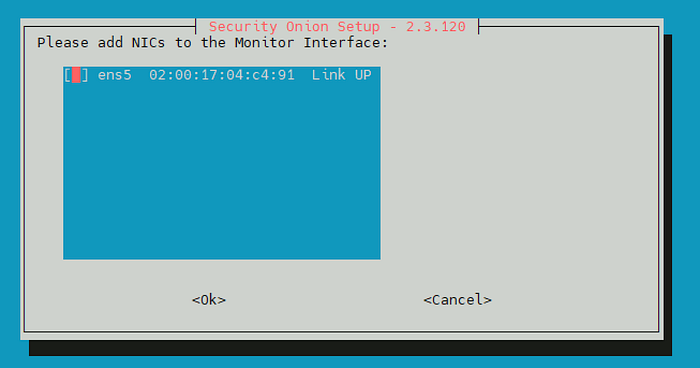

Define your internal IP’s that are allowed to connect to your Security Onion Server and press OK:

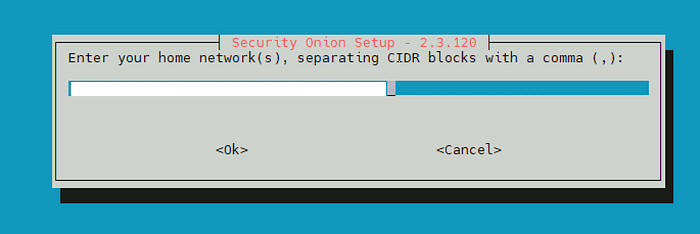

Install the Optional Services that you want to use and press Ok:

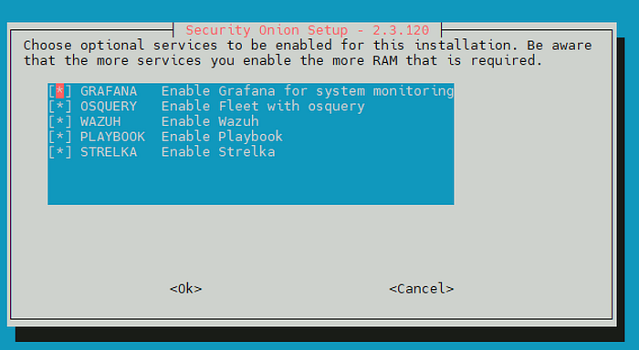

Keep the Docker IP range and press OK:

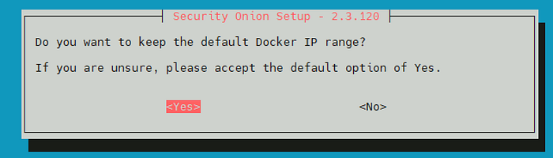

Create the management user and set the password:

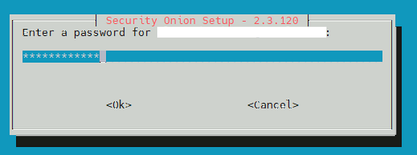

Specify how you like to access the instance:

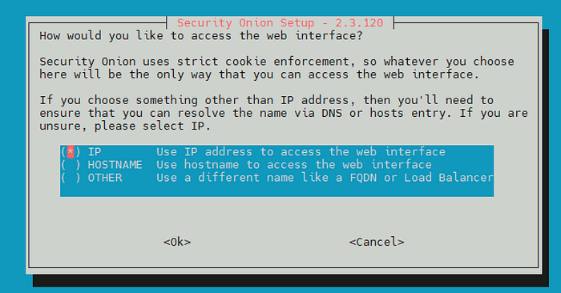

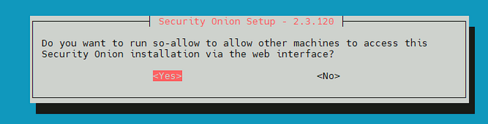

Select the IP that is allowed to access the Security Onion. I selected all, as this is in a private subnet, and the instace will be destroyed after the demo.

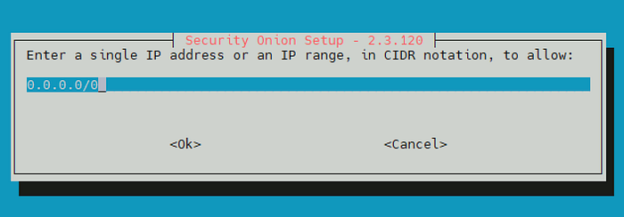

Press yes and wait for the installation to finish:

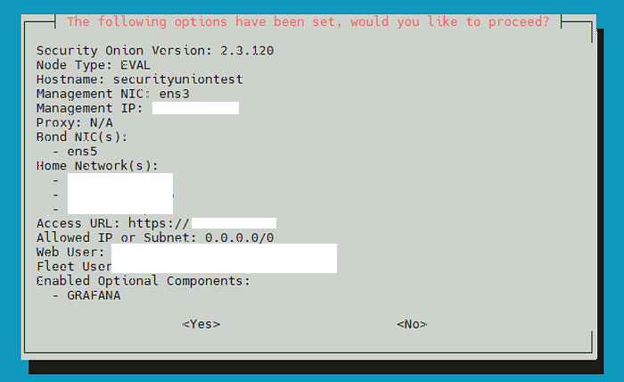

Congratulations! You have a new Security Onion Instance running on OCI.

run the script to be sure the 2nd VNIC Is up and running properly:

```text
curl https://docs.oracle.com/en-us/iaas/Content/Resources/Assets/secondary_vnic_all_configure.sh -O
chmod +x secondary_vnic_all_configure.sh
sudo ./secondary_vnic_all_configure.sh -c
```
