# Integrating OCI Logs into IBM QRadar SIEM

This tutorial covers quick steps to configure your IBM QRadar to receive logs from OCI and assumes the user has already configured their log sources in OCI and IBM QRadar is installed and configured with the latest log source application

Behind the scene

Service connector will be used to move data between 2 different services in OCI

for example, We can move data from the logging service to the streaming service which is the fundamental building block to access OCI logs on QRadar

Press enter or click to view image in full size

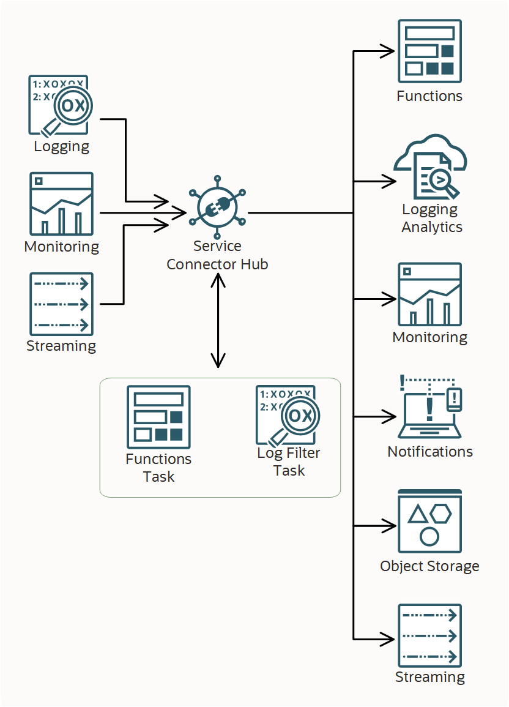

Press enter or click to view image in full size

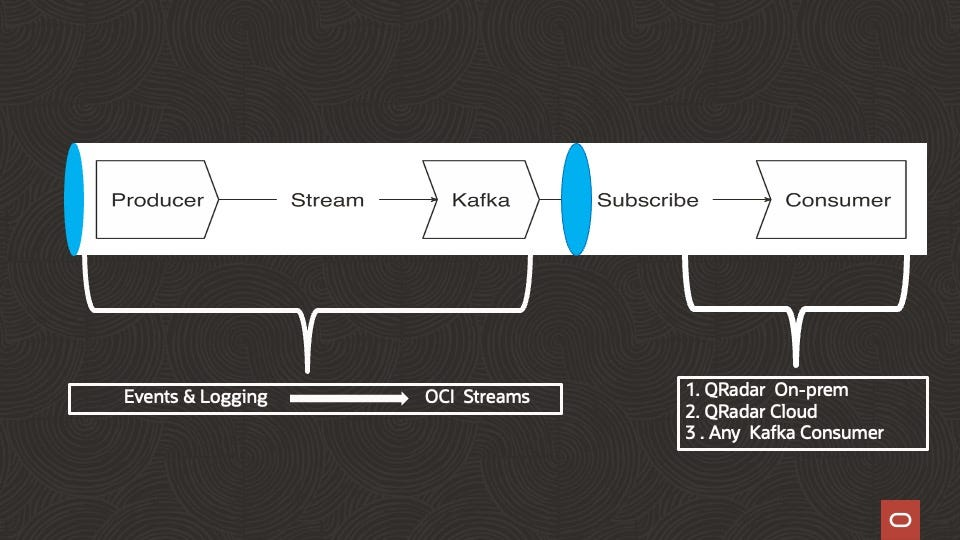

we will use service connectors to send the logs to streams

From Stream, we can extract data using any Kafka consumer

Once you have successfully configured sending logs to OCI Streams using the service connector

IBM QRadar has DSM for Kafka clients which can be used to read data from OCI Stream.

You can enable Logging for various OCI services like

Analytics Cloud

API Gateway

Application Performance Monitoring

DevOps Logging

Email Delivery

Events

Functions

Integration Generation 2

Integration 3

Load Balancer Logs

Media Flow

Network Firewall Logs

Object Storage

Site-to-Site VPN

You can also enable OCI Audit logs & Custom logs

On OCI Configure your Logging data ( any of the above ) as Source and Target as Streaming

Press enter or click to view image in full size

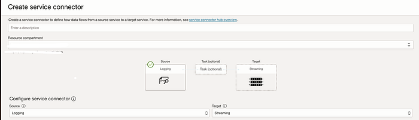

Pro Tip :

It is recommended to group logs from the same service to a single stream This will help later in parsing at QRadar, mixing up different service logs to a single stream will be tangled data

Once you have configured your service connector and receiving output on the OCI stream

On the QRadar Log Source management section

Press enter or click to view image in full size

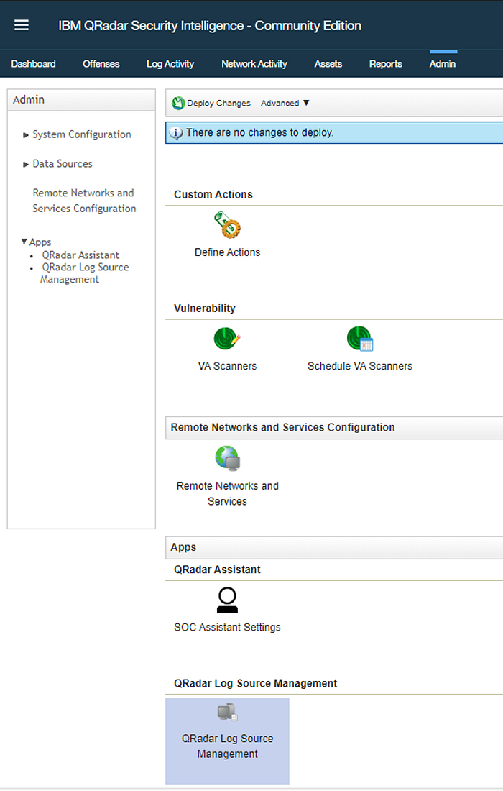

Select New Log source & Select Single Log source

Press enter or click to view image in full size

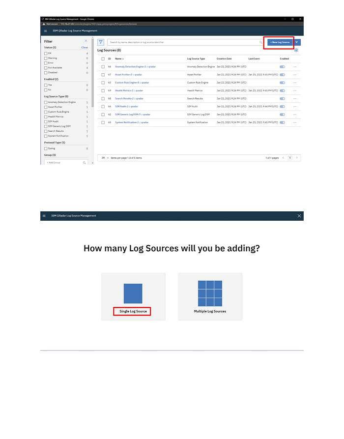

Select log source type as [Universal DSM](https://www.ibm.com/docs/en/dsm?topic=options-apache-kafka-protocol-configuration)

Press enter or click to view image in full size

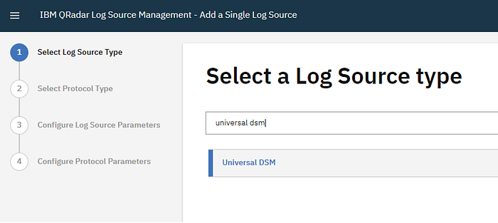

This section is specific to your use case and self explanatory

Press enter or click to view image in full size

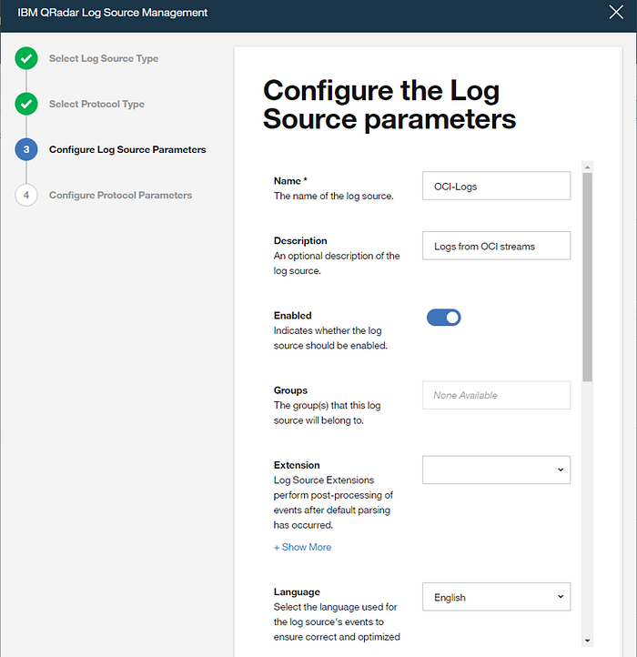

The protocol section is required to match your OCI streaming service configuration

Press enter or click to view image in full size

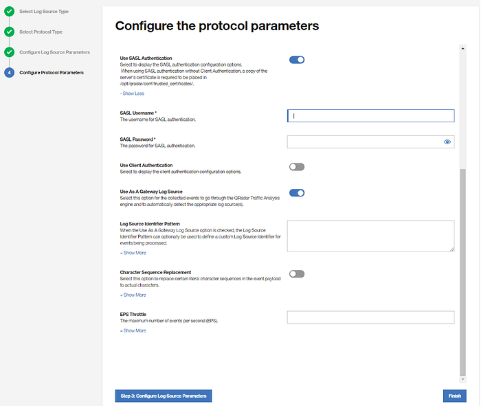

Parameter to be referred from OCI Streampool section ( not stream !!)

Under the Kafka connection setting

bootstrap server

username

password is your AUTH_TOKEN in OCI

Topic List is your OCI stream name

Press enter or click to view image in full size

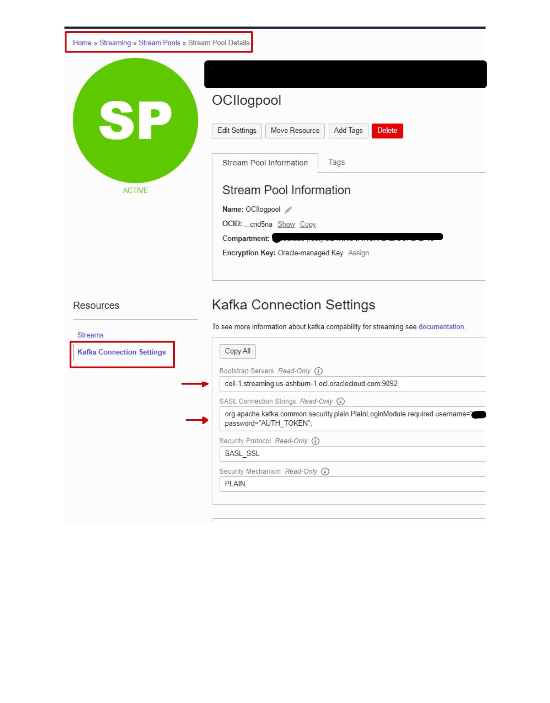

Press enter or click to view image in full size

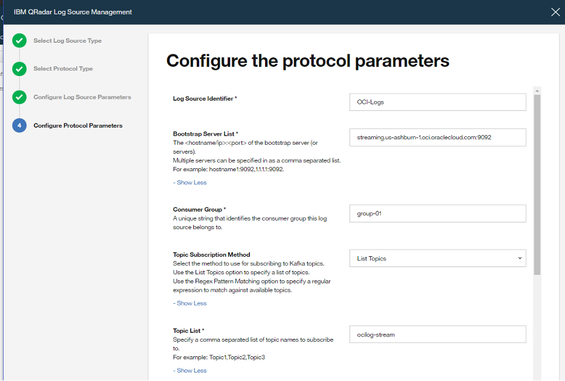

ensure you have the required SSL certificates for your OCI bootstrap server is placed at /opt/qradar/conf/trusted_certificates/ directory

Press enter or click to view image in full size

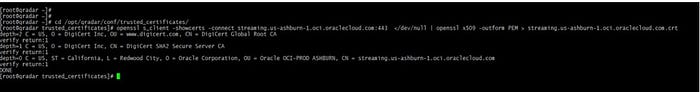

Steps to import certificates

Post-configuration Protocol should have all the information

Press enter or click to view image in full size

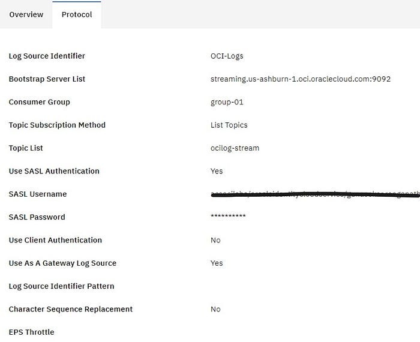

Once your Parameter and Protocol are matching you should be able to receive logs from OCI to QRadar

Press enter or click to view image in full size

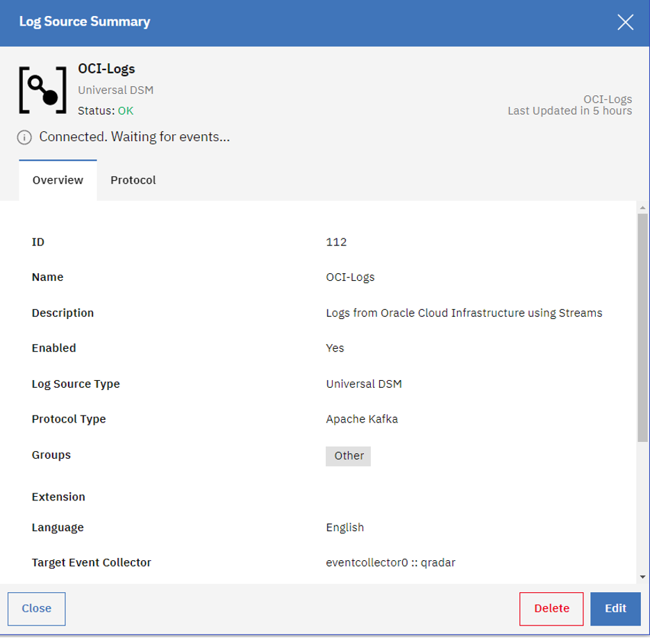

Press enter or click to view image in full size

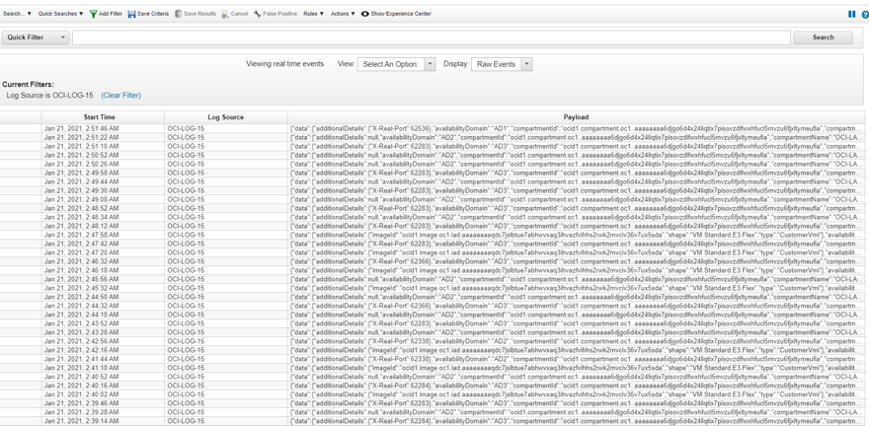

This idea can be applied to any Kafka consumer including a standalone Linux host
