# How to monitor your OCI environment using Dynatrace

In this guide I will show you how to set up your Dynatrace enviornment to collect metrics from OCI monitoring service. For OS Monitoring, you will still need to install the Dynatrace Agent on the Instance.

[Oracle Cloud Infrastructure monitoring & observability | Dynatrace Hub](https://www.dynatrace.com/hub/detail/oracle-cloud-infrastructure/)

1- Login in Dynatrace

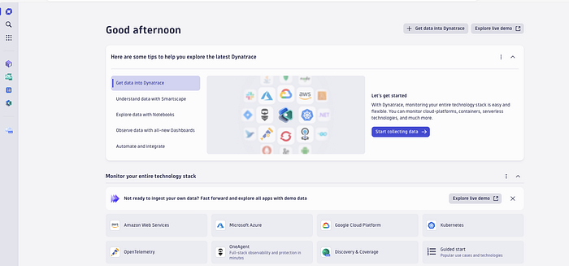

2- Press Start collecting Data:

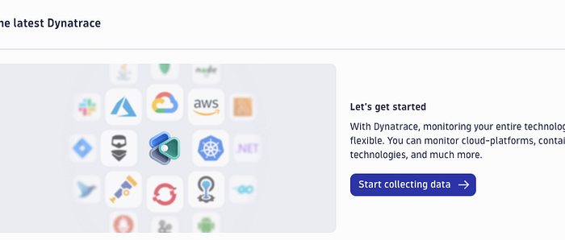

3- For OCI monitoring, you will need to use Active Gate. OCI is supported as Dynatrace states.

ActiveGate is a multi-purpose remote data acquisition, pre-processing and forwarding module of Dynatrace. If you need to expand your monitoring capabilities to allow for monitoring of services in AWS, Azure, GCP, CloudFoudry, Kubernetes, VMware, IBM Z mainframe systems, perform Synthetic monitoring, or execute extensions capable of monitoring or additional technolgies, you’ll need ActiveGate to perform these tasks. ActiveGate is also capable of routing the data from your OneAgents to Dynatrace Clusters and can act as a configurable secure network data proxy.

Go down on page and click on it:

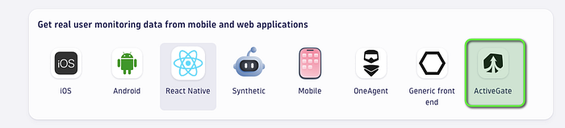

4- Press setup

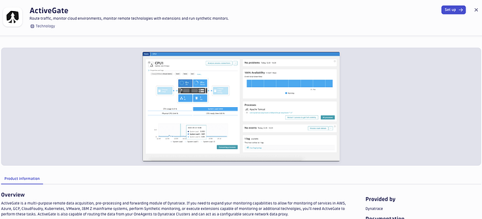

5- Select the OS. I will go with Linux:

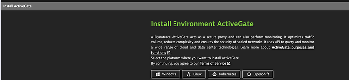

6- Generate the token, and select the architecture x86/64

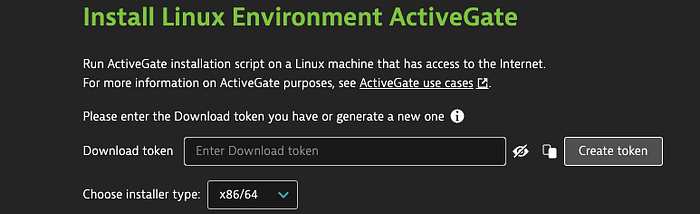

7- Select the purpose to Route OneAgent traffic to Dynatrace

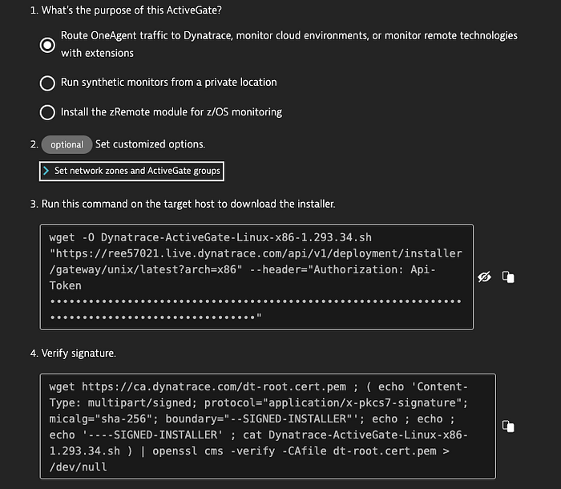

8- Now you need to provision a linux instance in OCI(It can be anywhere, but I am using OCI), and you will install the agent and configure the connection to OCI. For testing purposes, I created my instance in a public subnet.

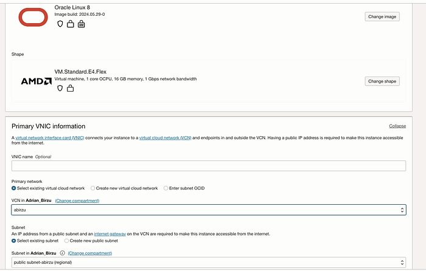

9-Run the commands from the page:

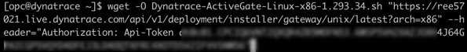

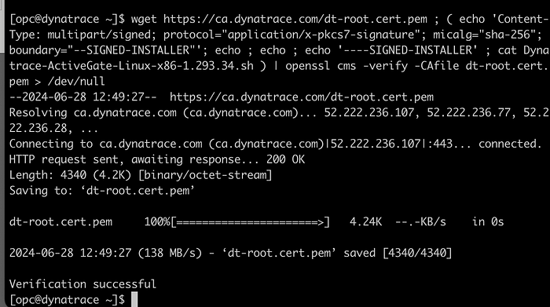

10- Install running and wait for Installation finished Successfully.

```text
sudo /bin/bash Dynatrace-ActiveGate-Linux-x86–1.293.34.sh
```

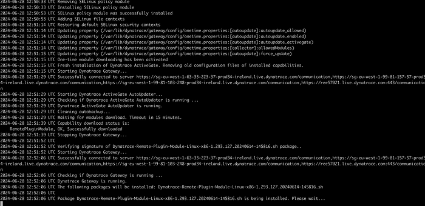

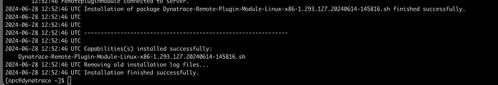

11- Click Show Deployment Status:

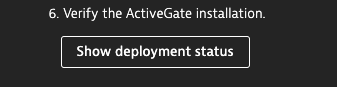

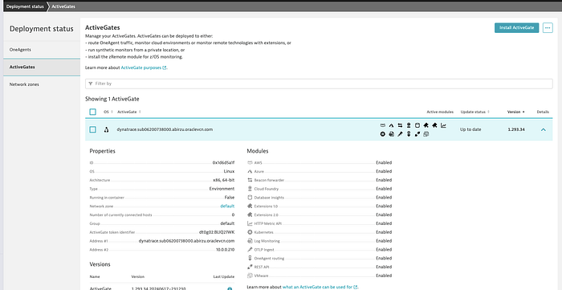

12-

To start, activate the extension in your environment using the in-product Hub. Then provide your OCI monitoring endpoint whereabouts. You will need to provide:

Compartment ID

Tenancy

User

Fingerprint

Region

Path location of a PEM key file which extension will use to sign OCI monitoring API requests

for each endpoint you are about to monitor on your OCI.

Note: Because the configuration requires the Compartment ID & region, a new endpoint or monitoring configuration will need to be created to monitor a new region or compartment. The User account provided in the configuration must also have permissions to read all OCI settings & resources.

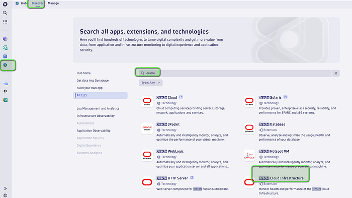

13- Go to hub, search for Oracle and click on Oracle Cloud Infrastructure and press Install:

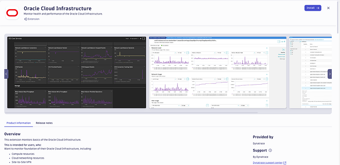

14 — Select the Active Gate and press next:

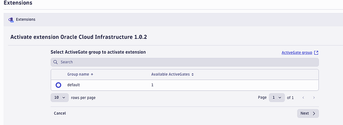

15 — Go to OCI → You monitoring User and create an API key. From there copy the relevant OCID’s(Click View Configuration file):

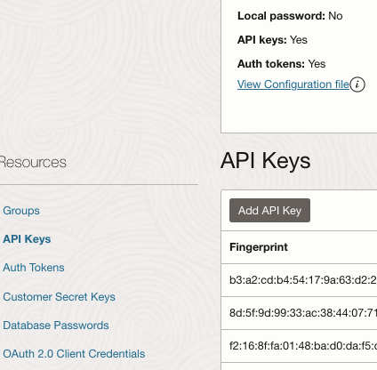

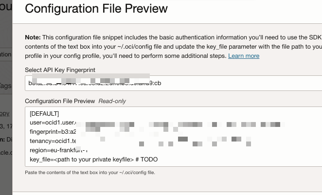

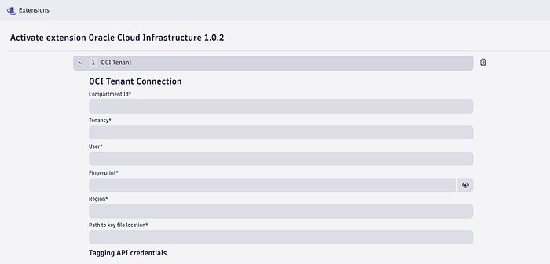

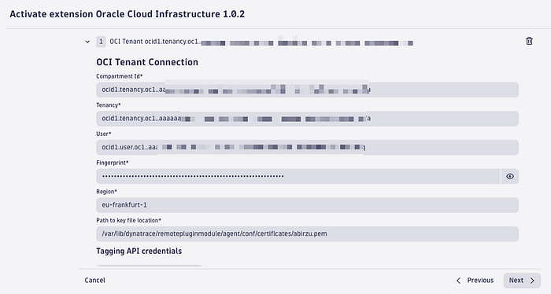

16 —Go to Active Gate and add the private key :

```text
sudo vi /var/lib/dynatrace/remotepluginmodule/agent/conf/certificates/abirzu.pem
```


17 — Press next , Give a name to the extension and select what you want to monitor in OCI and press Save:

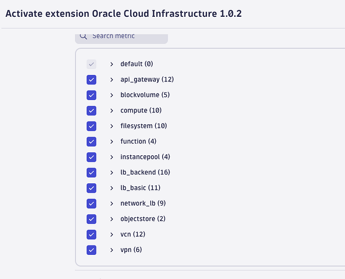

18 — Wait for the activation to finish:

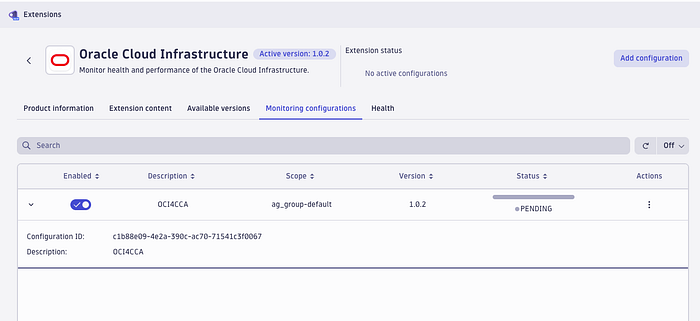

You need to have patience until all data is collected.(I have pasted the wrong Key Fingerprint, but after I put the correct key, data started to be collected.)

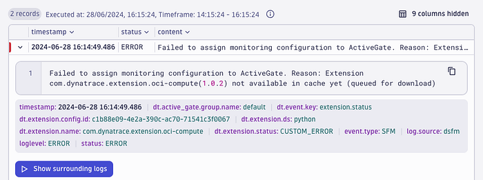

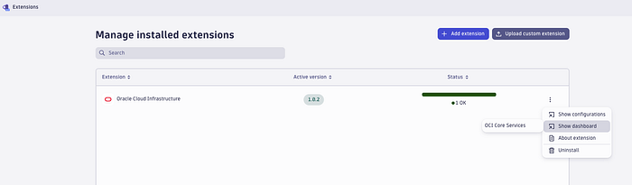

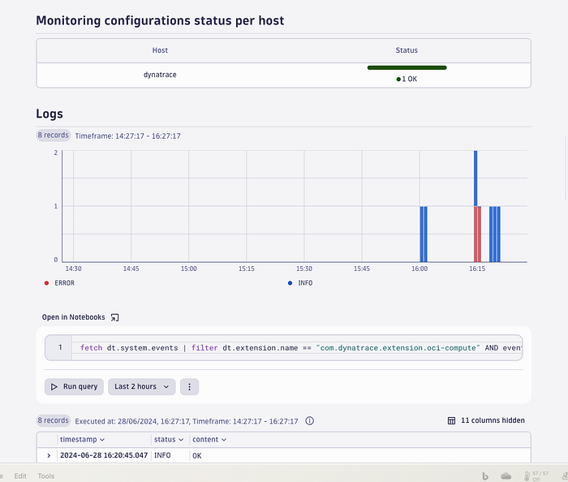

Go to Dashboards - Search App — Extensions →and check the views:

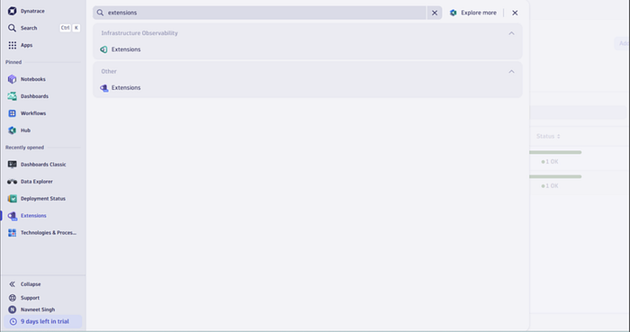

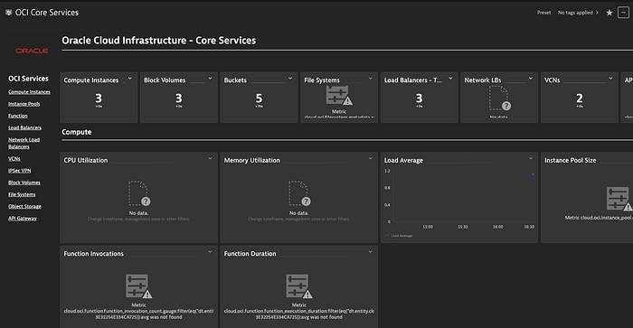

Congratulations! You have configured Dynatrace to collect logs from OCI.
