# How to monitor the resource usage on your OCI Instances using Cloud Guard Instance Security Queries

Oracle Cloud Guard’s Instance Security feature is a powerful tool designed to enhance your cloud security posture by continuously monitoring, identifying, and responding to potential risks in your Oracle Cloud Infrastructure (OCI) instances. Now, even if it’s main task is Security, you can extend the usage of this service to Observability, and run advanced queries.

One of the usecases I was asked about is how to monitor the usage of resources on a OCI instance, and I tested and proposed this workflow.

Behind the Queries is OSQuery, a very powerful tool that can be used to run SQL like queries against the OS.

Cloud Guard allows you to create and customize (security/observability) queries based on your specific operational needs. Whether you need to track unauthorized access, ensure compliance, or monitor resource usage, Instance Security Queries(Paid feature) provide the flexibility to build targeted checks tailored to your organization’s security requirements.

For this blog entry I will focus on Process and Resource Monitoring.

By using OSQuery integrated with Cloud Guard, you can monitor processes running on your instances, identify suspicious activities, and track resource utilization. This level of monitoring helps in early detection of anomalies, such as unauthorized users or unexpected resource consumption spikes.

1 — Enable Cloud Guard(It’s free to monitor your OCI tenancy!!!) if you haven’t in your tenancy and create the proper IAM rules:

Prerequisites | [Link](https://docs.oracle.com/en-us/iaas/cloud-guard/using/prerequisites.htm?source=post_page-----342836ca2811---------------------------------------)


2- Get familiar with the Query service capabilities:

About Queries | [Link](https://docs.oracle.com/en-us/iaas/cloud-guard/using/queries-about.htm?source=post_page-----342836ca2811---------------------------------------)


3- Go to Cloud Guard →Configuration →Create new target → Point it to your compartment:

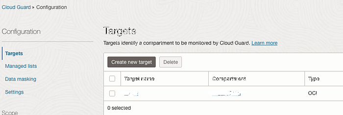

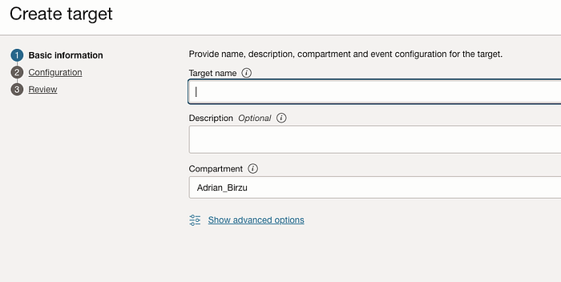

Select the recieps:

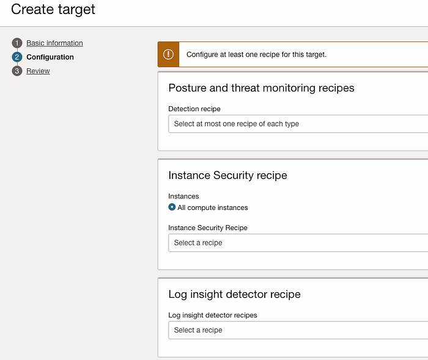

I have attached all this receips and saved:

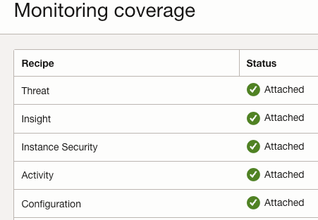

Check the Instance to have Cloud Guard Workload Protection(Paid feature) enabled.

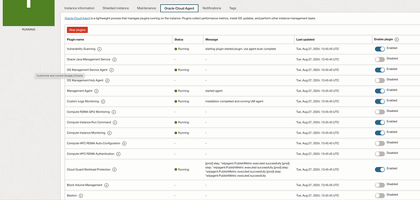

4- Go to Cloud Guard → Queries and run the needed queries

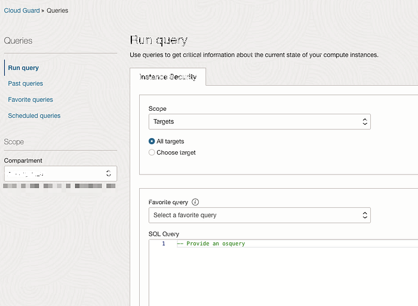

Some examples:

```text
— Provide an osquery
SELECT
 u.username AS user,
 g.groupname AS `group`,
 COUNT(p.pid) AS process_count,
 SUM(p.user_time + p.system_time) AS total_cpu_time,
 ROUND((SUM(p.user_time + p.system_time) / (SELECT SUM(user_time + system_time) FROM processes)) * 100, 2) AS cpu_usage_percentage,
 SUM(p.resident_size) AS total_memory_usage,
 ROUND((SUM(p.resident_size) / (SELECT SUM(resident_size) FROM processes)) * 100, 2) AS memory_usage_percentage
FROM
 processes p
JOIN
 users u ON p.uid = u.uid
JOIN
 groups g ON u.gid = g.gid
GROUP BY
 u.username, g.groupname
ORDER BY
 cpu_usage_percentage DESC, memory_usage_percentage DESC
LIMIT 10;
```

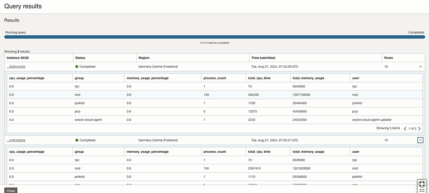

Now we have the results, we can get this data and use it for additional computations. At this point I will download the CSV with the results, but you can also use the OCI logging to collect this queries as Query Results(WIP to enable it):

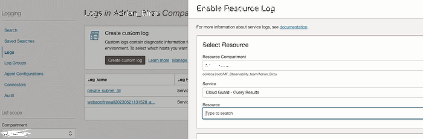

You need to go to Past Queries and click Download results(csv format)

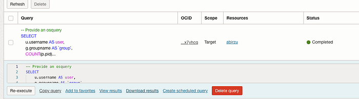

Extract the file:

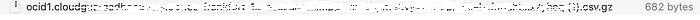

Go to Logging Analytics →Administration →Click Upload Files:

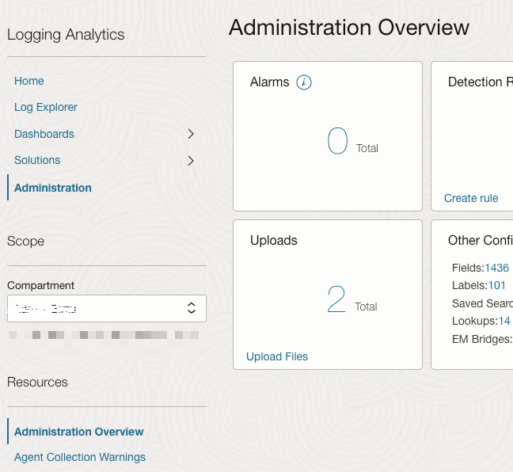

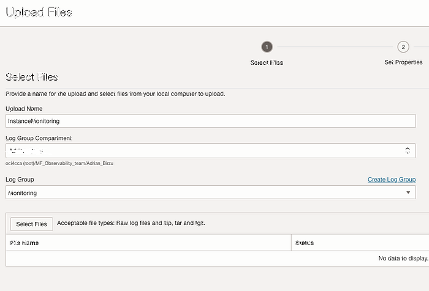

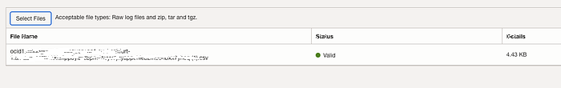

At this point I see I don’t have a valid Source for this, so I need to create it:

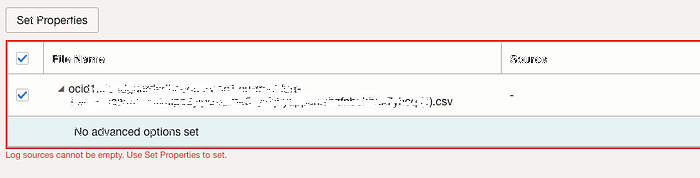

Before this, I also need a parser for this file(Create XML Type → Copy paste the file content to ):

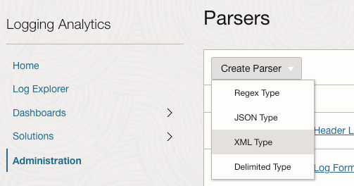

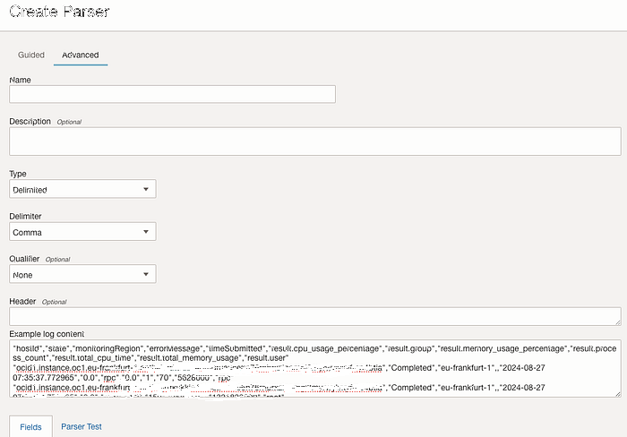

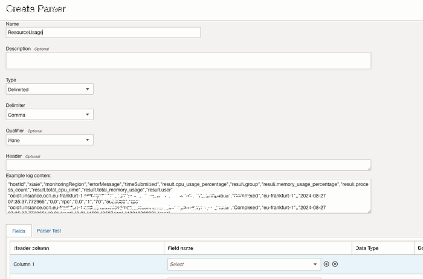

Now map the fields and create new fields.

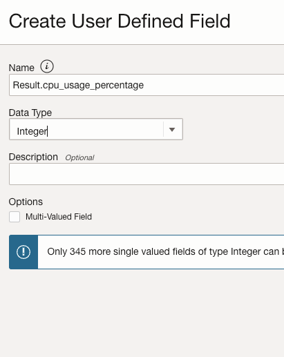

After mapping run a parser test:

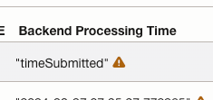

Click on the ! sign and change the parser to the right format.

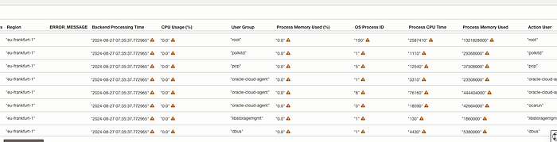

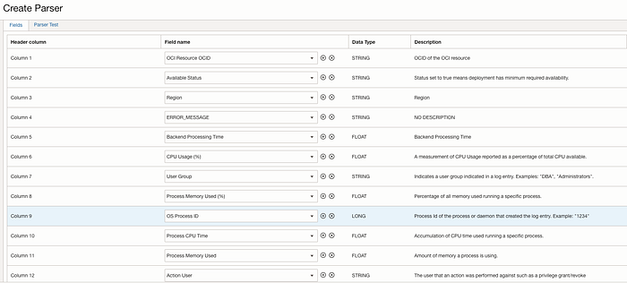

Based on the OSQuery created, you can have different fields. In my case I had this ones created as STRING.

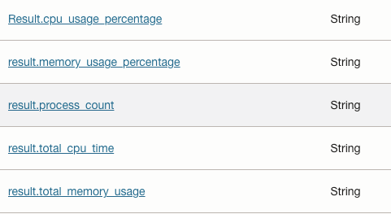

Next create the source with the new parser:

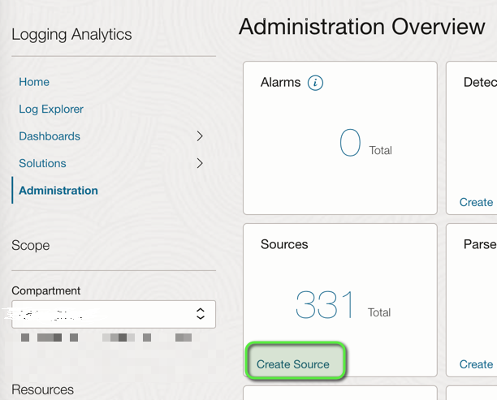

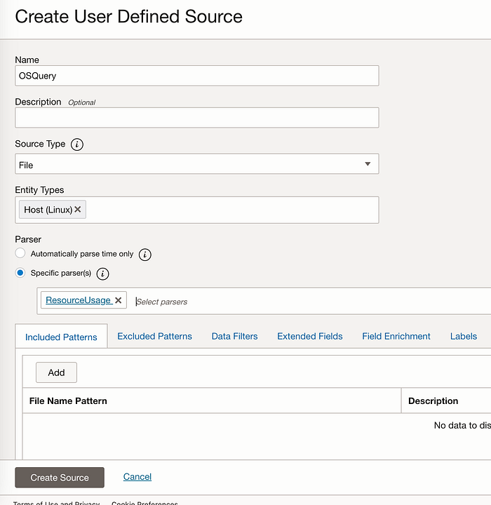

With the source created, we can restart the file upload wizard:

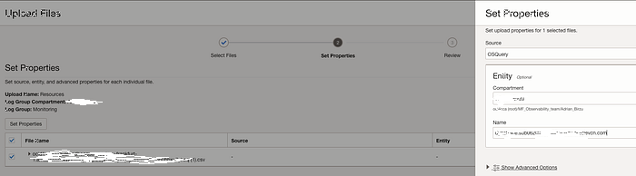

Next we can see the OSQuery in the Log Explorer, and we can start playing with the numbers:

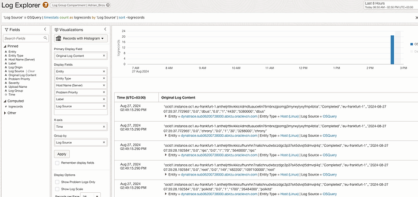

```text
‘Log Source’ = OSQuery | fields ‘CPU Usage (%)’, ‘Process CPU Time’, ‘Action User’, ‘OS Process ID’ | timestats count as logrecords by ‘Log Source’ | sort -logrecords
```

Based on your usecase you can monitor the user/groups.

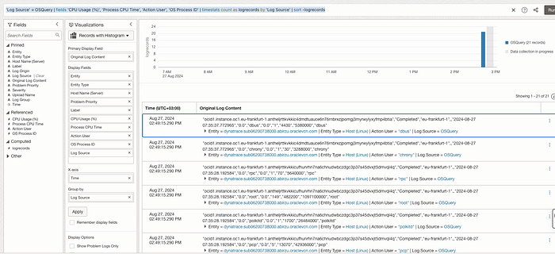

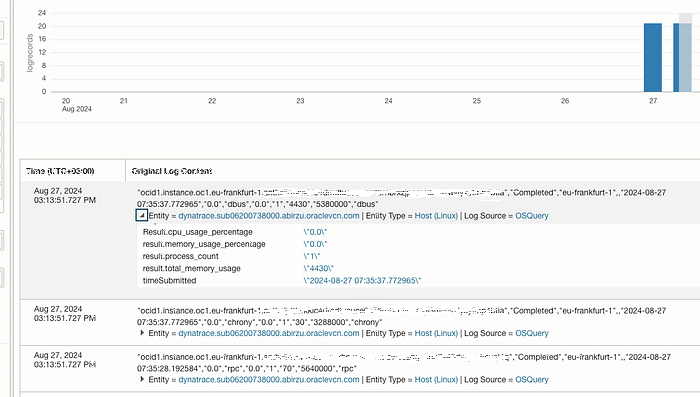

Now with the logs in Logging Analytics sky is the limit. One use case is to map the usage per groups:

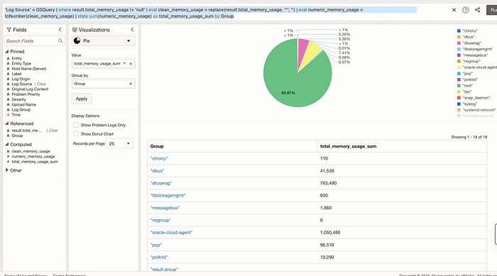

```text
‘Log Source’ = OSQuery | where result.total_memory_usage != ‘null’ | eval clean_memory_usage = replace(result.total_memory_usage, ‘“‘, ‘’) | eval numeric_memory_usage = toNumber(clean_memory_usage) | stats sum(numeric_memory_usage) as total_memory_usage_sum by Group
```

If you want to use see in MB, you can use another query like this:

```text
‘Log Source’ = OSQuery | where result.total_memory_usage != ‘null’ | eval clean_memory_usage = replace(result.total_memory_usage, ‘“‘, ‘’) | eval numeric_memory_usage = toNumber(clean_memory_usage) / 1000000 | stats sum(numeric_memory_usage) as total_memory_usage_sum_MB by Group
```

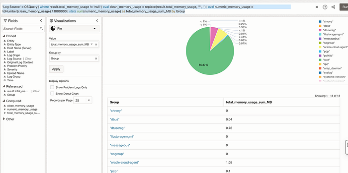

For CPU Usage you can try something like this:

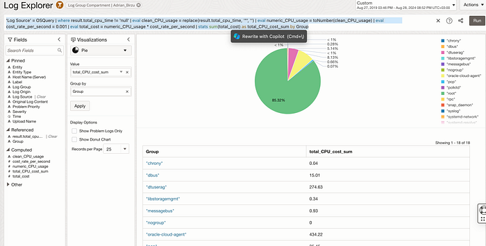

```text
‘Log Source’ = OSQuery | where result.total_cpu_time != ‘null’ | eval clean_CPU_usage = replace(result.total_cpu_time, ‘“‘, ‘’) | eval numeric_CPU_usage = toNumber(clean_CPU_usage) | eval cost_rate_per_second = 0.001 | eval total_cost = numeric_CPU_usage * cost_rate_per_second | stats sum(total_cost) as total_CPU_cost_sum by Group
```

[https://docs.oracle.com/en-us/iaas/logging-analytics/doc/use-timestats-command-plot-time-series.html](https://docs.oracle.com/en-us/iaas/logging-analytics/doc/use-timestats-command-plot-time-series.html) — Some Dashboard capabilities ideas.

This are some highlights on the service capabilities. This capabilities can be entended to multiple OS behavior/monitoring use cases. You need to do the mapping based on the data format you ingest.

This is my personal opionion, and use it only if it fits your needs.

Preview of Part 2 — Adding automation:

1. Create a Scheduled Query

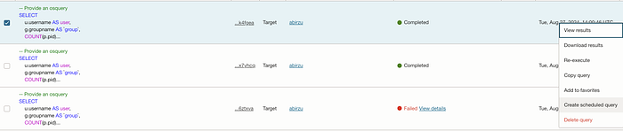

1. Create and enable logging for it

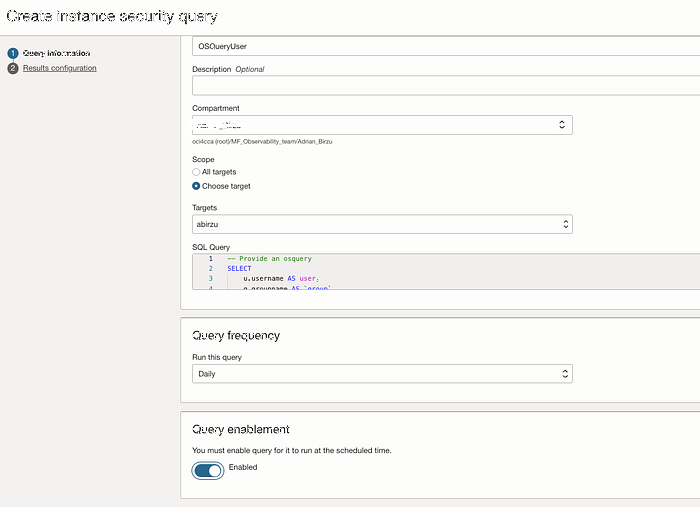

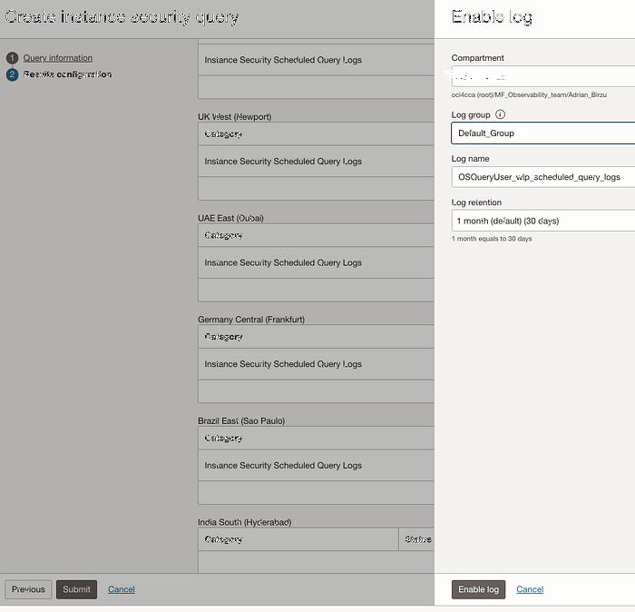

1. Send the Logs to Logging Analytics

2. Create queries on collected data.
