# How to monitor Weblogic in OCI and collect logs for analysis

If you are using Weblogic and want to monitor it and analyse logs you can easily do it with OCI Stack Monitoring and Logging Analytics.
In this blog we will see the steps for Weblogic on OCI but we can monitor weblogic on on-premise or other cloud as well using these services.

Installing weblogic and how to access the console. Skip this one if you already have a weblogic environment and console access
I have used the marketplace stack to install weblogic on OCI.Please follow the instructions based on your requirement.

Once the installation is complete you can access the weblogic admin console and weblogic private instance using the bastion host or bastion service.

```bash
ssh-add <ssh_private_key> ex:ssh-add /tmp/private_rsa
```

```bash
ssh -v -N -L 7002:<weblogic_adminserverprivateip>:7002 -p 22 opc@<bastionhost_public_ip> (Use https://localhost:7002/console in the browser)
```

```bash
ssh -v -J opc@<bastion_publicip> opc@<weblogic_private_ip>
```

2. Enable Management Agent under Oracle Cloud Agent tab for the weblogic instances

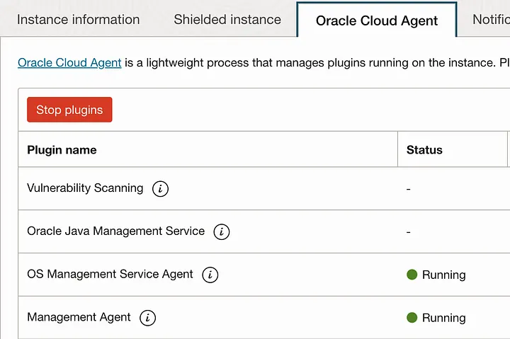

3. Enable Stack Monitoring on the compartment if its not done using easy onboarding or create the required policy manually
If you have enabled auto-promote config for host in Stack Monitoring it will be auto discovered . Otherwise you can easily promote the host manually by navigating to the below screen in Stack Monitoring

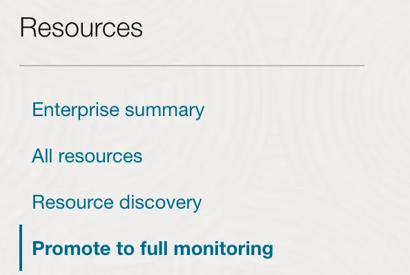

Once the host is discovered you will see the weblogic server in the list as well. Before starting the discovery for Weblogic Domain Enable Mbean as a pre-requisite to collect JVM metrics .

Navigate to Domain > Configuration > General page > Advanced options. Select the Platform MBean Server Used check box.

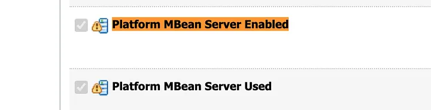

You can click on Promote for the weblogic admin server.

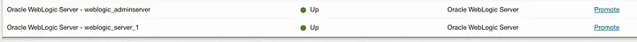

You will get the popup with details filled in. Enter a name for Resource Name.(ex:DemoWeblogic) In the Administration Server port use the admin server listen port by default its set to 7001 in the UI. 9071 is the default port when we use the marketplace image.

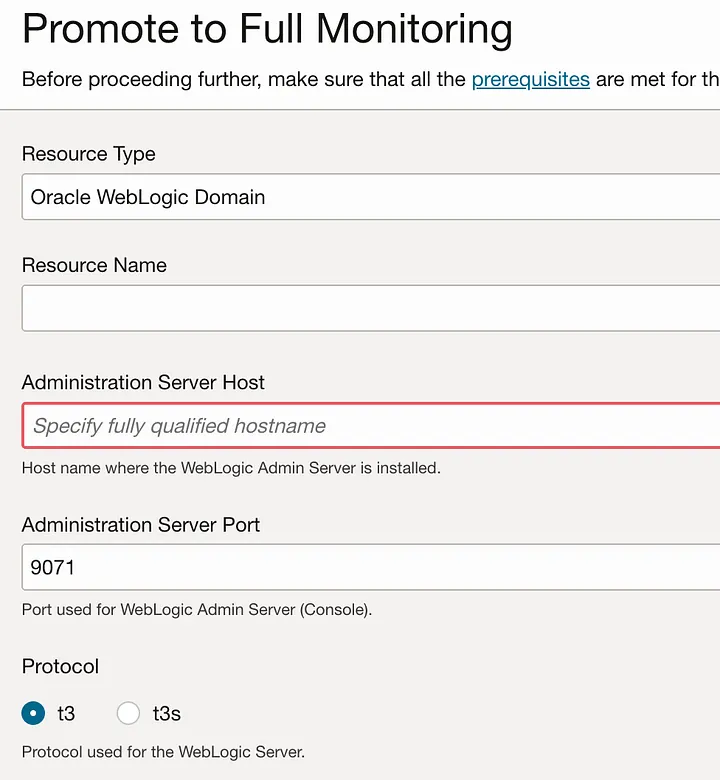

Enter the username and password . User should have at least monitor role.

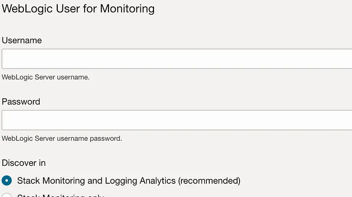

You should see a job started in Resource Discovery page.If there is any issue in connectivity or policy not configured properly the job might fail.

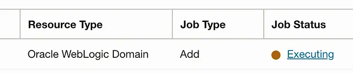

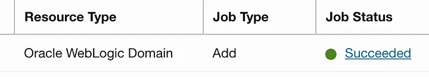

Use wlst.sh connect command to check if there is any connectivity issues and the job failed.

```bash
cd $WLS_HOME/../oracle_common/common/bin
./wlst.sh
```

```text
connect(‘username’,’password’,’adminserver:port’)
```

Click on the Weblogic Domain discovered and it will take you to a similar page.The members will show you the cluster and server details.In the below image we have one managed server and one admin server.

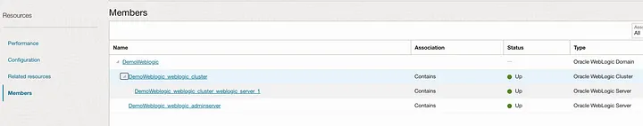

Click on the weblogic server to see the monitoring metrics

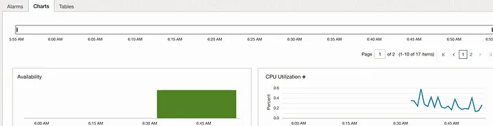

The list of available metrics can be seen here for Weblogic.

Become a Medium member
During discovery we have selected discover in Both StackMonitoring and Logging Analytics. This will automatically create the weblogic related entities in Logging Analytics.

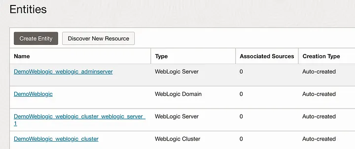

Enable the Logging Analytics plugin for the Agents associated with the weblogic host if not done before.

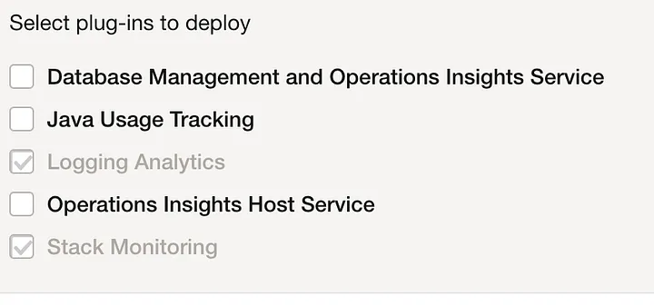

Weblogic related log sources are available out of the box.You can associate these sources to start collecting the logs required.

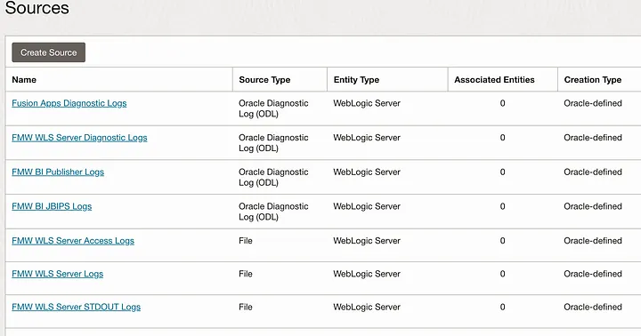

For example if you want to associate the below log source for all weblogic servers you can enable the auto-association.By default its Disabled.

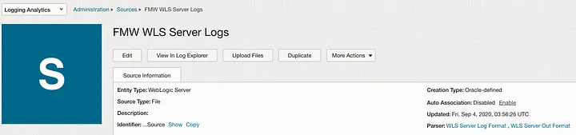

You can manually associate for selective weblogic servers as well.

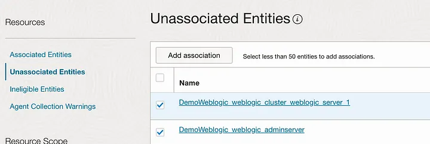

Click on Add association and you can choose the compartment and logging analytics log group or create a new one.

The management agent user by default will not have the read permission for the logs and you will see Agent Collection Warnings. Please follow this step to allow read permission for the agent user to those logs.

Since we are using the OCA management plugin the the agent userid will be oracle-cloud-agent.

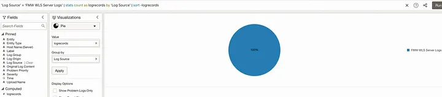

Use the cluster feature to find the potential issues easily.

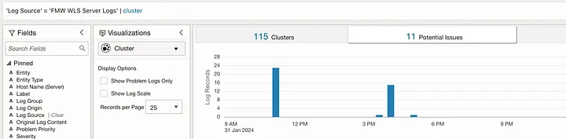
