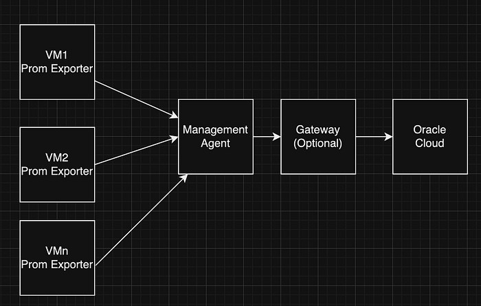
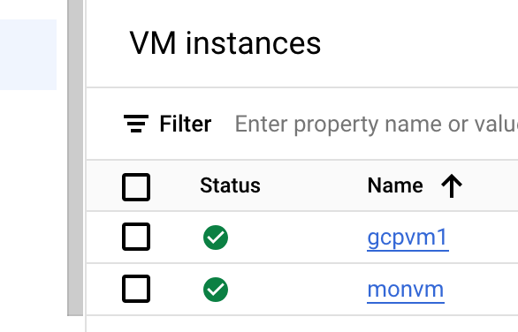
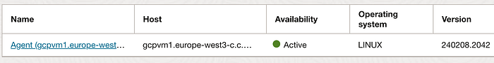
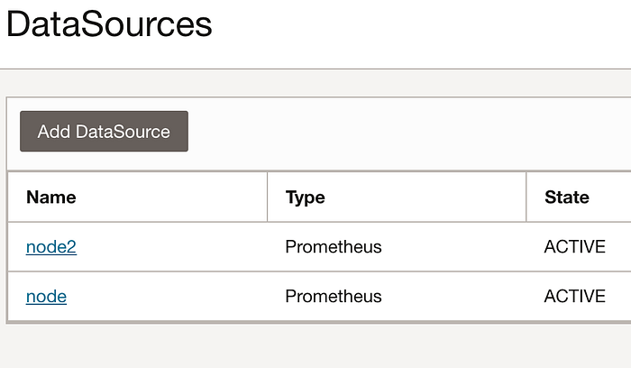
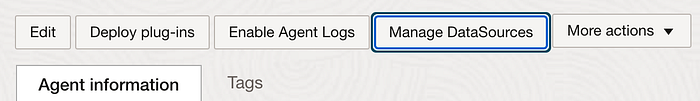
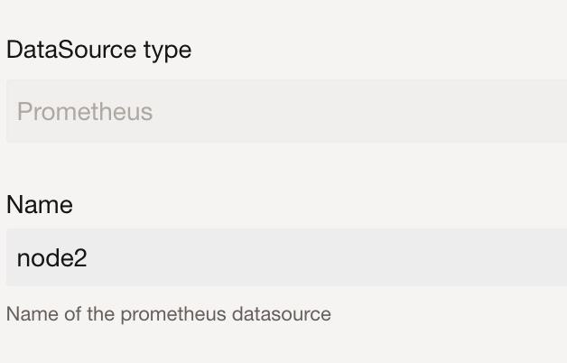
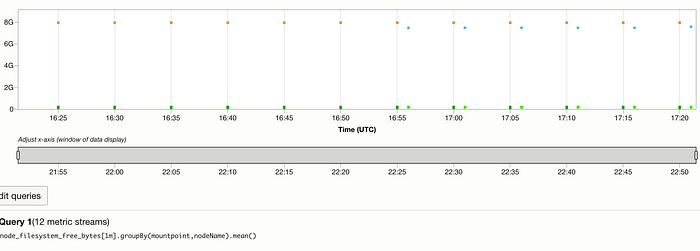

# Multi-cloud observability using OCI Monitoring

In this blog we will talk about Multi cloud monitoring using prometheus and OCI management agent. We will take GCP(Google Cloud Platform) as an example but this applies to all other cloud as well.



Two VM instances has been created in GCP as an example.



1. Install prometheus node-exporter in those VM instances by following the steps outlined [here](https://prometheus.io/docs/guides/node-exporter/) .Below is an example code.You can configure it to run as a system service as well. Open the firewall for the port if its blocked.

```text
#!/bin/bash
cd /tmp
wget [https://github.com/prometheus/node_exporter/releases/download/v1.7.0/node_exporter-1.7.0.linux-amd64.tar.gz](https://github.com/prometheus/node_exporter/releases/download/v1.7.0/node_exporter-1.7.0.linux-amd64.tar.gz)
tar xvfz node_exporter-*.*-amd64.tar.gz
cd node_exporter-*.*-amd64
./node_exporter &
```

2.Install management agent of oracle cloud in one of the VM instance as a central monitoring VM.Refer this [doc](https://docs.oracle.com/en-us/iaas/management-agents/doc/install-management-agent-chapter.html) for more instructions about management agent.

1. Install jdk-8(openjdk) which is a pre-requisite for the agent.

2. Download the agent zip file and agent key file .

./installer.sh <path_of_agent_response_file>

You can see the agent in OCI after successful installation.



This agent should have access to the node-exporter endpoint running in all other VM’s.

You can verify by running the curl -v [http://vmprivateip:9100/metrics](http://vmip:9100/metrics)

On the OCI management side we will be adding the datasource so the metrics will flow into OCI monitoring.

One datasource I have added by creating a node.properties file under the directory /opt/oracle/mgmt_agent/agent_inst/discovery/PrometheusEmitter with the configuration like below. For more details pls refer this [doc](https://docs.oracle.com/en-us/iaas/management-agents/doc/configure-management-agent-collect-metrics-using-prometheus-node-exporter.html).

```text
url=http://10.20.30.40:9100/metrics
namespace=poc_prometheus
nodeName=gcpvm1
metricDimensions=nodeName
allowMetrics=*
compartmentId=ocidl.compartment.ocl..aaaaaaaa...kolq
```

Its suggested to allow only required metrics instead of * by specifying metric name list as comma separated values.

By default these metrics are collected every 5 mins to change it please set the parameter scheduleMins=<minutes> .



I have added another datasource using the agents Manage datasource page in OCI console. You can edit the properties later if needed.





Now all the node metrics of the GCP VM will be available in OCI monitoring and we can build dashboard with these metrics.

You can take a look at the metrics explorer to see the metrics flowing in.
For example : filesystem_free_bytes.



You could install OCI management agent on all the GCP VM instances instead of prometheus node exporter to monitor as well . But with prometheus you will get the freedom to monitor not only the VM metrics and also other infrastructure hosted on top of the VM as well which may not be supported directly in OCI Observability services yet.

Advantages:

1. You don’t have to install management agents on all the VM to collect monitoring metrics.

2. Since prometheus is used it can also be pointed to common grafana dashboard for Multicloud observability later without much operational changes.

3. You don’t need to have separate Grafana instance for visualisation .OCI Dashboard can be used .

Disadvantages:

1. Since the agent is not available on all the VM, log collection is not possible. we need to use fluentd/fluentbit for log collection.

2. The VM running the agent has to be highly available.If that VM is down all the VM monitored by this agent will not be available. You can use gateway to act as a buffer but still the agent VM has to be available.

Sample Python script to create multiple prometheus datasources .

```text
import oci

config = oci.config.from_file("<oci_config_path>")
management_agent_client = oci.management_agent.ManagementAgentClient(config)
AGENT_ID = "<management_agent_ocid>"
COMPARTMENT_ID = "<compartment_ocid>"

# Example list of VM IP's
list_of_vms = ["10.0.0.1", "10.0.0.2", "10.0.0.3"]

# To create multiple datasource for the agent
# In this example only two metrics are set to be collected(node_filesystem_size_bytes,node_filesystem_free_bytes)
for ip in list_of_vms:
    node_name = "node" + str(list_of_vms.index(ip))
    create_data_source_response = management_agent_client.create_data_source(
        management_agent_id=AGENT_ID,
        create_data_source_details=oci.management_agent.models.CreatePrometheusEmitterDataSourceDetails(
            type="PROMETHEUS_EMITTER",
            name=node_name,
            compartment_id=COMPARTMENT_ID,
            url="http://$ip:9100/metrics",
            namespace="node_prometheus",
            allow_metrics="node_filesystem_size_bytes,node_filesystem_free_bytes",
            schedule_mins=1,
            metric_dimensions=[
                oci.management_agent.models.MetricDimension(
                    name="nodeName",
                    value=node_name)]))
```
